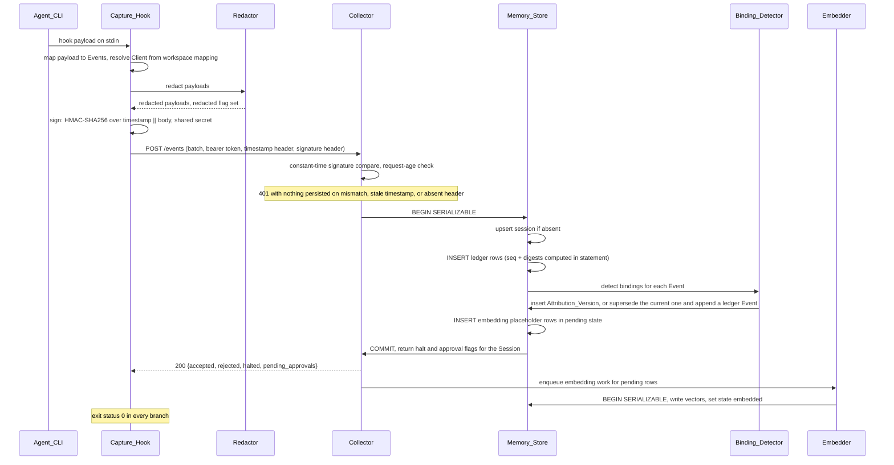
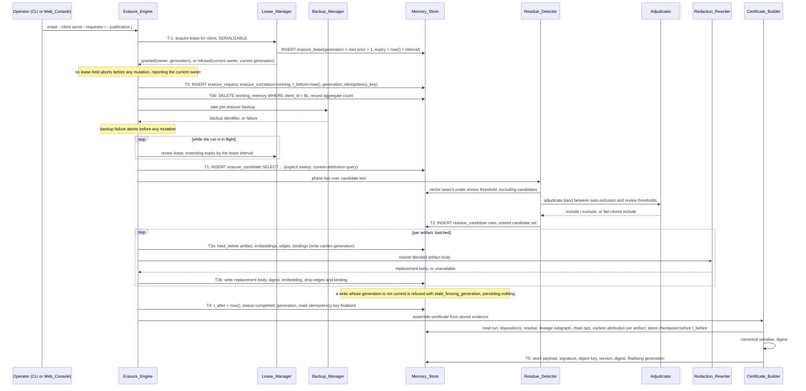
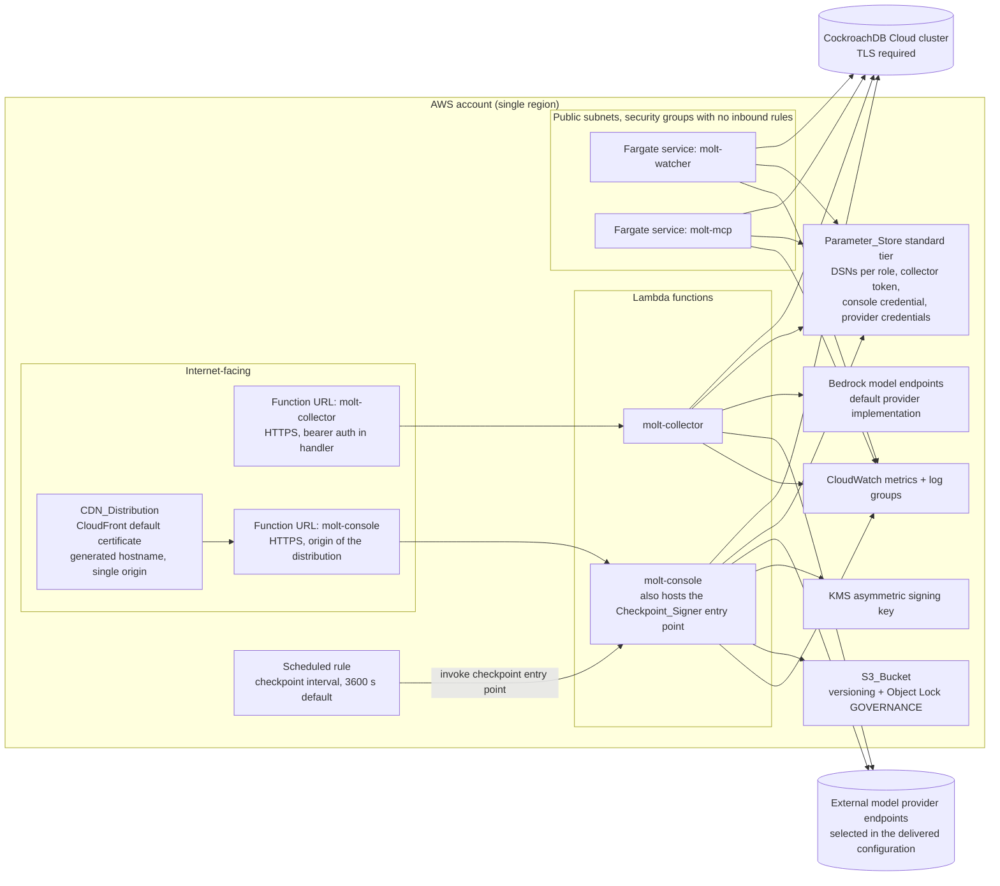
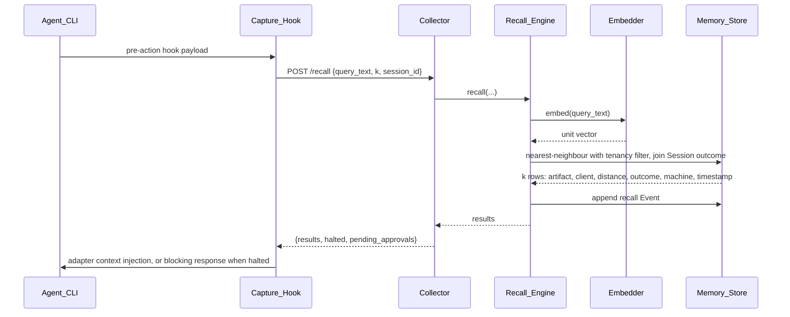

# Design Document

## Overview

Molt is a memory layer for AI coding agents in which a managed CockroachDB Cloud cluster is the single system of record. Capture runs on engineer machines, all durable state lives in the cluster, and every governance claim is either a SQL query result or a signed document that a third party can re-derive from the cluster.

The design is organised around seven load-bearing decisions.

**The cluster is the truth, not a mirror.** There is no local event log that is later shipped into a database. The only local persistence is a bounded retry spool. Provenance, lineage, bindings, embeddings, policy state, and erasure evidence are all relational objects with UUID keys, `TIMESTAMPTZ` columns, `JSONB` payloads, and a `VECTOR(1024)` column, from the first migration onward (Requirements 7, 9, 10, 29.6).

**Tamper evidence is produced by the writing statement.** Sequence assignment and digest computation happen inside the single `INSERT` that appends a ledger row, using values that statement itself reads. Nothing reads a previously written digest in a separate round trip and writes it back (Requirements 8.4, 29.7).

**Erasure is a three-phase pipeline whose evidence is written before, during, and after mutation.** Explicit sweep is SQL. Residue detection is vector search with a fail-closed model adjudication band. Disposition is per-artifact, choosing between hard delete and surgical rewrite. Every decision becomes a durable `disposition` row, so the certificate is assembled from stored evidence rather than from process memory (Requirements 16, 17, 18, 21).

**Nothing on an engineer machine holds database credentials.** Capture and recall both speak to the Collector over HTTPS with a bearer token. The Collector, the Policy_Watcher, the Web_Console, the Molt_MCP_Server, and the CLI hold cluster credentials scoped to a least-privilege role, each read from Parameter_Store (Requirements 27, 30).

**Model access is an interface, not a vendor.** The Embedder, the Adjudicator, and the Redaction_Rewriter call an `EmbeddingProvider` or a `TextProvider`, never a provider SDK directly. Bedrock is the documented default implementation; the delivered configuration selects external implementations because on-demand inference quota is zero and non-adjustable on the delivered account. The `VECTOR(1024)` column is unchanged either way, because the Provider_Selector refuses at startup any embedding implementation reporting a width other than 1024 (Requirements 37, 10.2).

**Memory is six named tiers, each with its own mutability contract and its own database capability.** Every stored row belongs to exactly one of `episodic`, `attribution`, `procedural_semantic`, `provenance`, `action`, and `working`. The tiers are not a taxonomy applied after the fact: a tier exists because its content is mutable in a different way and leans on a different CockroachDB feature, and those two facts are what make the cluster the agent's memory rather than its logfile. The taxonomy is set out in full immediately after the component inventory (Requirement 42).

**Governance claims are protected structurally, not procedurally.** Attribution is an immutable version history rather than an editable row, so *when did you first hold this* is answerable. Erasure ownership is a fenced lease, so a superseded worker's write is refused rather than merely unlikely. Ledger integrity is committed to by a signature produced outside the cluster, so a consistent rewrite is detectable even by a party that does not trust the database administrator. Audit evidence is protected by referential actions and privilege revocations, so removing the record of an erasure is refused by the database rather than avoided by discipline. Ingest is signed and time-bounded, so a captured request is replayable only inside a narrow window. In each case the enforcement point is a constraint, a privilege, or a key rather than an application rule (Requirements 43, 44, 45, 46, 47).

### Component inventory

Component names are used exactly as defined in the requirements glossary: Capture_Hook, MCP_Proxy, Decorator_API, Redactor, Collector, Memory_Store, Embedder, Provider_Selector, Binding_Detector, Recall_Engine, Erasure_Engine, Lease_Manager, Checkpoint_Signer, Sensitivity_Analyzer, Confidence_Tracker, Residue_Detector, Adjudicator, Redaction_Rewriter, Certificate_Builder, Certificate_Verifier, Policy_Watcher, Retention_Manager, Backup_Manager, Auditor_Gateway, Molt_MCP_Server, Web_Console, CLI, Provisioner, Seed_Generator, Telemetry.

Four of those are new components, each answering an obligation the earlier design left to convention:

| Component | Owns | Traces to |
|---|---|---|
| **Lease_Manager** | Granting, renewing, and transferring Erasure_Leases, and owning the Fencing_Generation for each Client, so exactly one worker owns an erasure at a time and a superseded worker's writes are refused | 44 |
| **Checkpoint_Signer** | Computing, signing, storing, and verifying Ledger_Checkpoints, so tamper evidence covers every Session in a window rather than only the Sessions a certificate names | 45 |
| **Sensitivity_Analyzer** | Evaluating the residue candidate set across a Threshold_Grid and reporting the consequence of each threshold pair, so the one tuning decision that changes erasure scope is made with evidence | 48 |
| **Confidence_Tracker** | Recording Learned_Procedure retrievals and outcomes and adjusting Procedure_Confidence, so procedural memory improves with use rather than only accumulating | 49 |

Six additional deliverables are designed here because they are acceptance conditions rather than runtime components: the Agent_Skills shipped under `skills/`, the CI_Workflow definition, the model provider implementations selected by the Provider_Selector, the Interface_Specification served by the Web_Console, the glossary document, and the Threat_Model.

### Memory tier taxonomy

Every stored row belongs to exactly one Memory_Tier. The tier is not a label bolted on after the fact: each tier exists because its content has a different mutability contract and leans on a different CockroachDB capability, and those two facts together are what make the cluster the agent's memory rather than its logfile (Requirement 42.1).

| Memory_Tier | Tables it holds | Mutability | CockroachDB capability it relies on | Traces to |
|---|---|---|---|---|
| `episodic` | `ledger` | **Append-only.** No role holds `UPDATE`; rows leave only by an authorised erasure or by Row-Level TTL | SERIALIZABLE isolation, so sequence assignment and digest computation happen inside the inserting statement; `TIMESTAMPTZ` and `JSONB` native types | 42.2, 7, 8 |
| `attribution` | `client_binding`, held as an Attribution_Version history | **Append-only with closure.** Detection method, confidence, Artifact, and Client are immutable on a stored version; only the validity end and the superseding reference are ever written, and both exactly once | SERIALIZABLE isolation, so closing the old version and inserting the new one commit together as one atomic supersession; partial and covering indexes serving the as-of query inside its one-second bound | 42.3, 43 |
| `procedural_semantic` | `derived_artifact`, `procedure_retrieval`, `procedure_outcome`, `procedure_confidence_change` | **Revisable.** Bodies are surgically rewritten and Procedure_Confidence moves with recorded outcomes; every change is accompanied by an audited change record | Distributed vector index over the `VECTOR(1024)` column for semantic recall; a database-side update guard confining which columns a revision may touch | 42.4, 18, 49 |
| `provenance` | `lineage_edge`, the Hash_Chain columns of `ledger`, `ledger_checkpoint` | **Immutable.** Edges are inserted and deleted, never edited; chain columns are never rewritten; checkpoints admit no `UPDATE` and no `DELETE` from any role | Recursive common table expressions for lineage closure; `sha256` evaluated inside the writing statement; referential actions refusing deletions that would remove audit history | 42.5, 11, 45, 46 |
| `action` | `erasure_lease`, `erasure_request`, `erasure_run`, `erasure_candidate`, `residue_candidate`, `disposition`, `run_session`, `backup_record`, `erasure_certificate` | **Write-once evidence, with one current lease per Client.** Dispositions and certificates are inserted and never rewritten; the lease row is the only mutable member and only its expiry, owner, and generation move | SERIALIZABLE isolation for monotonic Fencing_Generation assignment; a partial uniqueness constraint admitting one current lease per Client; `ON DELETE RESTRICT` protecting the evidence chain | 42.6, 44, 46 |
| `working` | `working_memory` | **Disposable.** Rows are overwritten freely and physically deleted on expiry; nothing depends on a working row surviving | Row-Level TTL with a 3600 second default interval, so expiry is enforced by the cluster rather than by a scheduled process outside it | 42.7, 42.9, 42.15 |

Three containment rules make the `working` tier genuinely disposable rather than nominally so, and they are what Property 37 asserts:

- **No certificate field and no Verification_Query reads the `working` tier.** The Certificate_Builder derives every field from `episodic`, `attribution`, `procedural_semantic`, `provenance`, and `action` tables, and every Verification_Query template targets those tables only (Requirements 42.10, 42.11).
- **Nothing references a working row.** `lineage_edge`, `client_binding`, `disposition`, and `ledger_checkpoint` each carry no reference to `working_memory`, and the `artifact_ref` view does not include it, so a working row cannot become a lineage parent or an erasure candidate (Requirement 42.12).
- **Erasure deletes working rows for a Client as one aggregate count.** The Erasure_Engine issues a single set-based delete at run start and records the deleted row count on the run row, rather than emitting a Disposition per row, because a Disposition is evidence about content that mattered and a working row is by construction content that did not (Requirement 42.13).

The taxonomy is observable at runtime rather than only documented. The Web_Console serves a Memory_Tier view at `GET /tiers` rendering one row per tier with the tables that tier holds, that tier's mutability, the capability that tier relies on, and that tier's live row count read from the cluster at request time (Requirements 25.15, 42.16). The four descriptive columns of the table above are encoded exactly once, as a module-level immutable mapping in `src/molt/models/tiers.py`; that mapping is the single source, the view reads it, and the generator that produces `docs/memory-tiers.md` reads it as well (Requirement 42.14), so the design table, the rendered view, and the documentation state one taxonomy rather than three copies of one.

### Platform facts verified against the delivered cluster

Four platform behaviours were previously treated as unconfirmed. Each has now been probed live against the delivered cluster and each result is recorded in the capability record that Memory_Store reads once at process start. No component branches on a cluster version string; every branch is driven by the probe result. The fallback paths remain in the design, but they are fallbacks for other tiers rather than the expected path on the delivered cluster.

| Platform fact | Verified result | Probe | Consequence for the design | Fallback retained for other tiers | Traces to |
|---|---|---|---|---|---|
| Distributed vector index | **Available.** The index was created successfully and the cluster reports it as `VECTOR INDEX … (v vector_l2_ops)` | `CREATE VECTOR INDEX` in migration 003, then the index definition is read back and recorded as `vector_index=present` with the reported operator class | The index is **required** on the delivered cluster: migration 003 records its presence, and recall and residue detection run index-served. Because the operator class is L2, the decision to unit-normalise every vector at write time is load-bearing rather than defensive — cosine thresholds stay meaningful while the L2 index serves the ordering | Exact scan bounded by the covering index on `(client_id)` and a candidate cap, same SQL shape, same cosine thresholds, `store.vector_index_unavailable` emitted | 10.3, 10.10, 10.11, 10.12, 13.5, 17.2 |
| Sinkless changefeeds | **Available.** `EXPERIMENTAL CHANGEFEED FOR … WITH resolved` emitted both row-change rows and resolved-timestamp rows, and the rangefeed cluster setting reads enabled | The changefeed statement is opened at Policy_Watcher start with a short resolved interval; the Provisioner separately reads the rangefeed cluster setting and records it | Changefeed consumption is the **primary** mechanism. The watcher's expected mode is `changefeed` and its health route reports that mode | Timestamp polling on `(recorded_at, id)` from a persisted watermark, `watcher.degraded_to_polling` emitted | 23.2, 23.3, 23.14, 23.15, 32.3 |
| Garbage-collection horizon | **Measured at 4500 seconds.** This is far shorter than typical defaults and far shorter than a certificate's evidence lifetime | `SHOW ZONE CONFIGURATION` is read for `gc.ttlseconds` and the measured value is recorded | The Ledger-plus-Dispositions derivation is the **primary** count mechanism for every certificate. The historical `AS OF SYSTEM TIME` read is an **opportunistic corroboration**, performed only when both `t_before` and `t_after` fall inside the horizon at assembly time, and its agreement or disagreement is recorded alongside the derived counts | None needed — the primary mechanism has no external dependency | 20.2, 20.4, 20.6, 20.7, 20.8 |
| On-demand backup through the cloud control plane | **Does not exist.** The control plane exposes backup listing and backup configuration only | The Provisioner interrogates the control plane through the ccloud CLI for an on-demand backup creation operation and records `on_demand_backup=absent`; the Self_Managed_Backup path is probed separately and recorded as `self_managed_backup` | `BACKUP INTO` against an operator-owned bucket is the **primary** backup path, issued by Backup_Manager before the first mutation of a run. Referencing the most recent Managed_Backup by identifier and timestamp is the fallback, and the recorded backup path value distinguishes the two | `managed_referenced`: the most recent Managed_Backup identifier and timestamp are recorded and the record is marked referenced rather than taken | 19.1, 19.2, 19.5, 19.6, 19.7, 27.11 |

### Verified deployment facts

These are the facts the delivered configuration was validated against, recorded here so the design states what was measured rather than what was assumed.

| Fact | Value |
|---|---|
| Deployment region | The single AWS region in which the CockroachDB_Cluster and every required model were verified reachable. The Provisioner re-verifies model reachability in that region and exits non-zero on an unreachable identifier (Requirements 34.10–34.12) |
| Cluster | Current major version, basic plan, on AWS, in the deployment region |
| Garbage-collection horizon | 4500 seconds, measured (Requirement 20.7) |
| Distributed vector index | Created, reported by the cluster with the `vector_l2_ops` operator class (Requirement 10.12) |
| Rangefeeds and sinkless changefeeds | Enabled and permitted (Requirement 23.15) |
| Embedding model | Verified to return exactly 1024 dimensions, so the `VECTOR(1024)` column and the L2 index are unchanged (Requirement 37.8) |
| Text model | Verified to complete an adjudication-shaped call and to report prompt-cache token fields in its usage response (Requirements 38.3, 38.5) |
| On-demand backup creation | Absent from the cloud control plane; `BACKUP INTO` is the primary path (Requirement 19.1) |

No account identifier, cluster hostname, personal name, calendar date, clock time, or timestamp literal appears anywhere in this document, which is the hygiene obligation of Requirement 29.4 applied to the design itself.

### Technology choices and rationale

| Choice | Rationale | Traces to |
|---|---|---|
| Python 3.11 as the floor | Required runtime declaration; the codebase uses `tomllib`, exception groups, and `Self` typing available at that floor | 35.7 |
| `psycopg` (version 3 API) as the sole driver | Required driver declaration; server-side parameter binding, native `TIMESTAMPTZ` and `JSONB` adaptation, streaming cursors for sinkless changefeed consumption, and a client-side connection pool | 30.6, 35.8, 23.2 |
| `boto3` as the sole AWS client | Required client declaration; one dependency covers Bedrock, KMS, S3, Parameter_Store, CloudWatch, and Lambda | 35.8, 34 |
| Standard-library `argparse` for the CLI | Zero added dependency, native support for the two-word `attest verify` verb through nested subparsers, deterministic exit codes | 26 |
| `starlette` with `jinja2` for the Web_Console, run as a Lambda handler | Server-rendered HTML needs no build toolchain and makes keyboard operability and accessible naming a template concern rather than a client-framework concern. The application is invoked through a Lambda adapter rather than a long-running server, because the console holds no long-running connection and a function endpoint carries no hourly charge | 25, 34.2 |
| Plain handler function behind a Lambda Function URL for the Collector | No web framework in the ingest path keeps cold start inside the capture latency budget and keeps request cost bounded | 1.8, 5, 34.1 |
| `hypothesis` for property-based tests | Required by the property set; shrinking is what makes counterexamples usable | 36.6–36.11 |
| `cryptography` for local signature verification | The Certificate_Verifier must verify against a public key retrieved from KMS rather than by asking KMS to verify, so verification survives loss of KMS call permission | 22.2, 22.8 |
| Model access behind Embedding_Provider and Text_Provider protocols | On-demand inference quota is zero and non-adjustable on the delivered account, a new-account restriction outside the operator's control. Behind an interface, provider availability is a configuration change rather than a rewrite, and Bedrock stays the documented default | 37.1–37.7, 37.14 |
| A code-specialised retrieval embedding model returning 1024 dimensions in the delivered configuration | Residue detection searches for semantically similar **source code**, so a code-specialised retrieval model is the right objective. The model was verified to return exactly 1024 dimensions, so the fixed `VECTOR(1024)` column and the L2 index are unchanged | 10.2, 37.8, 37.10 |
| A text model supporting prompt caching in the delivered configuration | Adjudication makes one call per review-band candidate against a shared task instruction and query excerpt. Prompt caching turns that shared prefix into one paid write and many cheap reads; cache-token fields in the usage response are what make the hit ratio measurable | 38.1–38.6 |
| Vectors L2-normalised before write | The delivered index is `vector_l2_ops`, so L2 ordering is what the index serves. On unit vectors L2 ordering and cosine ordering coincide, which is what lets the thresholds stay expressed in cosine space while the index does the work | 10.3, 10.10, 17.10 |
| Parameter_Store standard tier for every secret | The standard tier carries no per-parameter monthly charge, while the per-secret secret store charges monthly per secret. Molt holds several secrets — DSNs per role, the Collector token, the console credential and session key, and two provider credentials — so the per-secret charge is the dominant avoidable cost | 30.2, 30.3, 30.12, 33.12 |
| No Application Load Balancer anywhere, CloudFront in front of a Lambda function endpoint for the console | An ALB HTTPS listener requires an ACM certificate, and no ACM certificate can be issued for the ALB's own generated hostname, so HTTPS on an ALB would require a custom domain and none is in scope. An ALB also carries an hourly charge with no free-tier allowance. CloudFront terminates HTTPS on its own default certificate and generated hostname at no fixed hourly charge | 25.1, 25.14, 34.2, 34.9 |
| No NAT gateway and no interface endpoints; Fargate tasks in public subnets with no inbound rules | A NAT gateway carries an hourly charge plus per-gigabyte processing, and interface endpoints are not cheaper at the count this design would need — one per service reached, each hourly-charged per availability zone. Public subnets with security groups permitting no inbound traffic give the tasks egress without either charge, and the tasks expose nothing: the watcher and the MCP server are both outbound-connecting | 33.10, 33.11 |
| CloudFormation templates under `infra/` driven by shell wrappers | Infrastructure is declarative configuration with no runtime dependency to pin, and it is verified by template synthesis and deployment smoke tests rather than by property tests | 34.6 |
| `mypy` in strict mode as the static type checker | Strict mode is what makes the annotation obligation machine-verified rather than conventional: it rejects an untyped definition, an implicit `Any` return, and an unfollowed import, which are exactly the gaps a partially annotated codebase leaves. It runs over `src/molt/`, `tests/`, and `scripts/` and needs no cloud or cluster credential | 50.1, 50.2, 50.7 |
| `ruff` as both linter and formatter, pinned to one exact version | One tool covering both roles removes the class of failure where the formatter and the linter disagree about the same line, and a single pinned version makes the check reproducible on a developer machine and in the workflow. It runs over `src/molt/`, `tests/`, `scripts/`, and `infra/` | 50.5, 50.8, 50.9 |
| An OpenAPI document as the Interface_Specification | The Collector routes, the Web_Console routes, and the Molt_MCP_Server tools all reduce to request shape, response shape, authentication requirement, and error responses, which is what OpenAPI describes. Being machine-readable is what lets a test assert that every served route and every exposed tool appears in it | 51.1, 51.2, 51.10, 51.11 |

---

## Architecture

### System context

```mermaid
graph TB
    subgraph machine["Engineer machine (no database credentials)"]
        ACLI["Agent_CLI<br/>Claude Code / Cursor / Codex / Gemini CLI / Copilot"]
        CH["Capture_Hook"]
        MP["MCP_Proxy"]
        DA["Decorator_API"]
        RD["Redactor"]
        SPOOL[("Local spool file<br/>64 MiB bound")]
        ACLI -->|hook payload on stdin| CH
        ACLI -->|JSON-RPC| MP
        CH --> RD
        MP --> RD
        DA --> RD
        RD -->|"Events + recall query"| SPOOL
    end

    subgraph client["Any MCP-compatible client agent"]
        EXT["External agent"]
        SK["Agent_Skills<br/>shipped under skills/"]
    end

    subgraph aws["AWS"]
        CDN["CDN_Distribution<br/>CloudFront default certificate<br/>+ generated hostname"]
        COL["Collector<br/>Lambda + Function URL"]
        WC["Web_Console<br/>Lambda + Function URL"]
        PW["Policy_Watcher<br/>Fargate, public subnet, no inbound"]
        MMS["Molt_MCP_Server<br/>Fargate, public subnet, no inbound"]
        KMS["KMS"]
        S3["S3_Bucket<br/>versioning + Object Lock"]
        PS["Parameter_Store<br/>standard tier"]
        CW["CloudWatch"]
        BR["Bedrock<br/>default provider implementation"]
    end

    subgraph prov["Model providers behind the abstraction"]
        PSEL["Provider_Selector"]
        EES["External_Embedding_Service<br/>code-specialised retrieval, 1024 dims"]
        ETS["External_Text_Service<br/>prompt caching"]
    end

    subgraph crdb["CockroachDB_Cluster"]
        MS["Memory_Store<br/>schema, transactions, queries"]
        MMCP["Managed_MCP_Server"]
    end

    subgraph libs["Server-side components"]
        EMB["Embedder"]
        BD["Binding_Detector"]
        RE["Recall_Engine"]
        EE["Erasure_Engine"]
        LM["Lease_Manager"]
        CS["Checkpoint_Signer"]
        SA["Sensitivity_Analyzer"]
        CT["Confidence_Tracker"]
        RES["Residue_Detector"]
        ADJ["Adjudicator"]
        RW["Redaction_Rewriter"]
        CB["Certificate_Builder"]
        CV["Certificate_Verifier"]
        RM["Retention_Manager"]
        BM["Backup_Manager"]
        TEL["Telemetry"]
    end

    CLI["CLI"]
    PROV["Provisioner"]
    SG["Seed_Generator"]
    AG["Auditor_Gateway"]
    AUD["Auditor"]

    RD -->|"HTTPS + bearer token"| COL
    CH -->|"recall request"| COL
    COL -->|"halt / approval flags in response"| CH
    COL --> MS
    COL --> BD
    COL --> EMB
    COL --> RE
    CDN --> WC
    WC --> MS
    WC --> EE
    WC --> CV
    PW -->|"changefeed, polling as fallback"| MS
    PW --> MS
    EXT -->|"stdio or HTTP tools"| MMS
    SK -->|"read-only procedures"| MMS
    MMS -->|"read-only role"| MS
    MMS --> RE
    MMS --> RES
    CLI --> EE
    CLI --> RES
    CLI --> CV
    CLI --> RE
    CLI --> PW
    CLI --> WC
    CLI --> MMS
    CLI --> SG
    EE --> RES
    EE --> RW
    EE --> CB
    EE --> BM
    EE -->|"acquire / renew / fence"| LM
    LM --> MS
    CLI --> LM
    CLI --> SA
    WC --> SA
    WC --> CT
    WC -->|"scheduled invocation, shares kms:Sign"| CS
    CS --> KMS
    CS --> MS
    CV --> CS
    SA --> MS
    RE --> CT
    CT --> MS
    RES --> ADJ
    SA --> RES
    EMB --> PSEL
    ADJ --> PSEL
    RW --> PSEL
    PSEL --> BR
    PSEL --> EES
    PSEL --> ETS
    CB --> KMS
    CB --> S3
    CB --> MS
    CV --> KMS
    CV --> S3
    CV --> MS
    RM --> MS
    SG --> MS
    PROV --> MS
    PROV --> PS
    COL --> PS
    WC --> PS
    PW --> PS
    MMS --> PS
    CLI --> PS
    PSEL --> PS
    TEL --> CW
    AUD --> MMCP
    AG --> MMCP
    MMCP --> MS
    EE --> MS
    RE --> MS
    BD --> MS
    EMB --> MS
```



### Write path



### Erasure path



### Deployment topology



Five topology decisions are load-bearing and each replaces an earlier one:

- **No Application Load Balancer is created anywhere** (Requirement 34.9). An ALB HTTPS listener requires an ACM certificate, and ACM issues no certificate for the ALB's own generated hostname, so HTTPS on an ALB would require a custom domain that is not in scope. The ALB also carries an hourly charge with no free-tier allowance. The Web_Console is therefore a Lambda function behind an HTTPS function endpoint, with a CloudFront distribution in front of it terminating HTTPS on CloudFront's own default certificate and generated hostname (Requirements 25.1, 25.14, 34.2).
- **Fargate hosts only the Policy_Watcher and the Molt_MCP_Server**, because each holds a long-running connection: the watcher holds a changefeed cursor, and the MCP server holds client transport sessions (Requirement 34.2).
- **No NAT gateway and no interface endpoints** (Requirement 33.10). Fargate tasks run in public subnets with security groups that permit no inbound traffic (Requirement 33.11). Interface endpoints are not cheaper than NAT at the count this design would need — one per service reached, each charged hourly per availability zone — and both are avoidable entirely because the tasks only make outbound connections.
- **Every secret lives in Parameter_Store standard tier**, which carries no per-parameter monthly charge, rather than in a per-secret-charged store (Requirements 30.2, 30.3, 33.12).
- **The Checkpoint_Signer runs as a scheduled invocation of the console function rather than as a task of its own.** A Ledger_Checkpoint is signed with the same asymmetric KMS key that signs certificates (Requirement 45.4), and `kms:Sign` on that key is granted to the Certificate_Builder execution role and to no other principal (Requirement 30.9). Giving the checkpoint work its own compute would mean either granting `kms:Sign` to a second role, which breaks 30.9, or signing with a second key, which breaks 45.4. Hosting the checkpoint entry point in the same function that holds the Certificate_Builder satisfies both, and a scheduled rule carries no hourly charge, so the checkpoint interval costs one short invocation per interval rather than a standing task.

The Policy_Watcher and the Molt_MCP_Server expose no internet-facing listener. The watcher's health route binds to its own port and is reached only from inside the task's own network namespace and by the CLI when run in the foreground (Requirements 23.12, 31.5). The Molt_MCP_Server's HTTP transport binds likewise and is reached through the same path; the stdio transport is a locally spawned process. The Web_Console is the only component whose memory content is reachable from the internet, and every content route requires authentication (Requirement 25.9).

---

## Components and Interfaces

Every component below is a module under `src/molt/`. Interfaces are given as Python signatures; types named in capitals are the data models defined later.

### Capture layer

#### Capture_Hook

```python
def main(argv: list[str]) -> int:                    # always returns 0
def dispatch(tool: str, raw: bytes) -> HookOutcome
def map_payload(tool: str, payload: Mapping) -> list[Event]
def resolve_client(workspace_path: str) -> ClientRef  # falls back to UNASSIGNED
def emit(events: list[Event]) -> TransmitResult
```

The entry point is a single console script installed per tool as a thin shim (`molt-hook <tool> <event-name>`), so the invoking hook format identifies the Agent_CLI rather than operator configuration (Requirement 1.3). The tool token is supplied by the hook registration that the setup instructions generate, and is validated against the supported set; an unknown token still exits 0.

`main` is wrapped in a total handler: every exception, including decoding failures on non-UTF-8 input, is caught, one diagnostic line is written to standard error, and the process exits 0 (Requirements 1.7, 6.6, P22). The only paths that write to standard output are the ones that return a structured hook response, because standard output is the vendor channel for decisions.

**Latency budget.** The 250 ms budget at p95 (Requirement 1.8) is met by: no database driver import in the hook process, one HTTPS call with a 5 second cap but a 1.2 second soft deadline after which the batch is spooled, connection reuse across the spool flush and the new batch, and lazy import of the redaction pattern table. The benchmark harness lives at `tests/perf/test_hook_latency.py` and drives 1000 invocations of the real entry point against a local stub Collector.

**Per-tool adapters.** Each adapter is a module `src/molt/capture/adapters/<tool>.py` implementing one protocol, written from that tool's own published hook specification, with the specification location and the fields consumed recorded in `docs/hooks/<tool>.md` (Requirements 1.9, 29.9). No adapter shares parsing code with another beyond the shared `Event` builders, because sharing would force one tool's payload shape onto another.

```python
class HookAdapter(Protocol):
    tool: str
    def parse(self, raw: bytes) -> HookInvocation: ...
    def to_events(self, inv: HookInvocation, ctx: CaptureContext) -> list[Event]: ...
    def context_injection(self, results: list[RecallResult]) -> bytes: ...
    def blocking_response(self, reason: str) -> bytes: ...
    def capabilities(self) -> AdapterCapabilities: ...
```

`AdapterCapabilities` records three booleans that drive degradation: `structured_stdout`, `context_injection`, `blocking_decision`. Where a tool's specification provides no structured context-injection envelope, `context_injection` returns the advisory text form the specification does define and the capability flag is false; recall results are then surfaced as advisory text rather than as injected context, and this is recorded per tool in `docs/hooks/<tool>.md`. Where a tool provides no blocking decision channel, the halt path emits the policy halt Event and returns the tool's non-zero-exit convention as documented for that tool.

The hook payload to Event mapping is expressed per adapter as a table from the vendor's hook event name to Molt Event categories. The mapping obligations that hold for every adapter:

| Vendor hook event class | Emitted Events | Fields carried into payload |
|---|---|---|
| Session or conversation start | session start | agent tool identity, workspace path, machine identifier, resolved Client, parent Session and spawning Event where the payload names a spawned subagent (Requirement 1.4) |
| User prompt submitted | user prompt | prompt text after redaction |
| Pre tool invocation | tool call, plus an optional recall query | tool name, tool input after redaction, correlation identifier from the vendor payload |
| Post tool invocation | tool result, linked by `parent_event_id` | tool name, result after redaction, duration where the payload provides it |
| Model request or response where exposed | model request, model response | model identifier, token counts, cost where exposed |
| File read or write where exposed | file read, file write | path, byte length, digest of content rather than content where content exceeds the payload cap |
| Shell command where exposed | shell command | command string after redaction |
| Session or conversation end | session end | outcome classification, terminal counters |
| Any adapter-level failure | error | exception type, redacted message |

The correlation identifier from the vendor payload is what links a tool result Event to its tool call Event through `parent_event_id`; when the vendor payload provides no correlation identifier, the adapter links to the most recent unlinked tool call Event for the same Session recorded in the local invocation index (Requirement 7.8).

**Spool file.** Path `${MOLT_SPOOL_DIR}/spool-<machine_id>.ndjson`, one JSON record per line, opened with `O_APPEND` so concurrent hook processes on the same machine interleave safely at record granularity. On start, if the file is non-empty, spooled records are transmitted before new records (Requirement 6.2). Transmission failure retries at most 3 times with backoff 200 ms, 400 ms, 800 ms plus jitter, every network operation capped at 5 seconds (Requirements 6.3, 6.4). When the file exceeds 64 MiB the head is dropped: records are streamed into a sibling temporary file starting from the first record that leaves the file within the bound, the temporary file is renamed over the original, and the discarded count is written to a counter file and reported on the next successful transmission (Requirement 6.5).

**Request signing.** Every transmission to an ingest endpoint carries a timestamp header and an Ingress_Signature header computed over the timestamp and the serialised body with the shared secret read from configuration (Requirement 47.10). Signing is one HMAC over bytes the hook already holds, so it costs no additional round trip and sits inside the latency budget. A signature is computed at transmission time rather than at capture time, so a batch flushed from the spool after an outage presents a fresh timestamp inside the age bound. When the shared secret is absent from configuration, the hook writes one diagnostic line and spools rather than transmitting, because an unsigned ingest request would be rejected and the Event would be lost; recall requests still proceed, because the recall path is bearer-only.

**Halt and approval observation.** The hook holds no database credential, so it learns halt state from the Collector's response envelope: every ingest and recall response carries `halted`, `halt_reason`, and `pending_approvals` for the Session. On `halted`, the adapter's `blocking_response` is written and a policy halt Event is queued (Requirement 23.7). On a pending approval whose rule matches the current action, the same blocking response is returned (Requirement 23.9). When the Collector is unreachable the hook cannot observe halt state; it spools, does not block, and records the unobserved-halt condition in the diagnostic line, because Requirement 6.1 makes availability of the agent the higher obligation.

#### MCP_Proxy

```python
def run_stdio(child_cmd: list[str], ctx: CaptureContext) -> int
def run_http(upstream: str, bind: str, ctx: CaptureContext) -> int
def relay(frame: bytes, direction: Direction) -> bytes    # returns frame unchanged
```

The proxy forwards the exact byte sequence it received, excluding transport framing (Requirement 2.4, P24). Event emission is a side effect on a copy of the frame: the frame is parsed for observation only, and a parse failure increments the dropped-Event counter without touching the relay path (Requirement 2.5). Request and response Events are linked by the JSON-RPC `id` value carried in `parent_event_id` (Requirements 2.2, 2.3). Upstream close triggers downstream close and a session end Event (Requirement 2.6).

#### Decorator_API

```python
@molt_tool(name: str | None = None)
def wrapped(...): ...

@contextmanager
def molt_session(client: str, agent_cli: str = "decorator") -> Iterator[SessionRef]
```

Emits a tool call Event before and a tool result Event after the call, records duration in milliseconds, converts an exception into an error Event carrying the exception type and redacted message and re-raises the original exception, and becomes a pass-through when Molt is unconfigured (Requirement 3).

#### Redactor

```python
def redact(value: JsonValue, depth: int = 0) -> tuple[JsonValue, bool]
def redact_text(text: str) -> tuple[str, bool]
```

Pattern classes, each a compiled regular expression over string values only: AWS access key identifiers, AWS secret access key shaped high-entropy strings in assignment context, PEM private key blocks, bearer token headers and token-shaped strings following a bearer keyword, database connection strings with embedded credentials, and values whose sibling key matches the configured sensitive-name pattern set (Requirement 4.2). Matches are replaced with the fixed token `[MOLT_REDACTED]`.

Structure is preserved exactly: mappings keep their key sets and ordering, sequences keep their length and ordering, and non-string scalars are returned unchanged, so a redacted payload has the same shape and value types as its input (Requirements 4.4, P9). Recursion stops at depth 32 and deeper values are replaced by the placeholder with the container type preserved (Requirement 4.5). Because replacement is a fixed token that matches no pattern, and because sensitive-name replacement is idempotent on an already-replaced value, applying the Redactor twice equals applying it once (Requirement P8). The 50 ms budget for a 256 KiB payload is met by a single pre-compiled alternation applied per string rather than a loop over patterns.

With the redaction-disabled flag set, payloads pass through unmodified and Telemetry emits a warning log record naming the Session (Requirement 4.6).

### Ingest and store

#### Collector

Routes on a Lambda Function URL. Every route other than `/health` requires the bearer token; the two ingest routes require an Ingress_Signature in addition (Requirements 47.1, 47.11, 47.12):

| Method and path | Purpose | Auth | Traces to |
|---|---|---|---|
| `POST /events` | newline-delimited Event batch | bearer **and** Ingress_Signature | 5.1, 5.13, 47.1 |
| `PUT /sessions/{id}` | create or update Session metadata | bearer **and** Ingress_Signature | 5.2, 5.13, 47.1 |
| `POST /recall` | Recall_Engine query on the agent critical path | bearer only | 13, 47.12 |
| `GET /health` | liveness and database reachability, no memory content | none | 5.3 |

```python
def handler(event: dict, context) -> dict
def ingest_batch(lines: Iterable[bytes]) -> BatchResult   # accepted, rejected, halted, pending_approvals
```

Bearer comparison uses `hmac.compare_digest` (Requirement 5.5). A batch containing malformed records persists every well-formed record and returns both counts, whose sum equals the batch size (Requirements 5.6, P23). An Event whose Session does not exist creates the Session in the same transaction as the Event (Requirement 5.7). The connection string and expected token are read from Parameter_Store at cold start and cached for the container lifetime (Requirement 5.8). Cluster unreachability returns 503 and emits `collector.write_failure` (Requirement 5.9). Every database operation is bounded by a 10 second statement timeout (Requirement 32.6).

**Request bound and concurrency ceiling.** The handler reads the declared body length before decoding and rejects a body exceeding the configured maximum, default 5 MiB, with status 413, persisting no record from that request (Requirements 5.10, 5.11, P29). The check happens before any parse, so an oversized body is never held in a decoded form. The function is deployed with a reserved concurrency ceiling, default 10, so the cost of a flood of requests presenting a leaked bearer token is bounded by that ceiling rather than by account concurrency (Requirement 5.12).

**Signed ingress with replay resistance.** A bearer token authenticates a caller and resists no replay: a captured request body carrying a valid token can be re-sent indefinitely, and every replay writes new Ledger rows that are indistinguishable from the original. The Ingress_Signature closes that window to a bounded interval (Requirement 47.14).

```python
def verify_ingress(headers: Mapping[str, str], body: bytes, secret: str,
                   max_age_s: int) -> None                       # raises IngressRejected
def sign_ingress(body: bytes, secret: str, ts: str) -> str        # capture side
```

| Element | Design |
|---|---|
| Signed material | The concatenation of the presented request timestamp and the raw request body, in that order, with no separator inserted by the verifier that the signer does not also insert. The body is the exact bytes received, taken before any decode or parse, so a signature covers what was sent rather than what was interpreted (Requirement 47.2) |
| Algorithm and key | HMAC-SHA256 keyed by a shared secret the Collector retrieves from Parameter_Store at cold start through the same accessor as the DSN and the bearer token (Requirements 47.2, 30.2) |
| Headers | Two request headers, one carrying the RFC 3339 request timestamp and one carrying the hex-encoded signature. Both are read before any body handling (Requirement 47.3) |
| Comparison | `hmac.compare_digest` against the computed value, so a mismatch leaks no timing information about the correct prefix (Requirement 47.9) |
| Age bound | The absolute difference between the cluster's current timestamp and the presented timestamp must not exceed the configured maximum request age, default 300 seconds (Requirements 47.5, 47.6) |
| Rejection | Status 401 with **nothing persisted** on signature mismatch, on a timestamp outside the age bound, on an absent timestamp header, and on an absent signature header. The check runs before the transaction opens, so no partial write is possible even for a batch whose leading records are well-formed (Requirements 47.4, 47.5, 47.7, 47.8, Property 34) |
| Metric | `collector.signature_rejected` on every rejection under any of those four causes (Requirement 47.13) |
| Scope | Required on `POST /events` and `PUT /sessions/{id}`. `POST /recall` stays bearer-only on purpose: recall is the interactive path, and an operator or an editor-hosted caller holding the bearer token but not the shared secret must still be able to ask memory a question. A replayed recall request writes one recall Event and returns data the caller was already authorised to read, so the replay exposure there is bounded by construction rather than by a signature (Requirement 47.12) |

The capture side is symmetric: the Capture_Hook and the MCP_Proxy each read the shared secret from configuration, compute the signature over the serialised batch bytes immediately before transmission, and present both headers (Requirement 47.10). Because the spool holds records rather than signed requests, a spooled batch is signed with a fresh timestamp when it is finally transmitted, so the age bound is measured from transmission rather than from capture and a long spool outage does not produce a batch that is rejected as stale.

#### Memory_Store

The only module that issues SQL. Every caller-supplied value is a bound parameter; identifiers are never interpolated from caller input (Requirement 30.6). Connections require TLS with `sslmode=verify-full` (Requirement 30.7). Every write runs in an explicit `BEGIN` with `SET TRANSACTION ISOLATION LEVEL SERIALIZABLE` (Requirement 15.1).

```python
class MemoryStore:
    def capabilities(self) -> Capabilities
    def append_events(self, events: list[Event]) -> list[AppendedRow]
    def upsert_session(self, s: SessionRecord) -> None
    def bump_session_counters(self, session_id: UUID, d: CounterDelta) -> None
    def write_derived_artifact(self, a: DerivedArtifact, parents: list[ArtifactRef],
                              bindings: list[ClientBinding], vec: Vector | None) -> None
    def insert_lineage_edge(self, e: LineageEdge) -> None
    def descendants(self, roots: list[ArtifactRef]) -> list[ArtifactRef]
    def ancestors(self, node: ArtifactRef) -> list[ArtifactRef]
    def nearest(self, q: Vector, k: int, permitted: list[UUID],
                max_cosine: float | None) -> list[Neighbour]
    def verify_chain(self, session_id: UUID) -> ChainReport
    def historical(self, sql: str, params: Sequence, at: datetime) -> list[tuple]
    def in_serializable(self, fn: Callable[[Cursor], T]) -> T   # retry wrapper

    # attribution history (Requirement 43)
    def current_attribution(self, artifact_id: UUID) -> list[AttributionVersion]
    def attribution_as_of(self, artifact_id: UUID, at: datetime) -> list[AttributionVersion]
    def supersede_attribution(self, prior: UUID, replacement: AttributionVersion) -> UUID

    # fenced erasure writes (Requirement 44)
    def fenced(self, client_id: UUID, generation: int,
               fn: Callable[[Cursor], T]) -> T          # raises StaleFencingGeneration

    # working tier (Requirement 42)
    def working_put(self, session_id: UUID, key: str, value: JsonObject) -> None
    def working_get(self, session_id: UUID, key: str) -> JsonObject | None
    def working_purge_for_client(self, client_id: UUID) -> int   # one aggregate count
```

`in_serializable` retries on SQLSTATE `40001` at most 5 times with exponential jittered backoff (base 50 ms, cap 2 s), then raises a named error and emits `store.serialization_exhausted` (Requirements 15.4, 15.5). Counter updates are single statements of the form `UPDATE session SET tool_call_count = tool_call_count + $1 ...`, so no increment is lost and no read-modify-write occurs in application code (Requirements 15.6, 36.3, 36.5). No advisory lock, no session-level lock table, and no serialising sentinel row shared across unrelated Sessions is used; the only cross-transaction coupling is the erasure guard read described below (Requirement 15.7).

**Erasure guard read.** Any transaction that writes a Client_Binding first reads `erasure_run` for that Client with status `running` in the same transaction. If a run is in flight, the write is refused with a domain error. If a run starts concurrently, the run's insert or status update conflicts with that read set and SERIALIZABLE aborts exactly one of the two transactions, so a concurrently written Artifact either fails with a serialization error or lands before the sweep and appears in the run's Dispositions (Requirements 15.3, 36.4).

**Fenced writes.** `fenced` wraps a write body in the SERIALIZABLE retry wrapper and prefixes it with the guarded write predicate of the lease design below. It reads the current Fencing_Generation for the Client in the same transaction as the write and refuses the whole transaction when the presented generation is not current, raising `StaleFencingGeneration` carrying both values and persisting no row (Requirement 44.8). Every Disposition write, every run completion record, and every certificate insert goes through it.

#### Embedder

```python
def embed_texts(texts: list[str]) -> list[Vector]     # batches of at most 25
def drain_pending(limit: int) -> int                  # ascending creation order
```

The Embedder calls the configured Embedding_Provider obtained from the Provider_Selector, never a provider SDK directly (Requirements 10.1, 37.5). It batches at most 25 texts per provider call (Requirement 33.7). Vectors are L2-normalised before write, which the delivered `vector_l2_ops` index makes load-bearing rather than defensive (Requirement 10.10).

**Why normalisation is a correctness step rather than hygiene.** The vector index orders by L2 distance, while every threshold in this design — the auto-inclusion threshold, the review threshold, and the recall bound — is expressed as a cosine distance. The two orderings agree on unit vectors and disagree otherwise, so a non-unit vector reaching the table would be ranked by one measure and judged by another, and the thresholds would quietly stop meaning what the certificate says they mean. The normalisation step is what keeps those two facts reconciled.

**Whether the step does any work depends on the provider, which is exactly why it stays.** The delivered external embedding provider returns vectors that are already unit-normalised, so the scaling is a no-op with that provider selected. The documented default Bedrock embedding implementation does not normalise, so with the default selected the scaling is the whole of the reconciliation. Keeping the step is therefore not defensive coding but the thing that makes a provider change a configuration change (Requirements 10.13, 37.16). Two further mechanisms keep the claim checkable rather than assumed: every Embedding row carries a per-row assertion that the stored vector is unit-normalised, written at insert time, so a vector that reached the table through a path bypassing the scaling is identifiable rather than merely suspected (Requirement 10.15); and the property test pairs the provider stubs with a deliberately **non-normalising** stub, so the property exercises our normalisation rather than inheriting a provider's (Requirement 10.14). A provider failure retries at most 3 times with exponential backoff and then leaves the Artifact in `embedding_state = 'pending'` (Requirement 10.8). Pending Artifacts are included in explicit sweep results and counted in the certificate's unembedded-coverage count (Requirement 10.9). `drain_pending` runs on Collector invocation and on a Web_Console invocation background step, ordered by creation time ascending (Requirement 32.2). The provider name and the model identifier are both written on every Embedding row, so a corpus embedded across a provider switch is distinguishable row by row (Requirement 37.15).

### Model provider abstraction

Model access is two protocols and one selector. Nothing outside `src/molt/providers/` imports a provider SDK, so a provider restriction is a configuration change (Requirements 37.1–37.7, 37.14).

The two protocols, the two shapes they exchange, and the schema width constant all live in `src/molt/providers/__init__.py`, so a caller reaching the abstraction imports one module and the width the startup gate compares against has exactly one definition:

```python
SCHEMA_VECTOR_DIMENSIONS: Final[int] = 1024          # the width the schema fixes

class EmbeddingProvider(Protocol):
    name: str                                        # provider name stored on each Embedding row
    model_id: str
    dimensions: int                                  # declared width, validated at startup
    def embed(self, texts: Sequence[str]) -> Sequence[Sequence[float]]: ...
    def probe(self) -> ProviderProbe: ...            # reachability plus reported vector width

class TextProvider(Protocol):
    name: str
    model_id: str
    supports_prompt_cache: bool
    def generate(self, prompt: Prompt) -> TextResult: ...
    def probe(self) -> ProviderProbe: ...

@dataclass(frozen=True, slots=True)
class Prompt:
    stable_prefix: str                               # task instructions + query artifact excerpt
    variable_suffix: str                             # candidate excerpt
    cache_boundary: bool                             # mark the boundary where supported

@dataclass(frozen=True, slots=True)
class TextResult:
    text: str
    model_id: str
    input_tokens: int
    output_tokens: int
    cache_creation_tokens: int                       # 0 where the provider reports none
    cache_read_tokens: int
```

Three details of these shapes are forced rather than chosen, and each is worth stating because a caller written against the wrong shape would not type-check:

- **`generate` takes the prompt alone.** The per-call bounds this design once sketched as parameters — a token ceiling and a per-call timeout — are constructor state on each implementation instead, because both resolve from the configuration surface once per process rather than varying per call. Keeping the call to one argument is also what keeps the protocol satisfiable by an immutable test double that computes its answer, and the conftest stub the suites are driven with is exactly that shape, so the protocol has to match it rather than the other way round.
- **`embed` returns `Sequence[Sequence[float]]`** rather than a list of lists, so an implementation may answer with tuples, which are cheaper to hold and cannot be mutated after the Embedder normalises them.
- **`SCHEMA_VECTOR_DIMENSIONS` lives in `src/molt/providers/__init__.py`** beside the protocols, not in the store package, because the startup gate that reads it is the Provider_Selector and the value is a constant rather than a knob: the stored column and the vector index are declared at that width, so a different width is a refusal rather than a reconfiguration.

Implementations, one module each:

| Module | Implements | Notes |
|---|---|---|
| `providers/bedrock.py` | `EmbeddingProvider`, `TextProvider` | The documented default for both roles (Requirements 37.3, 37.6). Calls through `boto3` in the deployment region. Its embedding implementation returns vectors that are **not** unit-normalised, so the Embedder's scaling is load-bearing under this selection (Requirements 10.13, 37.16). `supports_prompt_cache` is set from the model's own capability rather than assumed |
| `providers/external_embedding.py` | `EmbeddingProvider` | The delivered demonstration embedding provider: a code-specialised retrieval model returning 1024 dimensions, chosen because residue detection searches for semantically similar source code (Requirements 37.4, 37.10). It returns already-normalised vectors, so the Embedder's scaling is a no-op with this provider selected, which is recorded per implementation rather than assumed (Requirements 10.13, 37.16) |
| `providers/external_text.py` | `TextProvider` | The delivered demonstration text provider for both adjudication and rewriting. `supports_prompt_cache` is true, and the cache-token fields of `TextResult` are populated from the provider's usage response (Requirements 37.4, 38.3, 38.5) |

#### Provider_Selector

```python
def select_embedding_provider(cfg: Config) -> EmbeddingProvider
def select_text_provider(cfg: Config) -> TextProvider
def validate_at_startup(emb: EmbeddingProvider, txt: TextProvider) -> None   # exits non-zero on width mismatch
def load_credential(ref: CredentialRef) -> str                              # Parameter_Store or operator file
```

Behaviour, in order:

1. Read `MOLT_EMBEDDING_PROVIDER` and `MOLT_TEXT_PROVIDER` from the configuration surface. Selection is by name from a fixed registry, so switching provider requires a change to no source file (Requirement 37.5). An unknown name is an `UnknownProviderError`, a `ConfigError` subclass naming the role, the value, and the registry keys, because nothing was called — a name was simply not one of the names on offer.
2. Load each provider's credential through `load_credential`, which reads Parameter_Store or an operator-provided file path and nothing else. No credential is read from source, and the loader's return value is never placed in a log record, an exception message, an error detail column, or any output stream (Requirements 30.12, 37.11, 37.12).
3. Probe the embedding provider and compare the reported vector width against `SCHEMA_VECTOR_DIMENSIONS`, which is 1024. **A width other than 1024 prints the reported width and the required width and exits non-zero before any Embedding is written** (Requirements 37.8, 37.9). This is a startup gate rather than a per-write check, because a mismatched width would otherwise be discovered one insert at a time by a column constraint.
4. Probe the text provider for reachability and record `supports_prompt_cache` in the capability record, which is what the Adjudicator reads to decide whether to mark the Cache_Boundary (Requirement 38.3, 38.4).
5. Record the selected provider name and model identifier for each of the Embedder, the Adjudicator, and the Redaction_Rewriter, so the documentation obligation of Requirement 37.13 is satisfied from recorded state rather than from memory.

The Provisioner runs the same probes before deployment completes and exits non-zero on an unreachable model identifier, so an unavailable model is a deployment failure rather than a runtime surprise (Requirements 34.10, 34.11).

#### Binding_Detector

```python
def bindings_for(artifact: ArtifactRef, text: str | None,
                 scope_client: UUID, parents: list[ArtifactRef]) -> list[ClientBinding]
```

Emits method `scope` with confidence 1.0 for the owning Session's Client, method `inherited` with confidence equal to the parent binding's confidence for every Client bound to any parent, and method `marker` with confidence 0.9 for every Client whose configured content markers appear in the Artifact text (Requirement 12.2–12.4). Bindings are written in the Artifact's transaction (Requirement 12.6).

A binding is not a row that gets edited. It is an Attribution_Version, and a detector result that differs from the current version supersedes rather than overwrites, which is what makes attribution a history rather than a current opinion (Requirement 43.3). The maximum-confidence rule of Requirement 12.7 therefore operates on the **unsuperseded** version for the pair: a repeated write with a lower or equal confidence and the same method leaves the current version alone, and a write with a higher confidence supersedes it, so exactly one unsuperseded version exists per Artifact and Client pair holding the maximum confidence submitted (Requirements 12.7, 43.5, Property 14). The bitemporal design, the supersession transaction, and the two query forms are specified in the attribution history section under Data Models.

Because `inherited` bindings are always emitted for the union of parent Clients, a Derived_Artifact's Client set is a superset of the union of its parents' Client sets (Property 15).

#### Recall_Engine

```python
def recall(query_text: str, k: int, permitted: list[UUID],
           session_id: UUID | None) -> list[RecallResult]
```

One embedding call, one nearest-neighbour query with tenancy filtering applied inside SQL as an `EXISTS` over the current-attribution query restricted to the permitted Client set, and one join to the originating Session for outcome, machine identifier, and timestamp (Requirements 13.1–13.4, 43.6). Results are ordered by ascending cosine distance and truncated to k (Property 17). One recall Event records the query text, returned Artifact identifiers, and distances (Requirement 13.7). Cluster unreachability propagates as an empty result set to the Capture_Hook, which returns an empty injection and exits 0 (Requirement 13.8).

**Confidence weighting for Learned_Procedures.** Two extra clauses apply to results of kind `learned_procedure` and to nothing else, so ordinary Events and Summaries rank exactly as before:

- **Confidence is the tie-break.** The `ORDER BY` is `cosine_distance ASC, procedure_confidence DESC NULLS LAST, artifact_id ASC`, so two results at equal distance place the more-trusted procedure first and the ordering stays total and deterministic (Requirement 49.8).
- **A recall floor excludes but does not delete.** A Learned_Procedure whose Procedure_Confidence is below the configured floor, default 0.15, is filtered out inside the SQL predicate rather than after truncation, so the floor does not silently shrink a k-result page. The row is retained in the database and still swept by erasure — exclusion from recall is not a soft delete (Requirements 49.9, 49.10, 49.11).

Every returned Learned_Procedure produces one retrieval record through the Confidence_Tracker, naming the procedure, the consuming Session, and the retrieval timestamp (Requirement 49.3). The record is written on the same path as the recall Event, after the response is composed, so it is not on the latency path.

#### Confidence_Tracker

```python
def record_retrieval(procedure_id: UUID, session_id: UUID) -> None
def record_outcome(procedure_id: UUID, session_id: UUID,
                   outcome: Outcome) -> ConfidenceChange | None
def history(procedure_id: UUID) -> list[ConfidenceChange]   # ordered by change timestamp
def summary(procedure_id: UUID) -> ProcedureStanding         # confidence, retrievals, outcomes
```

This is what makes memory self-improving rather than merely persistent. A Learned_Procedure that is only accumulated is a claim nobody has checked; a Learned_Procedure whose standing moves with how the Sessions that used it ended is a claim the fleet has been testing continuously. The recall path reads that standing, so the next agent's decision is shaped by the recorded consequences of the last agent's decision — which is the difference between a memory layer and an archive.

| Element | Design | Traces to |
|---|---|---|
| Initial value | Every Derived_Artifact of kind `learned_procedure` is written with Procedure_Confidence at the configured initial value, default 0.5, set by the writing statement rather than by a later update, so a procedure never exists without a standing | 49.1, 49.2 |
| Retrieval record | One row per returned procedure per consuming Session, naming procedure, Session, and timestamp. Retrievals are counted but do not move the value: being retrieved is not evidence of being right | 49.3 |
| Outcome record | One row per Session outcome for each procedure that Session consumed, with the classification drawn from `succeeded`, `failed`, and `abandoned`. Sourced from the Session's own terminal outcome joined to that Session's retrieval records, so an outcome cannot be asserted for a procedure the Session never retrieved | 49.4 |
| Adjustment | `succeeded` adds the configured increment, default 0.05; `failed` subtracts the configured decrement, default 0.10; `abandoned` leaves the value unchanged and writes no change record. The decrement is deliberately larger than the increment: a procedure that misleads an agent costs more than a procedure that helps one, so standing is lost faster than it is earned | 49.5, 49.6, 49.7 |
| Clamping | The new value is `GREATEST(0.0, LEAST(1.0, current ± delta))`, computed in the SQL statement rather than in Python, with a column `CHECK` constraint as the backstop, so the unit interval holds even if a caller passes an absurd delta | 49.1, Property 36 |
| Audited change history | Every value change appends one change record naming the procedure, the prior value, the new value, the triggering outcome record, and the change timestamp, **written in the same transaction as the value change** under SERIALIZABLE. The value and its justification therefore cannot disagree: there is no interleaving in which a confidence moved without a record, or a record exists for a move that did not commit | 49.12, 49.13, 49.15 |
| Privilege | `UPDATE` on `derived_artifact` for the Procedure_Confidence column only, so the component that adjusts standing cannot rewrite a body, a digest, or a tenancy field | 49.14 |

The abandoned case is a deliberate non-adjustment rather than an oversight: a Session the engineer walked away from says nothing about whether the procedure was sound, and treating it as a failure would let ordinary interruption erode good procedures.

### Erasure and evidence

#### Erasure_Engine

```python
def run(request: ErasureRequest, *, owner: str, idempotency_key: str,
        dry_run: bool = False, skip_backup: bool = False,
        thresholds: Thresholds = DEFAULT_THRESHOLDS,
        progress: Callable[[PhaseEvent], None] | None = None) -> ErasureRun
```

Phases, transaction boundaries, and retry behaviour are specified in the erasure algorithm section. `progress` is the hook that the Web_Console uses to stream phase updates (Requirement 25.5) and that the CLI uses for its human-readable output. The engine holds an Erasure_Lease for the whole run and carries the lease's Fencing_Generation on every evidence write; a run begun without a held lease aborts before any mutation (Requirement 44.12).

#### Lease_Manager

```python
def acquire(client_id: UUID, owner: str, idempotency_key: str) -> LeaseGrant | LeaseRefusal
def renew(lease: LeaseGrant) -> LeaseGrant                     # extends expiry by the interval
def release(lease: LeaseGrant) -> None
def current(client_id: UUID) -> LeaseState | None              # owner and generation
def finalisation_for(idempotency_key: str) -> FinalisationRecord | None
```

Exactly one worker may own an erasure for a Client at a time, and a worker that has lost ownership must not be able to write evidence — otherwise a certificate could be produced by a process that no longer speaks for the run.

**Generation assignment.** A grant sets the Fencing_Generation to the highest generation previously recorded for that Client plus one, computed and inserted in one SERIALIZABLE transaction. Two workers racing to acquire both read the same maximum; the second commit conflicts on that read set and aborts with SQLSTATE `40001`, and the retry re-reads and finds a current lease, so it is refused rather than granted a duplicate generation (Requirement 44.3).

**Refusal, renewal, takeover.** While a lease is current, an acquisition request from a different owner is refused and the response names the current owner identifier and the current Fencing_Generation, so the loser learns who won rather than merely that it lost (Requirement 44.4). The holder renews by extending the expiry timestamp by the configured lease interval, default 30 seconds (Requirement 44.5). Takeover is admitted only once the expiry timestamp precedes the cluster's current timestamp, and a takeover increments the generation by the same rule as a first grant (Requirement 44.6). A takeover supersedes the expired lease, which is two ordered statements inside one transaction rather than one statement, for the reason the migration 009 section gives. Expiry is evaluated against the cluster's clock inside the transaction, never against a worker's local clock, so a worker with a skewed clock cannot talk itself into a takeover.

**The guarded write predicate.** Every erasure write is wrapped so that the generation check and the write commit or abort together:

```sql
WITH holder AS (
    SELECT generation
    FROM erasure_lease
    WHERE client_id = $1 AND superseded_at IS NULL
),
guard AS (
    SELECT 1 AS ok FROM holder WHERE holder.generation = $2   -- $2 = presented generation
)
INSERT INTO disposition (run_id, artifact_id, artifact_kind, disposition, reason,
                         selection_reason, pre_digest, post_digest,
                         bindings_before, bindings_after, fencing_generation)
SELECT $3, $4, $5, $6, $7, $8, $9, $10, $11, $12, $2
FROM guard
ON CONFLICT (run_id, artifact_id) DO NOTHING
RETURNING id;
```

Zero returned rows with a live lease row means the presented generation is not current: Memory_Store raises `StaleFencingGeneration` carrying the presented and the current generation, emits `erasure.stale_generation_refused`, and **persists nothing** (Requirements 44.7, 44.8, 44.15). The same predicate wraps the run completion record and the certificate insert, so a stale owner can neither declare a run finished nor sign for it. The certificate carries the Fencing_Generation of the owner that finalised the run, which is what makes the fencing claim auditable from the document rather than only from the database (Requirement 44.11).

**Idempotent finalisation.** Each run records one idempotency key, unique per run and carried on the lease. Finalising a run whose key is already marked finalised returns the recorded finalisation result and performs no mutation, so a retried or duplicated finalisation is a no-op that reports the original outcome rather than a second completion (Requirements 44.9, 44.10).

**How this composes with the guard read and SERIALIZABLE retry.** These three mechanisms operate at different granularities and none subsumes another:

| Mechanism | Granularity | Question it answers | What it does not do |
|---|---|---|---|
| Erasure_Lease and Fencing_Generation | Coarse — one Client, whole-run duration | *Who is entitled to run an erasure for this Client right now?* | Says nothing about individual row conflicts. A lease holder can still race an ordinary agent write |
| Erasure guard read | Fine — one binding write against one in-flight run | *Is a concurrent Artifact write landing while a sweep is in progress?* | Says nothing about which of several erasure workers is legitimate. Two workers under the same run identifier would both pass the guard read |
| SERIALIZABLE retry | Fine — one transaction's read and write sets | *Did this transaction's premises still hold at commit?* | Cannot express ownership at all. Two workers issuing identical valid transactions both commit |

They are complementary. Without the lease, two workers could both write dispositions for the same run and produce two certificates that disagree; the guard read would not notice, because neither worker is an ordinary agent write, and SERIALIZABLE would not notice, because the transactions do not conflict. Without the guard read, a lease holder's sweep could still miss an Artifact written concurrently by an agent, because the agent's write conflicts with nothing the lease touches. Without SERIALIZABLE, generation assignment itself would race. The lease is coarse ownership, the guard read is fine-grained conflict detection, and the retry wrapper is what makes both correct under contention.

**Contention demonstration.** The `contend` verb drives the scenario the requirement names, against a real cluster and real leases rather than a simulation (Requirements 44.13, 44.14):

1. Spawn at least ten worker processes, all requesting a lease for one Client at once.
2. Assert exactly one grant and nine or more refusals, and print the winning owner identifier and the generation recorded at grant. Every refusal names the same current owner and generation.
3. Terminate the winner abruptly — no release, no final renewal — so the lease is held but unrenewed, which is the failure mode a graceful release would hide.
4. Assert that a second worker's acquisition is refused while the expiry timestamp is still in the future, then wait past it and assert the takeover succeeds with the generation incremented. Print the generation recorded at each takeover.
5. Revive the terminated worker and have it attempt a disposition write with the generation it still believes it holds. Assert the write is refused with `stale_fencing_generation`, that the response names both generations, that no `disposition` row was persisted, and that `erasure.stale_generation_refused` was emitted.

The verb prints the winning owner identifier, the generation at each takeover, and the refusal outcome, in human-readable form and as machine-readable JSON under the global JSON flag.

#### Residue_Detector and Adjudicator

```python
def candidates(run: ErasureRun, thresholds: Thresholds) -> list[ResidueCandidate]
def adjudicate(candidate: ResidueCandidate, context: AdjudicationContext) -> Adjudication
def build_prompt(context: AdjudicationContext, candidate: ResidueCandidate) -> Prompt
def stable_prefix(context: AdjudicationContext) -> str        # memoised per query artifact per run
```

The Adjudicator invokes the configured Text_Provider and records the provider name, the model identifier, the prompt digest, the returned classification, and the returned reasoning text per adjudicated candidate (Requirement 17.6). Prompt construction is designed for cache reuse and is specified in the prompt cache section below.

#### Sensitivity_Analyzer

```python
def analyse(client: ClientRef, grid: ThresholdGrid,
            ground_truth: GroundTruth | None = None) -> SensitivityReport
def default_grid() -> ThresholdGrid                 # 25 pairs
```

The threshold pair is the single tuning decision that changes what an erasure covers, and it is chosen once and then relied on for every certificate. The Sensitivity_Analyzer exists so that the choice is made against measured consequence instead of against the default's plausibility.

**What it computes.** One residue search per query Artifact at the *widest* review threshold in the grid, retaining every candidate with its cosine distance. Every grid pair is then evaluated by counting against that one retained candidate set rather than by re-searching, which is what makes 25 pairs cost roughly one pair's work. Per pair it reports the auto-inclusion threshold, the review threshold, the candidate count, the count that pair would include without adjudication, and the count that pair would refer for adjudication (Requirements 48.1–48.3).

**Ground truth where available.** When the Seed_Generator ground-truth mapping is present, each pair additionally reports the count of planted cross-client fragments recovered, which is the only figure in the report that says whether a pair is *right* rather than merely how much it would sweep (Requirement 48.4).

**Constraints, each structural:**

- **No mutation.** The analyser opens no write transaction. It runs against a read-only connection, so purity is enforced by privilege rather than by discipline (Requirement 48.5, Property 35).
- **No Text_Provider call for any candidate.** The adjudication-referred count is a count of candidates that *would* be referred, computed from the distance and the band boundaries. Nothing is adjudicated, so a 25-pair grid costs no model spend (Requirement 48.6).
- **Inapplicable pairs are reported, not skipped.** A pair whose auto-inclusion threshold exceeds its review threshold is reported as inapplicable with that reason, so the grid stays rectangular and a reader can see which cells are meaningless rather than finding blanks (Requirement 48.8).
- **Default grid of 25 pairs**: auto-inclusion values 0.10, 0.15, 0.20, 0.25, 0.30 crossed with review values 0.35, 0.40, 0.45, 0.50, 0.55. Every pair in that grid is applicable, so the default report is a full grid (Requirement 48.7).
- **Bounded at 120 seconds over at least 100000 embeddings**, met by the single-search-then-count design plus the index-served query, with the retained candidate set capped by the configured top-k per query Artifact (Requirement 48.11).

**This is calibration, not decision replay.** The report says what each threshold pair *would* have selected from the corpus as it stands now. It does not re-run recorded adjudications, does not re-ask the model anything, and makes no claim about what a past Erasure_Run would have decided under a different pair — a past run's adjudications were made against a corpus that erasure has since changed, and its recorded reasoning is evidence about that corpus rather than a function that can be re-evaluated. Confusing the two would turn a tuning aid into a false counterfactual, so the design states the boundary plainly and the documentation repeats it (Requirement 48.12).

Exposed as the CLI `sensitivity` verb printing a table, or machine-readable JSON under the global JSON flag, and as a Web_Console grid view whose rows are auto-inclusion values and whose columns are review values (Requirements 48.9, 48.10).

#### Redaction_Rewriter

```python
def rewrite(body: str, erase_client: ClientRef,
            keep_clients: list[ClientRef]) -> RewriteResult   # body or unavailable
```

Invokes the configured Text_Provider, not a provider SDK (Requirement 18.3). Every failure mode of the provider — unreachable, throttled after retries, empty response, response failing the validation checks in the disposition section — collapses to `unavailable`, which the Erasure_Engine treats as fail-closed (Requirement 18.7).

#### Certificate_Builder and Certificate_Verifier

```python
def build(run_id: UUID) -> SignedCertificate
def canonicalise(payload: Mapping) -> bytes
def verify(source: CertificateSource, store: MemoryStore) -> VerificationReport
```

#### Checkpoint_Signer

```python
def compute(window_start: datetime, window_end: datetime) -> LedgerCheckpoint
def root_digest(covered: list[SessionTip]) -> str      # SHA-256, ordered by session id
def sign_and_store(cp: LedgerCheckpoint) -> UUID
def verify(checkpoint_id: UUID) -> CheckpointReport
def latest_before(t: datetime) -> LedgerCheckpoint | None
```

The per-Session Hash_Chain detects an edit within a Session, and a certificate freezes the terminal digest of every Session an Erasure_Run touched. That leaves a gap: a Session no certificate ever named can be rewritten consistently — every row's content digest recomputed, every chain link re-derived — and the chain will verify, because the chain is self-consistent by construction. Ledger_Checkpoints close that gap by committing to the terminal digest of **every** Session in a window, signed outside the database (Requirement 45.15).

**Root digest.** SHA-256 over the covered Session identifiers and their terminal Hash_Chain digests, ordered by Session identifier, with a fixed separator between fields and between records so no concatenation ambiguity exists. Ordering by Session identifier rather than by first-seen time makes the digest a function of content alone, so an independent recomputation from live rows reproduces it without knowing the order the signer read them in (Requirements 45.2, 45.3).

**Signing.** The root digest is signed with the same asymmetric KMS key used for Erasure_Certificates, using the same digest-signing call shape, so there is one signing key and one signing path in the system rather than two to keep in agreement (Requirement 45.4). The stored row holds the window bounds, the covered Session count, the root digest, the signature, the KMS key identifier, and the signing algorithm name (Requirement 45.5).

**Interval and host.** Computed at a configured interval, default 3600 seconds, by a scheduled invocation of the console function, which is the Certificate_Builder execution role and therefore the only principal holding `kms:Sign` (Requirements 45.1, 30.9).

**Verification.** Recompute the root digest from live Ledger rows for the window, retrieve the public key from KMS, verify the stored signature against the stored digest, and report agreement or disagreement (Requirement 45.6). Disagreement is reported with the identifier of every covered Session whose terminal Hash_Chain digest now differs from the digest recorded at checkpoint time, so the report localises the change rather than merely announcing one (Requirement 45.7).

**Legitimate deletion is explained, not flagged as tampering.** An Erasure_Run that deleted Ledger rows inside a checkpoint's window changes those Sessions' terminal digests, and the recomputation will disagree. That disagreement is expected and the report says so: for every covered Session whose digest changed, the verifier looks up the `disposition` rows naming that Session's Events and reports the identifier of every Erasure_Run whose recorded Dispositions account for the deletions. A disagreement with a complete accounting is a governed erasure; a disagreement with rows unaccounted for is the finding (Requirement 45.8). This is only possible because a Disposition record survives the hard deletion of the Artifact it describes, which is why the Disposition's artifact identifier carries no foreign key (Requirement 46.4).

**Protection.** No role holds `UPDATE` or `DELETE` on `ledger_checkpoint`, and the Retention_Manager configures no Row-Level TTL on it, so a checkpoint outlives the rows it commits to — which it must, since its whole purpose is to be checkable after the fact (Requirements 45.9, 45.10).

**Reach and honest limits.** Two statements the design makes plainly rather than leaving to inference:

- **This is tamper evidence, not tamper proofing.** Nothing here prevents a rewrite. A principal with sufficient privilege can still alter Ledger rows; what changes is that the alteration becomes detectable by anyone holding the public key, and localised to named Sessions (Requirement 45.13).
- **Coverage extends beyond a database administrator.** The per-Session chain is computed and stored inside the cluster, so a principal holding administrator privilege on the cluster could rewrite rows and their chain columns together and leave nothing inconsistent. A checkpoint signature is produced by a key the cluster holds no access to and cannot forge, so the same principal cannot produce a signature agreeing with the rewritten rows (Requirement 45.14).

Wired into `attest verify` as an additional check, so verifying a certificate also verifies the checkpoint the certificate names (Requirement 45.12).

#### Backup_Manager

```python
def take_backup(run_id: UUID) -> BackupRecord         # primary: BACKUP INTO, fallback: reference
def self_managed(run_id: UUID) -> BackupRecord        # BACKUP INTO the operator-owned bucket
def reference_managed(run_id: UUID) -> BackupRecord   # most recent Managed_Backup, via ccloud CLI
```

On-demand backup creation does not exist in the cloud control plane, which exposes backup listing and backup configuration only. The design therefore has a primary path and a fallback, and the recorded path value distinguishes them (Requirements 19.1, 19.2, 19.5–19.7, P27):

| Path | Mechanism | Recorded |
|---|---|---|
| **Primary — `self_managed`** | A `BACKUP INTO` statement issued against the operator-owned S3_Bucket, before the first mutation of the run | Backup target URI, the exact statement issued, the backup timestamp, `backup_path = 'self_managed'`, `status = 'succeeded'`, `taken = true` |
| **Fallback — `managed_referenced`** | Entered only when the capability record reports the Self_Managed_Backup path unavailable. The most recent Managed_Backup identifier and timestamp are retrieved through the ccloud CLI | The identifier, the timestamp, the exact ccloud command vector, `backup_path = 'managed_referenced'`, `taken = false`, `referenced = true` |
| **Neither** | No path succeeded and no skip flag was passed | `status = 'failed'` with the detail; the run aborts before any mutation and reports the backup failure (Requirement 19.3) |
| **Skipped** | The operator passed the explicit skip-backup flag | `status = 'skipped'`; the certificate records the absent backup (Requirement 19.4) |

The ccloud CLI is always invoked as a subprocess with an argument vector, never a shell string. The `taken` and `referenced` distinction matters for the certificate: a referenced Managed_Backup is evidence that a backup exists, not evidence that Molt created one, and the certificate says which (Requirement 19.7). Managed_Backups on the cluster's tier run on a fixed 24-hour schedule with a 30-day retention interval that Molt leaves unaltered, which is why the self-managed path is primary and is recorded as such in the documentation (Requirement 19.8).

#### Retention_Manager

```python
def apply_ttl(migration_cursor: Cursor) -> None
def expiry_for(client: ClientRef, written_at: datetime) -> datetime
def report() -> list[RetentionRow]
```

`expiry_for` is `written_at + client.retention_interval`, evaluated per Artifact write, so the expiry column always equals the write timestamp plus the Jurisdiction interval (Requirements 14.3, 14.4, P21). Row-Level TTL is configured on the Ledger, Derived_Artifact, Embedding, and Working_Memory tables against that column, so deletion needs no process outside the cluster (Requirements 14.1, 14.6, 42.9). `report` returns per Client the Jurisdiction, the interval, the count expiring within 7 days, and the count already expired (Requirement 14.5).

**Every Row-Level TTL configuration is read back and raises when it is absent.** `apply_ttl` reads the table's stored configuration after setting the parameters and raises an error naming the table when they are not there (Requirements 14.7, 14.8). That check exists because the cluster reports success for a Row-Level TTL configuration applied to a table created earlier in the same transaction while storing no such parameter — the statement does not raise, the transaction commits, and the tier then expires nothing. A configuration whose only evidence is the absence of an error is no evidence at all, which is why the read-back is unconditional rather than applied only where the failure is known to be reachable.

Two tables are treated differently on purpose. `working_memory` uses a fixed short interval, default 3600 seconds, rather than the Jurisdiction interval, because working state is scratch and its lifetime is a property of the tier rather than of the Client's retention regime (Requirement 42.9). `ledger_checkpoint` is configured with **no** TTL at all, because a checkpoint's value is that it remains checkable after the rows it commits to have gone (Requirement 45.10).

### Governance and surfaces

#### Policy_Watcher

```python
def consume(store: MemoryStore) -> Iterator[Mutation]     # changefeed, else polling
def evaluate(m: Mutation, rules: list[PolicyRule]) -> list[PolicyOutcome]
def apply(outcomes: list[PolicyOutcome]) -> None
def health() -> WatcherHealth                             # last consumed mutation timestamp
```

#### Auditor_Gateway

Not a running service: a provisioned access path plus documentation. The Provisioner creates one read-only role and one ccloud service account per Auditor with an expiry interval of at most 30 days, creates a per-Auditor schema containing views that filter every table by that Auditor's Client identifier, and grants `SELECT` on the explicit view list only (Requirement 24.2, 24.4, 24.5, 27.6). The view set includes an as-of-attribution view exposing the query of Requirement 43.4 restricted to that Auditor's own Client, so a reviewer can establish when the consultancy first attributed each artifact to their client and what has changed since, without gaining any read outside their own tenancy (Requirement 43.11). Connection instructions for the three named editors are generated into `docs/auditor.md` from a template, parameterised by the Managed_MCP_Server endpoint and the service account identifier, with no credential value in the document (Requirements 24.1, 24.3, 24.7). Every Auditor query is recorded by Telemetry as a structured log record naming the service account, the statement digest, and the returned row count, sourced from the cluster audit log pull of Requirement 27.8 (Requirement 24.6).

#### Molt_MCP_Server

A read-only MCP server that exposes Molt memory as tools to any MCP-compatible client agent, so fleet memory informs agents that never import Molt. It is a Fargate service because it holds long-running client transport sessions, and it connects with the `molt_reader` role (Requirements 34.2, 40.5).

```python
def run_stdio(cfg: ServerConfig) -> int
def run_http(bind: str, cfg: ServerConfig) -> int
def tools() -> list[ToolSpec]                       # the four tools below, no mutation tool
def invoke(tool: str, args: Mapping, cfg: ServerConfig) -> ToolResult
```

Tool surface (Requirements 40.1–40.3):

| Tool | Arguments | Returns | Backed by |
|---|---|---|---|
| `recall_memory` | `query_text`, optional `k` | Ranked Artifacts with cosine distance, originating Session outcome, machine identifier, and timestamp | Recall_Engine |
| `lineage_ancestors` | `artifact_id` | The Artifacts from which the named Artifact was derived, with derivation methods | Memory_Store ancestor query |
| `lineage_descendants` | `artifact_id` | The Artifacts reachable from the named Artifact in the parent-to-child direction | Memory_Store descendant query |
| `residue_candidates` | `client_slug`, optional thresholds | Residue candidates with cosine distances, bands, and decisions, computed without mutation | Residue_Detector in the same read-only mode the CLI `residue` verb uses |

Invariants, each structural rather than conventional:

- **No mutation tool exists.** The tool registry is a module-level tuple, the `invoke` dispatcher accepts only names present in that tuple, and the database role holds `SELECT` only, so a mutation could not be issued even if a tool tried (Requirements 40.6, 36.18, P28). A test enumerates the registry and asserts that every entry's declared effect is `read_only`.
- **Tenancy comes from server configuration, never from tool arguments.** `ServerConfig.permitted_clients` is resolved at startup from configuration; no tool schema declares a client-set parameter, and the tenancy filter is applied inside SQL exactly as the Recall_Engine applies it. A client agent therefore cannot widen its own scope by argument (Requirements 40.7, 40.8, P28).
- **Every invocation is recorded as an Event** naming the tool, the redacted arguments, and the returned result count. The write goes through the Collector rather than directly, so the MCP server needs no write privilege and the recording obeys the same redaction path as capture (Requirement 40.9).
- **Every result is bounded** by a configured maximum result count, default 50, applied as the SQL `LIMIT` rather than as a post-filter, so a large corpus does not become a large response (Requirement 40.10).
- Both transports are supported: stdio for a locally spawned server and HTTP for the Fargate service (Requirement 40.4). The CLI exposes it as `molt mcp` (Requirement 40.11).

#### Agent_Skills

Three skill definitions shipped in the Repository under `skills/`, expressed in the open Agent Skills format so any MCP-compatible client loads them without modification (Requirements 39.1, 39.7). They are not Python modules that Molt imports; they are declarative artifacts that a client agent reads.

| Skill | Purpose | Read-only operations used |
|---|---|---|
| `verify-certificate` | Verify an Erasure_Certificate against a live cluster and report the outcome and any failed checks | The `attest verify` path and the Molt_MCP_Server lineage tools; the reader role only (Requirement 39.2) |
| `residue-sweep` | Run a residue sweep for a named Client and report candidates with distances and decisions | The `residue_candidates` tool, which performs no mutation (Requirement 39.3) |
| `retention-audit` | Audit retention status per Client, reporting Jurisdiction, interval, and expiring and expired counts | The Retention_Manager report path (Requirement 39.4) |

Each definition declares its inputs, its outputs, and its behavior in the format's own fields, and each declares an entry point that invokes only read-only operations (Requirements 39.5, 39.6). The loading test per skill parses the definition and executes the declared entry point against a seeded local instance, asserting both that the definition is well-formed and that the entry point runs (Requirement 36.17). The schema and query review obligation stands alongside these skills rather than being replaced by them, and `docs/reviews.md` records both (Requirement 39.8).

#### CI_Workflow

One workflow definition in the Repository, running six steps in a fixed order (Requirements 41.1, 50.6):

| Order | Step | Scope | Fails the workflow when |
|---|---|---|---|
| 1 | Strict static type check | `src/molt/`, `tests/`, `scripts/` | Any error is reported |
| 2 | Type-ignore allowlist check | tracked source | A type-check ignore directive appears in a file the allowlist names no entry for (Requirement 50.4) |
| 3 | Linter check | `src/molt/`, `tests/`, `scripts/`, `infra/` | Any violation is reported |
| 4 | Formatter check | the same four paths | Any file would be reformatted |
| 5 | Metadata-hygiene check | tracked source and documentation | Any prohibited pattern matches |
| 6 | Unit suite, then property suite | `tests/unit/`, `tests/property/` | Any test fails |

The cheap, credential-free static checks run before the suites, so a type error or a stray ignore directive fails in seconds rather than after a property run (Requirement 50.6). Any failing step fails the workflow (Requirement 41.2).

**The type-ignore allowlist.** `docs/typing.md` records every type-check ignore directive as a row naming the file path, the exact directive, and the reason it is there (Requirement 50.3). Step 2 scans tracked source for directives and compares the found set against the allowlist: a directive present in a file with no matching allowlist entry fails the workflow, so silencing the type checker is a documented decision rather than a quiet one (Requirement 50.4). The allowlist file is the only place a directive may be justified, and an allowlist entry naming a directive that no longer exists is also a failure, so the document cannot rot into a list of stale exemptions.

The workflow requires no cloud provider credential and no cluster credential, which is what makes it runnable by a reviewer: the three static checks read only tracked files, the hygiene check reads only tracked files, the unit suite uses stub cursors and stub providers, and the property suite runs the in-memory properties while the database-backed and provider-backed properties are marked and skipped with a clear message when no instance is reachable (Requirements 41.3, 50.7). `docs/typing.md` also records the exact commands that run all three checks on a developer machine, so the local and workflow behaviour are the same invocation (Requirement 50.9). The type checker, the linter, and the formatter are each declared in the dependency manifest pinned to an exact version (Requirement 50.8). Adding the workflow definition is a source change and is no repository publish step; nothing in the workflow commits, pushes, or publishes (Requirement 41.4).

#### Interface_Specification, glossary, and Threat_Model

Three tracked documents under `docs/`, each an acceptance condition rather than a courtesy.

**Interface_Specification** (`docs/interface.json`): a machine-readable OpenAPI document describing every Collector route, every Web_Console route, and every Molt_MCP_Server tool, with the request shape, the response shape, the authentication requirement, and the error responses for each (Requirements 51.1–51.3). The MCP tools are described as operations under a dedicated path prefix with their argument and result schemas, so one document covers both surfaces rather than splitting the vocabulary across two. Served by the Web_Console at `GET /spec`, which reads no table and returns no memory content (Requirement 51.4). Two tests hold it honest: one asserts the document parses and that every route the application's own route table declares appears in it, and one asserts that every tool the Molt_MCP_Server registry exposes appears in it (Requirements 51.10, 51.11).

**Glossary** (`docs/glossary.md`): every domain term, every system component name, and every external service name the documentation uses, defined once (Requirement 51.5). It is generated from nothing and maintained by hand, but a hygiene-adjacent test asserts that every component name the design and the README use appears in it, so a component added without a definition is a failure rather than a gap a reader discovers.

**Threat_Model** (`docs/threat-model.md`): the trust boundaries of the delivered configuration and the seven named threats, each with its mitigation and the requirement specifying that mitigation, or a plainly stated acceptance (Requirements 51.6–51.9).

Trust boundaries of the delivered configuration:

| Boundary | Crossing | What is trusted on the far side |
|---|---|---|
| Engineer machine to Collector | HTTPS with a bearer token and an Ingress_Signature | Nothing. The machine holds no database credential, and the Collector re-derives tenancy from its own principal mapping rather than from the request |
| Collector, console, watcher, and MCP server to the cluster | TLS with a role-scoped DSN from Parameter_Store | The role's privilege set, which is the enforcement point rather than the application's intent |
| Molt to a model provider | HTTPS with a credential from Parameter_Store or an operator file | Nothing beyond text. Provider output is validated before use and never executed |
| Molt to KMS | The signing key, with `kms:Sign` on one execution role | The key policy. A compromise of any other role cannot produce a signature |
| Auditor to the cluster | Managed_MCP_Server with a read-only, per-Client-filtered view set and an expiring service account | Nothing. The Auditor is explicitly untrusted, which is why the access is read-only and row-filtered |
| Public internet to the Web_Console | CloudFront to a function endpoint | Nothing. Every content route requires a session; demonstration mode blocks every mutation route |

The seven threats:

| Threat | Posture | Mitigation and where it is specified |
|---|---|---|
| Credential compromise | Mitigated | No credential in source; every secret from Parameter_Store or an operator file; least-privileged role per component; database-side update guards confining which columns a compromised credential can rewrite; a credential wrapper rendering a fixed placeholder in any log record, exception, or output stream (Requirements 30.1–30.4, 30.12, 37.11, 37.12, 43.9, 49.14) |
| Ledger tampering | **Partially mitigated, and the residue is stated** | In-statement Hash_Chain detects a row edit; signed Ledger_Checkpoints extend detection to every Session in a window and beyond a cluster administrator, because the signing key lives outside the cluster. Neither prevents a rewrite: this is tamper evidence, not tamper proofing, and the design says so rather than implying prevention (Requirements 8, 45.13, 45.14) |
| Concurrent erasure ownership | Mitigated | Erasure_Leases with a monotonic Fencing_Generation, one current lease per Client by uniqueness constraint, every evidence write fenced, per-run idempotent finalisation, and a contention demonstration that proves the refusal rather than asserting it (Requirement 44) |
| Ingress replay | **Bounded rather than eliminated** | The bearer token resists no replay. The Ingress_Signature over the timestamp and body bounds the replayable window to the configured maximum request age, default 300 seconds. A capture replayed inside that window is still accepted, and the design accepts that residue rather than adding a nonce store, because a per-request nonce table on the ingest path would put a write-contended row in front of every capture (Requirements 47.2, 47.5, 47.14) |
| Tenancy escape through a tool argument | Mitigated | The permitted Client set is resolved from server configuration at startup; no tool schema declares a client-set parameter; the tenancy filter is applied inside SQL; the database role holds `SELECT` only (Requirements 40.7, 40.8, 40.5) |
| Prompt injection into an adjudication prompt | **Partially mitigated, and the residue is stated** | Candidate and query excerpts are length-capped and enclosed in a fixed structure; the response is parsed into a two-value classification and anything else is treated as unavailability; unavailability fails closed to `include`; the rewrite output is validated for the erased Client's markers, slug, display name, and a length ratio before acceptance, and a failing rewrite becomes a hard delete. What is **not** mitigated is a candidate excerpt that persuades the model to answer `exclude` in a well-formed way. The consequence is bounded by the failure direction: a successful injection can cause an under-inclusive residue decision, which is why the review band exists and why the Sensitivity_Analyzer lets an operator widen it against measured evidence (Requirements 17.6, 17.8, 18.7, 48) |
| Provider credential leakage | Mitigated | Credentials read only from Parameter_Store or an operator file, held in a wrapper whose string forms return a fixed placeholder, excluded by the telemetry field filter and by the CLI output formatter's secret-name set, and asserted by an emission-path test across log records, exception messages, and output streams (Requirements 30.12, 37.11, 37.12, 26.7) |

Two of the seven are recorded as accepted in part rather than mitigated in full, and the document says which and why (Requirement 51.9). Overstating a mitigation would be the more expensive error: a reviewer who believes replay is impossible will not ask about the window.

#### Web_Console, CLI, Provisioner, Seed_Generator, Telemetry

Each has a dedicated section below.

### Metadata-hygiene check

`scripts/hygiene.py`, also wired as a test (Requirement 36.16) and as the last step of the setup script. It scans tracked files only, obtained from a file list the script builds by walking the tree and applying the ignore rules, so untracked and ignored paths including `reference/` are never read (Requirements 29.2, 29.3, 29.8).

**Scan pattern set**, applied to `*.py`, `*.md`, `*.sql`, `*.yaml`, `*.yml`, `*.toml`, `*.html`, `*.js`, `*.css`, `*.sh`:

| Pattern class | Shape matched | Rationale |
|---|---|---|
| Email address | local part, `@`, domain with a dotted suffix | Requirement 29.4 prohibits email addresses |
| Calendar date | `YYYY-MM-DD`, `YYYY/MM/DD`, `DD-MM-YYYY`, and month-name forms with a day and a four-digit year | Prohibits calendar dates |
| Clock time | `HH:MM` and `HH:MM:SS` with optional offset or zone suffix, outside a format-string context | Prohibits clock times |
| Timestamp literal | RFC 3339 shaped strings, epoch-second and epoch-millisecond integer literals in comment or docstring context | Prohibits timestamp literals |
| Version-history entry | headings and bullet forms introducing a release, changelog, or revision-history block | Prohibits version-history entries |
| Copyright and authorship attribution | `Copyright`, `(c)`, `Author`, `Maintainer`, `Written by`, `Contributed by` in comment or documentation context | Prohibits author names and attribution |
| Personal-name token denylist | tokens listed in the denylist data file | Prohibits personal names, which cannot be recognised by shape |
| Reference-project identifier denylist | tokens listed in the denylist data file | Prohibits third-party project names that identify the studied reference |

Two lists resolve the tension between Requirement 29.4 and the naming obligations of Requirements 1, 34.7, and 34.8:

- **Denylist file** `scripts/hygiene_denylist.txt`, containing personal-name tokens and the identifiers of the studied reference implementation. This file is the only path excluded from its own scan, and the exclusion is stated in the file itself and in `docs/hygiene.md`, because a denylist necessarily contains the tokens it forbids.
- **Allowlist** `scripts/hygiene_allowlist.txt`, containing the platform and vendor names the requirements oblige the documentation to state: the database product and its tooling, the cloud provider and each named service, and the five Agent_CLI product names. A match on an allowlisted token is not a finding.

The `LICENSE` file is scanned only for the denylist classes, because the MIT licence text requires a copyright line (Requirement 35.1).

**Exit behaviour.** Zero findings exits 0 and prints a per-class scanned-file count. One or more findings prints one line per finding as `path:line:class:matched-span` with the matched span truncated to 40 characters, prints a total, and exits 1. A `--json` flag prints the same findings as a JSON array. A malformed denylist or allowlist file exits 2, so a broken configuration is never reported as a clean scan.

#### Telemetry

```python
def metric(name: str, value: float, unit: str = "Count", **dims) -> None
def log(severity: str, component: str, message: str, **fields) -> None
@contextmanager
def correlation(correlation_id: str) -> Iterator[None]
```

Metric emission buffers and flushes in batches to reduce request count. A CloudWatch failure writes the record to standard error and continues (Requirement 31.6). A field filter drops any key in the content denylist (`body`, `text_body`, `payload`, `vector`, `vec`, `secret`, `token`, `password`, `dsn`) before serialisation, so memory content bodies, credential values, and embedding vectors cannot reach a log record (Requirement 31.4).

---

## Data Models

### Migration order

Migrations are numbered SQL files under `src/molt/store/migrations/`, applied in ascending order by the Provisioner, each recorded in `schema_migration` with its file digest. Every migration is idempotent: object creation uses `IF NOT EXISTS`, and privilege statements are re-runnable (Requirements 27.2, 27.9).

| Version | File | Contents |
|---|---|---|
| 001 | `001_core.sql` | `schema_migration`, `client`, the reserved `unassigned` Client row, `session`, `ledger` with the Client identifier column, the circular Session-to-Event foreign key, chain uniqueness constraints, Ledger indexes |
| 002 | `002_derived.sql` | `derived_artifact`, `lineage_edge`, `client_binding`, the `artifact_ref` view |
| 003 | `003_embedding.sql` | `embedding` including the `provider` column alongside `model_id`, the distributed vector index with the `vector_l2_ops` operator class, the covering fallback index, `capability` |
| 004 | `004_erasure.sql` | `erasure_request`, `erasure_run`, `erasure_candidate`, `residue_candidate`, `disposition`, `run_session`, `backup_record`, `erasure_certificate`, `audit_log_snapshot` |
| 005 | `005_policy.sql` | `policy_rule`, `policy_match`, `approval_queue`, `watcher_watermark` |
| 006 | `006_retention.sql` | Row-Level TTL configuration on `ledger`, `derived_artifact`, `embedding` |
| 007 | `007_roles.sql` | writer, eraser, reader, watcher roles and grants, the `UPDATE` revocation on `ledger`, and the two update guards providing column scoping on `session` and `client_binding` |
| 008 | `008_attribution.sql` | Attribution_Version columns on `client_binding`, the partial uniqueness constraint on unsuperseded versions, the as-of index, the supersession-Event category |
| 009 | `009_lease.sql` | `erasure_lease`, the partial uniqueness constraint admitting one current lease per Client, `fencing_generation` columns on `erasure_run`, `disposition`, and `erasure_certificate`, the run idempotency key and finalisation record |
| 010 | `010_checkpoint.sql` | `ledger_checkpoint`, its index by window end, and the privilege exclusions |
| 011 | `011_working_memory.sql` | `working_memory` and its Row-Level TTL at the 3600 second default |
| 012 | `012_confidence.sql` | `procedure_confidence` on `derived_artifact`, `procedure_retrieval`, `procedure_outcome`, `procedure_confidence_change` |
| 013 | `013_referential_actions.sql` | `ON DELETE RESTRICT` on every foreign key referencing audit evidence, `ON DELETE CASCADE` on recomputable derived rows, removal of the Disposition's artifact foreign key, and removal of the two self-referencing foreign keys on `client_binding.superseded_by` and `erasure_lease.superseded_by` |
| 014 | `014_roles_amend.sql` | Grants on the tables added by 008 through 012, the writer role's `SELECT` on `erasure_lease`, the Procedure_Confidence write confinement on `derived_artifact`, and the `DELETE` revocations of Requirement 46 criterion 5 |

Migrations 008 through 014 are additive and idempotent like the first seven: column addition uses `IF NOT EXISTS`, constraint creation is guarded, and every privilege statement is re-runnable. The role grants for the new tables live in 014 rather than being folded back into 007, because a migration that has already been applied is never edited — the applied-version digest recorded in `schema_migration` would stop matching, and a re-run would report a corrupted history rather than a clean no-op.

**Migrations 013 and 014 are not yet written, and that is where two corrections land.** The removal of the two self-referencing foreign keys belongs in 013 and the restoration of the writer role's `SELECT` on `erasure_lease` belongs in 014, for exactly the reason the paragraph above gives: 008 and 009 are already applied, and editing either file would change its digest, so the runner would refuse the next run rather than report a clean no-op. A correction to an applied migration is therefore always a new numbered file, never an edit, and the two unwritten files are the place each of these corrections is made.

**Two marker comments drive how the runner applies a file, and both are part of the migration contract rather than commentary.** A migration is applied inside one transaction that also writes its own history row, so the objects a file creates and the record of that file exist together or not at all. Two classes of statement cannot live inside that transaction, and each carries a marker written immediately above the statement it applies to:

- `-- molt:permit-failure <label>` marks a statement that is allowed to fail. The runner wraps it in a savepoint of its own, and its success or failure becomes an outcome reported under the label rather than an exception that ends the run. Migration 003 carries it on `CREATE VECTOR INDEX` under the label `vector_index`, which is how the index's presence reaches the capability record on the delivered cluster and how a rejection on another tier stays a recorded fallback rather than a failed provision (Requirements 10.11, 10.12).
- `-- molt:own-transaction` marks a statement the cluster serves only outside an explicit transaction. The runner applies it in an implicit transaction of its own, after the migration's body has committed, and unlike a permitted statement it is still required to succeed. Because that leaves the body committed while a marked statement may not yet have run, the history row for such a file is written only once every marked statement has succeeded, so a recorded version still means a fully applied file and an interrupted run re-applies the file whole — which every statement being re-runnable is what makes safe (Requirements 27.2, 27.13).

Which files carry the own-transaction marker, and why each needs it:

| Migration | Marked statements | Why the statement cannot live in the migration's own transaction |
|---|---|---|
| 007 | Both write-confinement guards: each guard's trigger removal, function definition, and trigger attachment | Attaching and removing a trigger are served only by the newer schema changer, and that changer is unreachable from a multi-statement transaction under any setting |
| 008 | The named self-reference removal and addition, `binding_current_unique`, both closure `CHECK` constraints, `binding_as_of`, and the `ledger_category_known` replacement | An index whose predicate or stored columns name a column added earlier in the same transaction is refused, because that column is not yet visible to the index builder; and a constraint cannot be removed and re-added under one name inside a single transaction, because the removal is not yet visible when the addition is checked |
| 009 | `run_idempotency_unique` | Its predicate names the idempotency key column the same file adds, so the index creation must follow that column's own committed addition |
| 011 | The `ALTER TABLE working_memory SET (…)` Row-Level TTL configuration | Setting Row-Level TTL on a table created earlier in the same transaction is a silent no-op, described in the migration 011 section below |
| 012 | Both `CHECK` constraint replacements and `derived_procedure_confidence` | Same two reasons as 008: each constrains or indexes the Procedure_Confidence column the same file adds |

A statement in a migration's body therefore must not depend on either kind of marked statement, because both run after that body has committed.

### Migration 001: core

```sql
CREATE TABLE IF NOT EXISTS schema_migration (
    version     INT PRIMARY KEY,
    name        STRING NOT NULL,
    file_digest STRING NOT NULL,
    applied_at  TIMESTAMPTZ NOT NULL DEFAULT now()
);

CREATE TABLE IF NOT EXISTS client (
    id                 UUID PRIMARY KEY DEFAULT gen_random_uuid(),
    slug               STRING NOT NULL,
    display_name       STRING NOT NULL,
    jurisdiction       STRING NOT NULL DEFAULT 'default',
    retention_interval INTERVAL NOT NULL DEFAULT INTERVAL '90 days',
    content_markers    STRING[] NOT NULL DEFAULT ARRAY[]::STRING[],
    created_at         TIMESTAMPTZ NOT NULL DEFAULT now(),
    CONSTRAINT client_slug_unique UNIQUE (slug),
    CONSTRAINT client_retention_positive CHECK (retention_interval > INTERVAL '0')
);

INSERT INTO client (id, slug, display_name, jurisdiction)
VALUES ('00000000-0000-4000-8000-000000000000', 'unassigned', 'Unassigned workspace', 'default')
ON CONFLICT (id) DO NOTHING;

CREATE TABLE IF NOT EXISTS session (
    id                  UUID PRIMARY KEY DEFAULT gen_random_uuid(),
    client_id           UUID NOT NULL REFERENCES client (id),
    agent_cli           STRING NOT NULL,
    machine_id          STRING NOT NULL,
    team_id             STRING NULL,
    attribution         JSONB NOT NULL DEFAULT '{}'::JSONB,
    workspace_path      STRING NULL,
    started_at          TIMESTAMPTZ NOT NULL DEFAULT now(),
    ended_at            TIMESTAMPTZ NULL,
    outcome             STRING NOT NULL DEFAULT 'in_progress',
    parent_session_id   UUID NULL REFERENCES session (id),
    spawning_event_id   UUID NULL,
    depth               INT NOT NULL DEFAULT 0,
    tool_call_count     INT NOT NULL DEFAULT 0,
    model_request_count INT NOT NULL DEFAULT 0,
    error_count         INT NOT NULL DEFAULT 0,
    token_count         INT8 NOT NULL DEFAULT 0,
    cost_usd            DECIMAL(14, 6) NOT NULL DEFAULT 0,
    halted              BOOL NOT NULL DEFAULT false,
    halted_at           TIMESTAMPTZ NULL,
    halt_reason         STRING NULL,
    halt_rule_id        UUID NULL,
    CONSTRAINT session_outcome_known CHECK (
        outcome IN ('in_progress', 'succeeded', 'failed', 'abandoned')),
    CONSTRAINT session_depth_non_negative CHECK (depth >= 0),
    CONSTRAINT session_root_depth CHECK (
        (parent_session_id IS NULL AND depth = 0) OR parent_session_id IS NOT NULL),
    INDEX session_by_client (client_id, started_at DESC),
    INDEX session_by_parent (parent_session_id),
    INDEX session_by_machine (machine_id, started_at DESC),
    INDEX session_halted (halted) WHERE halted
);

CREATE TABLE IF NOT EXISTS ledger (
    id                UUID PRIMARY KEY DEFAULT gen_random_uuid(),
    session_id        UUID NOT NULL REFERENCES session (id),
    client_id         UUID NOT NULL REFERENCES client (id),
    seq               INT NOT NULL,
    category          STRING NOT NULL,
    occurred_at       TIMESTAMPTZ NOT NULL DEFAULT now(),
    recorded_at       TIMESTAMPTZ NOT NULL DEFAULT now(),
    agent_cli         STRING NOT NULL,
    machine_id        STRING NOT NULL,
    parent_event_id   UUID NULL REFERENCES ledger (id),
    payload           JSONB NOT NULL,
    redacted          BOOL NOT NULL DEFAULT false,
    text_body         STRING NULL,
    content_digest    STRING NOT NULL,
    prev_chain_digest STRING NOT NULL,
    chain_digest      STRING NOT NULL,
    embedding_state   STRING NOT NULL DEFAULT 'not_required',
    expires_at        TIMESTAMPTZ NOT NULL,
    CONSTRAINT ledger_category_known CHECK (category IN (
        'session_start', 'session_end', 'user_prompt', 'assistant_response',
        'tool_call', 'tool_result', 'model_request', 'model_response',
        'file_read', 'file_write', 'shell_command', 'decision', 'error',
        'cost_record', 'recall', 'policy_halt')),
    CONSTRAINT ledger_embedding_state_known CHECK (embedding_state IN (
        'not_required', 'pending', 'embedded', 'failed')),
    CONSTRAINT ledger_seq_positive CHECK (seq > 0),
    CONSTRAINT ledger_digest_hex CHECK (
        length(content_digest) = 64 AND length(chain_digest) = 64
        AND length(prev_chain_digest) = 64),
    CONSTRAINT ledger_seq_unique_in_session UNIQUE (session_id, seq),
    CONSTRAINT ledger_one_successor_per_predecessor UNIQUE (session_id, prev_chain_digest),
    INDEX ledger_by_session_seq (session_id, seq ASC),
    INDEX ledger_by_client_time (client_id, occurred_at DESC),
    INDEX ledger_by_recorded (recorded_at ASC, id ASC),
    INDEX ledger_pending_embedding (recorded_at ASC) WHERE embedding_state = 'pending',
    INDEX ledger_by_parent (parent_event_id)
);

ALTER TABLE session ADD CONSTRAINT session_spawning_event_fk
    FOREIGN KEY (spawning_event_id) REFERENCES ledger (id);
```

Notes on the shape, each traceable:

- The Ledger primary key is a `UUID` populated with a version-4 value generated client-side so the digest input can include it, with `gen_random_uuid()` as the default for server-side inserts (Requirement 7.2).
- `client_id` is non-null and present in migration 001 rather than added later (Requirements 7.3, 29.6). It is denormalised from `session` deliberately: the explicit sweep, the per-Client index, and the tenancy filter all need it without a join.
- Result-to-call linkage is a column, not payload nesting (Requirement 7.8).
- `ledger_by_session_seq` serves per-Session ordered retrieval and `ledger_by_client_time` serves per-Client time-ordered retrieval (Requirements 7.9, 7.10).
- `ledger_by_recorded` serves the Policy_Watcher polling fallback watermark scan (Requirement 23.3).
- The `ledger_category_known` constraint holds **sixteen** values as migration 001 writes it: the fourteen categories Requirement 7.7 names, plus `recall` and `policy_halt`, which Requirements 13.7 and 23.7 each oblige and 7.7's list does not name. The seventeenth value, `attribution_superseded`, is added by migration 008, which obliges Requirement 43.8's supersession Event; 008 replaces the whole constraint rather than editing this file, because an applied migration is never edited. The category enumeration in the Event model therefore reads seventeen values while this constraint reads sixteen until 008 has been applied.
- `session_spawning_event_fk` is added after both tables exist and is checked per statement rather than at commit, so a transaction writing a spawning Event together with the child Session that Event spawns inserts the Event first. No constraint anywhere in this design is declared `DEFERRABLE INITIALLY DEFERRED`, for the reason set out in the supersession subsection of migration 008 (Requirements 9.9, 9.10).
- `session_root_depth` encodes half of the depth invariant in the schema; the parent-plus-one half is enforced by the insert statement, which derives depth from the parent row rather than trusting the caller (Requirements 9.3, 9.4, P13).
- The foreign key on `parent_session_id` rejects a Session whose parent does not exist (Requirement 9.7).

### Migration 002: derived artifacts, lineage, bindings

```sql
CREATE TABLE IF NOT EXISTS derived_artifact (
    id                UUID PRIMARY KEY DEFAULT gen_random_uuid(),
    kind              STRING NOT NULL,
    owner_client_id   UUID NOT NULL REFERENCES client (id),
    body              STRING NOT NULL,
    content_digest    STRING NOT NULL,
    derivation_method STRING NOT NULL,
    revision          INT NOT NULL DEFAULT 1,
    created_at        TIMESTAMPTZ NOT NULL DEFAULT now(),
    updated_at        TIMESTAMPTZ NOT NULL DEFAULT now(),
    redacted_at       TIMESTAMPTZ NULL,
    embedding_state   STRING NOT NULL DEFAULT 'pending',
    expires_at        TIMESTAMPTZ NOT NULL,
    CONSTRAINT derived_kind_known CHECK (kind IN (
        'summary', 'behavioral_baseline', 'learned_procedure')),
    CONSTRAINT derived_embedding_state_known CHECK (embedding_state IN (
        'not_required', 'pending', 'embedded', 'failed')),
    CONSTRAINT derived_digest_hex CHECK (length(content_digest) = 64),
    CONSTRAINT derived_revision_positive CHECK (revision >= 1),
    INDEX derived_by_client (owner_client_id, created_at DESC),
    INDEX derived_by_kind (kind, created_at DESC),
    INDEX derived_pending_embedding (created_at ASC) WHERE embedding_state = 'pending'
);

CREATE TABLE IF NOT EXISTS lineage_edge (
    id                UUID PRIMARY KEY DEFAULT gen_random_uuid(),
    child_id          UUID NOT NULL REFERENCES derived_artifact (id) ON DELETE CASCADE,
    parent_id         UUID NOT NULL,
    parent_kind       STRING NOT NULL,
    derivation_method STRING NOT NULL,
    created_at        TIMESTAMPTZ NOT NULL DEFAULT now(),
    CONSTRAINT lineage_parent_kind_known CHECK (parent_kind IN (
        'event', 'session', 'derived_artifact')),
    CONSTRAINT lineage_no_self_edge CHECK (child_id != parent_id),
    CONSTRAINT lineage_edge_unique UNIQUE (child_id, parent_id),
    INDEX lineage_by_parent (parent_id),
    INDEX lineage_by_child (child_id)
);

CREATE TABLE IF NOT EXISTS client_binding (
    id            UUID PRIMARY KEY DEFAULT gen_random_uuid(),
    artifact_id   UUID NOT NULL,
    artifact_kind STRING NOT NULL,
    client_id     UUID NOT NULL REFERENCES client (id),
    method        STRING NOT NULL,
    confidence    FLOAT8 NOT NULL,
    detected_at   TIMESTAMPTZ NOT NULL DEFAULT now(),
    CONSTRAINT binding_kind_known CHECK (artifact_kind IN (
        'event', 'session', 'derived_artifact', 'embedding')),
    CONSTRAINT binding_method_known CHECK (method IN (
        'scope', 'inherited', 'marker', 'residue')),
    CONSTRAINT binding_confidence_range CHECK (confidence >= 0.0 AND confidence <= 1.0),
    CONSTRAINT binding_unique_pair UNIQUE (artifact_id, client_id),
    INDEX binding_by_client (client_id, artifact_kind, artifact_id),
    INDEX binding_by_artifact (artifact_id)
);

CREATE VIEW IF NOT EXISTS artifact_ref AS
    SELECT id, 'event' AS kind, client_id FROM ledger
    UNION ALL
    SELECT id, 'session' AS kind, client_id FROM session
    UNION ALL
    SELECT id, 'derived_artifact' AS kind, owner_client_id AS client_id FROM derived_artifact;
```

`lineage_edge.parent_id` is polymorphic across the three Artifact kinds, so it carries no database foreign key. Existence is enforced by the insert statement joining `artifact_ref`, which returns zero rows for a missing parent and causes Memory_Store to raise (Requirement 11.3). The alternative — three nullable typed columns with three foreign keys — was rejected because the recursive descendant query would then need a three-way `COALESCE` in its join predicate, which defeats the index on `lineage_by_parent`.

`binding_unique_pair` is the total uniqueness constraint as first created. Migration 008 replaces it with a partial constraint over unsuperseded versions only, because a versioned history necessarily holds several rows for one Artifact and Client pair while admitting exactly one current among them. The maximum-confidence rule of Requirement 12.7 correspondingly moves from an in-place upsert to a supersession, specified next.

### Migration 003: embeddings and the vector index

```sql
CREATE TABLE IF NOT EXISTS embedding (
    id            UUID PRIMARY KEY DEFAULT gen_random_uuid(),
    artifact_id   UUID NOT NULL,
    artifact_kind STRING NOT NULL,
    client_id     UUID NOT NULL REFERENCES client (id),
    provider      STRING NOT NULL,
    model_id      STRING NOT NULL,
    dimension     INT NOT NULL DEFAULT 1024,
    normalised    BOOL NOT NULL DEFAULT true,
    vec           VECTOR(1024) NOT NULL,
    created_at    TIMESTAMPTZ NOT NULL DEFAULT now(),
    expires_at    TIMESTAMPTZ NOT NULL,
    CONSTRAINT embedding_kind_known CHECK (artifact_kind IN ('event', 'derived_artifact')),
    CONSTRAINT embedding_dimension_fixed CHECK (dimension = 1024),
    CONSTRAINT embedding_unique_per_model UNIQUE (artifact_id, artifact_kind, provider, model_id),
    INDEX embedding_by_client (client_id, artifact_kind, artifact_id),
    INDEX embedding_by_artifact (artifact_id)
);

CREATE VECTOR INDEX IF NOT EXISTS embedding_vec_idx ON embedding (vec);

CREATE TABLE IF NOT EXISTS capability (
    name       STRING PRIMARY KEY,
    available  BOOL NOT NULL,
    detail     STRING NULL,
    checked_at TIMESTAMPTZ NOT NULL DEFAULT now()
);
```

`provider` is written alongside `model_id` on every row, so a corpus embedded before and after a provider switch is distinguishable row by row and the uniqueness constraint admits one vector per Artifact per provider-and-model pair rather than silently colliding across providers (Requirement 37.15). `normalised` is the per-row unit-norm assertion the writing statement sets, so a vector that reached this table through a path bypassing the Embedder's scaling is identifiable from the row rather than only inferable from the vector (Requirement 10.15).

The vector index is created on the delivered cluster: the statement succeeds and the migration runner reads the index definition back, recording `('vector_index', true, '<reported operator class>')` in the capability record. The reported class is `vector_l2_ops`, which is why unit normalisation at write time is required rather than optional — L2 ordering over unit vectors is cosine ordering, so the index serves the ordering that the cosine thresholds are expressed in (Requirements 10.3, 10.10, 10.12). A rejection on another tier records `('vector_index', false, <error code>)` and the migration continues, because the fixed 1024-dimension column and every query's SQL text are unchanged either way, and `store.vector_index_unavailable` is emitted (Requirement 10.11).

`embedding_by_client` is the covering index that bounds the fallback exact scan on tiers without the index. In that fallback the nearest-neighbour statement adds a client restriction and an explicit row cap so latency stays bounded; on the delivered cluster the same statement runs index-served without the cap.

The capability record holds one row per probed fact, all four of them verified on the delivered cluster and all four read once at process start:

| `name` | Delivered value | Written by |
|---|---|---|
| `vector_index` | true, detail records the reported operator class | Migration 003 runner |
| `changefeed` | true | Policy_Watcher at start |
| `rangefeed_setting` | true | Provisioner (Requirement 23.14) |
| `gc_horizon_seconds` | 4500, recorded as the detail | Memory_Store zone-configuration probe |
| `self_managed_backup` | true | Memory_Store backup probe (Requirement 19.5) |
| `on_demand_backup` | false, detail records that the control plane offers listing and configuration only | Provisioner (Requirement 27.11) |
| `text_provider_prompt_cache` | true | Provider_Selector text probe (Requirement 38.3) |

Nearest-neighbour query, one statement in both modes (Requirements 10.7, 13.1, 13.4):

```sql
SELECT e.artifact_id,
       e.artifact_kind,
       e.client_id,
       (e.vec <=> $1::VECTOR) AS cosine_distance
FROM embedding AS e
WHERE EXISTS (
        SELECT 1 FROM client_binding AS b
        WHERE b.artifact_id = e.artifact_id
          AND b.client_id = ANY ($2::UUID[]))
  AND ($3::FLOAT8 IS NULL OR (e.vec <=> $1::VECTOR) <= $3::FLOAT8)
ORDER BY e.vec <-> $1::VECTOR
LIMIT $4;
```

Vectors are unit-normalised at write time, so ordering by L2 distance and ordering by cosine distance are the same ordering, while the projected `cosine_distance` is the exact value the thresholds of Requirement 17.10 are expressed in. This is why the design does not depend on which distance operator the tier's vector index accepts.

### Migration 004: erasure evidence

```sql
CREATE TABLE IF NOT EXISTS erasure_request (
    id            UUID PRIMARY KEY DEFAULT gen_random_uuid(),
    client_id     UUID NOT NULL REFERENCES client (id),
    requester     STRING NOT NULL,
    justification STRING NOT NULL,
    submitted_at  TIMESTAMPTZ NOT NULL DEFAULT now(),
    status        STRING NOT NULL DEFAULT 'submitted',
    CONSTRAINT request_status_known CHECK (status IN (
        'submitted', 'running', 'completed', 'aborted'))
);

CREATE TABLE IF NOT EXISTS erasure_run (
    id                     UUID PRIMARY KEY DEFAULT gen_random_uuid(),
    request_id             UUID NOT NULL REFERENCES erasure_request (id),
    client_id              UUID NOT NULL REFERENCES client (id),
    requester              STRING NOT NULL,
    dry_run                BOOL NOT NULL DEFAULT false,
    status                 STRING NOT NULL DEFAULT 'running',
    phase                  STRING NOT NULL DEFAULT 'sweep',
    t_before               TIMESTAMPTZ NOT NULL,
    t_after                TIMESTAMPTZ NULL,
    auto_include_threshold FLOAT8 NOT NULL DEFAULT 0.20,
    review_threshold       FLOAT8 NOT NULL DEFAULT 0.45,
    backup_id              STRING NULL,
    backup_skipped         BOOL NOT NULL DEFAULT false,
    unembedded_count       INT NOT NULL DEFAULT 0,
    error_detail           STRING NULL,
    started_at             TIMESTAMPTZ NOT NULL DEFAULT now(),
    finished_at            TIMESTAMPTZ NULL,
    CONSTRAINT run_status_known CHECK (status IN ('running', 'completed', 'aborted')),
    CONSTRAINT run_phase_known CHECK (phase IN (
        'sweep', 'residue', 'disposition', 'certificate', 'done')),
    CONSTRAINT run_thresholds_ordered CHECK (
        auto_include_threshold >= 0.0
        AND review_threshold >= auto_include_threshold
        AND review_threshold <= 2.0),
    INDEX run_active_by_client (client_id) WHERE status = 'running'
);

CREATE TABLE IF NOT EXISTS erasure_candidate (
    run_id           UUID NOT NULL REFERENCES erasure_run (id) ON DELETE CASCADE,
    artifact_id      UUID NOT NULL,
    artifact_kind    STRING NOT NULL,
    content_digest   STRING NULL,
    selection_reason STRING NOT NULL,
    added_at         TIMESTAMPTZ NOT NULL DEFAULT now(),
    CONSTRAINT candidate_pk PRIMARY KEY (run_id, artifact_id),
    CONSTRAINT candidate_reason_known CHECK (selection_reason IN (
        'session_scope', 'event_of_scoped_session', 'client_binding',
        'lineage_descendant', 'embedding_of_selected', 'semantic_residue'))
);

CREATE TABLE IF NOT EXISTS residue_candidate (
    id               UUID PRIMARY KEY DEFAULT gen_random_uuid(),
    run_id           UUID NOT NULL REFERENCES erasure_run (id) ON DELETE CASCADE,
    artifact_id      UUID NOT NULL,
    artifact_kind    STRING NOT NULL,
    query_artifact_id UUID NOT NULL,
    cosine_distance  FLOAT8 NOT NULL,
    band             STRING NOT NULL,
    adjudicated      BOOL NOT NULL DEFAULT false,
    model_id         STRING NULL,
    prompt_digest    STRING NULL,
    classification   STRING NULL,
    reasoning        STRING NULL,
    included         BOOL NOT NULL,
    decision_reason  STRING NOT NULL,
    evaluated_at     TIMESTAMPTZ NOT NULL DEFAULT now(),
    CONSTRAINT residue_band_known CHECK (band IN ('auto_include', 'review')),
    CONSTRAINT residue_classification_known CHECK (
        classification IS NULL OR classification IN ('include', 'exclude')),
    CONSTRAINT residue_unique_per_run UNIQUE (run_id, artifact_id),
    INDEX residue_by_run (run_id, cosine_distance ASC)
);

CREATE TABLE IF NOT EXISTS disposition (
    id                UUID PRIMARY KEY DEFAULT gen_random_uuid(),
    run_id            UUID NOT NULL REFERENCES erasure_run (id) ON DELETE CASCADE,
    artifact_id       UUID NOT NULL,
    artifact_kind     STRING NOT NULL,
    disposition       STRING NOT NULL,
    reason            STRING NOT NULL,
    selection_reason  STRING NOT NULL,
    pre_digest        STRING NULL,
    post_digest       STRING NULL,
    bindings_before   STRING[] NOT NULL DEFAULT ARRAY[]::STRING[],
    bindings_after    STRING[] NOT NULL DEFAULT ARRAY[]::STRING[],
    decided_at        TIMESTAMPTZ NOT NULL DEFAULT now(),
    CONSTRAINT disposition_known CHECK (disposition IN (
        'hard_delete', 'surgical_redaction', 'retained')),
    CONSTRAINT disposition_unique_per_run UNIQUE (run_id, artifact_id),
    INDEX disposition_by_run (run_id, disposition)
);

CREATE TABLE IF NOT EXISTS run_session (
    run_id                UUID NOT NULL REFERENCES erasure_run (id) ON DELETE CASCADE,
    session_id            UUID NOT NULL,
    terminal_chain_digest STRING NULL,
    terminal_seq          INT NULL,
    row_count             INT NULL,
    CONSTRAINT run_session_pk PRIMARY KEY (run_id, session_id)
);

CREATE TABLE IF NOT EXISTS backup_record (
    id          UUID PRIMARY KEY DEFAULT gen_random_uuid(),
    run_id      UUID NOT NULL REFERENCES erasure_run (id) ON DELETE CASCADE,
    backup_id   STRING NULL,
    taken_at    TIMESTAMPTZ NULL,
    command     STRING NOT NULL,
    status      STRING NOT NULL,
    detail      STRING NULL,
    CONSTRAINT backup_status_known CHECK (status IN ('succeeded', 'failed', 'skipped'))
);

CREATE TABLE IF NOT EXISTS erasure_certificate (
    id                UUID PRIMARY KEY DEFAULT gen_random_uuid(),
    run_id            UUID NOT NULL REFERENCES erasure_run (id) ON DELETE CASCADE,
    payload           JSONB NOT NULL,
    canonical_digest  STRING NOT NULL,
    signature         BYTES NULL,
    kms_key_id        STRING NULL,
    signing_algorithm STRING NULL,
    s3_bucket         STRING NULL,
    s3_key            STRING NULL,
    s3_version_id     STRING NULL,
    storage_status    STRING NOT NULL DEFAULT 'pending',
    storage_detail    STRING NULL,
    created_at        TIMESTAMPTZ NOT NULL DEFAULT now(),
    CONSTRAINT certificate_storage_status_known CHECK (storage_status IN (
        'pending', 'stored', 'failed')),
    CONSTRAINT certificate_unique_per_run UNIQUE (run_id)
);

CREATE TABLE IF NOT EXISTS audit_log_snapshot (
    id           UUID PRIMARY KEY DEFAULT gen_random_uuid(),
    run_id       UUID NOT NULL REFERENCES erasure_run (id) ON DELETE CASCADE,
    window_start TIMESTAMPTZ NOT NULL,
    window_end   TIMESTAMPTZ NOT NULL,
    records      JSONB NOT NULL,
    retrieved_at TIMESTAMPTZ NOT NULL DEFAULT now()
);
```

`run_active_by_client` is the partial index that makes the erasure guard read a single-row lookup rather than a scan, which matters because every binding write performs that read (Requirement 15.3).

`disposition` carries `bindings_before` and `bindings_after` as Client slug arrays so that the surgical-redaction claim of Requirement 18.2 and property P3 are verifiable from stored evidence alone, without reconstructing bindings that the run deleted.

### Migration 005: policy

```sql
CREATE TABLE IF NOT EXISTS policy_rule (
    id            UUID PRIMARY KEY DEFAULT gen_random_uuid(),
    name          STRING NOT NULL,
    enabled       BOOL NOT NULL DEFAULT true,
    match_kind    STRING NOT NULL,
    pattern       STRING NULL,
    client_id     UUID NULL REFERENCES client (id),
    threshold     FLOAT8 NULL,
    window_events INT NULL,
    action        STRING NOT NULL,
    created_at    TIMESTAMPTZ NOT NULL DEFAULT now(),
    CONSTRAINT rule_name_unique UNIQUE (name),
    CONSTRAINT rule_match_kind_known CHECK (match_kind IN (
        'file_path', 'shell_command', 'client', 'session_cost', 'error_rate')),
    CONSTRAINT rule_action_known CHECK (action IN (
        'allow', 'warn', 'require_approval', 'halt_agent')),
    CONSTRAINT rule_shape_valid CHECK (
        (match_kind IN ('file_path', 'shell_command') AND pattern IS NOT NULL)
        OR (match_kind = 'client' AND client_id IS NOT NULL)
        OR (match_kind IN ('session_cost', 'error_rate') AND threshold IS NOT NULL))
);

CREATE TABLE IF NOT EXISTS policy_match (
    id         UUID PRIMARY KEY DEFAULT gen_random_uuid(),
    rule_id    UUID NOT NULL REFERENCES policy_rule (id),
    session_id UUID NOT NULL,
    event_id   UUID NULL,
    action     STRING NOT NULL,
    detail     JSONB NOT NULL DEFAULT '{}'::JSONB,
    matched_at TIMESTAMPTZ NOT NULL DEFAULT now(),
    CONSTRAINT match_unique UNIQUE (rule_id, session_id, event_id),
    INDEX match_by_session (session_id, matched_at DESC)
);

CREATE TABLE IF NOT EXISTS approval_queue (
    id           UUID PRIMARY KEY DEFAULT gen_random_uuid(),
    rule_id      UUID NOT NULL REFERENCES policy_rule (id),
    session_id   UUID NOT NULL,
    event_id     UUID NULL,
    status       STRING NOT NULL DEFAULT 'pending',
    created_at   TIMESTAMPTZ NOT NULL DEFAULT now(),
    resolved_by  STRING NULL,
    decision     STRING NULL,
    resolved_at  TIMESTAMPTZ NULL,
    CONSTRAINT approval_status_known CHECK (status IN ('pending', 'resolved')),
    CONSTRAINT approval_decision_known CHECK (
        decision IS NULL OR decision IN ('approved', 'denied')),
    CONSTRAINT approval_unique UNIQUE (rule_id, session_id, event_id),
    INDEX approval_pending (session_id) WHERE status = 'pending'
);

CREATE TABLE IF NOT EXISTS watcher_watermark (
    id                UUID PRIMARY KEY,
    mode              STRING NOT NULL,
    last_mutation_at  TIMESTAMPTZ NULL,
    last_event_id     UUID NULL,
    resolved_at       TIMESTAMPTZ NULL,
    updated_at        TIMESTAMPTZ NOT NULL DEFAULT now(),
    CONSTRAINT watermark_mode_known CHECK (mode IN ('changefeed', 'polling'))
);
```

`match_unique` and `approval_unique` are the deduplication that makes policy evaluation replay-safe: after a watcher restart, redelivered mutations produce the same rows rather than duplicate halts or duplicate approval entries. This is also what makes the triggered-action set independent of evaluation order (Requirement P25).

### Migration 006: Row-Level TTL

```sql
ALTER TABLE ledger SET (
    ttl_expiration_expression = 'expires_at',
    ttl_job_cron = '@daily',
    ttl_delete_batch_size = 500
);

ALTER TABLE derived_artifact SET (
    ttl_expiration_expression = 'expires_at',
    ttl_job_cron = '@daily',
    ttl_delete_batch_size = 500
);

ALTER TABLE embedding SET (
    ttl_expiration_expression = 'expires_at',
    ttl_job_cron = '@daily',
    ttl_delete_batch_size = 500
);
```

The expression form is used rather than a fixed `ttl_expire_after`, because the retention interval varies per Jurisdiction and therefore per row (Requirements 14.1, 14.2, 14.4). A small delete batch size keeps the TTL job's request-unit consumption inside the monthly request-unit budget of the cost ceiling (Requirement 33.4).

This migration was never exposed to the silent Row-Level TTL no-op that migration 011 has to work around, because every table it alters came from an earlier migration and therefore from an earlier transaction. The read-back of Requirement 14.7 is performed here all the same, since a configuration that is verified only where it is known to be at risk is a configuration nobody checks.

### Migration 007: roles and privileges

```sql
CREATE ROLE IF NOT EXISTS molt_writer;
CREATE ROLE IF NOT EXISTS molt_eraser;
CREATE ROLE IF NOT EXISTS molt_reader;

GRANT SELECT, INSERT ON TABLE ledger, session, derived_artifact, lineage_edge,
    client_binding, embedding TO molt_writer;
-- No SELECT on erasure_lease here: that table arrives in migration 009, and this
-- file grants only on the tables the first migration generation creates.
GRANT SELECT ON TABLE client, erasure_run, policy_rule, approval_queue
    TO molt_writer;
GRANT UPDATE ON TABLE session TO molt_writer;

-- The only mutation the writer may make to attribution is closing a version.
-- Detection method, confidence, artifact, and client are immutable once written.
-- GRANT admits a table and a privilege and nothing finer on this cluster, so the
-- column restriction is expressed by the guard below rather than by this grant.
GRANT UPDATE ON TABLE client_binding TO molt_writer;

GRANT SELECT, INSERT, UPDATE, DELETE ON TABLE derived_artifact, lineage_edge,
    client_binding, embedding TO molt_eraser;
GRANT SELECT, DELETE ON TABLE ledger TO molt_eraser;
GRANT SELECT, INSERT, UPDATE ON TABLE erasure_request, erasure_run, erasure_candidate,
    residue_candidate, disposition, run_session, backup_record, erasure_certificate,
    audit_log_snapshot TO molt_eraser;
GRANT SELECT ON TABLE session, client, capability TO molt_eraser;
GRANT UPDATE ON TABLE session TO molt_eraser;

GRANT SELECT ON TABLE client, session, ledger, derived_artifact, lineage_edge,
    client_binding, embedding, erasure_run, disposition, residue_candidate,
    erasure_certificate, capability TO molt_reader;

REVOKE UPDATE ON TABLE ledger FROM molt_writer, molt_eraser, molt_reader;

-- Column scoping, expressed as a guard that runs before every update and refuses
-- a statement changing a column the acting role may not change. Each guard is a
-- removal, a definition, and an attachment, in that order, and each of the three
-- carries the marker asking for a transaction of its own.
--
-- molt:own-transaction
DROP TRIGGER IF EXISTS molt_session_update_scope_guard ON session;

-- molt:own-transaction
CREATE OR REPLACE FUNCTION molt_session_update_scope() RETURNS TRIGGER ...;

-- molt:own-transaction
CREATE TRIGGER molt_session_update_scope_guard BEFORE UPDATE ON session
    FOR EACH ROW EXECUTE FUNCTION molt_session_update_scope();

-- molt:own-transaction
DROP TRIGGER IF EXISTS molt_client_binding_update_scope_guard ON client_binding;

-- molt:own-transaction
CREATE OR REPLACE FUNCTION molt_client_binding_update_scope() RETURNS TRIGGER ...;

-- molt:own-transaction
CREATE TRIGGER molt_client_binding_update_scope_guard
    BEFORE UPDATE ON client_binding FOR EACH ROW
    EXECUTE FUNCTION molt_client_binding_update_scope();
```

No role holds `UPDATE` on `ledger`, which is what makes the table append-only in the privilege model rather than only by convention (Requirement 7.6). The eraser role holds `DELETE` but not `UPDATE` on `ledger`, matching Requirement 27.4 exactly: a ledger row can be removed by an authorised erasure but never edited.

**Column scoping is a guard rather than a grant, because `GRANT` on this cluster admits a table and a privilege and nothing finer.** There is no column list to grant, and a view narrowed to the writable columns is not updatable either, so the restriction is expressed as a trigger that runs before every update and refuses a statement changing a column the acting role may not change. The enforcement point is still the database rather than the writing statement, which is what Requirements 27.3, 30.4, 43.2, and 43.9 ask for; only its shape differs from a column list. Each guard names the columns that are **immutable** rather than the columns that are writable, so a column a later migration adds is writable unless a later guard protects it — which is why the two attribution closure columns migration 008 adds are writable by construction rather than needing this file to anticipate them.

Two guards are attached here. The `session` guard makes tenancy and lineage unwritable by every role and confines each role to the columns its work needs — counters and terminal fields for the writer, terminal fields for the eraser, the halt fields for the watcher — so a compromised capture credential cannot move a Session to another Client or restate what spawned it. The `client_binding` guard refuses any statement changing the Artifact identifier, the Client identifier, the detection method, or the confidence value, which is what makes the immutability of a stored Attribution_Version a database fact rather than an application convention: a compromised capture credential can close a version but cannot restate a detection method or inflate a confidence value.

The administrative path is exempt from both guards, because a database administrator can already drop the table and a guard pretending otherwise would be theatre; the answer to a hostile administrator is the externally signed Ledger_Checkpoint, not a trigger. Exempting it is also what keeps schema work, seeding, and the test fixtures able to write a row wholesale (Requirements 43.9, 49.14).

Attaching and removing a trigger are served only by the newer schema changer, which is unreachable from a multi-statement transaction, so every statement of both guards carries `-- molt:own-transaction`. The removal-then-definition-then-attachment order is what makes the trio re-runnable, since the cluster refuses to replace a definition a live trigger points at.

**One grant is missing here on purpose and is restored by migration 014.** The writer role reads the current Erasure_Lease as part of the erasure guard read, but `erasure_lease` does not exist until migration 009, so this file cannot grant on it. Migration 014 must therefore carry `GRANT SELECT ON TABLE erasure_lease TO molt_writer`, and as delivered it does not — the grant is stated in the migration 014 block below as an obligation of that unwritten file rather than as something already applied.

### Migration 008: bitemporal attribution

A Client_Binding was a mutable row asserting a current opinion. It becomes an Attribution_Version: an immutable statement with a validity interval and an explicit successor. The question an auditor actually asks — *when did you first attribute this artifact to my client, and what has changed since* — is unanswerable against a row that gets overwritten, and answerable by construction against a history.

```sql
ALTER TABLE client_binding ADD COLUMN IF NOT EXISTS valid_from TIMESTAMPTZ NOT NULL DEFAULT now();
ALTER TABLE client_binding ADD COLUMN IF NOT EXISTS valid_to TIMESTAMPTZ NULL;
ALTER TABLE client_binding ADD COLUMN IF NOT EXISTS superseded_by UUID NULL;

-- The total uniqueness constraint an earlier migration created, removed because a
-- version history cannot satisfy it. The cluster implements no constraint-removal
-- path for a uniqueness constraint and directs the caller to the backing index, so
-- the removal is a DROP INDEX with CASCADE, which carries the constraint entry away
-- with the index. Nothing else depends on that index.
DROP INDEX IF EXISTS client_binding@binding_unique_pair CASCADE;

-- The successor reference is declared as a named constraint rather than inline on
-- the column addition, so it can be removed by name first and the file stays
-- re-runnable. Migration 013 drops it again, for the reason given below.
--
-- molt:own-transaction
ALTER TABLE client_binding DROP CONSTRAINT IF EXISTS binding_superseded_by_fkey;

-- molt:own-transaction
ALTER TABLE client_binding ADD CONSTRAINT binding_superseded_by_fkey
    FOREIGN KEY (superseded_by) REFERENCES client_binding (id);

-- Exactly one current version per artifact and client pair. A superseded version
-- carries a successor, so it falls outside the constraint and the history accumulates.
CREATE UNIQUE INDEX IF NOT EXISTS binding_current_unique
    ON client_binding (artifact_id, client_id)
    WHERE superseded_by IS NULL;

-- Closure is total: a version is either current in both columns or closed in both.
ALTER TABLE client_binding ADD CONSTRAINT binding_closure_consistent CHECK (
    (valid_to IS NULL AND superseded_by IS NULL)
    OR (valid_to IS NOT NULL AND superseded_by IS NOT NULL));

ALTER TABLE client_binding ADD CONSTRAINT binding_interval_ordered CHECK (
    valid_to IS NULL OR valid_to >= valid_from);

-- The supersession Event category of Requirement 43.8.
ALTER TABLE ledger DROP CONSTRAINT IF EXISTS ledger_category_known;
ALTER TABLE ledger ADD CONSTRAINT ledger_category_known CHECK (category IN (
    'session_start', 'session_end', 'user_prompt', 'assistant_response',
    'tool_call', 'tool_result', 'model_request', 'model_response',
    'file_read', 'file_write', 'shell_command', 'decision', 'error',
    'cost_record', 'recall', 'policy_halt', 'attribution_superseded'));

-- Serves the as-of query: one artifact's versions in validity order, so the
-- interval containment predicate is an index range rather than a scan.
CREATE INDEX IF NOT EXISTS binding_as_of
    ON client_binding (artifact_id, valid_from DESC, valid_to DESC)
    STORING (client_id, method, confidence, superseded_by);
```

`binding_as_of` is what holds the one-second bound of Requirement 43.10 for an Artifact carrying at least 100 versions: the query is an index range over one Artifact's versions ordered by validity start, with the client, method, confidence, and successor stored in the index so containment filtering and projection need no row fetch.

Each constraint and index statement in this file is preceded by a guarded drop of the same name and carries the `-- molt:own-transaction` marker, for the two reasons the migration order section sets out: an index cannot name a column added earlier in the same transaction, and a constraint cannot be removed and re-added under one name inside a single transaction.

**Supersession is two ordered statements in one transaction, and the self-referencing foreign key is dropped.** One statement performing both mutations of `client_binding` through chained common table expressions is not available: the cluster refuses it outright, reporting that *multiple mutations of the same table are not supported unless they all use INSERT*. Closing the current version is an `UPDATE` and writing the successor is an `INSERT`, so no arrangement of CTEs makes one statement out of them.

The design is therefore two statements, in a fixed order, inside one transaction under SERIALIZABLE isolation. The successor's identifier is generated by the caller before either statement runs, which is what lets the closing statement name a row that does not exist yet:

```sql
-- Statement 1: close the current version, naming the successor's generated identifier.
UPDATE client_binding
SET valid_to = now(), superseded_by = $1                      -- $1 = successor id, generated
WHERE artifact_id = $2 AND client_id = $3 AND superseded_by IS NULL
RETURNING id, confidence;                                      -- prior confidence read here

-- Statement 2: insert the successor, carrying the maximum-confidence rule forward.
INSERT INTO client_binding (id, artifact_id, artifact_kind, client_id,
                            method, confidence, valid_from)
VALUES ($1, $2, $4, $3, $5,
        GREATEST($6::FLOAT8, $7::FLOAT8),                      -- $7 = prior confidence
        now())
RETURNING id, confidence;
```

The supersession Event is appended by the ledger statement of the Hash_Chain design in the same transaction, after both statements, naming both version identifiers.

**Integrity comes from the transaction rather than from a constraint.** Statement 1 writes a successor identifier for a row statement 2 has not yet inserted, so a self-referencing foreign key on `superseded_by` would be violated between the two statements. The cluster checks each foreign key per statement rather than at commit and supports no deferred checking, so there is no arrangement in which the constraint survives the ordering. Migration 013 therefore drops `binding_superseded_by_fkey`, and the guarantee that a superseding identifier names a real version is carried by the transaction: both statements commit together or neither does, so no committed state exists in which the reference dangles. This is the same reasoning already applied to `disposition.artifact_id`, which carries no reference so that a Disposition outlives the Artifact it describes, and to `checkpoint_session.session_id`, which carries none so that a checkpoint outlives an erased Session (Requirements 43.12, 43.13, 46.4).

**No constraint anywhere in this design is declared `DEFERRABLE INITIALLY DEFERRED`,** because the cluster implements no deferred constraint checking; a design leaning on deferral would be describing a different database. Every ordering problem a deferred constraint would have solved is instead solved by statement order inside one transaction. The other place that shows is the spawning Event: a transaction writing a spawning Event together with the child Session that Event spawns inserts the Event row **before** the child Session row, rather than inserting the Session first and relying on `session_spawning_event_fk` being checked at commit (Requirements 9.9, 9.10).

Four things this shape gets right:

- **The maximum-confidence rule of Requirement 12.7 reads from the unsuperseded version.** `GREATEST` is evaluated against the confidence the closing statement returned, so the new current version never carries less confidence than the one it replaces, and exactly one unsuperseded version exists per pair holding the maximum submitted value (Requirements 12.7, 43.5, Property 14).
- **A first write is not a supersession.** When no current version exists, statement 1 returns no rows and the caller takes the plain insert path for a new pair instead: `valid_from = now()`, `valid_to` and `superseded_by` null, guarded by `binding_current_unique`.
- **The ordering is checked, not incidental.** Statement 2 before statement 1 would leave two rows with a null successor for one pair, and `binding_current_unique` refuses the second, so the wrong order fails loudly at the database rather than producing an ambiguous history.
- **No supersession is silent.** One Event is appended to the Ledger naming the Artifact identifier, the Client identifier, the superseded Attribution_Version identifier, and the superseding Attribution_Version identifier, in the same transaction as both writes, so the attribution history is itself part of the episodic record and inherits the Hash_Chain (Requirement 43.8). The `ledger_category_known` constraint gains the category `attribution_superseded`.

**The two query forms.** Current attribution, which is what every operational read uses:

```sql
SELECT id, client_id, method, confidence, valid_from
FROM client_binding
WHERE artifact_id = $1 AND superseded_by IS NULL;
```

As-of attribution, which is what an auditor uses (Requirement 43.4):

```sql
SELECT id, client_id, method, confidence, valid_from, valid_to
FROM client_binding
WHERE artifact_id = $1
  AND valid_from <= $2
  AND (valid_to IS NULL OR valid_to > $2)
ORDER BY client_id;
```

The interval is half-open — inclusive at the start, exclusive at the end — so a supersession instant belongs to exactly one version and no timestamp returns two versions for one Client (Property 32).

**Every read of bindings moves to the current-attribution form.** These are the call sites and what each becomes:

| Reader | Was | Becomes | Traces to |
|---|---|---|---|
| Explicit sweep, the "every Artifact bound to the Client" statement | `WHERE b.client_id = $2` | `WHERE b.client_id = $2 AND b.superseded_by IS NULL` | 16.4, 43.6 |
| Disposition classification query | `LEFT JOIN client_binding AS b ON b.artifact_id = c.artifact_id` | the same join with `AND b.superseded_by IS NULL` in the join predicate, so `other_client_count` counts current attributions only | 18.1, 18.2 |
| Surgical redaction's parent-pruning subquery | counts over all binding rows for the parent | the same counts restricted to unsuperseded versions | 18.4 |
| Surgical redaction's binding removal | `DELETE FROM client_binding WHERE artifact_id = $3 AND client_id = $2` | closes the current version by setting `valid_to` and `superseded_by` to a terminal marker version recording the erasure, so the removal is itself part of the history rather than a hole in it | 18.4, 43.1 |
| Recall tenancy filter | `EXISTS (… WHERE b.client_id = ANY($2))` | the same `EXISTS` with `AND b.superseded_by IS NULL` | 13.4 |
| Nearest-neighbour query | as above | as above | 10.7 |
| Molt_MCP_Server tenancy filter | as above | as above | 40.8 |
| Auditor views | current bindings only | current bindings **and** the as-of query, exposed through the read-only per-Client view set | 24.5, 43.11 |

Hard deletion of an Artifact still deletes that Artifact's binding rows outright, current and superseded alike, because the Artifact itself is gone and an attribution history for a row that no longer exists is not evidence anyone can check — the Disposition record is what carries that history forward, and it carries the binding slugs before and after.

**The certificate gains an attribution field.** Per touched Artifact, the validity start timestamp of the **earliest** Attribution_Version naming the erased Client and the detection method recorded on that version (Requirement 43.7):

```sql
SELECT artifact_id, min(valid_from) AS first_attributed_at,
       (array_agg(method ORDER BY valid_from))[1] AS first_method
FROM client_binding
WHERE client_id = $1 AND artifact_id = ANY ($2::UUID[])
GROUP BY artifact_id;
```

Read before the dispositions run, because a hard delete removes the rows it reads from. The earliest version is the honest answer to *when did you first hold this*, and its method says *how you concluded it* — a `marker` detection at the earliest instant is a materially different admission from an `inherited` one.

### Migration 009: erasure leases and fencing

```sql
CREATE TABLE IF NOT EXISTS erasure_lease (
    id                UUID PRIMARY KEY DEFAULT gen_random_uuid(),
    client_id         UUID NOT NULL REFERENCES client (id),
    owner             STRING NOT NULL,
    generation        INT8 NOT NULL,
    idempotency_key   STRING NOT NULL,
    acquired_at       TIMESTAMPTZ NOT NULL DEFAULT now(),
    expires_at        TIMESTAMPTZ NOT NULL,
    renewed_at        TIMESTAMPTZ NULL,
    superseded_at     TIMESTAMPTZ NULL,
    -- A plain UUID after migration 013 drops the self-reference, for the reason
    -- the supersession paragraph below gives.
    superseded_by     UUID NULL,
    CONSTRAINT lease_generation_positive CHECK (generation >= 1),
    CONSTRAINT lease_expiry_after_acquisition CHECK (expires_at > acquired_at),
    CONSTRAINT lease_closure_consistent CHECK (
        (superseded_at IS NULL AND superseded_by IS NULL)
        OR (superseded_at IS NOT NULL AND superseded_by IS NOT NULL)),
    INDEX lease_history_by_client (client_id, generation DESC)
);

-- At most one current lease per Client (Requirement 44.2). The history of prior
-- generations stays in the table, each carrying a successor.
CREATE UNIQUE INDEX IF NOT EXISTS lease_current_unique
    ON erasure_lease (client_id) WHERE superseded_at IS NULL;

CREATE UNIQUE INDEX IF NOT EXISTS lease_idempotency_unique
    ON erasure_lease (idempotency_key);

ALTER TABLE erasure_run ADD COLUMN IF NOT EXISTS fencing_generation INT8 NULL;
ALTER TABLE erasure_run ADD COLUMN IF NOT EXISTS lease_id UUID NULL
    REFERENCES erasure_lease (id);
ALTER TABLE erasure_run ADD COLUMN IF NOT EXISTS idempotency_key STRING NULL;
ALTER TABLE erasure_run ADD COLUMN IF NOT EXISTS finalised_at TIMESTAMPTZ NULL;
ALTER TABLE erasure_run ADD COLUMN IF NOT EXISTS finalisation_result JSONB NULL;
ALTER TABLE erasure_run ADD COLUMN IF NOT EXISTS working_rows_deleted INT NOT NULL DEFAULT 0;

CREATE UNIQUE INDEX IF NOT EXISTS run_idempotency_unique
    ON erasure_run (idempotency_key) WHERE idempotency_key IS NOT NULL;

ALTER TABLE disposition ADD COLUMN IF NOT EXISTS fencing_generation INT8 NULL;
ALTER TABLE erasure_certificate ADD COLUMN IF NOT EXISTS fencing_generation INT8 NULL;
```

Generation assignment is `SELECT COALESCE(max(generation), 0) + 1 FROM erasure_lease WHERE client_id = $1` evaluated inside the granting SERIALIZABLE transaction, so the value is monotonic per Client across the whole history rather than only across current leases (Requirement 44.3). `lease_history_by_client` makes that maximum a single index seek.

`finalisation_result` is the recorded outcome that a repeated finalisation returns unchanged, and `finalised_at` is the marker that makes the repeat a no-op (Requirement 44.10). `working_rows_deleted` is the aggregate count of Working_Memory rows the run removed for the Client, carried as one number rather than as Dispositions (Requirement 42.13).

**Lease supersession takes the same two-statement shape as attribution supersession, and for the same reason.** Closing the current lease is an `UPDATE` and writing the successor is an `INSERT`, and the cluster refuses one statement performing both mutations of `erasure_lease`. The successor's identifier is generated before either statement runs, so the closing statement can name it:

```sql
-- Statement 1: close the current lease, naming the successor's generated identifier.
UPDATE erasure_lease
SET superseded_at = now(), superseded_by = $1                  -- $1 = successor id, generated
WHERE client_id = $2 AND superseded_at IS NULL
RETURNING id, generation;                                       -- prior generation read here

-- Statement 2: insert the successor one generation above every generation
-- ever recorded for this Client, which is the same rule a first grant follows.
INSERT INTO erasure_lease (id, client_id, owner, generation, idempotency_key, expires_at)
SELECT $1, $2, $3, COALESCE(max(l.generation), 0) + 1, $4, now() + $5::INTERVAL
FROM erasure_lease AS l
WHERE l.client_id = $2
RETURNING id, generation, expires_at;
```

Integrity again comes from the transaction rather than from a constraint: statement 1 names a lease row statement 2 has not yet inserted, so a self-referencing foreign key on `superseded_by` would be violated between the two statements, and the cluster checks each foreign key per statement with no deferred checking available. Migration 013 therefore drops that reference too, and `lease_current_unique` is what keeps the ordering honest — statement 2 before statement 1 would leave two leases with a null supersession timestamp for one Client, and the partial unique index refuses the second. The monotonicity of the generation is unaffected, because it is still computed inside the transaction from the recorded maximum for that Client (Requirements 44.16, 44.17, 44.18).

### Migration 010: signed ledger checkpoints

```sql
CREATE TABLE IF NOT EXISTS ledger_checkpoint (
    id                  UUID PRIMARY KEY DEFAULT gen_random_uuid(),
    window_start        TIMESTAMPTZ NOT NULL,
    window_end          TIMESTAMPTZ NOT NULL,
    covered_session_count INT NOT NULL,
    root_digest         STRING NOT NULL,
    signature           BYTES NOT NULL,
    kms_key_id          STRING NOT NULL,
    signing_algorithm   STRING NOT NULL,
    created_at          TIMESTAMPTZ NOT NULL DEFAULT now(),
    CONSTRAINT checkpoint_window_ordered CHECK (window_end > window_start),
    CONSTRAINT checkpoint_digest_hex CHECK (length(root_digest) = 64),
    CONSTRAINT checkpoint_count_non_negative CHECK (covered_session_count >= 0),
    INDEX checkpoint_by_window_end (window_end DESC)
);

CREATE TABLE IF NOT EXISTS checkpoint_session (
    checkpoint_id         UUID NOT NULL REFERENCES ledger_checkpoint (id) ON DELETE RESTRICT,
    session_id            UUID NOT NULL,
    terminal_chain_digest STRING NOT NULL,
    terminal_seq          INT NOT NULL,
    CONSTRAINT checkpoint_session_pk PRIMARY KEY (checkpoint_id, session_id)
);
```

`checkpoint_session` is what makes disagreement localisable: without the per-Session digests recorded at checkpoint time, a root-digest mismatch would say only that *something* in the window changed. With them, the verifier names every Session whose terminal digest moved (Requirement 45.7) and, for each, the Erasure_Runs whose Dispositions account for the deletion (Requirement 45.8). `session_id` deliberately carries no foreign key to `session`, for the same reason a Disposition's artifact identifier carries none: the checkpoint must outlive an erased Session.

`checkpoint_by_window_end` serves the certificate's lookup of the most recent checkpoint whose window end precedes `t_before` (Requirement 45.11).

### Migration 011: the working tier

```sql
CREATE TABLE IF NOT EXISTS working_memory (
    session_id  UUID NOT NULL REFERENCES session (id) ON DELETE CASCADE,
    scratch_key STRING NOT NULL,
    client_id   UUID NOT NULL REFERENCES client (id),
    value       JSONB NOT NULL,
    updated_at  TIMESTAMPTZ NOT NULL DEFAULT now(),
    expires_at  TIMESTAMPTZ NOT NULL DEFAULT (now() + INTERVAL '3600 seconds'),
    CONSTRAINT working_memory_pk PRIMARY KEY (session_id, scratch_key),
    INDEX working_by_client (client_id)
);

-- molt:own-transaction
ALTER TABLE working_memory SET (
    ttl_expiration_expression = 'expires_at',
    ttl_job_cron = '@hourly',
    ttl_delete_batch_size = 500
);
```

Keyed by Session identifier and scratch key, so a write is an upsert on the primary key and a read is a single point lookup (Requirement 42.7). The `JSONB` value, the Client identifier, and the expiry timestamp are the three stored fields the requirement names (Requirement 42.8). The TTL job runs hourly rather than daily because the interval is 3600 seconds and a daily job would leave expired scratch rows resident for up to a day, which would make the tier's disposability nominal (Requirement 42.9).

**The `ALTER TABLE … SET` above carries the `-- molt:own-transaction` marker, and it has to.** Setting Row-Level TTL on a table created earlier in the *same* transaction does not raise: the statement reports success, the transaction commits, and the storage parameters are simply absent afterwards. The failure is therefore silent in the worst way — the migration reads as applied, the history row records it as applied, and the tier expires nothing at all, so the `working` tier's disposability would be nominal rather than enforced while every visible signal said otherwise. The mitigation is the marker: the table creation commits with the migration's body, and the TTL configuration is applied afterwards in an implicit transaction of its own, where the table already exists as a committed object.

Because a silent failure cannot be caught by watching for an error, verification is a read-back rather than a return code. The Retention_Manager reads the table descriptor back after configuring Row-Level TTL and raises an error naming the table when the parameters are absent (Requirements 14.7, 14.8), and the integration suite goes one step further and proves live expiry: a row is written with an expiry timestamp already in the past and the suite asserts the cluster removes it, so the evidence is the deletion rather than the descriptor alone. Migration 006 was never at risk of this, because it alters `ledger`, `derived_artifact`, and `embedding`, all of which earlier migrations created in earlier transactions.

`working_by_client` serves the one statement erasure issues against this table:

```sql
DELETE FROM working_memory WHERE client_id = $1;   -- returns the aggregate row count
```

One statement, one number recorded on the run row, no Dispositions (Requirement 42.13). The `artifact_ref` view is **not** extended to include this table, which is what structurally prevents a working row from becoming a lineage parent, an erasure candidate, or a binding subject (Requirement 42.12, Property 37).

### Migration 012: confidence-weighted procedural memory

```sql
ALTER TABLE derived_artifact ADD COLUMN IF NOT EXISTS procedure_confidence FLOAT8 NULL;

ALTER TABLE derived_artifact ADD CONSTRAINT derived_confidence_range CHECK (
    procedure_confidence IS NULL
    OR (procedure_confidence >= 0.0 AND procedure_confidence <= 1.0));

-- Confidence exists exactly for learned procedures and for nothing else.
ALTER TABLE derived_artifact ADD CONSTRAINT derived_confidence_kind CHECK (
    (kind = 'learned_procedure') = (procedure_confidence IS NOT NULL));

CREATE INDEX IF NOT EXISTS derived_procedure_confidence
    ON derived_artifact (procedure_confidence DESC)
    WHERE kind = 'learned_procedure';

CREATE TABLE IF NOT EXISTS procedure_retrieval (
    id            UUID PRIMARY KEY DEFAULT gen_random_uuid(),
    procedure_id  UUID NOT NULL REFERENCES derived_artifact (id) ON DELETE CASCADE,
    session_id    UUID NOT NULL,
    retrieved_at  TIMESTAMPTZ NOT NULL DEFAULT now(),
    INDEX retrieval_by_procedure (procedure_id, retrieved_at DESC),
    INDEX retrieval_by_session (session_id)
);

CREATE TABLE IF NOT EXISTS procedure_outcome (
    id            UUID PRIMARY KEY DEFAULT gen_random_uuid(),
    procedure_id  UUID NOT NULL REFERENCES derived_artifact (id) ON DELETE CASCADE,
    session_id    UUID NOT NULL,
    outcome       STRING NOT NULL,
    recorded_at   TIMESTAMPTZ NOT NULL DEFAULT now(),
    CONSTRAINT outcome_known CHECK (outcome IN ('succeeded', 'failed', 'abandoned')),
    CONSTRAINT outcome_unique_per_session UNIQUE (procedure_id, session_id),
    INDEX outcome_by_procedure (procedure_id, outcome)
);

CREATE TABLE IF NOT EXISTS procedure_confidence_change (
    id            UUID PRIMARY KEY DEFAULT gen_random_uuid(),
    procedure_id  UUID NOT NULL REFERENCES derived_artifact (id) ON DELETE CASCADE,
    prior_value   FLOAT8 NOT NULL,
    new_value     FLOAT8 NOT NULL,
    outcome_id    UUID NOT NULL REFERENCES procedure_outcome (id) ON DELETE CASCADE,
    changed_at    TIMESTAMPTZ NOT NULL DEFAULT now(),
    CONSTRAINT change_values_in_range CHECK (
        prior_value BETWEEN 0.0 AND 1.0 AND new_value BETWEEN 0.0 AND 1.0),
    CONSTRAINT change_actually_changed CHECK (prior_value != new_value),
    INDEX change_by_procedure (procedure_id, changed_at ASC)
);
```

Each constraint and index statement above is preceded by a guarded drop of the same name and carries the `-- molt:own-transaction` marker, because each constrains or indexes the Procedure_Confidence column this same file adds.

`derived_confidence_kind` is an equivalence rather than an implication, so a Summary can never acquire a confidence value and a Learned_Procedure can never be written without one (Requirements 49.1, 49.2). `outcome_unique_per_session` means one Session contributes at most one outcome per procedure, so a Session that reports its outcome twice does not move confidence twice. `change_actually_changed` is what makes the change-record count equal the count of events that changed the value: an `abandoned` outcome writes no change record because it changes nothing, and a clamped adjustment at a bound writes none either (Requirement 49.12, Property 36).

The adjustment and its record are one statement pair in one SERIALIZABLE transaction (Requirement 49.13):

```sql
WITH adjusted AS (
    UPDATE derived_artifact
    SET procedure_confidence = GREATEST(0.0, LEAST(1.0, procedure_confidence + $2))
    WHERE id = $1 AND kind = 'learned_procedure'
    RETURNING id, procedure_confidence AS new_value,
              procedure_confidence - $2 AS prior_value
)
INSERT INTO procedure_confidence_change (procedure_id, prior_value, new_value, outcome_id)
SELECT a.id, a.prior_value, a.new_value, $3
FROM adjusted AS a
WHERE a.prior_value != a.new_value;
```

`change_by_procedure` serves the ordered change-history query (Requirement 49.15), and `derived_procedure_confidence` serves both the recall tie-break and the floor predicate (Requirements 49.8, 49.9).

### Migration 013: structural protection of audit records

Deleting a row of memory content is a governed operation. Deleting a row of *evidence about* a governed operation is not something any principal should be able to do by accident, and cascading deletes were how it could have happened: an `ON DELETE CASCADE` on `disposition.run_id` means removing one run row silently removes the entire record of what that run touched.

```sql
-- Evidence: refuse the delete, name the referencing table and count.
ALTER TABLE erasure_run          DROP CONSTRAINT IF EXISTS erasure_run_request_id_fkey;
ALTER TABLE erasure_run          ADD  CONSTRAINT erasure_run_request_fk
    FOREIGN KEY (request_id) REFERENCES erasure_request (id) ON DELETE RESTRICT;

ALTER TABLE erasure_candidate    DROP CONSTRAINT IF EXISTS erasure_candidate_run_id_fkey;
ALTER TABLE erasure_candidate    ADD  CONSTRAINT erasure_candidate_run_fk
    FOREIGN KEY (run_id) REFERENCES erasure_run (id) ON DELETE RESTRICT;
-- residue_candidate, disposition, run_session, backup_record, erasure_certificate,
-- audit_log_snapshot, checkpoint_session, and erasure_run.lease_id are re-created
-- identically with ON DELETE RESTRICT.

-- A Disposition must outlive the Artifact it describes, so its artifact identifier
-- carries no reference at all rather than a restricted one.
-- disposition.artifact_id is a plain UUID column: no foreign key is added.

-- The two self-references, dropped for the same class of reason: each names a row
-- the same transaction has not yet inserted, and this cluster checks a foreign key
-- per statement with no deferred checking available.
ALTER TABLE client_binding DROP CONSTRAINT IF EXISTS binding_superseded_by_fkey;
ALTER TABLE erasure_lease  DROP CONSTRAINT IF EXISTS erasure_lease_superseded_by_fkey;

-- Recomputable derived rows: cascade, because they can be rebuilt from their source.
ALTER TABLE embedding            DROP CONSTRAINT IF EXISTS embedding_artifact_fk;
ALTER TABLE embedding            ADD  CONSTRAINT embedding_client_fk
    FOREIGN KEY (client_id) REFERENCES client (id) ON DELETE CASCADE;
ALTER TABLE lineage_edge         DROP CONSTRAINT IF EXISTS lineage_edge_child_id_fkey;
ALTER TABLE lineage_edge         ADD  CONSTRAINT lineage_edge_child_fk
    FOREIGN KEY (child_id) REFERENCES derived_artifact (id) ON DELETE CASCADE;
```

Which tables restrict and which cascade, with the reason for each (Requirement 46.8):

| Table | Referential action on its evidence references | Why |
|---|---|---|
| `erasure_run` → `erasure_request` | **RESTRICT** | A run is the execution of a request; a request whose runs still exist is history, not a draft |
| `erasure_candidate` → `erasure_run` | **RESTRICT** | The candidate set is the record of what the sweep selected, and a certificate's completeness claim rests on it |
| `residue_candidate` → `erasure_run` | **RESTRICT** | Distances, bands, and adjudication reasoning are the only record of why a borderline artifact was included |
| `disposition` → `erasure_run` | **RESTRICT** | The Dispositions *are* the erasure certificate's substance; losing them makes the certificate unverifiable |
| `disposition` → artifact | **no foreign key** | A Disposition describes an Artifact that a hard delete removed. A reference of any kind would either block the erasure or vanish with it, and both defeat the record (Requirement 46.4) |
| `run_session` → `erasure_run` | **RESTRICT** | Terminal chain digests per touched Session are what a verifier re-derives |
| `backup_record` → `erasure_run` | **RESTRICT** | The backup evidence answers whether an erasure was reversible at the moment it ran |
| `erasure_certificate` → `erasure_run` | **RESTRICT** | The signed document must not be orphaned or removable by removing its run |
| `audit_log_snapshot` → `erasure_run` | **RESTRICT** | Cluster audit records covering the run window are third-party corroboration |
| `checkpoint_session` → `ledger_checkpoint` | **RESTRICT** | Per-Session digests are what localise a checkpoint disagreement |
| `erasure_run` → `erasure_lease` | **RESTRICT** | The lease record is the proof that the finalising worker held ownership |
| `embedding` → `client` | **CASCADE** | An Embedding is a recomputable function of an Artifact's text and the configured model. Rebuilding one costs one provider call; keeping a stale one costs correctness (Requirement 46.3) |
| `lineage_edge` → `derived_artifact` | **CASCADE** | An edge whose child is gone describes nothing. The derivation is recorded on the Disposition and in the certificate's lineage subgraph, so the evidence survives the edge (Requirement 46.3) |
| `working_memory` → `session` | **CASCADE** | Scratch state for a Session that no longer exists is by definition disposable |
| `client_binding.superseded_by` → `client_binding` | **no foreign key** | The closing statement names the successor's identifier before the successor row exists. Integrity is the transaction's, not a constraint's (Requirements 43.12, 43.13) |
| `erasure_lease.superseded_by` → `erasure_lease` | **no foreign key** | The same ordering, for the same reason: the lease is closed naming a successor the next statement inserts (Requirements 44.17, 44.18) |

A refused delete raises with the referencing table name and the referencing row count, so the operator learns what is holding the row rather than only that something is (Requirement 46.2).

**This migration is not yet written, which is what makes it the right place for the two self-reference removals.** Migrations 008 and 009 are already applied and each added its self-reference, and an applied migration is never edited: changing either file would change the digest recorded in `schema_migration`, and the runner would refuse the next run rather than report a clean no-op. Landing the removals here means no applied file moves and no migration digest breaks, and the two-statement supersession shapes the attribution and lease sections specify become correct the moment this file is applied.

### Migration 014: role grants for the new tables

```sql
GRANT SELECT, INSERT ON TABLE working_memory TO molt_writer;
GRANT UPDATE ON TABLE working_memory TO molt_writer;
GRANT SELECT, INSERT ON TABLE procedure_retrieval, procedure_outcome,
    procedure_confidence_change TO molt_writer;

-- The read migration 007 could not grant, because erasure_lease arrives in 009.
-- The writer performs the erasure guard read against this table on every binding
-- write, so the grant is an obligation of this file rather than an optional extra.
GRANT SELECT ON TABLE erasure_lease TO molt_writer;

-- Standing may move; bodies, digests, and tenancy may not (Requirement 49.14).
-- Expressed as a guard on derived_artifact for the reason migration 007 gives:
-- GRANT admits no column list on this cluster.
GRANT UPDATE ON TABLE derived_artifact TO molt_writer;
-- molt:own-transaction
CREATE TRIGGER molt_derived_update_scope_guard BEFORE UPDATE ON derived_artifact
    FOR EACH ROW EXECUTE FUNCTION molt_derived_update_scope();

GRANT SELECT, INSERT, UPDATE ON TABLE erasure_lease TO molt_eraser;
-- A lease may be renewed or superseded; its owner and its Fencing_Generation are
-- immutable once granted, which a guard of the same shape enforces.
-- molt:own-transaction
CREATE TRIGGER molt_erasure_lease_update_scope_guard BEFORE UPDATE ON erasure_lease
    FOR EACH ROW EXECUTE FUNCTION molt_erasure_lease_update_scope();
GRANT SELECT, DELETE ON TABLE working_memory TO molt_eraser;
GRANT SELECT ON TABLE ledger_checkpoint, checkpoint_session TO molt_eraser, molt_reader,
    molt_writer, molt_watcher;
GRANT INSERT ON TABLE ledger_checkpoint, checkpoint_session TO molt_eraser;
GRANT SELECT ON TABLE erasure_lease, procedure_retrieval, procedure_outcome,
    procedure_confidence_change TO molt_reader;

-- Audit evidence is not deletable by the role that performs erasures
-- (Requirement 46.5). Erasure removes memory content, never its own record.
REVOKE DELETE ON TABLE erasure_request, erasure_run, disposition, erasure_certificate,
    backup_record, audit_log_snapshot, erasure_candidate, residue_candidate, run_session
    FROM molt_eraser;

-- No role may edit or remove a checkpoint (Requirements 45.9, 45.10).
REVOKE UPDATE, DELETE ON TABLE ledger_checkpoint, checkpoint_session
    FROM molt_writer, molt_eraser, molt_reader, molt_watcher;
```

The eraser role's loss of `DELETE` on the audit tables is the privilege half of migration 013's structural half: the referential actions stop a cascade from removing evidence, and the revocation stops a direct statement from doing it. Neither alone is sufficient, because `ON DELETE RESTRICT` says nothing about deleting a row nothing references, and a privilege revocation says nothing about a cascade the database performs on the role's behalf.

Two obligations of this file are worth stating plainly, because this file is not yet written. The first is the writer role's `SELECT` on `erasure_lease`: migration 007 could not grant it, since the table arrives in 009, and the writer reads the current lease as part of the erasure guard read on every binding write, so the grant is required rather than tidy. The second is that each of the three write confinements this file adds is a guard rather than a column list, for the reason migration 007 gives — `GRANT` on this cluster admits a table and a privilege and nothing finer — and every guard statement carries `-- molt:own-transaction`, since attaching a trigger is served only by the newer schema changer (Requirements 27.3, 27.13, 44.1, 49.14).

### Migration 015: the structural diff summary a redaction leaves

```sql
ALTER TABLE disposition ADD COLUMN IF NOT EXISTS removed_segments INT NULL;
ALTER TABLE disposition ADD COLUMN IF NOT EXISTS retained_segments INT NULL;

-- Absence is admitted, because a hard delete and a retention summarise no rewrite.
-- A present value is a count, so zero is admitted and nothing below it is.
-- molt:own-transaction
ALTER TABLE disposition DROP CONSTRAINT IF EXISTS disposition_removed_segments_counted;
-- molt:own-transaction
ALTER TABLE disposition ADD CONSTRAINT disposition_removed_segments_counted CHECK (
    removed_segments IS NULL OR removed_segments >= 0);
-- molt:own-transaction
ALTER TABLE disposition DROP CONSTRAINT IF EXISTS disposition_retained_segments_counted;
-- molt:own-transaction
ALTER TABLE disposition ADD CONSTRAINT disposition_retained_segments_counted CHECK (
    retained_segments IS NULL OR retained_segments >= 0);
```

A surgical redaction's whole claim is that one tenant's content left a shared body and every other tenant's content stayed. Before this migration the Disposition row carried the digest either side of the rewrite, which proves the body changed and says nothing about how much of it survived, so the redaction comparison view had to either re-read both bodies — one of which no longer exists — or assert nothing. After it, the row carries the two counts the Rewriter already computes, and the comparison is a query over stored evidence.

Three shapes here are load-bearing rather than incidental. The counts are counts and never text: a stored diff, or a stored list of the segments that went, would be a copy of the pre-redaction body under another name, and the Disposition table is precisely the place no body may land. Both columns are nullable, because two of the three dispositions summarise no rewrite — a hard delete removed the body outright and a retention left it untouched — so absence is the honest value and a zero would be a claim that a rewrite dropped nothing. And the non-negativity is asserted per column rather than over the pair, so a row carrying one count and not the other is still checked on the count it carries; whether the pair travels together is the writing path's business, and every disposition of every path goes through one insert.

The constraint statements are separated from the column additions because a constraint cannot be dropped and re-added under one name inside the same transaction that added the column it reads: the column is not yet visible to the constraint builder. The column additions therefore stay in the migration's own transaction and each constraint statement carries the marker asking for a transaction of its own. The drop-then-add pairing is what keeps the file re-runnable, since a constraint addition admits no guard of its own. No privilege is granted here, because the Disposition table's privileges are already carried by the grants migration and a column added to an existing table is covered by that table-level grant (Requirements 18.2, 18.5, 49.14).

### Hash chain design

Every ledger append is one statement. The statement reads the current chain tip for the Session, derives the next sequence number and the predecessor digest from that read, computes both digests with the cluster's own `sha256`, and inserts — all inside the transaction that will commit the row (Requirements 8.1–8.4, 29.7).

```sql
WITH anchor AS (SELECT 1 AS n),
prev AS (
    SELECT seq, chain_digest
    FROM ledger
    WHERE session_id = $2
    ORDER BY seq DESC
    LIMIT 1
),
computed AS (
    SELECT COALESCE(p.seq, 0) + 1 AS next_seq,
           COALESCE(p.chain_digest, repeat('0', 64)) AS prev_chain_digest
    FROM anchor AS a LEFT JOIN prev AS p ON true
),
content AS (
    SELECT c.next_seq,
           c.prev_chain_digest,
           sha256(concat_ws(chr(31),
               $1::STRING,                  -- event id
               $2::STRING,                  -- session id
               $3::STRING,                  -- client id
               c.next_seq::STRING,          -- sequence number, from this statement
               $4::STRING,                  -- category
               to_char($5::TIMESTAMPTZ, 'YYYY-MM-DD"T"HH24:MI:SS.USOF'),
               $6::STRING,                  -- agent cli
               $7::STRING,                  -- machine id
               COALESCE($8::STRING, ''),    -- parent event id
               $9::STRING,                  -- canonical payload text
               $10::STRING                  -- redacted flag
           )) AS content_digest
    FROM computed AS c
)
INSERT INTO ledger (
    id, session_id, client_id, seq, category, occurred_at, agent_cli, machine_id,
    parent_event_id, payload, redacted, text_body,
    content_digest, prev_chain_digest, chain_digest, embedding_state, expires_at)
SELECT $1, $2, $3, k.next_seq, $4, $5, $6, $7, $8, $9::JSONB, $10::BOOL, $11,
       k.content_digest,
       k.prev_chain_digest,
       sha256(k.prev_chain_digest || chr(31) || k.content_digest),
       $12, $13
FROM content AS k
RETURNING seq, content_digest, prev_chain_digest, chain_digest;
```

Design points:

- **The digest input includes the sequence number the same statement derived.** Nothing outside the statement knows the sequence number in advance, so the chain cannot be pre-computed client-side and no second write-back exists (Requirement 8.4).
- **The payload contributes as canonical text, not as `JSONB`.** `$9` is the canonical JSON string produced by the Event serialiser, inserted into the `JSONB` column and hashed as text in the same statement. Hashing the text avoids depending on the database's internal `JSONB` key ordering, so a verifier written in Python reproduces the digest exactly (Requirement P6, P10).
- **Timestamp contributes in a fixed textual form** with microsecond precision and a numeric offset, so the digest is stable across client locale and session time zone.
- **Genesis predecessor is 64 zero characters**, making `prev_chain_digest` non-null for every row and keeping the uniqueness constraint total.
- **Concurrency.** Two concurrent appends to the same Session both read the same tip. Under SERIALIZABLE, the second commit conflicts on that read and aborts with SQLSTATE `40001`; the retry wrapper re-executes, re-reads the new tip, and produces sequence n+2. The outcome is unique contiguous sequence numbers where each row references exactly one predecessor (Requirements 8.5, P7). Two constraints make the invariant structural rather than probabilistic: `ledger_seq_unique_in_session` forbids a duplicate sequence number, and `ledger_one_successor_per_predecessor` forbids two rows in one Session from claiming the same predecessor, which is what forbids the chain from forking into a tree.
- **Appends to different Sessions never conflict**, because the read set is a single-Session index span. This is what allows at least 20 machines to write concurrently without a shared lock (Requirements 15.7, 33.1).
- **Batch appends** for one Session run as a loop of these statements inside one transaction; each statement sees the prior one's row, so the chain is contiguous within the batch with a single conflict window for the whole batch.

Verification recomputes independently in Python from stored columns and reports the first mismatching sequence number, or the verified row count and terminal digest when the chain is intact (Requirements 8.6, 8.7):

```python
def verify_chain(session_id: UUID) -> ChainReport:
    prev = "0" * 64
    for row in rows_ordered_by_seq(session_id):
        content = sha256_hex(canonical_content_input(row))
        chain = sha256_hex(prev + UNIT_SEP + content)
        if content != row.content_digest or chain != row.chain_digest \
                or prev != row.prev_chain_digest or row.seq != expected_seq:
            return ChainReport(ok=False, first_mismatch_seq=row.seq)
        prev, expected_seq = chain, expected_seq + 1
    return ChainReport(ok=True, rows=expected_seq - 1, terminal_digest=prev)
```

Because the recomputation is an independent implementation of the same rule, any altered stored field — payload, category, timestamp, sequence number, or a digest column itself — produces a mismatch at that row (Requirement P6).

### Lineage graph design

Edges point child to parent. Insertion is one guarded statement that rejects both a missing parent and a cycle-closing edge (Requirements 11.3, 11.4):

```sql
WITH RECURSIVE reachable AS (
    SELECT child_id AS node FROM lineage_edge WHERE parent_id = $1     -- $1 = child_id
    UNION
    SELECT e.child_id FROM lineage_edge AS e
    JOIN reachable AS r ON e.parent_id = r.node
),
parent_exists AS (
    SELECT id FROM artifact_ref WHERE id = $2 AND kind = $3            -- $2 = parent_id
),
guard AS (
    SELECT 1 AS ok
    WHERE $1::UUID != $2::UUID
      AND NOT EXISTS (SELECT 1 FROM reachable WHERE node = $2::UUID)
)
INSERT INTO lineage_edge (child_id, parent_id, parent_kind, derivation_method)
SELECT $1, $2, $3, $4 FROM guard, parent_exists
RETURNING id;
```

Zero returned rows means the insert was refused; Memory_Store distinguishes the two causes with one follow-up existence check inside the same transaction and raises either a missing-parent error or a cycle error. Two concurrent inserts that would jointly close a cycle both read `reachable`, and each conflicts with the other's write, so SERIALIZABLE aborts one and the retry sees the committed edge and refuses (Requirement P5).

Descendants, seeded from an array of root identifiers (Requirements 11.5, 16.5):

```sql
WITH RECURSIVE seed AS (
    SELECT unnest($1::UUID[]) AS node
),
descendants AS (
    SELECT e.child_id AS node FROM lineage_edge AS e
    JOIN seed AS s ON e.parent_id = s.node
    UNION
    SELECT e.child_id FROM lineage_edge AS e
    JOIN descendants AS d ON e.parent_id = d.node
)
SELECT node FROM descendants;
```

Ancestors, the mirror traversal (Requirement 11.6):

```sql
WITH RECURSIVE ancestors AS (
    SELECT e.parent_id AS node, e.parent_kind AS kind
    FROM lineage_edge AS e WHERE e.child_id = $1
    UNION
    SELECT e.parent_id, e.parent_kind
    FROM lineage_edge AS e
    JOIN ancestors AS a ON e.child_id = a.node
)
SELECT node, kind FROM ancestors;
```

`UNION` rather than `UNION ALL` deduplicates, which both bounds the work on a diamond-shaped graph and guarantees termination even if an edge ever escaped the acyclicity guard. The traversals are served by `lineage_by_parent` and `lineage_by_child`, which is what keeps a 100000-edge graph inside the 5 second bound (Requirement 11.7). The performance test asserts that bound on a generated graph of that size.

### Event model and serialisation

```python
@dataclass(frozen=True, slots=True)
class Event:
    id: UUID
    session_id: UUID
    client_id: UUID
    category: EventCategory          # the seventeen values of ledger_category_known
    occurred_at: datetime            # timezone-aware, microsecond precision
    agent_cli: str
    machine_id: str
    parent_event_id: UUID | None
    payload: JsonObject
    redacted: bool
    text_body: str | None
```

Serialisation is the canonical JSON form defined for certificates, restricted to the Event field set: sorted keys, no insignificant whitespace, UUIDs as lowercase hyphenated strings, timestamps as RFC 3339 with a numeric offset and microsecond precision, `None` omitted for optional fields rather than emitted as null. Deserialisation reconstructs an equal `Event`, including timezone and precision, which is the round trip of Requirement P10. Non-UTF-8 bytes in a payload are decoded with replacement at the capture boundary before an Event exists, so an Event never holds undecodable content.

---

## Erasure Algorithm

### Run skeleton and transaction boundaries

No transaction is ever held open across a model call or a subprocess call. Each phase writes its evidence in its own SERIALIZABLE transaction, so a crash mid-run leaves a run row with a phase marker and the evidence produced so far, and the run is either resumable or abortable rather than ambiguous.

| Step | Transaction | Statements | Notes |
|---|---|---|---|
| T-1 | SERIALIZABLE | read the highest Fencing_Generation for the Client, insert `erasure_lease` with that value plus one and `expires_at = now() + interval` | Refused when a current lease is held by another owner. **No lease, no run**: the engine aborts here before any mutation and reports the current owner (Requirements 44.3, 44.4, 44.12) |
| Idempotency check | read-only | look up the idempotency key in `erasure_run` | An already-finalised key returns the recorded finalisation result and performs no mutation (Requirement 44.10) |
| T0 | SERIALIZABLE | insert `erasure_request` if new, insert `erasure_run` with `t_before = now()`, `status = running`, `phase = sweep`, thresholds, `lease_id`, `fencing_generation`, `idempotency_key` | The insert into `run_active_by_client` is the conflict footprint that concurrent binding writers read (Requirement 15.3) |
| T0b | SERIALIZABLE, fenced | `DELETE FROM working_memory WHERE client_id = $c`, then record the row count in `erasure_run.working_rows_deleted` | One aggregate count, no Dispositions; the `working` tier is disposable by design (Requirement 42.13) |
| Backup | none | ccloud CLI subprocess, then a short transaction inserting `backup_record` | Failure aborts the run before any mutation (Requirement 19.3) |
| Renewal | SERIALIZABLE, background | extend `expires_at` by the lease interval at roughly a third of the interval | Runs concurrently with every phase below, so a long phase does not lose the lease to expiry (Requirement 44.5) |
| T1 | SERIALIZABLE | five `INSERT ... SELECT` statements into `erasure_candidate`, then `run_session` population, then `phase = residue` | Whole sweep is server-side; no candidate identifier crosses the wire |
| Read phase | read-only | index-served vector queries per query artifact | Outside a write transaction; results held in memory as candidate rows |
| Model calls | none | Text_Provider adjudication per review-band candidate, grouped by query artifact so the Stable_Prefix is reused | Bounded concurrency, no transaction open |
| T2 | SERIALIZABLE | insert `residue_candidate` rows, insert included residue into `erasure_candidate`, `phase = disposition` | Idempotent on retry through `residue_unique_per_run` |
| T3a | SERIALIZABLE, fenced, one per batch of 100 | classify candidates, insert `disposition` rows for `hard_delete` and `retained` carrying the writer's generation, delete artifact rows, embeddings, edges, bindings | Deletes are idempotent; `disposition_unique_per_run` makes reinsertion a no-op. A stale generation refuses the whole batch and persists nothing (Requirements 44.7, 44.8) |
| Rewrite call | none | Text_Provider rewrite per blended artifact | One call per artifact, bounded concurrency |
| T3b | SERIALIZABLE, fenced, one per artifact | write replacement body, recompute digest, replace embedding, delete edges to parents whose current attribution names the erased Client only, close the erased Client's Attribution_Version, insert `disposition` | Requirement 18.4 makes this one transaction |
| T4 | SERIALIZABLE, fenced | `t_after = now()`, `status = completed`, `phase = certificate`, `unembedded_count`, `finalised_at`, `finalisation_result` | Requirements 18.9, 44.7, 44.9 |
| T5 | SERIALIZABLE, fenced | insert `erasure_certificate` with payload, digest, signature, object key, version, and the finalising Fencing_Generation | After signing and storage (Requirements 44.7, 44.11) |
| Release | SERIALIZABLE | mark the lease superseded | On an aborted run the lease is left to expire instead, so a crashed worker's ownership lapses on the clock rather than needing a cleanup path (Requirement 44.6) |

**Retry strategy.** Every transaction above runs through `in_serializable`: on SQLSTATE `40001`, roll back, sleep `min(2.0, 0.05 * 2**attempt) * uniform(0.5, 1.5)` seconds, and re-execute the whole transaction body, at most 5 attempts, then raise and emit `store.serialization_exhausted` (Requirements 15.4, 15.5). Every transaction body is written to be replayable: candidate and disposition inserts use `ON CONFLICT DO NOTHING`, deletes are set-based and idempotent, and the surgical rewrite reads the artifact's current digest inside the transaction and skips if it already equals the post-redaction digest. Because retry re-executes rather than resumes, batch size 100 keeps a retry cheap under contention.

**Dry run.** With the dry-run flag, T0 sets `dry_run = true`, T0b is skipped entirely so no Working_Memory row is deleted, T1 and T2 run unchanged because their writes are run-scoped evidence rather than memory content, T3a and T3b compute and insert `disposition` rows but execute no delete, no body write, no embedding replacement, and no attribution closure, and T4 records `t_after`. No `ledger`, `session`, `derived_artifact`, `lineage_edge`, `client_binding`, `embedding`, or `working_memory` row is touched, which is exactly the purity property of Requirement 18.11 and Property 19. A dry run still acquires a lease, because two concurrent dry runs writing evidence for the same Client would produce two candidate sets attributed to one Client with no record of which worker produced which. The CLI prints the computed dispositions.

### Phase one: explicit sweep

Five set-based statements, each recording its selection reason, all inside T1 (Requirement 16.2–16.7). `$1` is the run identifier and `$2` the erased Client identifier throughout.

```sql
-- Sessions owned by the Client
INSERT INTO erasure_candidate (run_id, artifact_id, artifact_kind, content_digest, selection_reason)
SELECT $1, s.id, 'session', NULL, 'session_scope'
FROM session AS s WHERE s.client_id = $2
ON CONFLICT DO NOTHING;

-- Events of those Sessions
INSERT INTO erasure_candidate (run_id, artifact_id, artifact_kind, content_digest, selection_reason)
SELECT $1, e.id, 'event', e.content_digest, 'event_of_scoped_session'
FROM ledger AS e
JOIN session AS s ON s.id = e.session_id
WHERE s.client_id = $2
ON CONFLICT DO NOTHING;

-- Every Artifact whose CURRENT attribution names the Client, whatever its kind.
-- The superseded_by predicate is the current-attribution query of Requirement 43.5:
-- a binding that was superseded away from this Client is history, not a live claim.
INSERT INTO erasure_candidate (run_id, artifact_id, artifact_kind, content_digest, selection_reason)
SELECT $1, b.artifact_id, b.artifact_kind,
       (SELECT d.content_digest FROM derived_artifact AS d WHERE d.id = b.artifact_id),
       'client_binding'
FROM client_binding AS b
WHERE b.client_id = $2 AND b.superseded_by IS NULL
ON CONFLICT DO NOTHING;

-- Learned_Procedures below the recall floor are excluded from recall but retained
-- in storage, so the sweep must reach them explicitly rather than inheriting
-- recall's filter (Requirements 49.10, 49.11).
INSERT INTO erasure_candidate (run_id, artifact_id, artifact_kind, content_digest, selection_reason)
SELECT $1, d.id, 'derived_artifact', d.content_digest, 'client_binding'
FROM derived_artifact AS d
JOIN client_binding AS b ON b.artifact_id = d.id AND b.superseded_by IS NULL
WHERE d.kind = 'learned_procedure' AND b.client_id = $2
ON CONFLICT DO NOTHING;

-- Lineage descendants of everything selected so far
INSERT INTO erasure_candidate (run_id, artifact_id, artifact_kind, content_digest, selection_reason)
WITH RECURSIVE roots AS (
    SELECT artifact_id AS node FROM erasure_candidate WHERE run_id = $1
),
descendants AS (
    SELECT e.child_id AS node FROM lineage_edge AS e JOIN roots AS r ON e.parent_id = r.node
    UNION
    SELECT e.child_id FROM lineage_edge AS e JOIN descendants AS d ON e.parent_id = d.node
)
SELECT $1, d.node, 'derived_artifact', a.content_digest, 'lineage_descendant'
FROM descendants AS d JOIN derived_artifact AS a ON a.id = d.node
ON CONFLICT DO NOTHING;

-- Embeddings of everything selected
INSERT INTO erasure_candidate (run_id, artifact_id, artifact_kind, content_digest, selection_reason)
SELECT $1, em.id, 'embedding', NULL, 'embedding_of_selected'
FROM embedding AS em
JOIN erasure_candidate AS c ON c.run_id = $1 AND c.artifact_id = em.artifact_id
ON CONFLICT DO NOTHING;
```

Then the touched Sessions and their chain tips are recorded for the certificate (Requirement 21.9):

```sql
INSERT INTO run_session (run_id, session_id, terminal_chain_digest, terminal_seq, row_count)
SELECT $1, t.session_id, t.chain_digest, t.seq, t.row_count
FROM (
    SELECT e.session_id, e.chain_digest, e.seq,
           count(*) OVER (PARTITION BY e.session_id) AS row_count,
           row_number() OVER (PARTITION BY e.session_id ORDER BY e.seq DESC) AS rn
    FROM ledger AS e
    WHERE e.session_id IN (
        SELECT DISTINCT session_id FROM ledger
        WHERE id IN (SELECT artifact_id FROM erasure_candidate
                     WHERE run_id = $1 AND artifact_kind = 'event'))
) AS t
WHERE t.rn = 1
ON CONFLICT DO NOTHING;
```

Artifacts in `embedding_state = 'pending'` are selected by the binding and descendant statements like any other, because selection is by identity and lineage rather than by embedding presence. Their count is recorded in `erasure_run.unembedded_count` and reported in the certificate (Requirements 10.9, 16). The 60 second bound for 100000 Artifacts is met because all five statements are index-served set operations with no per-row round trip (Requirement 16.8).

### Phase two: semantic residue detection

```
query_artifacts := up to N artifacts from the candidate set that carry text,
                   selected by descending text length within kind, N = MOLT_RESIDUE_QUERY_LIMIT
for each query artifact q:
    v := embedding of q                      # already stored; embedded on demand if pending
    rows := nearest(v, k = MOLT_RESIDUE_TOP_K, permitted = all clients,
                    max_cosine = run.review_threshold)
    for each row r in rows:
        if r.artifact_id in candidate_set:   continue     # disjointness, Requirement 17.3
        if r.cosine_distance <= run.auto_include_threshold:
            record(band = auto_include, included = true,
                   reason = 'below_auto_include_threshold')
        else:
            band := review
            verdict := Adjudicator.adjudicate(r, context)
            record(band = review, adjudicated = true,
                   model_id, prompt_digest, classification = verdict.label,
                   reasoning = verdict.text,
                   included = (verdict.label == 'include'),
                   reason = verdict.reason)
```

Thresholds default to cosine distance 0.20 for auto-inclusion and 0.45 for review, both overridable per run and both persisted on the run row so the certificate states the values that were actually used (Requirement 17.10). Candidates are keyed by artifact within a run, so an artifact reached from several query vectors keeps its smallest distance; `residue_unique_per_run` plus a `GREATEST`-style conflict update on inclusion makes that deterministic and replay-safe.

The candidate set exclusion happens in SQL as well as in the loop, by anti-joining `erasure_candidate`, so the disjointness of Requirement 17.3 and P18 does not depend on an in-memory set being complete.

**Adjudication.** One Text_Provider call per review-band candidate, through the interface rather than a provider SDK. The prompt states the erasure task, includes the query artifact excerpt and the candidate excerpt with both excerpts length-capped, and demands a two-field response. The recorded evidence per candidate is the provider name, the model identifier, the SHA-256 digest of the exact prompt string, the returned classification, and the returned reasoning text (Requirement 17.6). Calls run with bounded concurrency and a per-call timeout.

**Fail-closed.** Any provider failure — throttling after retries, timeout, malformed response that does not parse to a known label, or credential failure — classifies the affected candidates as `include` with `decision_reason = 'adjudication_unavailable_fail_closed'` and `adjudicated = false` (Requirement 17.8). The bias is deliberate: an over-inclusive erasure costs memory utility, an under-inclusive erasure breaks the contractual claim.

**Read-only exposure.** The CLI `residue` verb runs exactly this phase against a synthetic run row marked `dry_run = true`, prints candidates with distances and decisions, and performs no mutation of memory content (Requirement 17.9). The Molt_MCP_Server's `residue_candidates` tool runs the identical path.

### Adjudication prompt structure and cache efficiency

Adjudication is the one place in the design that makes many model calls whose content mostly repeats. Every candidate adjudicated against the same query Artifact shares the task instructions and the query excerpt, and differs only in the candidate excerpt. Sending that shared portion afresh per candidate would pay full prompt price per candidate; with n candidates against one query Artifact, the shared portion would be billed n times instead of once (Requirement 38).

The prompt is therefore two parts with a boundary between them:

```
Prompt
├── stable_prefix                  ← identical for every candidate sharing a query artifact
│     task instructions            ← fixed text, no per-candidate substitution
│     query artifact excerpt       ← length-capped, drawn from the query artifact only
├── ── Cache_Boundary ──           ← marked where the provider supports prompt caching
└── variable_suffix                ← the candidate excerpt, length-capped
```

Design rules, each testable:

- **The Stable_Prefix serialises byte-identically for every candidate sharing a query Artifact within one run.** It is built once per query Artifact by `stable_prefix(context)`, memoised on the query Artifact identifier for the lifetime of the run, and never re-rendered per candidate. Nothing that varies per candidate — no distance, no candidate identifier, no counter, no ordinal — appears in it. Excerpt truncation is by a fixed byte budget at a fixed boundary rule, so the same query Artifact yields the same bytes on every call (Requirements 38.1, 38.2, P30).
- **The Cache_Boundary is marked immediately after the Stable_Prefix** where `TextProvider.supports_prompt_cache` is true, which the Provider_Selector records in the capability record. Where the provider supports no prompt caching, the same two-part structure is sent without a boundary marker, so the prompt text does not differ by provider and the recorded prompt digest stays comparable across providers (Requirements 38.3, 38.4).
- **There is a floor below which the boundary is deliberately left unmarked.** A provider caches a prefix only from a minimum length, so the Cache_Boundary is marked only where the Stable_Prefix reaches the configured `Minimum_Cacheable_Prefix_Length`, whose default is 16384 bytes. Below the floor the same two-part structure is sent unmarked, because a cache write that no subsequent call reads back costs more than no caching at all: the write is billed and nothing amortises it (Requirements 38.7, 38.8, 38.9). Telemetry records per Erasure_Run the count of adjudication batches whose Stable_Prefix fell below the floor, so a low measured hit ratio is interpretable rather than merely disappointing (Requirement 38.11).
- **The prefix byte budget is raised to clear the floor.** The budget governing the query Artifact excerpt inside the Stable_Prefix defaults to 32768 bytes, twice the floor, so a batch built to the budget caches rather than sitting just under the threshold — and the second effect is worth as much as the first: the Adjudicator judges each candidate against a longer excerpt of the query Artifact, which is the input the borderline decisions actually turn on (Requirement 38.10).
- **Candidates are grouped by query Artifact before dispatch**, so the calls that share a prefix are issued together rather than interleaved with calls carrying a different prefix. This is what makes the cache read rather than repeatedly re-created.
- **Cache-creation and cache-read token counts are recorded per adjudication batch** from the provider's usage response, as the metrics `adjudication.cache_creation_tokens` and `adjudication.cache_read_tokens`, and the measured hit ratio and resulting cost per Erasure_Run are recorded in the cost documentation (Requirements 38.5, 38.6).
- The prompt digest recorded per candidate covers the whole prompt, prefix and suffix together, so the evidence identifies the exact text the model saw even though the prefix was reused.

**The delivered text model is retained rather than exchanged for one with a lower floor.** A model whose minimum cacheable prefix is shorter would let more batches cache, and that is the wrong trade: the alternative's input token price is roughly three times the delivered model's, so every token — cached or not — costs three times as much. Exchanging models to enable a cost saving would raise cost, which is why the design pays the occasional unamortised prefix instead and records the below-floor batch count so the choice stays visible rather than assumed (Requirements 38.12, 38.13).

### Phase three: per-artifact disposition

Classification is a single SQL statement over the candidate set joined to bindings, so the decision is made from stored state rather than from a Python view of it:

```sql
SELECT c.artifact_id,
       c.artifact_kind,
       c.selection_reason,
       count(b.client_id) FILTER (WHERE b.client_id != $2) AS other_client_count,
       array_agg(cl.slug) AS binding_slugs
FROM erasure_candidate AS c
LEFT JOIN client_binding AS b ON b.artifact_id = c.artifact_id
LEFT JOIN client AS cl ON cl.id = b.client_id
WHERE c.run_id = $1
GROUP BY c.artifact_id, c.artifact_kind, c.selection_reason;
```

Decision table:

| Condition | Disposition | Actions |
|---|---|---|
| `other_client_count = 0` | `hard_delete` | Delete the Artifact row, its `embedding` rows, its `lineage_edge` rows in both directions, and its `client_binding` rows (Requirement 18.1) |
| `other_client_count > 0` and kind is `derived_artifact` | `surgical_redaction` | Rewrite through the Redaction_Rewriter, then the single transaction of Requirement 18.4 |
| `other_client_count > 0` and kind is `event` or `session` | `hard_delete` | An Event body cannot be partially attributed; its binding set names other Clients only through inheritance, and the erased Client's ownership of the row is total. The reason recorded is `event_not_divisible` |
| Candidate excluded by adjudication, or an Artifact whose binding for the erased Client no longer exists | `retained` | Reason recorded, no mutation (Requirement 18.8) |

Hard delete, one batch transaction:

```sql
DELETE FROM embedding WHERE artifact_id = ANY ($3::UUID[]);
DELETE FROM lineage_edge WHERE child_id = ANY ($3::UUID[]) OR parent_id = ANY ($3::UUID[]);
DELETE FROM client_binding WHERE artifact_id = ANY ($3::UUID[]);
DELETE FROM derived_artifact WHERE id = ANY ($3::UUID[]);
DELETE FROM ledger WHERE id = ANY ($3::UUID[]);
DELETE FROM session WHERE id = ANY ($3::UUID[]);
INSERT INTO disposition (run_id, artifact_id, artifact_kind, disposition, reason,
                         selection_reason, pre_digest, bindings_before)
SELECT ... ON CONFLICT DO NOTHING;
```

Order matters: dependent rows first, then the Artifact, so no foreign key is violated mid-transaction. `disposition` rows are inserted with the pre-deletion digest and binding slugs captured by the classification query, because after the delete that evidence exists nowhere else.

Surgical redaction, one transaction per artifact (Requirement 18.4):

```sql
UPDATE derived_artifact
SET body = $4, content_digest = $5, revision = revision + 1,
    updated_at = now(), redacted_at = now(), embedding_state = 'pending'
WHERE id = $3 AND content_digest = $6;                   -- $6 = pre-redaction digest

DELETE FROM embedding WHERE artifact_id = $3;

DELETE FROM lineage_edge
WHERE child_id = $3
  AND parent_id IN (
      SELECT b.artifact_id FROM client_binding AS b
      WHERE b.artifact_id = lineage_edge.parent_id
      GROUP BY b.artifact_id
      HAVING count(*) FILTER (WHERE b.client_id != $2) = 0
        AND count(*) FILTER (WHERE b.client_id = $2) > 0);

DELETE FROM client_binding WHERE artifact_id = $3 AND client_id = $2;

INSERT INTO embedding (artifact_id, artifact_kind, client_id, provider, model_id, vec, expires_at)
VALUES ($3, 'derived_artifact', $7, $8, $9, $10::VECTOR, $11);

INSERT INTO disposition (run_id, artifact_id, artifact_kind, disposition, reason,
                         selection_reason, pre_digest, post_digest,
                         bindings_before, bindings_after)
VALUES ($1, $3, 'derived_artifact', 'surgical_redaction', 'blended_artifact_rewritten',
        $11, $6, $5, $12, $13)
ON CONFLICT (run_id, artifact_id) DO NOTHING;
```

The `content_digest = $6` predicate is an optimistic guard: if a concurrent transaction changed the body between the rewrite call and this transaction, zero rows update and the engine re-reads and re-rewrites. The replacement vector is produced before the transaction opens, so no model call happens inside it. Only the pre-redaction and post-redaction digests survive; the pre-redaction body is never copied into any table, and the provider request and response bodies are not persisted (Requirements 18.5, 18.6). Other Clients' bindings are untouched, which is the invariant of P3.

**Rewrite fail-closed.** If the Redaction_Rewriter cannot produce a usable replacement — the configured Text_Provider unavailable, response empty, response failing the validation checks below — the artifact is hard-deleted and the reason `redaction_unavailable_fail_closed` is recorded (Requirement 18.7).

**Rewrite validation** before the replacement is accepted: non-empty after stripping, no occurrence of the erased Client's slug, display name, or configured content markers, length within a configured ratio band of the original so a degenerate one-line answer is rejected, and at least one configured marker of a retained Client still present when the original contained one. Failing any check is treated as unavailability, so the fail-closed path covers a model that answers but answers badly.

### Erasure idempotence

A second run for the same Client sweeps an empty candidate set, because the first run removed every binding for that Client and hard-deleted or rewrote every artifact carrying one. Residue detection has no query artifacts to build vectors from, so it produces no candidates. Phase three has nothing to classify. `t_after` is recorded, and the certificate's touched-Artifact list is empty (Requirement P20). The run row itself is new evidence, which is intended: a repeated purge request produces a fresh certificate attesting that nothing remained.

---

## Erasure Certificate

### Payload shape

```json
{
  "certificate_version": "1",
  "erasure_request": {
    "request_id": "3f2b...",
    "requester": "governance-owner-principal",
    "justification": "Engagement concluded under contractual purge obligation.",
    "submitted_at": "<rfc3339 with numeric offset>"
  },
  "client": { "client_id": "9c1e...", "slug": "acme" },
  "run": {
    "run_id": "77aa...",
    "dry_run": false,
    "t_before": "<rfc3339 with numeric offset>",
    "t_after": "<rfc3339 with numeric offset>",
    "auto_include_threshold": "0.200000",
    "review_threshold": "0.450000",
    "unembedded_artifact_count": "0",
    "working_rows_deleted": "12"
  },
  "ownership": {
    "owner": "worker-owner-identifier",
    "fencing_generation": "3",
    "idempotency_key": "…"
  },
  "ledger_checkpoint": {
    "checkpoint_id": "…",
    "window_start": "<rfc3339 with numeric offset>",
    "window_end": "<rfc3339 with numeric offset>",
    "covered_session_count": "41",
    "root_digest": "…64 hex…"
  },
  "backup": {
    "present": true,
    "backup_path": "self_managed",
    "taken": true,
    "referenced": false,
    "backup_id": "...",
    "target_uri": "s3://…/backups",
    "statement": "BACKUP INTO 's3://…' …"
  },
  "counts": {
    "artifacts_bound_before": "412",
    "artifacts_bound_after": "0",
    "count_derivation": "ledger_and_dispositions",
    "historical_corroboration": {
      "attempted": true,
      "within_horizon": true,
      "agrees": true,
      "gc_horizon_seconds": "4500"
    },
    "hard_delete": "301",
    "surgical_redaction": "7",
    "retained": "4"
  },
  "dispositions": [
    {
      "artifact_id": "...",
      "artifact_kind": "derived_artifact",
      "disposition": "surgical_redaction",
      "reason": "blended_artifact_rewritten",
      "selection_reason": "client_binding",
      "pre_digest": "…64 hex…",
      "post_digest": "…64 hex…",
      "bindings_before": ["acme", "borealis"],
      "bindings_after": ["borealis"],
      "first_attributed_at": "<rfc3339 with numeric offset>",
      "first_attribution_method": "marker"
    }
  ],
  "lineage_subgraph": [
    { "child_id": "...", "parent_id": "...", "parent_kind": "event",
      "derivation_method": "distil_behavioral_baseline" }
  ],
  "residue_candidates": [
    { "artifact_id": "...", "artifact_kind": "event",
      "cosine_distance": "0.183041", "band": "auto_include",
      "included": true, "decision_reason": "below_auto_include_threshold",
      "adjudicated": false, "model_id": null, "reasoning": null }
  ],
  "sessions": [
    { "session_id": "...", "terminal_chain_digest": "…64 hex…",
      "terminal_seq": "128", "row_count": "128" }
  ],
  "verification_queries": [
    { "name": "no_current_attribution_remains",
      "sql": "SELECT b.artifact_id FROM client_binding AS b WHERE b.client_id = $1 AND b.superseded_by IS NULL",
      "params": ["9c1e..."],
      "expectation": "empty" },
    { "name": "no_sessions_remain",
      "sql": "SELECT s.id FROM session AS s WHERE s.client_id = $1",
      "params": ["9c1e..."],
      "expectation": "empty" }
  ],
  "cluster_audit_log": { "window_start": "...", "window_end": "...", "records": [] },
  "caveats": {
    "historical_read_bound": "Historical reads are bounded by the cluster garbage-collection interval, measured at 4500 seconds on this cluster.",
    "durable_evidence": "The append-only Ledger and the recorded Dispositions are the primary and durable evidence for long-horizon provenance; historical reads are a corroborating convenience layer performed only when both timestamps fall inside the garbage-collection horizon.",
    "checkpoint_scope": "A Ledger_Checkpoint provides tamper evidence rather than tamper proofing. The per-Session hash chain reaches this certificate only for the Sessions this run touched; the named checkpoint covers every Session in its window.",
    "working_tier_excluded": "No field of this certificate is derived from the working memory tier, and no verification query reads it. Working rows removed for this Client are reported as one aggregate count."
  }
}
```

The signed envelope wraps the payload without being part of the signed bytes:

```json
{
  "payload": { "…as above…" },
  "signature": {
    "algorithm": "ECDSA_SHA_256",
    "kms_key_id": "arn:aws:kms:…:key/…",
    "payload_digest": "…64 hex…",
    "value": "base64…"
  }
}
```

Every field maps to a criterion: request identity and justification to 21.2, timestamps to 21.3, dispositions with both digests to 21.4, lineage edge list to 21.5, residue with distances and adjudication evidence to 21.6, backup with its path value and its taken-or-referenced flags to 21.7 and 19.2 and 19.7, verification queries to 21.8, session chain tips to 21.9, audit log to 21.10, caveats to 20.3 and 20.4 and 45.13 and 42.10, counts and derivation method to 20.2, the historical corroboration block to 20.6, the per-disposition first-attribution fields to 43.7, the ownership block's Fencing_Generation to 44.11, the working-rows count to 42.13, and the `ledger_checkpoint` block to 45.11.

Three of those deserve a word on why they belong in a signed document rather than only in the database:

- **`first_attributed_at` and `first_attribution_method`** answer the question a departing client's reviewer asks first. A certificate that says *we removed this* without saying *and we had held it since this moment, concluded this way* is an assertion about the present that says nothing about exposure duration.
- **The ownership block** makes the fencing claim checkable from the document. A reader can compare the certificate's Fencing_Generation against the current generation for that Client and see that the finalising owner was the legitimate one.
- **The `ledger_checkpoint` block** names the most recent checkpoint whose window end precedes `t_before`, so a verifier can establish integrity of the whole Ledger up to the moment the erasure began, not merely of the Sessions the erasure touched.

**Count derivation is primary, historical reads are corroboration.** The measured garbage-collection horizon is 4500 seconds, which is shorter than the evidence lifetime of a certificate, so a certificate that depended on a point-in-time read would stop being re-derivable within roughly an hour and a quarter of being issued. `count_derivation` therefore reads `ledger_and_dispositions` for every certificate: the before-count is the number of `disposition` rows for the run whose `bindings_before` contains the erased Client's slug plus the count still bound, and the after-count is the live count. Both are computed from append-only rows that outlive the horizon. The historical read is attempted **only** when both `t_before` and `t_after` fall inside the horizon at assembly time, and its outcome is recorded in `historical_corroboration` as agreement or disagreement rather than replacing the derived figures (Requirements 20.2, 20.4, 20.6, 20.7). Where the horizon has already passed, `attempted` is false and `within_horizon` is false, and the certificate is complete regardless.

### Canonical serialisation rules

1. UTF-8 encoding, no byte order mark.
2. Object keys sorted ascending by Unicode code point at every nesting level.
3. No insignificant whitespace: `,` and `:` separators with nothing around them.
4. **Every number is a string.** Counts, sequence numbers, thresholds, and cosine distances are formatted as decimal strings — thresholds and distances with exactly six fractional digits — so no floating-point formatting difference between producers or between languages can change the bytes. This is the single most important rule for making verification reproducible, and it is why P11 and P12 are meaningful properties rather than tests of a JSON library.
5. Booleans are `true` and `false`; absent optional values are `null` rather than omitted, so key sets do not vary with content.
6. Timestamps are RFC 3339 with a numeric offset and microsecond precision (Requirement 21.3).
7. UUIDs are lowercase hyphenated.
8. Arrays are sorted by a declared key before serialisation: `dispositions` by `artifact_id`, `residue_candidates` by `artifact_id`, `lineage_subgraph` by `(child_id, parent_id)`, `sessions` by `session_id`, `verification_queries` by `name`. Order is therefore a function of content, not of insertion (Requirement P11).
9. Non-finite numbers are impossible by rule 4; a non-finite value at build time aborts certificate assembly.

The implementation is one function, used both when signing and when verifying, so there is exactly one canonicaliser in the codebase (Requirement 21.11).

### Signing flow

1. `payload_bytes = canonicalise(payload)`.
2. `digest = sha256(payload_bytes)`.
3. `kms.sign(KeyId=MOLT_KMS_KEY_ID, Message=digest, MessageType='DIGEST', SigningAlgorithm='ECDSA_SHA_256')`.
4. Attach the signature value, the KMS key identifier, the algorithm name, and the digest to the envelope (Requirement 21.12).
5. Persist payload, digest, signature, key identifier, and algorithm in `erasure_certificate` before attempting S3 storage, so a storage failure never loses the signed document (Requirement 21.15).

The key is an asymmetric KMS key with usage `SIGN_VERIFY` and spec `ECC_NIST_P256`. `MessageType='DIGEST'` keeps the payload out of the KMS request, which matters because the payload names artifacts. KMS unavailability aborts certificate creation, retains the run record, and reports the signing failure (Requirement 32.5).

### Storage

Object key `certificates/{client_slug}/{run_id}.json`, in a bucket with versioning enabled, Object Lock enabled at bucket creation because it can be enabled on no existing bucket, public access blocked at the bucket level, and server-side encryption required (Requirements 21.13, 30.8). The delivered configuration uses `GOVERNANCE` mode with a short configured retention interval, default one day, because a `COMPLIANCE`-mode retention interval can be overridden by no principal and would leave teardown permanently blocked; `COMPLIANCE` mode is recorded in the documentation as the production posture (Requirements 21.13, 21.16, 30.11). The returned object key and version identifier and the payload digest are stored in the cluster (Requirement 21.14). A failed write sets `storage_status = 'failed'` with the error detail and reports the failure; the certificate remains retrievable from the cluster (Requirement 21.15).

### Verification algorithm

```
verify(source, store):
    envelope := load(source)                       # local path or S3 object key
    checks := []

    # 1. Cryptographic integrity
    bytes := canonicalise(envelope.payload)
    digest := sha256(bytes)
    if digest != envelope.signature.payload_digest: fail('signature_invalid')
    pubkey := kms.get_public_key(envelope.signature.kms_key_id)
    if not verify_ecdsa(pubkey, envelope.signature.value, digest): fail('signature_invalid')

    # 2. Verification queries against the live cluster, read-only role
    for q in envelope.payload.verification_queries:
        rows := store.execute(q.sql, q.params)     # bound parameters from the certificate
        record(q.name, row_count = len(rows))
        if q.expectation == 'empty' and rows: fail('erasure_incomplete', ids = rows)

    # 3. Before and after counts — derived mechanism is primary
    before, after := derive_from_ledger_and_dispositions(envelope.payload, store)
    record('count_derivation', 'ledger_and_dispositions')
    compare(before, after, envelope.payload.counts)      # agreement or disagreement

    # 3b. Opportunistic corroboration, only inside the garbage-collection horizon
    if within_gc_horizon(store, t_before) and within_gc_horizon(store, t_after):
        h_before := store.historical(COUNT_SQL, params, at = t_before)
        h_after  := store.historical(COUNT_SQL, params, at = t_after)
        record('historical_corroboration', agrees = (h_before, h_after) == (before, after))
    else:
        record('historical_corroboration', attempted = false,
               reason = 'outside_gc_horizon')            # not a failed check

    # 4. Hash chains of every named Session
    #    A Session this run hard-deleted is expected to be absent, and the
    #    certificate's own dispositions are what say so. Zero rows is that claim
    #    upheld; a surviving row is content that outlived a recorded deletion.
    deleted := {d.artifact_id for d in envelope.payload.dispositions
                where d.disposition == 'hard_delete'}
    for s in envelope.payload.sessions:
        report := store.verify_chain(s.session_id)
        if s.session_id in deleted:
            if report.rows != 0: fail('artifact_still_present', session = s.session_id,
                                      rows = report.rows)
            else: record('session_deleted_by_this_run', session = s.session_id)
            continue                                     # tip comparison does not apply
        if not report.ok: fail('chain_mismatch', session = s.session_id,
                               first_mismatch_seq = report.first_mismatch_seq)
        if report.terminal_digest != s.terminal_chain_digest:
            fail('chain_tip_mismatch', session = s.session_id)

    # 4b. The named Ledger_Checkpoint, covering every Session in its window
    cp := envelope.payload.ledger_checkpoint
    if cp is not null:
        cr := checkpoint_signer.verify(cp.checkpoint_id)
        if not cr.signature_ok: fail('checkpoint_signature_invalid', cp.checkpoint_id)
        if not cr.digest_agrees:
            explained, unexplained := partition(cr.changed_sessions,
                                                by = accounted_for_by_dispositions)
            record('checkpoint_disagreement', explained_by_runs = cr.accounting_run_ids,
                   sessions = cr.changed_sessions)
            if unexplained: fail('checkpoint_unexplained_change', sessions = unexplained)

    # 5. Disposition consistency
    for d in envelope.payload.dispositions where d.disposition == 'surgical_redaction':
        current := store.digest_of(d.artifact_id)
        if current != d.post_digest: fail('redaction_digest_mismatch', d.artifact_id)
    for d in ... where d.disposition == 'hard_delete':
        if store.exists(d.artifact_id): fail('artifact_still_present', d.artifact_id)

    return VerificationReport(outcome = 'verified' if not failures else 'failed',
                              failed_checks = failures, per_query_counts = ...)
```

The verifier connects with the reader role only (Requirements 22.8, 27.5). Embedded query parameters travel as bound parameters, never interpolated, so a certificate cannot smuggle SQL through its own parameter list; the SQL text itself is restricted at build time to a fixed template set and validated at verify time against that set, so a hostile certificate cannot ask the verifier to run arbitrary statements. Outcome is `verified` or `failed` with a list of failed checks, and the CLI maps outcome to exit status (Requirements 22.9, 22.10, 26.3). The 30 second bound for 1000 Artifacts is met by batching the existence and digest checks into two set-based queries against a bound array parameter rather than one query per artifact (Requirement 22.11).

Any single-byte alteration of the payload changes the canonical bytes and therefore the digest, so verification reports `signature_invalid` and exits non-zero (Requirements 22.3, 36.13, Property 12).

Step 4b is the reason `attest verify` is more than a per-certificate check: a checkpoint disagreement whose changed Sessions are fully accounted for by recorded Dispositions is a governed erasure and is recorded as an explanation rather than a failure, while a changed Session that no run's Dispositions account for is a finding and fails the verification (Requirements 45.8, 45.12). The distinction is only decidable because Disposition records survive the deletion of the Artifacts they describe.

### Before and after counts

Count statement, run twice at two timestamps (Requirements 20.1, 20.2):

```sql
SELECT count(*) FROM client_binding AS b
WHERE b.client_id = $1 AND b.superseded_by IS NULL;
```

The count is over **current** attribution, because a superseded version naming the Client is a historical statement rather than a live one, and counting history as if it were present state would make the after-count non-zero for every Client whose attribution had ever changed.

The **primary** derivation is: before-count equals the number of `disposition` rows for the run whose `bindings_before` contains the erased Client's slug, plus the count currently bound; after-count is the live count. Both are computed from append-only rows and therefore stay derivable indefinitely. `count_derivation` records `ledger_and_dispositions` on every certificate (Requirement 20.2).

The historical form appends `AS OF SYSTEM TIME '<timestamp>'` composed from a validated timestamp, and is attempted only when the timestamp lies inside the measured horizon of 4500 seconds. A `40000`-class failure naming the garbage-collection horizon is returned as an error naming the horizon with no retry at a different timestamp (Requirement 20.5). Its result never replaces the derived counts; it is recorded as corroboration, and its absence is not a verification failure (Requirements 20.6, 20.8).

Both the Certificate_Builder and the Certificate_Verifier read the horizon from the capability record rather than assuming a default, and both compare the certificate's timestamps against it before attempting a historical read. This is why a certificate verified long after issue still reports `verified`: the mechanism it relies on has no expiry (Requirement 20.8).

---

## Policy Watcher

### Consumption

Primary and required path, a sinkless changefeed consumed through a streaming cursor on a dedicated connection. Sinkless changefeeds are permitted on the delivered cluster and the rangefeed cluster setting reads enabled, both recorded in the capability record, so this is the expected mode rather than an attempt (Requirements 23.1, 23.2, 23.14, 23.15):

```sql
EXPERIMENTAL CHANGEFEED FOR ledger, derived_artifact
WITH updated, resolved = '2s', cursor = $1;
```

Each yielded row is `(table_name, primary_key_json, row_json)`; resolved rows carry no row payload and advance the watermark. The cursor is resumed from `watcher_watermark.resolved_at` so a restart replays only the unresolved tail, and replayed mutations are deduplicated by the unique constraints on `policy_match` and `approval_queue`.

Fallback path, retained only for clusters on which the changefeed statement is rejected (Requirements 23.3, 23.15, 32.3):

```sql
SELECT id, session_id, client_id, category, occurred_at, recorded_at, payload
FROM ledger
WHERE (recorded_at, id) > ($1, $2)
ORDER BY recorded_at ASC, id ASC
LIMIT $3;
```

Served by `ledger_by_recorded`. The watermark row is updated after each batch. The metric `watcher.degraded_to_polling` is emitted on entry, `mode` is persisted as `polling`, and the health route reports the mode alongside the last consumed mutation timestamp (Requirements 23.12, 31.5). The poll interval defaults to 2 seconds, which keeps the 10 second halt bound of Requirement 23.6 satisfied in the degraded mode.

### Rule evaluation

`evaluate` is a pure function from one mutation plus the rule set to a list of outcomes, which is what makes order-independence testable (Requirement P25):

| `match_kind` | Matched against | Comparison |
|---|---|---|
| `file_path` | `payload.path` on file read, file write, and tool call Events whose tool operates on a path | Configured glob or regular expression pattern, including the sensitive path pattern set covering credential files, key material directories, and environment files (Requirement 23.11) |
| `shell_command` | `payload.command` on shell command Events | Pattern match on the command string |
| `client` | the mutation's `client_id` | Equality with the rule's Client |
| `session_cost` | the Session's accrued `cost_usd` read at evaluation time | Greater than threshold |
| `error_rate` | error Events divided by total Events over the last `window_events` Events of the Session | Greater than threshold |

Actions are applied in a fixed severity order per mutation — `halt_agent`, then `require_approval`, then `warn`, then `allow` — so several matching rules produce one deterministic outcome set. Each applied outcome writes a `policy_match` row.

### Kill switch

`halt_agent` marks the Session in the cluster within the latency budget (Requirement 23.6):

```sql
UPDATE session
SET halted = true, halted_at = now(), halt_reason = $2, halt_rule_id = $3
WHERE id = $1 AND NOT halted;
```

The marker is fleet-wide because it lives in the cluster, not on the offending machine. Capture on any machine learns it from the Collector's response envelope, returns the vendor's documented blocking response, and emits a policy halt Event (Requirement 23.7). Because the capture layer holds no database credential, this response-envelope path is the only channel, and it is also the fastest: the hook already makes exactly one round trip.

### Approval queue

A `require_approval` match inserts one `approval_queue` row naming the Session, the rule, and the triggering mutation (Requirement 23.8). While a pending entry exists for a Session, capture blocks actions matching the same rule — the Collector returns the pending entries with their rule identifiers, and the adapter blocks only actions the rule matches, so an unrelated action is not blocked (Requirement 23.9). Resolution records the resolving principal, the decision, and the resolution timestamp (Requirement 23.10). Resolution is exposed as an authenticated Web_Console route.

---

## Recall on the Agent Critical Path



The permitted Client set comes from the Collector's authenticated principal mapping, never from the request body, so a caller cannot widen its own tenancy (Requirements 13.4, P16). Results carry the originating Session identifier, machine identifier, and timestamp, and the outcome classification from `session.outcome` (Requirements 13.2, 13.3).

The 2 second p95 budget over 100000 embeddings is met by: one embedding call on a short query string through the configured Embedding_Provider, one index-served query with `LIMIT k` against the distributed vector index the delivered cluster provides, the tenancy filter as an `EXISTS` over `binding_by_client` rather than a join that would materialise, and the recall Event appended after the response is composed so it is not on the latency path (Requirement 13.5). On a tier without the vector index the same query runs as a bounded exact scan; the performance test records both numbers and the documentation states the fallback figure alongside the delivered one.

Each adapter renders results in the injection format its vendor specification documents, from a single structured `RecallResult` list, so the wording and the ranking are identical across tools and only the envelope differs (Requirement 13.6):

| Adapter surface | Behaviour |
|---|---|
| `context_injection(results)` | Returns the bytes the vendor specification defines for supplying additional context to the model on that hook event. Where the specification defines a structured field for injected context, the payload carries the rendered result block in that field. Where the specification defines only an advisory text channel, the block is written there and `capabilities().context_injection` is false |
| `blocking_response(reason)` | Returns the bytes the vendor specification defines for refusing or interrupting the pending action, used for both the kill switch and a pending approval |
| Empty results | Returns the vendor's no-op response, never an empty structured field that a tool might reject |

The rendered block is deterministic text: one line per result with rank, cosine distance to six decimals, outcome, machine identifier, timestamp, and a length-capped excerpt. Each adapter's exact field names, event names, and response schema are recorded in `docs/hooks/<tool>.md` with the vendor specification location, and the adapter is implemented from that specification alone (Requirements 1.9, 29.9). A cluster failure yields an empty result set, an empty injection, and exit 0 (Requirement 13.8).

The CLI `recall` verb performs the identical query through the same Recall_Engine call and prints distances and outcomes (Requirement 13.9).

---

## Web Console

A Starlette application rendering server-side Jinja2 templates with a small amount of progressive-enhancement JavaScript for the streaming views. No client-side framework, no build step.

**Hosting.** The application runs as a Lambda function reached through an HTTPS function endpoint, with a CloudFront distribution in front of it as its single origin, terminating HTTPS on CloudFront's own default certificate and generated hostname (Requirements 25.1, 25.14, 34.2). No custom domain and no ACM certificate are required, and no Application Load Balancer is created (Requirement 34.9). The application object is wrapped by a small ASGI-to-Lambda adapter so the same object is served by a local development server for the `molt serve` verb and by the function in the deployed configuration; nothing in the route handlers knows which.

**Consequence for the streaming view.** A function invocation is request-scoped, so the erasure console cannot hold an in-process background task for the life of a run. `POST /erase` therefore records the run and returns the run identifier, the run itself proceeds as a sequence of invocations driven by the phase marker on `erasure_run`, and `GET /erase/{run_id}/stream` streams from the durable phase and disposition rows rather than from process memory. This is the same evidence the certificate is assembled from, so the streamed progress and the certificate cannot disagree.

### Routes

| Method and path | Purpose | Auth | Demo mode | Traces to |
|---|---|---|---|---|
| `GET /health` | liveness, database reachability, capability record, no memory content | none | visible | 25.10, 31.5 |
| `GET /spec` | the Interface_Specification, served from the tracked document under `docs/`, exposing no memory content | none | visible | 51.4 |
| `GET /login`, `POST /login`, `POST /logout` | session cookie issue and revoke | none / form | hidden | 25.9 |
| `GET /` | fleet overview: live Sessions with Client, Agent_CLI, machine, depth, Event count, accrued cost | required | read-only | 25.2 |
| `GET /sessions/{id}` | Event stream for one Session with chain verification status | required | read-only | 8.6, 25.2 |
| `GET /lineage` | Lineage_Graph view, filterable by Client, showing Sessions feeding shared Derived_Artifacts | required | read-only | 25.3 |
| `GET /lineage/{artifact_id}` | ancestor and descendant subgraph for one Artifact | required | read-only | 11.5, 11.6 |
| `GET /residue` | semantic residue search form and results with cosine distances | required | read-only | 25.4 |
| `GET /sensitivity` | Threshold_Grid view: rows are auto-inclusion values, columns are review values, each cell showing candidate, auto-included, referred, and recovered-fragment counts | required | read-only | 48.10 |
| `GET /procedures` | Learned_Procedure standing: current Procedure_Confidence, retrieval count, and outcome counts per classification, with the change history per procedure | required | read-only | 49.16 |
| `GET /tiers` | Memory_Tier view: one row per tier with the tables it holds, its mutability, the CockroachDB capability it relies on, its live row count, and for the `working` tier the expired-resident count and the interval until the next TTL job run | required | read-only | 25.15, 42.16–42.21 |
| `GET /erase` | erasure console: Client picker, thresholds, dry-run toggle | required | hidden | 25.5 |
| `POST /erase` | start an Erasure_Run, returns the run identifier | required | **blocked** | 25.5, 25.12 |
| `GET /erase/{run_id}/stream` | server-sent events streaming phase progress | required | read-only for seeded runs | 25.5 |
| `GET /erase/{run_id}` | run detail with per-Artifact Dispositions | required | read-only | 18.8 |
| `GET /erase/{run_id}/redactions/{artifact_id}` | side-by-side before and after comparison of a Blended_Artifact body | required | read-only | 25.6 |
| `GET /certificates/{run_id}` | certificate display | required | read-only | 25.7 |
| `POST /certificates/{run_id}/verify` | trigger a live verification and display the outcome | required | allowed, read-only by construction | 25.7 |
| `GET /retention` | per-Client Jurisdiction, interval, expiring and expired counts | required | read-only | 25.8, 14.5 |
| `GET /approvals`, `POST /approvals/{id}` | Approval_Queue list and resolution | required | **blocked** | 23.10 |

### Authentication posture

A single operator credential set held in Parameter_Store, verified with a constant-time comparison against a password hash, establishing a signed, `HttpOnly`, `Secure`, `SameSite=Strict` session cookie with an absolute expiry. Every content route and every mutation route requires a valid cookie (Requirement 25.9). Mutation routes additionally require a per-session CSRF token submitted in the form body. There is no user management, role editor, or single sign-on, which is explicitly out of scope.

### Read-only demonstration mode

`MOLT_DEMO_MODE=true` changes three things and nothing else (Requirement 25.12):

1. A middleware rejects every mutation route with 403 before the handler runs, from a denylist that is the set of routes marked blocked above. The check is on the route name, not on the HTTP method, so a new route is blocked until it is explicitly classified.
2. An anonymous read-only principal is established automatically, with a permitted Client set restricted to the seeded Clients, so demonstration traffic can never read a Client that a real engagement created.
3. A banner element states the mode, and every blocked control is rendered as disabled with an accessible explanation rather than hidden, so the demonstration shows what the erasure console is without exposing it.

The erasure console in demonstration mode replays a completed seeded run through the same streaming view, so the phase streaming, the redaction comparison, and the certificate verification are all observable without a mutation route (Requirements 25.5–25.7).

### Erasure phase streaming

`POST /erase` records the run and returns immediately with the run identifier. `GET /erase/{run_id}/stream` is a server-sent event stream sourced from `erasure_run.phase` and the run's `disposition` and `residue_candidate` rows, each carrying phase name, counts so far, and the current artifact kind. The `progress` callback of the Erasure_Engine writes the same phase markers, so the CLI and the console observe one source of truth. Because the stream reads durable rows rather than process memory, a client that connects late or reconnects receives the current state rather than nothing, which is also what makes the view work under a request-scoped function host. Stream termination is an explicit terminal event carrying the outcome, so the client never depends on connection close to learn the result.

### Lineage visualisation

The server computes the subgraph with the ancestor and descendant queries, assigns layers by longest path from the roots, and emits inline SVG with `<title>` elements per node. Nodes are focusable in layer order and each node's accessible name states kind, Client bindings, and creation time. A tabular equivalent of the same graph is rendered below the diagram as an edge list table, because a graph that only exists as a picture is not operable without vision. Client colour is never the only distinguishing channel: each node carries a text label and a shape per kind.

### Redaction comparison view

Two panes, before and after, rendered from the pre-redaction digest and the post-redaction body. The pre-redaction body no longer exists, by Requirement 18.6, so the view shows the post-redaction body in full, the pre-redaction digest, the post-redaction digest, the binding set before and after, and a structural diff summary computed at rewrite time and stored on the disposition row as counts of removed and retained segments. The view states explicitly that the original text was not retained, which is the honest presentation of the requirement rather than a pretence of a full text diff.

### Threshold sensitivity grid view

`GET /sensitivity` renders the Sensitivity_Analyzer report as a table whose rows are auto-inclusion threshold values and whose columns are review threshold values, so the shape of the grid matches the shape of the decision (Requirement 48.10). Each applicable cell shows four numbers — candidates, auto-included, referred for adjudication, and planted fragments recovered where ground truth is available — stacked with text labels rather than distinguished by colour alone. Inapplicable cells render the word `inapplicable` with the reason, rather than as a blank, so the grid stays rectangular and legible (Requirement 48.8). The view is read-only in every mode including demonstration mode, because the analyser opens no write transaction and connects with a read-only role.

### Procedure standing view

`GET /procedures` lists each Learned_Procedure with its current Procedure_Confidence, its retrieval count, and its outcome counts broken out by `succeeded`, `failed`, and `abandoned` (Requirement 49.16). A row expands to the ordered change history for that procedure, each entry naming the prior value, the new value, and the triggering outcome (Requirement 49.15). Procedures below the recall floor are shown, marked as excluded from recall and retained in storage, because hiding them would misrepresent what the floor does.

### Memory tier view

`GET /tiers` renders the Memory_Tier taxonomy against the live cluster: one table row per tier carrying the tier name, the tables that tier holds, that tier's mutability, the CockroachDB capability that tier relies on, and that tier's current row count (Requirement 25.15). The handler is `src/molt/console/routes/tiers.py` and the template is `web/templates/tiers.html`.

**Authentication and demonstration mode.** The route requires a valid session cookie, like every other route that reads memory (Requirement 25.9). It is available unchanged in read-only demonstration mode, because it opens no write transaction and connects with the reader role, so the mutation denylist has nothing to block on it (Requirements 42.18, 42.19).

**Where the tier metadata comes from.** The four descriptive columns are not written into the template. They come from a single module-level immutable mapping in `src/molt/models/tiers.py`, which is the one place the taxonomy is encoded. The view reads that mapping, and the generator that produces `docs/memory-tiers.md` reads the same mapping (Requirement 42.14), so the design table in the memory tier taxonomy section, the rendered view, and the documentation cannot drift apart.

**The live counts.** One statement per tier, all issued inside one read-only transaction, each an index-served or full-table `COUNT(*)` over the tier's tables. The counts are read at request time and are neither cached nor precomputed (Requirement 42.16), because the claim the view makes is about the cluster as it is now and a stale count would make the view decorative rather than evidential.

**The `working` tier row.** Two further figures are shown for this tier alone, so that expiry enforced by the cluster is observable rather than asserted (Requirement 42.17). The first is the count of resident rows whose expiry timestamp already precedes the cluster's current timestamp:

```sql
SELECT count(*) FILTER (WHERE expires_at < now()) AS expired_resident,
       count(*)                                   AS resident
  FROM working_memory;
```

The second is the interval remaining until the next Row-Level TTL job run, computed from the `ttl_job_cron` storage parameter that migration 011 set on `working_memory`, read back from the table's own configuration rather than from a hardcoded value or a configuration key, so the figure follows the table if the cron is ever changed. A non-zero expired-resident count is therefore explained by the view itself: it is the residue of rows that expired since the last job run, and the accompanying interval says when the cluster will remove them.

**Rendering.** One table row per tier, each tier distinguished by its own text label rather than by colour (Requirement 42.20); mutability and capability are prose cells; the working tier's two expiry figures occupy their own cells and are labelled, so the extra numbers do not need a legend to read. The route, its response shape, and its authentication requirement appear in the Interface_Specification alongside every other route (Requirement 42.21).

### Interface specification route

`GET /spec` serves the tracked Interface_Specification document from `docs/` verbatim with the appropriate content type. It is unauthenticated because it describes shapes rather than content: it names routes, request and response schemas, authentication requirements, and error responses, and reads no table (Requirements 51.1, 51.2, 51.4). A route test asserts that the served body parses and that every route the application's own route table declares appears in the document, and a companion test asserts the same for every tool the Molt_MCP_Server registry exposes, so the specification cannot drift from the implementation without failing the suite (Requirements 51.10, 51.11).

### Accessibility

Requirement 25.11 is met by construction: every interactive control is a native `button`, `a`, `input`, `select`, or `details` element with a visible text label or an `aria-label`; no control is a bare `div` with a click handler. The erasure console is fully keyboard operable — tab order follows document order, the Client picker is a native `select`, thresholds are native number inputs, the start control is a `button` inside a form, and the streaming region is an `aria-live="polite"` container so progress is announced without stealing focus. Focus is never trapped, focus outlines are never removed, and the streaming region does not move focus. Colour contrast is checked against the 4.5:1 ratio for text in the stylesheet review. Template tests assert the presence of an accessible name on every control in the rendered erasure console.

---

## Command-Line Interface

Console entry point `molt`, implemented with `argparse` nested subparsers (Requirements 26.1, 26.2). Global flags apply to every verb: `--json` for machine-readable output, `--config PATH`, `--client-set`, `--log-level`, `--yes` for non-interactive confirmation.

| Verb | Arguments | Behaviour |
|---|---|---|
| `molt erase` | `--client SLUG` (required), `--requester ID` (required), `--justification TEXT` (required), `--dry-run`, `--skip-backup`, `--auto-include-threshold FLOAT`, `--review-threshold FLOAT`, `--batch-size INT` | Runs the three phases, prints per-phase progress and a disposition summary, prints the certificate object key. `--dry-run` mutates no memory content. `--skip-backup` records the absent backup in the certificate (Requirements 18.10, 18.11, 19.4) |
| `molt residue` | `--client SLUG` (required), `--auto-include-threshold FLOAT`, `--review-threshold FLOAT`, `--limit INT`, `--top-k INT`, `--no-adjudicate` | Prints residue candidates with distances, bands, and decisions. No mutation of memory content (Requirement 17.9) |
| `molt sensitivity` | `--client SLUG` (required), `--auto-include-thresholds LIST`, `--review-thresholds LIST`, `--ground-truth PATH` | Prints the Threshold_Grid table: per pair the two thresholds, the candidate count, the auto-included count, the adjudication-referred count, and where ground truth is supplied the recovered planted-fragment count. Inapplicable pairs are printed with their reason. No mutation, no Text_Provider call, read-only role (Requirements 48.5, 48.6, 48.9) |
| `molt contend` | `--client SLUG` (required), `--workers INT` (default 10), `--lease-interval SECONDS` | Runs the lease contention demonstration: races the workers, prints the winning owner identifier, terminates the winner, prints the Fencing_Generation recorded at each takeover, revives the terminated worker, and prints the refusal outcome of its disposition write. Exits non-zero if exactly one worker does not win, if takeover succeeds before expiry, or if the stale write is not refused (Requirements 44.13, 44.14) |
| `molt attest verify` | `--certificate PATH` or `--s3-key KEY`, `--bucket NAME`, `--skip-live-queries`, `--checkpoint UUID` | Runs the verification algorithm including the Ledger_Checkpoint check, prints per-check outcomes and the overall outcome, exits non-zero on `failed`. `--checkpoint` verifies a named checkpoint on its own without a certificate (Requirements 22.10, 26.3, 45.12) |
| `molt recall` | `QUERY` positional (required), `-k INT`, `--client SLUG` repeatable, `--session-id UUID` | Prints ranked results with cosine distances, outcomes, machine identifiers, and timestamps (Requirement 13.9) |
| `molt watch` | `--interval SECONDS`, `--once`, `--rules PATH`, `--bind HOST:PORT` | Runs the Policy_Watcher in the foreground with its health route bound; `--once` processes one batch and exits, which is what the integration test drives (Requirement 23.13) |
| `molt serve` | `--bind HOST:PORT`, `--demo` | Runs the Web_Console application locally against the same ASGI object the deployed function serves (Requirement 25.13) |
| `molt mcp` | `--transport stdio\|http`, `--bind HOST:PORT`, `--client SLUG` repeatable, `--max-results INT` | Runs the Molt_MCP_Server. The permitted Client set comes from these arguments and the configuration file at startup, never from a tool argument. Exposes the four read-only tools and no mutation tool (Requirements 40.4, 40.7, 40.10, 40.11) |
| `molt seed` | `--seed INT` (required), `--clients INT`, `--sessions INT`, `--events INT`, `--ground-truth PATH`, `--reset` | Generates seed data and writes the ground-truth mapping to a separate file (Requirements 28.8, 28.6) |
| `molt migrate` | `--to VERSION`, `--dry-run` | Applies migrations in order and records applied versions (supporting Requirement 27.2) |
| `molt verify-chain` | `--session-id UUID` or `--client SLUG` | Reports verified row counts and terminal digests, or first mismatch (Requirements 8.6, 8.7) |
| `molt retention` | `--client SLUG` | Prints the retention report (Requirement 14.5) |

Exit status is 0 on success and non-zero on failure for every verb, with distinct codes: 1 for an operational failure, 2 for a usage or configuration error, 3 for a verification outcome of `failed` (Requirement 26.3). Configuration resolves from environment variables over configuration file over defaults, and a missing required value prints the name of the missing value and exits 2 (Requirements 26.5, 26.6). Output goes through one formatter that redacts any value whose key matches the secret-name set, so no verb can print a secret (Requirement 26.7). `--json` prints a single JSON object per invocation on standard output with all human-readable narration diverted to standard error (Requirement 26.4).

---

## AWS Deployment Topology and Infrastructure

### Layout under `infra/`

```
infra/
  templates/
    network.yaml          # VPC, public subnets only, security groups with no inbound rules,
                          # no NAT gateway, no interface endpoints
    parameters.yaml       # Parameter_Store standard-tier parameter names, no values
    kms.yaml              # asymmetric signing key, key policy
    storage.yaml          # S3_Bucket: versioning, Object Lock, public access block, encryption
    collector.yaml        # Lambda function, Function URL, reserved concurrency, role, log group
    console.yaml          # Lambda function, Function URL, execution role, log group,
                          # and the scheduled rule invoking the Checkpoint_Signer entry point
    cdn.yaml              # CloudFront distribution: default certificate, generated hostname,
                          # the console Function URL as its single origin
    watcher.yaml          # ECS cluster, task definition and service for the Policy_Watcher,
                          # public subnet, no ingress listener
    mcp.yaml              # ECS task definition and service for the Molt_MCP_Server,
                          # public subnet, no ingress listener
    observability.yaml    # log groups, metric filters, alarms, metric cardinality guard
  params/
    demo.json             # non-secret parameter values for the demonstration deployment
  deploy.sh               # ordered stack deployment, idempotent, parameter validation
  teardown.sh             # reverse-order deletion, releases GOVERNANCE-mode retention first
  README.md               # what each stack creates and which requirement it satisfies
```

Four template changes replace earlier decisions: the console template creates a Lambda function rather than an ECS service, **no template creates an Application Load Balancer** (Requirement 34.9), a CloudFront template is added, and the MCP server joins the watcher on Fargate. The network template creates public subnets only, with no NAT gateway and no interface endpoints (Requirements 33.10, 33.11). Secret storage is Parameter_Store standard tier rather than a per-secret-charged store (Requirement 33.12).

CloudFormation is chosen over a programmatic framework because infrastructure here is declarative configuration with no runtime dependency to pin, and because a template renders the same resources on every run, which is what makes `deploy.sh` idempotent (Requirements 34.6, 27.9). Verification is template validation plus a post-deploy smoke check, not property tests. The teardown script releases the `GOVERNANCE`-mode Object Lock retention on each certificate version before deleting the bucket, which is what lets it complete without manual intervention (Requirement 30.11).

Cluster creation is separate, because the database is not an AWS resource: `scripts/provision_cluster.sh` drives the ccloud CLI to create the cluster, then `molt migrate` applies migrations, then `scripts/provision_roles.sh` creates roles and service accounts and writes credentials to Parameter_Store (Requirements 27.1–27.7). The Provisioner then runs the capability probes — the rangefeed cluster setting, the control plane's backup capability, and every required model identifier in the deployment region — and exits non-zero on an unreachable model identifier (Requirements 23.14, 27.11, 34.11).

### IAM roles, least privilege

| Role | Trusts | Permissions |
|---|---|---|
| `molt-collector-exec` | Lambda | `ssm:GetParameter` and `ssm:GetParameters` on the collector DSN parameter, the collector token parameter, the **ingress signing secret parameter**, and the embedding provider credential parameter only, plus `kms:Decrypt` on the parameter encryption key where a parameter is stored encrypted; `bedrock:InvokeModel` on the embedding model resource only, present so the documented default provider works without a policy change; `cloudwatch:PutMetricData` restricted to the `Molt` namespace by condition; `logs:CreateLogStream` and `logs:PutLogEvents` on its own log group |
| `molt-console-exec` | Lambda | `ssm:GetParameter` on the eraser DSN parameter, the console credential parameter, the console session-key parameter, and the text provider credential parameter, plus `kms:Decrypt` as above; `kms:Sign` and `kms:GetPublicKey` on the signing key, used by the Certificate_Builder and by the Checkpoint_Signer entry point that the scheduled rule invokes in the same function; `s3:PutObject`, `s3:GetObject`, `s3:GetObjectVersion` on `arn:aws:s3:::<bucket>/certificates/*`; `bedrock:InvokeModel` on the adjudication and rewrite model resources for the default provider path; CloudWatch as above |
| `molt-watcher-task` | ECS tasks | `ssm:GetParameter` on the watcher DSN parameter; CloudWatch as above. No KMS signing, no S3, no model invocation |
| `molt-mcp-task` | ECS tasks | `ssm:GetParameter` on the reader DSN parameter and the embedding provider credential parameter, because semantic recall embeds the query text; CloudWatch as above. No KMS, no S3, no write path |
| `molt-verifier` | operator or auditor principal | `kms:GetPublicKey` on the signing key and `s3:GetObject` on the certificate prefix. No `kms:Sign` |

`kms:Sign` is granted to `molt-console-exec` only, which is the Certificate_Builder execution role, and to no other principal including the account administrator path in the key policy (Requirement 30.9). This is why the Checkpoint_Signer is hosted in that same function rather than in a task of its own: a Ledger_Checkpoint is signed with the same key, and creating a second signing principal would break the exclusivity that 30.9 requires. The S3 bucket policy denies unencrypted `PutObject` and denies any principal outside the roles above. No wildcard resource appears in any policy statement except the CloudWatch namespace-conditioned statement. Where the delivered configuration selects an external provider, that provider's credential is a Parameter_Store parameter and no IAM permission grants model access — which is the point of the abstraction: switching provider changes a parameter and a role's parameter list, not the application.

### CockroachDB roles

`molt_writer` for the Collector, `molt_eraser` for the Web_Console and the CLI erasure path, `molt_reader` for the Certificate_Verifier, the Sensitivity_Analyzer, the Policy_Watcher read path, the Molt_MCP_Server, and the Auditor views, exactly as granted in migrations 007 and 014 (Requirements 27.3–27.5, 30.4, 40.5, 48.5).

Four column-scoped write confinements carry weight beyond convenience, because each turns an application rule into a database fact. Three of them are expressed as guards rather than as grants, because `GRANT` on this cluster admits a table and a privilege and nothing finer; the enforcement point is the database either way:

| Confinement | Confines | Traces to |
|---|---|---|
| The `client_binding` update guard, with `UPDATE` granted at table level to `molt_writer` | Attribution can be closed, never restated. Detection method, confidence, Artifact, and Client are unwritable after insert | 43.2, 43.9 |
| The `derived_artifact` update guard, with `UPDATE` granted at table level to `molt_writer` | Standing can move; bodies, digests, revisions, and tenancy cannot | 49.14 |
| The `erasure_lease` update guard, with `UPDATE` granted at table level to `molt_eraser` | A lease can be renewed or superseded; its owner and its Fencing_Generation are immutable once granted | 44.1, 44.3 |
| No `UPDATE` and no `DELETE` on `ledger_checkpoint` for any role | A checkpoint is neither editable nor removable by any Molt principal, which is what lets it be evidence rather than a record | 45.9 |

Each guard names the columns that are immutable rather than the columns that are writable, and the administrative path is exempt from all three, because a database administrator can already drop the table and the answer to a hostile administrator is the externally signed Ledger_Checkpoint rather than a trigger.

The eraser role's `DELETE` is revoked on every audit-evidence table in migration 014, so the role that removes memory content cannot remove the record of having removed it (Requirement 46.5). The Sensitivity_Analyzer runs under `molt_reader`, which is why its no-mutation guarantee is structural rather than conventional (Requirement 48.5). The Policy_Watcher needs `UPDATE` on `session.halted` and `INSERT` on `policy_match` and `approval_queue`, which is a fourth grant set applied to a `molt_watcher` role in migration 007 alongside the three named roles; it holds no privilege on `ledger` beyond `SELECT`. The Molt_MCP_Server holds `molt_reader` and nothing more, which is what makes its no-mutation guarantee structural rather than conventional. Each role has one ccloud service account and one Parameter_Store parameter holding its DSN (Requirements 27.6, 27.7).

### Cost ceiling

The delivered demonstration configuration runs under a **stated maximum monthly cost**, and the table below names each service, its estimated monthly consumption, and its estimated monthly cost. The decisions that hold it there are the topology decisions above: no ALB, no NAT gateway, no interface endpoints, no per-secret secret store, and a bounded custom-metric cardinality (Requirements 33.6, 33.10–33.14).

| Service | Estimated monthly consumption | Estimated monthly cost | What holds it there |
|---|---|---|---|
| CockroachDB Cloud, basic plan | Seeded corpus under 10 GiB, under 50 million request units | Covered by introductory account credits rather than by a perpetual free tier | Payload caps on Event text, digest-instead-of-content for large file writes, small TTL delete batches, index-served queries only (Requirements 33.3, 33.4, 33.9) |
| Lambda — Collector | One invocation per hook batch, reserved concurrency 10 | Low; dominated by request count rather than duration | Batching in the hook, spool coalescing, no web framework in the ingest path, and the reserved concurrency ceiling bounding a leaked-token flood (Requirement 5.12) |
| Lambda — Web_Console | One invocation per page view at demonstration traffic, plus one short scheduled invocation per checkpoint interval | Low | Server-rendered HTML, no browser polling beyond the erasure stream; the checkpoint invocation reads terminal digests through an index-served aggregate and makes one KMS call |
| Scheduled rule for the Checkpoint_Signer | One rule, one invocation per 3600 seconds | No fixed hourly charge | Hosting the signer in an existing function rather than a standing task, which also keeps `kms:Sign` confined to one principal |
| CloudFront | Demonstration-scale requests and egress | Low, with no fixed hourly charge | Default certificate and generated hostname, single origin, no custom domain |
| Fargate — Policy_Watcher and Molt_MCP_Server | Two long-running tasks at the smallest task size | The dominant fixed line item, with no perpetual free tier | Smallest task size, one replica each, public subnets so no NAT charge stacks on top (Requirements 33.9–33.11) |
| Application Load Balancer | **None created** | Zero | Removed by design: an ALB HTTPS listener needs an ACM certificate that cannot be issued for its own generated hostname, and it carries an hourly charge with no free-tier allowance (Requirement 34.9) |
| NAT gateway and interface endpoints | **None created** | Zero | Public subnets with no inbound rules; interface endpoints are not cheaper at the count this design would need (Requirement 33.10) |
| Parameter_Store, standard tier | Roughly a dozen parameters | No per-parameter monthly charge | Standard tier chosen over the per-secret-charged store (Requirements 33.12, 30.2) |
| Model providers, delivered configuration | Embeddings in batches of at most 25; adjudication only in the review band; one rewrite per blended artifact; the adjudication Stable_Prefix paid once per query Artifact rather than once per candidate | Low and bounded by the threshold band | Threshold band narrows adjudication volume; prompt caching removes the repeated prefix cost (Requirements 33.7, 17.4, 38) |
| Bedrock | Zero in the delivered configuration, because on-demand inference quota is zero and non-adjustable on the account | Zero as delivered; the default path stays documented and deployable | The provider abstraction, which makes this a configuration state rather than a design change (Requirements 37.3, 37.6, 33.9) |
| S3 | One object per Erasure_Run plus versions, small payloads | Negligible | Certificates only, no memory content in S3; `GOVERNANCE`-mode retention with a short interval so teardown completes (Requirements 21.13, 21.16, 30.11) |
| KMS | One asymmetric key, one sign per run | One key-storage charge, with no perpetual free tier | Digest signing rather than payload signing (Requirement 33.9) |
| CloudWatch | Batched metric puts, one log group per component, at most 10 distinct billable metric-and-dimension combinations | Low, and bounded rather than open-ended | The cardinality bound below |

**Metric cardinality is bounded.** A dimensioned custom metric multiplies into a separate billable metric for every distinct combination of its dimension values, so an unbounded dimension set — one combination per Client slug per Agent_CLI, say — turns a fixed amount of code into an unbounded bill. Telemetry therefore tracks the set of distinct metric-and-dimension combinations it has emitted, bounded by a configured maximum whose default is 10. Where emitting a combination would exceed the bound, the value is emitted as a structured log record carrying the same name, value, and dimensions instead (Requirements 33.13, 33.14). Log records are charged by volume rather than by cardinality, so the overflow path is bounded by traffic rather than by dimension count.

No service is used whose demonstration cost is unbounded with respect to request volume: every request-priced service in the table is either behind a concurrency ceiling, behind a bounded metric set, or priced per request at demonstration volume (Requirement 33.8).

Measured storage footprint, measured request-unit consumption, the measured prompt-cache hit ratio, and the resulting cost per Erasure_Run are recorded in `docs/cost.md` after the seeded workload runs (Requirements 33.5, 33.6, 38.6).

---

## Configuration Surface

Resolution order: environment variable, then configuration file key, then default. Environment variables win (Requirement 26.5). The example file `config.example.toml` lists every key with a non-secret placeholder (Requirement 35.4). No secret has a default, and no secret is read from the configuration file — secrets resolve only from Parameter_Store, from an operator-provided credential file for model provider credentials, or from an environment variable that the deployment injects from Parameter_Store (Requirements 30.1–30.3, 30.12, 37.11).

| Environment variable | Config key | Default | Used by | Traces to |
|---|---|---|---|---|
| `MOLT_COLLECTOR_URL` | `collector.url` | none, required for capture | Capture_Hook, MCP_Proxy, Decorator_API | 5 |
| `MOLT_COLLECTOR_TOKEN_PARAM` | `collector.token_param` | none | Collector, Parameter_Store parameter name | 5.8, 30.3 |
| `MOLT_COLLECTOR_TOKEN` | — | none | capture side only, injected by the operator's shell profile | 5.4 |
| `MOLT_COLLECTOR_MAX_BODY_BYTES` | `collector.max_body_bytes` | `5242880` | Collector | 5.10, 5.11 |
| `MOLT_COLLECTOR_RESERVED_CONCURRENCY` | `collector.reserved_concurrency` | `10` | Collector deployment | 5.12 |
| `MOLT_INGRESS_SECRET_PARAM` | `collector.ingress_secret_param` | none | Collector, Parameter_Store parameter name for the Ingress_Signature shared secret | 47.2, 30.2 |
| `MOLT_INGRESS_SECRET` | — | none | capture side only, injected by the operator's shell profile | 47.10 |
| `MOLT_INGRESS_MAX_AGE_SECONDS` | `collector.ingress_max_age_seconds` | `300` | Collector request-age bound | 47.5, 47.6 |
| `MOLT_DSN_PARAM` | `store.dsn_param` | none | Collector, Policy_Watcher, Web_Console, Molt_MCP_Server, CLI | 30.2 |
| `MOLT_DSN` | — | none | local development and tests only | 30.7 |
| `MOLT_DB_ROLE` | `store.role` | `writer` | all cluster clients, selects which DSN secret to read | 30.4 |
| `MOLT_DB_STATEMENT_TIMEOUT_MS` | `store.statement_timeout_ms` | `10000` | Memory_Store | 32.6 |
| `MOLT_DB_MAX_RETRIES` | `store.max_retries` | `5` | Memory_Store | 15.4 |
| `MOLT_CLIENT_MAP` | `capture.client_map` | none | Capture_Hook workspace-to-Client mapping path | 1.5, 1.6 |
| `MOLT_SPOOL_DIR` | `capture.spool_dir` | `~/.molt/spool` | Capture_Hook | 6.1 |
| `MOLT_SPOOL_MAX_BYTES` | `capture.spool_max_bytes` | `67108864` | Capture_Hook | 6.5 |
| `MOLT_HTTP_TIMEOUT_SECONDS` | `capture.http_timeout_seconds` | `5` | Capture_Hook | 6.4 |
| `MOLT_HTTP_RETRIES` | `capture.http_retries` | `3` | Capture_Hook | 6.3 |
| `MOLT_HOOK_SOFT_DEADLINE_MS` | `capture.soft_deadline_ms` | `1200` | Capture_Hook | 1.8 |
| `MOLT_REDACTION_DISABLED` | `redaction.disabled` | `false` | Redactor | 4.6 |
| `MOLT_REDACTION_MAX_DEPTH` | `redaction.max_depth` | `32` | Redactor | 4.5 |
| `MOLT_REDACTION_SENSITIVE_NAMES` | `redaction.sensitive_names` | built-in set | Redactor | 4.2 |
| `MOLT_EMBEDDING_PROVIDER` | `providers.embedding` | `bedrock`, the documented default; the delivered configuration sets the external service | Provider_Selector | 37.5, 37.6, 37.7 |
| `MOLT_TEXT_PROVIDER` | `providers.text` | `bedrock`, the documented default; the delivered configuration sets the external service | Provider_Selector | 37.5, 37.6, 37.7 |
| `MOLT_EMBEDDING_CREDENTIAL_PARAM` | `providers.embedding_credential_param` | none | Provider_Selector, Parameter_Store parameter name | 30.12, 37.11 |
| `MOLT_TEXT_CREDENTIAL_PARAM` | `providers.text_credential_param` | none | Provider_Selector, Parameter_Store parameter name | 30.12, 37.11 |
| `MOLT_EMBEDDING_CREDENTIAL_FILE` | `providers.embedding_credential_file` | none | Provider_Selector, operator-provided file path alternative | 30.12, 37.11 |
| `MOLT_TEXT_CREDENTIAL_FILE` | `providers.text_credential_file` | none | Provider_Selector, operator-provided file path alternative | 30.12, 37.11 |
| `MOLT_EMBEDDING_MODEL_ID` | `providers.embedding_model_id` | a code-specialised retrieval model returning 1024 dimensions | Embedder | 10.1, 10.2, 37.8, 37.10 |
| `MOLT_EMBEDDING_DIMENSIONS` | `providers.embedding_dimensions` | `1024`, not operator-widenable | Provider_Selector startup gate | 37.8, 37.9 |
| `MOLT_EMBEDDING_BATCH_SIZE` | `providers.embedding_batch_size` | `25` | Embedder | 33.7 |
| `MOLT_ADJUDICATION_MODEL_ID` | `providers.adjudication_model_id` | text model with prompt caching in the delivered configuration | Adjudicator | 17.6, 38.3 |
| `MOLT_REWRITE_MODEL_ID` | `providers.rewrite_model_id` | text model | Redaction_Rewriter | 18.3 |
| `MOLT_PROVIDER_MAX_RETRIES` | `providers.max_retries` | `3` | Embedder, Adjudicator, Redaction_Rewriter | 10.8 |
| `MOLT_PROVIDER_TIMEOUT_SECONDS` | `providers.timeout_seconds` | `30` | model callers | 32 |
| `MOLT_BEDROCK_REGION` | `providers.bedrock_region` | deployment region | Bedrock provider implementations | 34.3, 34.10 |
| `MOLT_PROMPT_CACHE_ENABLED` | `providers.prompt_cache_enabled` | `auto`, following the text provider's reported capability | Adjudicator Cache_Boundary marking | 38.3, 38.4 |
| `MOLT_ADJUDICATION_PREFIX_BUDGET_BYTES` | `erasure.prefix_budget_bytes` | `32768`, the fixed byte budget for the query excerpt inside the Stable_Prefix, twice the cacheable floor | Adjudicator | 38.1, 38.2, 38.10 |
| `MOLT_MINIMUM_CACHEABLE_PREFIX_BYTES` | `erasure.minimum_cacheable_prefix_bytes` | `16384`, the least Stable_Prefix length at which a Cache_Boundary is marked | Adjudicator Cache_Boundary marking | 38.7, 38.8, 38.9 |
| `MOLT_AUTO_INCLUDE_THRESHOLD` | `erasure.auto_include_threshold` | `0.20` | Residue_Detector | 17.10 |
| `MOLT_REVIEW_THRESHOLD` | `erasure.review_threshold` | `0.45` | Residue_Detector | 17.10 |
| `MOLT_RESIDUE_QUERY_LIMIT` | `erasure.residue_query_limit` | `50` | Residue_Detector | 17.1 |
| `MOLT_RESIDUE_TOP_K` | `erasure.residue_top_k` | `100` | Residue_Detector | 17.2 |
| `MOLT_ERASURE_BATCH_SIZE` | `erasure.batch_size` | `100` | Erasure_Engine | 15.4 |
| `MOLT_REWRITE_LENGTH_RATIO_MIN` | `erasure.rewrite_ratio_min` | `0.3` | Redaction_Rewriter validation | 18.7 |
| `MOLT_LEASE_INTERVAL_SECONDS` | `erasure.lease_interval_seconds` | `30` | Lease_Manager expiry extension on grant and renewal | 44.5, 44.6 |
| `MOLT_LEASE_OWNER` | `erasure.lease_owner` | host-and-process-derived identifier | Lease_Manager owner identifier | 44.1, 44.4 |
| `MOLT_CONTEND_WORKERS` | `erasure.contend_workers` | `10` | `contend` verb worker count, floor of 10 | 44.13 |
| `MOLT_SENSITIVITY_AUTO_THRESHOLDS` | `sensitivity.auto_include_thresholds` | `0.10, 0.15, 0.20, 0.25, 0.30` | Sensitivity_Analyzer grid rows | 48.7 |
| `MOLT_SENSITIVITY_REVIEW_THRESHOLDS` | `sensitivity.review_thresholds` | `0.35, 0.40, 0.45, 0.50, 0.55` | Sensitivity_Analyzer grid columns | 48.7 |
| `MOLT_SENSITIVITY_GROUND_TRUTH` | `sensitivity.ground_truth_path` | none | Sensitivity_Analyzer recovered-fragment column | 48.4 |
| `MOLT_PROCEDURE_CONFIDENCE_INITIAL` | `procedures.confidence_initial` | `0.5` | Memory_Store on Learned_Procedure write | 49.2 |
| `MOLT_PROCEDURE_CONFIDENCE_SUCCESS_DELTA` | `procedures.success_delta` | `0.05` | Confidence_Tracker | 49.5 |
| `MOLT_PROCEDURE_CONFIDENCE_FAILURE_DELTA` | `procedures.failure_delta` | `0.10` | Confidence_Tracker | 49.6 |
| `MOLT_PROCEDURE_RECALL_FLOOR` | `procedures.recall_floor` | `0.15` | Recall_Engine exclusion predicate | 49.9 |
| `MOLT_CHECKPOINT_INTERVAL_SECONDS` | `checkpoint.interval_seconds` | `3600` | Checkpoint_Signer, and the scheduled rule's period | 45.1 |
| `MOLT_WORKING_TTL_SECONDS` | `retention.working_ttl_seconds` | `3600` | Retention_Manager Row-Level TTL on `working_memory` | 42.9 |
| `MOLT_INTERFACE_SPEC_PATH` | `console.interface_spec_path` | the tracked document under `docs/` | Web_Console `GET /spec` | 51.3, 51.4 |
| `MOLT_KMS_KEY_ID` | `certificate.kms_key_id` | none | Certificate_Builder, Certificate_Verifier | 21.12 |
| `MOLT_KMS_SIGNING_ALGORITHM` | `certificate.signing_algorithm` | `ECDSA_SHA_256` | Certificate_Builder | 21.12 |
| `MOLT_CERT_BUCKET` | `certificate.bucket` | none | Certificate_Builder | 21.13 |
| `MOLT_CERT_PREFIX` | `certificate.prefix` | `certificates/` | Certificate_Builder | 21.13 |
| `MOLT_CCLOUD_BIN` | `ccloud.binary` | `ccloud` | Backup_Manager, Provisioner | 19.1, 27 |
| `MOLT_CCLOUD_CLUSTER_ID` | `ccloud.cluster_id` | none | Backup_Manager, Provisioner | 19.2 |
| `MOLT_BACKUP_TIMEOUT_SECONDS` | `backup.timeout_seconds` | `600` | Backup_Manager | 19.3 |
| `MOLT_WATCHER_MODE` | `watcher.mode` | `auto` | Policy_Watcher, values `auto`, `changefeed`, `polling` | 23.2, 23.3 |
| `MOLT_WATCHER_POLL_INTERVAL_SECONDS` | `watcher.poll_interval_seconds` | `2` | Policy_Watcher | 23.6 |
| `MOLT_WATCHER_RESOLVED_INTERVAL` | `watcher.resolved_interval` | `2s` | Policy_Watcher | 23.2 |
| `MOLT_POLICY_RULES_PATH` | `watcher.rules_path` | built-in rule set | Policy_Watcher | 23.5 |
| `MOLT_SENSITIVE_PATHS` | `watcher.sensitive_paths` | built-in path set | Policy_Watcher | 23.11 |
| `MOLT_RETENTION_DEFAULT_INTERVAL` | `retention.default_interval` | `90 days` | Retention_Manager | 14.4 |
| `MOLT_CONSOLE_BIND` | `console.bind` | `127.0.0.1:8080`, used by `molt serve` only; the deployed console is invoked through its function endpoint | Web_Console | 25.13 |
| `MOLT_DEMO_MODE` | `console.demo_mode` | `false` | Web_Console | 25.12 |
| `MOLT_CONSOLE_CREDENTIAL_PARAM` | `console.credential_param` | none | Web_Console | 25.9 |
| `MOLT_CONSOLE_SESSION_KEY_PARAM` | `console.session_key_param` | none | Web_Console | 25.9 |
| `MOLT_MCP_TRANSPORT` | `mcp.transport` | `stdio` | Molt_MCP_Server | 40.4 |
| `MOLT_MCP_BIND` | `mcp.bind` | `0.0.0.0:8090` for the HTTP transport | Molt_MCP_Server | 40.4 |
| `MOLT_MCP_PERMITTED_CLIENTS` | `mcp.permitted_clients` | none, required; resolved at startup and never from a tool argument | Molt_MCP_Server | 40.7, 40.8 |
| `MOLT_MCP_MAX_RESULTS` | `mcp.max_results` | `50` | Molt_MCP_Server | 40.10 |
| `MOLT_METRIC_NAMESPACE` | `telemetry.namespace` | `Molt` | Telemetry | 31.1 |
| `MOLT_METRIC_CARDINALITY_MAX` | `telemetry.metric_cardinality_max` | `10` | Telemetry, overflow emitted as structured log records | 33.13, 33.14 |
| `MOLT_LOG_LEVEL` | `telemetry.log_level` | `info` | all | 31.2 |
| `MOLT_TELEMETRY_DISABLED` | `telemetry.disabled` | `false` | Telemetry, for local tests | 31.6 |
| `MOLT_MACHINE_ID` | `capture.machine_id` | stable host-derived identifier | Capture_Hook | 9.1 |
| `MOLT_TEAM_ID` | `capture.team_id` | none | Capture_Hook | 9.5 |

**Parameter_Store retrieval path.** One accessor, `molt.config.parameters.get_parameter(name)`, using a `boto3` client created once per process, with a process-lifetime cache keyed by parameter name and a single retry on a transient error. Parameters live in the standard tier, which carries no per-parameter monthly charge, and secret-valued parameters are stored encrypted so the reader also needs decrypt permission on the parameter key (Requirements 30.2, 33.12). The Collector calls the accessor at cold start for the DSN and the expected token (Requirement 5.8); the Web_Console, the Policy_Watcher, and the Molt_MCP_Server call it at startup; the CLI calls it lazily on first cluster use. A missing parameter raises a named configuration error that prints the parameter name and never the value. When `MOLT_DSN` is set, the accessor is bypassed — this path exists for local tests and is refused when `MOLT_ENV=production`.

**Provider credential path.** Model provider credentials resolve through the same accessor when a parameter name is configured, or from an operator-provided file when a file path is configured. Nothing else is accepted: no source constant, no configuration-file value, no default (Requirements 30.12, 37.11). The loaded value is held in a wrapper whose `__repr__` and `__str__` return a fixed placeholder, so an accidental interpolation into a log record, an exception message, or an error-detail column yields the placeholder rather than the credential (Requirement 37.12). The CLI output formatter's secret-name set covers the provider credential keys as well, so no verb can print one (Requirement 26.7).

---

## Correctness Properties

*A property is a characteristic or behavior that should hold true across all valid executions of a system — essentially, a formal statement about what the system should do. Properties serve as the bridge between human-readable specifications and machine-verifiable correctness guarantees.*

This feature is suited to property-based testing because the load-bearing claims are universal statements over data shapes rather than statements about specific inputs: erasure completeness over arbitrary memory graphs, digest tamper detection over arbitrary Event sequences, canonical serialisation stability over arbitrary certificate payloads, redaction structure preservation over arbitrary nested payloads, prompt-prefix stability over arbitrary candidate sets, attribution interval containment over arbitrary write histories, threshold monotonicity over arbitrary grids, confidence bounds over arbitrary outcome sequences, signature and freshness rejection over arbitrary request alterations, and concurrency and ownership invariants over arbitrary interleavings. The parts of the system that are declarative configuration or external-service wiring — infrastructure templates, model provider and KMS and S3 invocation, ccloud provisioning, Managed_MCP_Server connectivity, Agent_Skill loading, console route rendering — are excluded from the property suite and covered by example-based integration tests, as recorded at the end of the testing strategy.

The property set below is the consolidated set carried forward from the acceptance-criteria analysis. Redundant candidates were merged: selection-path properties folded into completeness, evidence-completeness properties folded into their parent completeness or preservation property, ordering and field-presence properties folded into the recall properties, the two no-mutation properties merged into one purity property with two entry points, the per-provider width and normalisation checks folded into provider substitutability, and the backup recording obligations of Requirements 19.2, 19.6, 19.7, and 21.7 folded into one recording-agreement property. Each property below therefore carries unique validation value.

Seven properties are new in this amendment, one per new mechanism, and each was checked against the existing set for redundancy before being added. Fencing safety (31) does not fold into hash-chain concurrency (7), because the chain properties are about row identity within a Session and fencing is about ownership across workers. Attribution history (32) subsumes what binding uniqueness (14) asserted about the current version and extends it to the history, so 14 is narrowed to the uniqueness and range clauses and 32 carries the interval and immutability clauses. Checkpoint verifiability (33) does not fold into chain tamper detection (6), because a consistently rewritten Session passes 6 and fails 33 — which is the entire reason checkpoints exist. Ingress signature verification (34) does not fold into the request-bound property (29), because one is about size and the other about authenticity and freshness, and their rejection paths differ. Threshold monotonicity (35) does not fold into residue disjointness (18), because 18 fixes one threshold pair and 35 quantifies over the grid. Confidence bounds (36) and working-tier disposability (37) each guard a mechanism nothing else touches.

Properties 1 through 37 are the requirement-traced set and correspond one-to-one with the requirements document's own property list. Properties 38 through 40 are design-level statements that fall out of the design rather than out of a single acceptance criterion; they were numbered 31 through 33 before this amendment and are renumbered here so that nothing collides with the expanded requirement-traced set.

Each property is implemented as exactly one Hypothesis test running at least 100 examples, tagged with a comment naming the feature, the property number, and the property text, in the tag format shown in the testing strategy.

### Property 1: Erasure completeness

*For any* memory graph of Sessions, Events, Derived_Artifacts, Lineage_Edges, and Client_Bindings over 2 to 5 Clients with derivation depth up to 4, after an Erasure_Run for Client C the set of Artifacts carrying a Client_Binding for C is empty, every candidate selected by any of the five sweep paths has exactly one recorded Disposition carrying a known selection reason, and Artifacts in the pending-embedding state are selected like any other.

**Validates: Requirements 16.2, 16.3, 16.4, 16.5, 16.6, 16.7, 18.1, 18.4, 10.9**

### Property 2: Erasure preservation

*For any* memory graph as in Property 1, for every Artifact carrying no Client_Binding for the erased Client C before the run, the content digest after the run equals the content digest before the run, and every candidate the run left unchanged carries a `retained` Disposition with a non-empty reason.

**Validates: Requirements 18.2, 18.4, 18.8**

### Property 3: Surgical redaction preserves other clients' bindings

*For any* Blended_Artifact carrying 2 to 4 Client_Bindings, after Surgical_Redaction for Client C the Artifact row still exists, its Client_Binding set equals the original set minus C, both the pre-redaction and post-redaction digests are recorded on the Disposition, and the pre-redaction body text appears in no row of any table.

**Validates: Requirements 18.2, 18.3, 18.4, 18.5, 18.6**

### Property 4: Lineage descendant closure

*For any* directed acyclic Lineage_Graph of up to 500 nodes, the result of the recursive descendant query equals the transitive closure computed by an independent reference traversal implemented in Python, and the ancestor query result equals the reverse closure.

**Validates: Requirements 11.5, 11.6, 11.7, 16.5**

### Property 5: Lineage graph acyclicity invariant

*For any* sequence of Lineage_Edge insertions, including insertions that would close a cycle and insertions naming absent parents, every accepted insertion leaves the Lineage_Graph acyclic, every cycle-closing insertion is rejected, and every insertion naming an absent parent is rejected.

**Validates: Requirements 11.3, 11.4**

### Property 6: Hash chain tamper detection

*For any* Event sequence of length 1 to 200 in one Session, plus any single-field mutation of one stored row, chain verification reports no mismatch on the unmutated chain together with the correct verified row count and terminal digest, and reports the mutated row's sequence number on the mutated chain, for mutations of payload, category, timestamp, sequence number, content digest, predecessor digest, or chain digest.

**Validates: Requirements 8.2, 8.3, 8.6, 8.7, 22.7**

### Property 7: Hash chain uniqueness under concurrency

*For any* interleaving of concurrent Event inserts into one Session, the resulting sequence numbers are unique and contiguous from 1, every row's predecessor digest equals exactly one other row's chain digest or the genesis value, and no two rows in the Session share a predecessor.

**Validates: Requirements 8.1, 8.5, 15.1**

### Property 8: Redaction idempotence

*For any* nested payload containing embedded secret-shaped strings, applying the Redactor twice produces the same value as applying it once.

**Validates: Requirements 4.1, 4.4**

### Property 9: Redaction structure preservation

*For any* nested payload, the redacted payload has the same key set at every level, the same sequence lengths, and the same value types as the input payload, and the `redacted` flag is true exactly when the output differs from the input.

**Validates: Requirements 4.3, 4.4, 4.5**

### Property 10: Event round trip

*For any* Event across all Event categories with an arbitrary JSON-compatible payload, deserialising the canonical serialisation of that Event yields an equivalent Event, preserving timezone, microsecond precision, optional-field absence, and payload structure.

**Validates: Requirements 7.5, 7.7, 5.6**

### Property 11: Certificate canonical round trip and schema completeness

*For any* Erasure_Certificate payload, parsing the canonical serialisation yields an equivalent payload, the canonical bytes are identical across arbitrary key insertion orders and arbitrary array orderings of the sorted collections, the payload contains every key the certificate contract requires with each collection agreeing with the stored evidence it is derived from, and the before-state and after-state counts derived from the Ledger and the recorded Dispositions equal the counts computed independently from the generating memory graph with `count_derivation` reading `ledger_and_dispositions`.

**Validates: Requirements 21.1, 21.2, 21.3, 21.4, 21.5, 21.6, 21.8, 21.9, 21.10, 21.11, 21.12, 20.2, 20.3, 20.4**

### Property 12: Signature verification detects any alteration

*For any* signed certificate and any single-byte mutation of its payload, verification succeeds on the unmutated certificate and reports `signature_invalid` on every mutated certificate.

**Validates: Requirements 22.2, 22.3**

### Property 13: Session depth invariant

*For any* Session spawn tree, every Session's nesting depth equals its parent's nesting depth plus 1 and every root Session has depth 0, whether the Session was created by the capture layer or by the Collector.

**Validates: Requirements 9.3, 9.4, 1.4**

### Property 14: Client binding uniqueness invariant

*For any* sequence of repeated Client_Binding writes for the same Artifact and Client with varying confidence values, exactly one unsuperseded Attribution_Version exists per Artifact and Client pair, it holds the maximum submitted confidence value, and every stored confidence lies in the closed interval from 0.0 to 1.0. The interval, immutability, and query-form clauses of the same mechanism are carried by Property 32.

**Validates: Requirements 12.5, 12.7, 43.5**

### Property 15: Binding inheritance monotonicity

*For any* derivation chain, the Client set of a Derived_Artifact's Client_Bindings is a superset of the union of its parents' Client sets.

**Validates: Requirements 12.3**

### Property 16: Recall tenancy filtering

*For any* corpus and any permitted Client set, every returned recall result carries at least one Client_Binding within the permitted set, and every result carries the originating Session identifier, machine identifier, timestamp, and outcome classification matching the stored Session row.

**Validates: Requirements 13.2, 13.3, 13.4, 9.8**

### Property 17: Recall ordering

*For any* query text against any corpus, the returned cosine distances are non-decreasing, the result count is at most k, and no Artifact appears twice.

**Validates: Requirements 13.1, 10.7**

### Property 18: Residue candidate disjointness and recovery

*For any* corpus with explicit Client_Bindings and planted unlabelled fragments, the residue candidate set and the explicit sweep candidate set are disjoint, their union contains every planted fragment whose cosine distance is at most the auto-inclusion threshold, every candidate at or below the auto-inclusion threshold is included without an Adjudicator call, and every recorded candidate carries a distance, a band, and a decision reason.

**Validates: Requirements 17.2, 17.3, 17.4, 17.7**

### Property 19: Dry-run and residue-verb purity

*For any* memory graph, a dry-run Erasure_Run and a `residue` verb invocation each leave every Artifact row, Embedding row, Lineage_Edge, and Client_Binding unchanged, verified by comparing a digest computed over all memory-content tables before and after.

**Validates: Requirements 17.9, 18.11**

### Property 20: Erasure idempotence

*For any* memory graph, a second Erasure_Run for the same Client changes no memory-content row and produces a certificate whose touched-Artifact list is empty.

**Validates: Requirements 16.2, 16.3, 16.4, 16.5, 16.6, 18.1**

### Property 21: Retention expiry monotonicity

*For any* Artifact written under any Jurisdiction at any write timestamp, the Artifact's expiry timestamp equals its write timestamp plus that Jurisdiction's retention interval.

**Validates: Requirements 14.3, 14.4**

### Property 22: Capture never fails the host agent

*For any* hook payload, including malformed JSON, absent fields, oversized fields, non-UTF-8 bytes, and an absent configuration, the Capture_Hook exits with status code 0, emits no unredacted secret, and writes at most one diagnostic line per failure.

**Validates: Requirements 1.7, 6.6, 4.1**

### Property 23: Collector partial-batch acceptance

*For any* batch mixing well-formed and malformed records, the persisted record count equals the well-formed record count and the reported accepted and rejected counts sum to the batch size.

**Validates: Requirements 5.6**

### Property 24: MCP proxy transparency

*For any* JSON-RPC message sequence, including non-JSON bodies and oversized frames, the byte sequence the proxy forwards equals the byte sequence the proxy received, excluding transport framing, and every result Event links to its call Event.

**Validates: Requirements 2.4, 2.2, 2.3**

### Property 25: Policy evaluation confluence

*For any* mutation stream and any Policy_Rule set, the set of triggered Policy_Actions is independent of the order in which independent mutations are evaluated, and is identical whether the stream was consumed by changefeed or by polling.

**Validates: Requirements 23.3, 23.4, 23.5**

### Property 26: Provider substitutability

*For any* text input of length 1 to 8192 characters, paired with each configured Embedding_Provider implementation **and with a deliberately non-normalising stub**, the returned vector has exactly 1024 dimensions and an L2 norm equal to 1 within floating-point tolerance — including every vector produced through the non-normalising stub, which is what makes the property exercise the Embedder's own normalisation rather than a provider's — the schema and the nearest-neighbour query text are byte-identical across provider selections, and the written Embedding row carries the selected provider name alongside the model identifier and the unit-norm assertion.

**Validates: Requirements 37.5, 37.8, 37.9, 37.15, 10.2, 10.10, 10.14, 10.15**

### Property 27: Backup path recording agreement

*For any* Erasure_Run executed under any capability record marking the Self_Managed_Backup path available or unavailable, the recorded backup path value, the taken and referenced flags on the backup record, and the backup evidence in the Erasure_Certificate all name the path actually taken; no run records a taken backup when no backup succeeded; and when no path succeeds and no skip flag was passed, the run aborts with every memory-content table unchanged.

**Validates: Requirements 19.2, 19.3, 19.5, 19.6, 19.7, 21.7**

### Property 28: MCP server read-only tenancy

*For any* corpus with any permitted Client set, and any sequence of invocations across every tool the Molt_MCP_Server exposes — including invocations whose arguments attempt to name a client set — no invocation changes any row of any memory-content table, every returned Artifact carries at least one Client_Binding within the configured permitted Client set, every result length is at most the configured maximum result count, and each invocation produces exactly one recording Event naming the tool and the returned result count with no unredacted argument value.

**Validates: Requirements 40.6, 40.7, 40.8, 40.9, 40.10**

### Property 29: Collector request bound

*For any* request body spanning sizes below, at, and above the configured maximum request body size, a body within the maximum is processed normally and a body exceeding the maximum is rejected with status code 413 while persisting no record from that request, including no record from the well-formed prefix of an oversized batch.

**Validates: Requirements 5.10, 5.11**

### Property 30: Prompt cache prefix stability

*For any* candidate set of size 2 to 50 sharing one query Artifact, with arbitrary candidate excerpts, the serialised Stable_Prefix is byte-identical across every candidate in the set and each prompt's Cache_Boundary falls exactly at the end of that Stable_Prefix.

**Validates: Requirements 38.1, 38.2, 38.3**

### Property 31: Fencing safety under contention

*For any* interleaving of lease acquisition, renewal, expiry, takeover, worker termination, worker revival, and disposition writes across 2 to 20 workers contending for 1 to 3 Clients, at every point in the interleaving at most one Fencing_Generation is current per Client, every write carrying a Fencing_Generation other than the current one for that Client is refused with `stale_fencing_generation` and persists no row, every takeover generation strictly exceeds every generation previously recorded for that Client, no takeover is granted while the current lease's expiry timestamp is in the future, and a run begun with no held lease performs no mutation.

**Validates: Requirements 44.2, 44.3, 44.4, 44.6, 44.7, 44.8, 44.12**

### Property 32: Attribution history correctness

*For any* sequence of 1 to 50 attribution writes per Artifact over 2 to 5 Clients with arbitrary detection methods and confidence values, paired with as-of timestamps spanning before, within, and after the write sequence, the as-of-attribution query returns exactly the Attribution_Versions whose half-open validity interval contains the supplied timestamp, the current-attribution query returns exactly the versions carrying no superseding reference, exactly one unsuperseded version exists per Artifact and Client pair holding the maximum confidence submitted, every stored version's detection method, confidence value, Artifact identifier, and Client identifier are unchanged from the values written, and every supersession produced exactly one Ledger Event naming both version identifiers.

**Validates: Requirements 43.1, 43.2, 43.3, 43.4, 43.5, 43.8, 12.7**

### Property 33: Checkpoint verifiability

*For any* Ledger state of 1 to 50 Sessions with 1 to 200 Events each, one computed Ledger_Checkpoint over that window, and any single-row mutation or Erasure_Run deletion inside the window, checkpoint verification reports agreement before the change and disagreement after it, naming exactly the Sessions whose terminal Hash_Chain digest differs from the digest recorded at checkpoint time; a deletion performed by an Erasure_Run is reported with the identifier of every run whose Dispositions account for it, and a mutation performed by no run leaves at least one changed Session unaccounted for.

**Validates: Requirements 45.2, 45.3, 45.6, 45.7, 45.8**

### Property 34: Ingress signature verification

*For any* request body of 0 to 5 MiB paired with any request timestamp inside or outside the configured maximum request age, and any alteration drawn from body mutation, signature mutation, timestamp-header removal, and signature-header removal, a correctly signed request whose timestamp falls within the age bound is accepted, and every altered body, altered signature, absent header, and out-of-window timestamp is rejected with status code 401 while persisting no record from that request — including no record from the well-formed prefix of an otherwise valid batch.

**Validates: Requirements 47.1, 47.2, 47.4, 47.5, 47.7, 47.8**

### Property 35: Threshold monotonicity and analysis purity

*For any* corpus with explicit Client_Bindings and planted unlabelled fragments, paired with any Threshold_Grid, raising either threshold of a pair yields a candidate count no lower than the original pair's count, every pair whose auto-inclusion threshold exceeds its review threshold is reported as inapplicable rather than evaluated, no Text_Provider call is made for any candidate, and every Artifact row, Embedding row, Lineage_Edge, and Client_Binding is byte-identical after the analysis to its state before.

**Validates: Requirements 48.2, 48.3, 48.5, 48.6, 48.8**

### Property 36: Procedure confidence bounds and direction

*For any* sequence of 1 to 200 retrieval and outcome events per Learned_Procedure across the classifications `succeeded`, `failed`, and `abandoned`, Procedure_Confidence remains within the closed interval from 0.0 to 1.0 after every event, moves upward on `succeeded`, moves downward on `failed`, stays equal on `abandoned`, and the count of change records equals the count of events that changed the value, with every change record's prior and new values matching the transition it describes.

**Validates: Requirements 49.1, 49.5, 49.6, 49.7, 49.12, 49.13**

### Property 37: Working memory disposability

*For any* memory graph paired with arbitrary Working_Memory rows across the same Clients, and any deletion of those Working_Memory rows, every Erasure_Certificate field and every Verification_Query result is identical with and without the Working_Memory rows present, no Lineage_Edge, Client_Binding, Disposition record, or Ledger_Checkpoint references a Working_Memory row, and an Erasure_Run for a Client removes every Working_Memory row carrying that Client identifier while recording one aggregate count and no per-row Disposition.

**Validates: Requirements 42.10, 42.11, 42.12, 42.13**

### Design-level properties beyond the requirements list

Three further universal statements fall out of the design and are implemented as property tests alongside the thirty-seven above, because they are cheap and each guards a surface that would otherwise be checked case by case. They were numbered 31 through 33 before this amendment and are renumbered here so nothing collides with the expanded requirement-traced set.

### Property 38: Route-table authentication and demonstration-mode containment

*For any* route in the Web_Console route table, a request without a valid session returns 401 or 403 unless the route is in the public allowlist, the health route body and the Interface_Specification route body each contain no key from the memory-content key set, every route the application declares appears in the Interface_Specification, and with demonstration mode enabled every route classified as a mutation returns 403. The property is asserted against the ASGI application object, which is the same object the deployed function serves, so it holds for the deployed console without needing a running server.

**Validates: Requirements 25.9, 25.10, 25.12, 30.5, 51.4**

Because this property enumerates the route table from the ASGI object at test time rather than from a list maintained by hand, the Memory_Tier view route is covered by it the moment the route is registered: its authentication requirement, its availability under demonstration mode, and its presence in the Interface_Specification are all asserted by the same enumeration, and the generator note for this property needs no change. No new property is required for that route.

### Property 39: Metadata-hygiene detection and parameter binding

*For any* generated file content containing a prohibited metadata pattern, the hygiene check exits with a non-zero status code and names the pattern class; for any content containing only allowlisted platform and vendor names, it exits 0. *For any* caller-supplied string containing SQL metacharacters, quote sequences, or statement terminators, the value round-trips through Memory_Store as data and alters no schema or query semantics.

**Validates: Requirements 29.4, 29.8, 30.6, 36.16**

### Property 40: Metric cardinality bound

*For any* sequence of metric emissions with arbitrary names and arbitrary dimension values, in any arrival order, the count of distinct metric-and-dimension combinations reaching the metric sink never exceeds the configured maximum, and every suppressed emission appears instead as a structured log record carrying the same name, value, and dimensions.

**Validates: Requirements 33.13, 33.14**

---

## Error Handling

### Principle

Failures are classified by whose obligation they break. A failure that would cost an engineer their session degrades to a local buffer and exit 0. A failure that would weaken an erasure claim fails closed, either by including more than strictly necessary or by refusing to produce a certificate. A failure that would produce a false governance claim aborts rather than reports success.

### Exception taxonomy

Two rules shape the taxonomy beyond the classification itself. **`ConfigError` sits outside the `MoltError` tree**, defined beside the configuration resolver that raises it rather than under the shared base, because configuration resolution and the secret accessors run before anything else in the process exists and must import with nothing else present; a base class they had to import first would invert that order. The practical consequence is that catching `MoltError` does not catch a configuration fault, which is correct — a missing key is a fault of the deployment rather than a documented runtime outcome, and it exits 2 rather than being handled. **Every exception class name ends in `Error`**, which the linter enforces, and each shorter spelling this document previously used is bound as a module-level alias of its suffixed class, so following either name reaches one object and no failure gains a second identity (Requirements 50.10, 50.11).

```python
# molt.config.resolve — outside the MoltError tree, by necessity
class ConfigError(Exception): ...             # missing key or secret; CLI exit 2
class MissingConfigError(ConfigError): ...
class InvalidConfigValueError(ConfigError): ...
class UnknownSettingError(ConfigError): ...
class UnknownProviderError(ConfigError): ...  # configured provider name matches no registry key

# molt.errors — the deliberate-failure tree
class MoltError(Exception): ...
class StoreError(MoltError): ...
class SerializationExhaustedError(StoreError): ...
class LineageCycleError(StoreError): ...
class MissingParentError(StoreError): ...
class ErasureInFlightError(StoreError): ...        # guard read refused the write
class HistoricalHorizonError(StoreError): ...
class StaleFencingGenerationError(StoreError): ... # presented and current generation carried
class LeaseNotHeldError(StoreError): ...           # run begun without a lease; aborts pre-mutation
class LeaseRefusedError(StoreError): ...           # acquisition while a lease is current
class AuditRecordProtectedError(StoreError): ...   # RESTRICT refusal, names table and count
class AttributionImmutableError(StoreError): ...   # restating a stored Attribution_Version
class CheckpointDisagreementError(MoltError): ...  # changed sessions and accounting runs
class IngressRejectedError(MoltError): ...         # signature, timestamp, or header fault; 401
class ProviderError(MoltError): ...                # base for model provider faults
class ModelUnavailableError(ProviderError): ...    # any provider, all causes collapsed
class ProviderWidthMismatchError(ProviderError): ...  # startup gate, before any write
class RequestTooLargeError(MoltError): ...         # Collector body bound; status 413
class SigningUnavailableError(MoltError): ...      # KMS
class StorageUnavailableError(MoltError): ...      # S3
class BackupFailedError(MoltError): ...
class VerificationFailedError(MoltError): ...      # CLI exit 3

# Design spellings, each an alias of the suffixed class above rather than a second class
SerializationExhausted = SerializationExhaustedError
StaleFencingGeneration = StaleFencingGenerationError
LeaseNotHeld = LeaseNotHeldError
LeaseRefused = LeaseRefusedError
AuditRecordProtected = AuditRecordProtectedError
AttributionImmutable = AttributionImmutableError
CheckpointDisagreement = CheckpointDisagreementError
IngressRejected = IngressRejectedError
ModelUnavailable = ModelUnavailableError
ProviderWidthMismatch = ProviderWidthMismatchError
RequestTooLarge = RequestTooLargeError
SigningUnavailable = SigningUnavailableError
StorageUnavailable = StorageUnavailableError
BackupFailed = BackupFailedError
VerificationFailed = VerificationFailedError
```

Where a caller needs the offending value, the class carries it as a structured attribute rather than interpolating it into the message: `StaleFencingGenerationError` carries the presented and the current generation, `AuditRecordProtectedError` carries the referencing table and row count, `ProviderWidthMismatchError` carries the reported and required widths, and `CheckpointDisagreementError` carries the changed Sessions and the accounting runs. Domain errors never carry a payload body, a vector, or a secret value in their message, because messages reach logs.

### Per-dependency degradation

| Dependency fails | Component | Behaviour | Capability retained | Traces to |
|---|---|---|---|---|
| Collector unreachable | Capture_Hook | Spool locally, exit 0, no blocking, halt state unobserved and noted | Agent keeps working; Events arrive late | 6.1, 6.6 |
| Cluster unreachable | Collector | 503, `collector.write_failure`; hook spools | Capture continues | 5.9 |
| Cluster unreachable | Recall_Engine | Empty result set to the hook, exit 0 | Agent proceeds uninformed rather than blocked | 13.8 |
| Configured Embedding_Provider unavailable | Embedder | Retry 3 times, then Artifact stays `pending`; Events keep being accepted; `drain_pending` catches up in ascending creation order when the provider returns | Capture and explicit erasure unaffected; pending Artifacts still swept and counted | 10.8, 32.1, 32.2 |
| Configured Text_Provider unavailable | Adjudicator | Review-band candidates classified `include`, reason `adjudication_unavailable_fail_closed` | Erasure completes, over-inclusive | 17.8 |
| Configured Text_Provider unavailable or answers badly | Redaction_Rewriter | Artifact hard-deleted, reason `redaction_unavailable_fail_closed` | Erasure completes; blended memory lost rather than leaked | 18.7 |
| Configured provider unreachable in the deployment region | Provisioner | Report the unreachable model identifier and exit non-zero before deployment completes | An unavailable model is a deployment failure rather than a runtime surprise | 34.11 |
| Embedding provider reports a width other than 1024 | Provider_Selector | `ProviderWidthMismatch` printing the reported width and the required width, exit non-zero **before any Embedding is written** | The `VECTOR(1024)` column and the L2 index are never fed a mismatched vector | 37.9 |
| Provider quota is zero for a whole provider | Provider_Selector | The operator selects a different implementation by configuration; no source change and no schema change | The delivered configuration is exactly this case, and the abstraction is why it is a configuration change | 37.5, 37.7 |
| Changefeed rejected on another tier | Policy_Watcher | Poll on `(recorded_at, id)`, emit `watcher.degraded_to_polling`, persist mode | Policy enforcement continues inside the 10 second bound | 23.3, 23.15, 32.3 |
| Vector index absent on another tier | Memory_Store | Bounded exact scan with the same SQL shape and thresholds, emit `store.vector_index_unavailable` | Recall and residue remain correct, slower | 10.11 |
| Historical timestamp outside the 4500 second horizon | Memory_Store | `HistoricalHorizonError` naming the horizon, no retry at another timestamp. The certificate is unaffected: counts are already derived from the Ledger and Dispositions, and the corroboration block records `attempted = false` | Certificate produced and verifiable regardless; corroboration is a convenience, not evidence | 20.5, 20.6, 20.7, 20.8 |
| Self_Managed_Backup path unavailable | Backup_Manager | Fall back to referencing the most recent Managed_Backup by identifier and timestamp through the ccloud CLI, recording `managed_referenced` and marking the record referenced rather than taken | Backup evidence exists and the certificate says which path produced it | 19.5, 19.6, 19.7 |
| Metric cardinality bound reached | Telemetry | Emit the value as a structured log record carrying the same name, value, and dimensions | Observability retained; the billable metric count stays bounded | 33.13, 33.14 |
| Request body exceeds the configured maximum | Collector | `RequestTooLarge`, status 413, no record persisted from that request | An oversized request costs one rejected response rather than a partial write | 5.10, 5.11 |
| Ingress signature absent, mismatched, or stale | Collector | `IngressRejected`, status 401, nothing persisted, `collector.signature_rejected` emitted. The check runs before the transaction opens | Ingest is refused; the recall path is unaffected because it is bearer-only | 47.4, 47.5, 47.7, 47.8, 47.13 |
| Ingress shared secret absent from capture configuration | Capture_Hook | One diagnostic line, spool rather than transmit, exit 0. Recall requests still proceed | The Event is retained locally rather than lost to a 401 | 47.10, 6.1 |
| Erasure lease held by another owner | Lease_Manager | `LeaseRefused` naming the current owner and the current Fencing_Generation; the caller reports and exits non-zero | Exactly one erasure proceeds; the loser learns who won | 44.4, 44.12 |
| Lease lost to expiry mid-run, another owner took over | Memory_Store | `StaleFencingGeneration` on the next evidence write, carrying both generations, persisting nothing, `erasure.stale_generation_refused` emitted; the run aborts with `status = aborted` | Evidence written under the valid generation stands; nothing is written under a superseded one, so no certificate can be produced by a worker that lost ownership | 44.7, 44.8, 44.15 |
| Finalisation retried for an already-finalised run | Erasure_Engine | Return the recorded finalisation result, perform no mutation | A duplicated finalisation is a no-op that reports the original outcome rather than a second completion | 44.9, 44.10 |
| Checkpoint recomputation disagrees with the stored root digest | Checkpoint_Signer | Report disagreement naming every changed Session; partition them into those accounted for by recorded Dispositions and those not. Accounted-for changes are an explanation, unaccounted-for changes fail the verification | A governed erasure is not reported as tampering, and tampering is not excused as an erasure | 45.7, 45.8 |
| A delete would remove audit evidence | Memory_Store | `AuditRecordProtected` from the referential action, naming the referencing table and the referencing row count. No cascade occurs | The audit trail survives an operator error rather than cascading away | 46.1, 46.2 |
| An attempt to restate a stored Attribution_Version | Memory_Store | Refused by the `client_binding` update guard before any application check; the detector's path is supersession, which inserts a new version and closes the old one | Attribution stays a history rather than becoming a rewritten opinion | 43.2, 43.9 |
| Text_Provider unavailable during a sensitivity analysis | Sensitivity_Analyzer | Not reachable: the analyser calls no Text_Provider for any candidate, so a provider outage does not affect it | Threshold calibration remains available during a provider outage | 48.6 |
| Confidence adjustment conflicts with a concurrent adjustment | Confidence_Tracker | SERIALIZABLE aborts one; the retry re-reads the current value and re-applies its own delta, so the change record it writes matches the transition it actually caused | Value and change record never disagree, and no adjustment is lost | 49.13, Property 36 |
| Molt_MCP_Server loses the cluster | Molt_MCP_Server | Tool returns an empty result with an error note; the transport session stays open | A client agent proceeds uninformed rather than crashing | 32.7, 40.1 |
| KMS unavailable | Certificate_Builder | Abort certificate creation, retain the Erasure_Run record, report the signing failure | Run evidence intact; no unsigned certificate is ever emitted | 32.5 |
| S3 unavailable | Certificate_Builder | Signed certificate retained in the cluster with `storage_status = 'failed'`, failure reported | Certificate retrievable and verifiable | 21.15, 32.4 |
| Backup fails | Backup_Manager and Erasure_Engine | Abort the run before any mutation, report the failure | No unbacked erasure occurs unless the operator passes the skip flag | 19.3, 19.4 |
| Parameter_Store unavailable | any | `ConfigError` at startup naming the parameter, no fallback to a source constant or an environment default in production | No component runs on a stale or guessed credential | 30.2, 30.12 |
| CloudWatch unavailable | Telemetry | Write the record to standard error and continue | No component fails because telemetry failed | 31.6 |
| Serialization retries exhausted | Memory_Store | `SerializationExhausted` naming the transaction, `store.serialization_exhausted` metric | Caller decides; capture spools, erasure aborts the phase and leaves the run resumable | 15.5 |
| Termination signal | all | Stop accepting new work, let in-flight transactions commit or roll back, close pool connections, flush telemetry, exit | No half-applied transaction, no leaked connection | 32.7 |

### Erasure run failure states

A run that aborts mid-phase leaves `status = 'aborted'` with `phase` naming where it stopped and `error_detail` set. Evidence written so far is retained deliberately: the candidate set and the dispositions already recorded are the record of what was touched. No certificate is produced for an aborted run, and the CLI exits non-zero. A subsequent run for the same Client is a fresh run rather than a resumption, and it is correct by idempotence: already-deleted Artifacts are absent, already-redacted Artifacts no longer carry the erased Client's current attribution, and the new run sweeps only what remains.

The lease is not released on an abort. It is left to expire, so a worker that crashed without running its abort path and a worker that aborted cleanly both release ownership on the cluster's clock rather than through a cleanup step that might not run. The cost is that the next run for that Client waits out at most one lease interval; the benefit is that there is no path by which a crashed worker holds ownership indefinitely and no path by which a cleanup routine releases a lease a live worker still holds (Requirement 44.6).

---

## Observability

### Metrics

Namespace `Molt`, dimensions `component` and, where applicable, `client_slug` and `agent_cli`. Client slug is used rather than Client identifier so a metric dimension never leaks a database key.

**Cardinality is bounded before emission.** Each dimensioned metric multiplies into a separate billable metric per distinct combination of dimension values, so the emitter tracks the set of combinations it has already published and stops at a configured maximum, default 10. Beyond the bound the value is written as a structured log record carrying the same name, value, and dimensions, and `telemetry.cardinality_overflow` is incremented — itself an undimensioned metric, so the guard cannot be the thing that breaches the bound (Requirements 33.13, 33.14, Property 40). The consequence for the metric table below is that high-cardinality dimensions such as `client_slug` are attached only to the metrics where the per-Client breakdown earns its place, and everything else is emitted with `component` alone.

| Metric | Unit | Emitted by | Traces to |
|---|---|---|---|
| `collector.events_accepted` | Count | Collector | 31.1 |
| `collector.events_rejected` | Count | Collector | 31.1 |
| `collector.write_failure` | Count | Collector | 5.9 |
| `collector.batch_latency_ms` | Milliseconds | Collector | 33.2 |
| `capture.spool_bytes` | Bytes | Capture_Hook, reported on next success | 6.5 |
| `capture.spool_discarded` | Count | Capture_Hook | 6.5 |
| `embedder.calls` | Count | Embedder | 31.1 |
| `embedder.failures` | Count | Embedder | 31.1 |
| `embedder.pending_backlog` | Count | Embedder | 32.2 |
| `adjudication.cache_creation_tokens` | Count, per adjudication batch | Adjudicator | 38.5 |
| `adjudication.cache_read_tokens` | Count, per adjudication batch | Adjudicator | 38.5 |
| `store.vector_index_unavailable` | Count | Memory_Store, fallback tiers only | 10.11 |
| `mcp.tool_invocations` | Count, dimension `tool` | Molt_MCP_Server | 40.9 |
| `telemetry.cardinality_overflow` | Count | Telemetry, when an emission is diverted to a log record | 33.14 |
| `recall.queries` | Count | Recall_Engine | 31.1 |
| `recall.latency_ms` | Milliseconds | Recall_Engine | 31.1, 13.5 |
| `store.serialization_retries` | Count | Memory_Store | 15.4 |
| `store.serialization_exhausted` | Count | Memory_Store | 15.5 |
| `erasure.runs` | Count | Erasure_Engine | 31.1 |
| `erasure.run_duration_ms` | Milliseconds | Erasure_Engine | 31.1 |
| `erasure.dispositions` | Count, dimension `disposition` | Erasure_Engine | 18 |
| `erasure.residue_candidates` | Count, dimension `band` | Residue_Detector | 17.7 |
| `erasure.adjudication_fail_closed` | Count | Adjudicator | 17.8 |
| `erasure.redaction_fail_closed` | Count | Redaction_Rewriter | 18.7 |
| `erasure.stale_generation_refused` | Count | Memory_Store, on every write refused under the guarded write predicate | 44.8, 44.15 |
| `erasure.lease_takeovers` | Count | Lease_Manager | 44.6 |
| `erasure.working_rows_deleted` | Count | Erasure_Engine, the aggregate per run | 42.13 |
| `collector.signature_rejected` | Count | Collector, on signature mismatch, stale timestamp, or either header absent | 47.13 |
| `attribution.supersessions` | Count | Memory_Store | 43.3 |
| `checkpoint.computed` | Count | Checkpoint_Signer | 45.1 |
| `checkpoint.verification_disagreements` | Count, dimension `explained` | Checkpoint_Signer | 45.7, 45.8 |
| `procedure.confidence_changes` | Count, dimension `direction` | Confidence_Tracker | 49.12 |
| `procedure.recall_floor_exclusions` | Count | Recall_Engine | 49.9 |
| `certificate.verifications` | Count, dimension `outcome` | Certificate_Verifier | 31.1 |
| `watcher.mutations_consumed` | Count | Policy_Watcher | 23.12 |
| `watcher.degraded_to_polling` | Count | Policy_Watcher | 23.3 |
| `watcher.halts` | Count | Policy_Watcher | 23.6 |
| `watcher.approvals_raised` | Count | Policy_Watcher | 23.8 |

### Log record shape

One JSON object per line, keys in a fixed order for readability, values already filtered by the content denylist:

```json
{"severity":"info","component":"erasure_engine","message":"phase complete",
 "correlation_id":"77aa…","phase":"sweep","candidate_count":412,
 "client_slug":"acme","run_id":"77aa…"}
```

`severity`, `component`, `message`, and `correlation_id` are always present (Requirement 31.2). The correlation identifier is the Erasure_Run identifier for every record produced during a run, established by the `correlation` context manager at run start so nothing has to pass it explicitly (Requirement 31.3). Outside a run, the correlation identifier is the Session identifier for capture and recall paths, the request identifier for Collector invocations, and the watcher batch identifier for policy paths. Content bodies, credential values, and embedding vectors are removed by the field filter before serialisation (Requirement 31.4).

### Health routes

| Component | Route | Body |
|---|---|---|
| Collector | `GET /health` | status, database reachability, capability record summary, no memory content (Requirements 5.3, 31.5) |
| Policy_Watcher | `GET /health` | status, mode (`changefeed` on the delivered cluster, `polling` on a tier that rejects the statement), last consumed mutation timestamp, database reachability (Requirements 23.12, 31.5) |
| Web_Console | `GET /health` | status, database reachability, demo-mode flag, capability record summary, no memory content (Requirements 25.10, 31.5) |
| Molt_MCP_Server | `GET /health` on the HTTP transport | status, database reachability, exposed tool names, permitted Client count, no memory content |

---

## Testing Strategy

### Library and configuration

`hypothesis` is the property-based testing library; `pytest` is the runner. No property-based testing machinery is written from scratch. Each property test runs a minimum of 100 examples (`@settings(max_examples=100)` or higher for cheap in-memory properties), and each carries a tag comment of the form:

```python
# Feature: molt, Property 1: For any memory graph …, after an Erasure_Run for Client C
# the set of Artifacts carrying a Client_Binding for C is empty …
```

Each of the forty properties is implemented by exactly one property-based test. Database-backed properties use a function-scoped schema created inside a single local CockroachDB instance, so examples are isolated without paying cluster-creation cost per example; `deadline=None` is set for those tests because network latency is not the property under test.

**Model provider calls stay out of the hundred-example loop.** Every property that needs a vector uses deterministic stub vectors, and every property that needs generated text uses a stub provider. Property 26, which is about provider substitutability, parameterises over each implementation's *contract* — a stub implementation per provider that reports the real width and normalisation behaviour, plus one non-generated example per real implementation in the service integration suite. This is the decision already taken for residue thresholds and recall ordering, extended to the provider set: the property under test is the width, the norm, and the invariance of the schema and query text across selections, not the model.

### Generators

| Property | Generator |
|---|---|
| P1, P2, P19, P20 | `memory_graphs()`: 2–5 Clients, 1–12 Sessions with spawn trees to depth 3, 0–40 Events per Session across all categories, 0–10 Derived_Artifacts per graph with 1–4 parents each and derivation depth up to 4, a configurable fraction of them of kind `learned_procedure` carrying Procedure_Confidence values drawn to straddle the recall floor, Attribution_Versions from scope, inheritance, and markers including superseded versions, a configurable fraction of Artifacts left in `pending` embedding state, and deterministic stub vectors so residue behaviour is controllable without a provider call |
| P3 | `blended_artifacts()`: Derived_Artifacts with 2–4 Client_Bindings and bodies assembled from per-Client labelled segments, so a stub rewriter's correct output is computable and the property does not depend on a model |
| P4 | `dags()`: node counts 1–500, random topological order, edge density parameterised, including diamonds and long chains |
| P5 | `edge_insertion_sequences()`: a random DAG plus a random shuffle of its edges interleaved with reversed edges and self edges and edges to absent identifiers |
| P6 | `event_sequences()`: 1–200 Events in one Session, plus a mutation selector choosing a row index, a field, and a replacement value drawn from the field's type |
| P7 | `concurrent_schedules()`: 2–8 writer tasks, 1–20 Events each, into one Session, with randomised submission order and randomised small delays |
| P8, P9 | `payloads()`: recursive JSON to depth 6 with keys drawn from a mix of neutral and sensitive-shaped names, and values drawn from neutral strings, secret-shaped strings per pattern class, numbers, booleans, nulls, and nested containers; a depth-40 variant exercises the depth cap |
| P10 | `events()`: all categories, arbitrary JSON payloads, timezone-aware timestamps at microsecond precision including non-UTC offsets, optional fields present and absent |
| P11 | `certificate_payloads()`: dispositions, lineage edges, residue candidates, sessions, and counts generated from a `memory_graphs()` run, plus a key-order shuffler and an array-order shuffler applied to the same payload |
| P12 | `signed_certificates()`: a generated payload signed with a local test key, plus a byte-index and replacement-byte selector |
| P13 | `spawn_trees()`: 1–30 Sessions with random parent assignment producing depth up to 6 |
| P14 | `binding_write_sequences()`: 1–20 writes for one Artifact and Client with confidences drawn from the unit interval and methods drawn from the method set |
| P15 | `derivation_chains()`: chains and trees of Derived_Artifacts with parent Client sets drawn from 2–5 Clients |
| P16, P17 | `corpora_with_permissions()`: 50–500 stub embeddings across 2–5 Clients with known distances to a generated query vector, a subset of source Artifacts of kind `learned_procedure` with Procedure_Confidence values including deliberate ties at equal distance so the tie-break ordering is exercised, plus a permitted Client subset |
| P18 | `contaminated_corpora()`: an explicit-binding corpus plus 1–10 planted fragments whose stub vectors are placed at controlled distances straddling both thresholds |
| P21 | `artifacts_across_jurisdictions()`: Jurisdictions with intervals from one hour to ten years, write timestamps across a wide range including offsets |
| P22 | `hook_inputs()`: valid payloads per adapter, truncated JSON, wrong-type fields, absent fields, fields of 1 MiB, non-UTF-8 byte sequences, empty input, and an absent configuration environment |
| P23 | `batches()`: 1–200 records mixing valid Event JSON with truncated lines, wrong-type fields, empty lines, and oversized lines |
| P24 | `jsonrpc_sequences()`: request, response, notification, and batch forms, plus non-JSON bodies and frames at the size cap |
| P25 | `mutation_streams_and_rules()`: 1–50 mutations across 1–5 Sessions and 1–10 rules across all five match kinds, plus a permutation selector over independent mutations |
| P26 | `provider_inputs()`: text of length 1–8192 characters including source-code shaped fragments, non-ASCII text, and whitespace-only input, crossed with `provider_stubs()` — one stub per configured implementation reporting that implementation's real declared width and normalisation behaviour, one deliberately non-normalising stub returning vectors of arbitrary magnitude so the Embedder's own scaling is exercised rather than bypassed, plus a mismatched-width stub used by the rejection edge case |
| P27 | `backup_scenarios()`: generated Erasure_Runs over `memory_graphs()`, crossed with a capability selector marking the Self_Managed_Backup path available or unavailable, and a failure selector making zero, one, or both paths fail, with and without the skip-backup flag |
| P28 | `mcp_invocations()`: `corpora_with_permissions()` crossed with 1–20 invocations drawn from the exposed tool set, arguments including well-formed identifiers, absent identifiers, out-of-scope identifiers, and extra keys that attempt to name a client set, plus requested result counts above and below the configured maximum |
| P29 | `request_bodies()`: newline-delimited batches serialised to byte lengths drawn to straddle the configured maximum — well below, one byte below, exactly at, one byte above, and far above — including an oversized body whose leading records are all well-formed |
| P30 | `candidate_sets()`: one query Artifact excerpt crossed with 2–50 candidate excerpts of varying length and content, including excerpts containing the prefix's own text, plus a provider-capability selector toggling prompt-cache support |
| P31 | `lease_schedules()`: 2–20 worker identities contending for 1–3 Clients, crossed with an operation sequence drawn from acquire, renew, let-expire, take-over, terminate-abruptly, revive, and attempt-disposition-write, with the lease interval drawn small enough that expiry occurs inside the example and a clock advanced through an injected time source rather than by sleeping, so 100 examples stay affordable |
| P32 | `attribution_write_sequences()`: 1–50 writes per Artifact over 2–5 Clients with methods drawn from the method set and confidences from the unit interval, including repeated identical writes, strictly increasing and strictly decreasing confidence runs, and method changes at equal confidence; crossed with as-of timestamps drawn from before the first write, at each supersession instant, between supersessions, and after the last write |
| P33 | `checkpoint_states()`: `event_sequences()` widened to 1–50 Sessions, one computed checkpoint over a window covering all of them, crossed with a change selector choosing between a single-row field mutation, a consistent whole-Session rewrite that leaves the chain self-consistent, and a deletion performed through a real Erasure_Run, so the accounted and unaccounted branches are both exercised |
| P34 | `signed_requests()`: bodies drawn from `request_bodies()` extended to include the empty body, crossed with timestamps offset from the cluster clock by values straddling the configured maximum request age in both directions, crossed with an alteration selector over body mutation, signature mutation, timestamp-header removal, signature-header removal, and no alteration |
| P35 | `threshold_grids()`: `contaminated_corpora()` crossed with grids of 1–36 pairs whose thresholds are drawn from the unit interval, including pairs in both orders so the inapplicable branch is exercised, plus a table-digest helper that hashes every memory-content table before and after so purity is asserted by comparison rather than by inspection |
| P36 | `procedure_event_sequences()`: 1–200 events per Learned_Procedure drawn from retrieval and the three outcome classifications, with runs long enough to drive the value to both bounds and to attempt adjustments past them, plus duplicate outcomes for one Session so the per-Session uniqueness constraint is exercised |
| P37 | `graphs_with_working_state()`: `memory_graphs()` crossed with 0–50 Working_Memory rows across the same Clients with arbitrary `JSONB` values and expiry timestamps, plus a presence selector that runs the same erasure with the rows present and absent so certificate fields and query results are compared pairwise |
| P38 | `route_requests()`: the application's own route table enumerated at test time from the ASGI object, crossed with authenticated, unauthenticated, and demo-mode contexts, and crossed with the parsed Interface_Specification so route coverage is checked in the same property |
| P39 | `hygiene_fixtures()` and `adversarial_values()`: file contents containing each prohibited pattern class and only-allowlisted variants; strings containing quotes, semicolons, comment markers, and statement fragments |
| P40 | `metric_streams()`: 1–200 emissions with names drawn from the metric table and dimension values drawn from a pool larger than the configured maximum, in randomised arrival order, with the maximum itself drawn from 1–20 |

Stub vectors and stub providers deserve a note: properties about residue thresholds, recall ordering, and provider contracts generate vectors and provider responses directly rather than calling a real provider, because the property under test is the threshold, ordering, width, and normalisation logic, not the model. Real providers are exercised separately by integration tests with representative examples. This is what keeps 100-example runs affordable and inside the cost ceiling.

### Test suites

| Suite | Location | Contents | Traces to |
|---|---|---|---|
| Unit | `tests/unit/` | Memory_Store data-access functions with a stub cursor, Event model serialisation, Redactor, Lineage_Graph query builders, Certificate_Builder assembly and canonicalisation, hook adapters, CLI argument parsing including the `mcp` verb, config resolution, Provider_Selector registry resolution and the width-mismatch rejection path, Adjudicator prompt construction, Telemetry cardinality accounting, Lease_Manager generation arithmetic and refusal messages, Ingress_Signature computation and the constant-time comparison path, checkpoint root-digest ordering, Sensitivity_Analyzer grid construction and the inapplicable-pair rule, Confidence_Tracker delta arithmetic and clamping, and the Recall_Engine tie-break and recall-floor ordering including the equal-distance case | 36.1, 37.9, 44.3, 47.2, 45.3, 48.7, 48.8, 49.5, 49.6, 49.8, 49.9 |
| Property | `tests/property/` | One test per property, Property 1 through Property 40 | 36.6–36.11 |
| Concurrency | `tests/concurrency/` | Lossless Session counter updates under SERIALIZABLE; the naive read-modify-write comparison asserting increment loss; concurrent Artifact write against an in-flight Erasure_Run asserting serialization error or appearance in Dispositions; concurrent ledger appends; the lease contention demonstration driving at least ten real worker processes through race, termination, expiry, takeover, revival, and refused stale write, asserting each stage and that no `disposition` row was persisted by the stale owner; concurrent attribution supersession asserting exactly one unsuperseded version survives | 36.3, 36.4, 36.5, 44.13, 43.3 |
| Integration | `tests/integration/` | Vector nearest-neighbour search, recursive lineage CTEs, Row-Level TTL expiry on the content tables and on `working_memory`, changefeed consumption, `AS OF SYSTEM TIME` reads, transactional atomicity of Artifact-plus-Embedding and Artifact-plus-Attribution writes, the as-of-attribution query inside its one-second bound on an Artifact carrying at least 100 versions, checkpoint computation and verification against live rows, the referential-action refusals and cascades of Requirement 46, the confidence adjustment and its change record committing together, privilege assertions per role including every update guard's refusal of a column it protects and every `DELETE` revocation, a read-back of every Row-Level TTL configuration together with a live-expiry assertion, index-use assertions | 36.2, 42.9, 43.10, 45.6, 46.6, 46.7, 49.13 |
| Service integration | `tests/integration/services/` | **Provider invocation across both implementations for each role** — a Bedrock embedding call and a Bedrock text call, and an External_Embedding_Service call and an External_Text_Service call — each asserting the returned width for embeddings and completion for text; the text-provider call additionally asserting the cache-creation and cache-read token fields are present in the usage response and recorded per batch; KMS signing and public-key retrieval; S3 Object Lock storage and version retrieval; Parameter_Store retrieval; CloudWatch emission; ccloud `BACKUP INTO` and Managed_Backup listing and audit-log pull; Managed_MCP_Server connectivity; model reachability per required identifier in the deployment region | 36.15, 34.11, 38.5 |
| Agent skills | `tests/skills/` | One test per Agent_Skill: the definition parses, the declared inputs, outputs, and behavior fields are present, the declared operations fall inside the read-only set, and the declared entry point executes against a seeded local instance | 36.17, 39.1–39.7 |
| MCP server | `tests/mcp/` | Tool exposure: enumerate the registry and assert the four expected tool names and their schemas; assert every registry entry declares a read-only effect and that no mutation tool exists; complete one handshake over the stdio transport and one over the HTTP transport; assert the permitted Client set is read from configuration and that a tool argument attempting to name one is ignored | 36.18, 40.1–40.4, 40.6, 40.7, 40.11 |
| End to end | `tests/e2e/` | Seed, capture with a signed ingest request, recall showing a confidence-weighted procedure, a sensitivity analysis, a checkpoint computation, a leased erase, certify, and verify in sequence against a running instance, with the certificate's counts asserted through the derived mechanism so the run does not depend on the garbage-collection horizon, and with the certificate's ownership, checkpoint, and first-attribution fields asserted against the database | 36.12, 20.2, 42.13, 43.7, 44.11, 45.11, 47.1, 48.9 |
| Regression and security | `tests/security/` | Signature invalidation on any altered byte, residue recovery of every ground-truth fragment, hygiene check non-zero exit on an introduced pattern, route-table authentication, credential-absence scan covering model provider credentials and the ingress signing secret, an emission-path test asserting a loaded provider credential renders as the fixed placeholder in every log record, exception message, and output stream, a replay test asserting a captured request is accepted once inside the age bound and rejected once the bound has passed, and a checkpoint test asserting that a consistently rewritten Session passes chain verification and fails checkpoint verification | 36.13, 36.14, 36.16, 30.12, 37.12, 47.5, 45.14 |
| Infrastructure | `tests/infra/` | Template synthesis assertions: **no load balancer resource exists in any template**, no NAT gateway resource exists, no interface endpoint resource exists, every Fargate security group declares zero ingress rules, the CDN's single origin is the console function endpoint, every parameter resource declares the standard tier, no per-secret secret resource exists, the Collector function declares the configured reserved concurrency, the scheduled rule targets the console function's checkpoint entry point, the ingress signing secret is declared as a parameter resource, and **`kms:Sign` appears in exactly one role's policy** | 34.9, 33.10–33.12, 5.12, 25.14, 30.9, 45.1, 47.2 |
| Typing, linting, formatting | `tests/quality/` plus the workflow | A test asserting the strict type check reports no error over `src/molt/`, `tests/`, and `scripts/`; a test asserting the linter and formatter report no violation over those plus `infra/`; a test that scans for type-check ignore directives and fails when a directive appears that the documented allowlist names no entry for; a test asserting the workflow runs all three before the test suites | 50.1–50.9, 41.1, 41.6 |
| Interface specification | `tests/spec/` | The Interface_Specification parses; every route the Web_Console route table declares appears in it with a request shape, a response shape, an authentication requirement, and error responses; every tool the Molt_MCP_Server registry exposes appears in it; the served `GET /spec` body equals the tracked document and contains no memory content | 51.1, 51.2, 51.4, 51.10, 51.11 |
| CI | `.github/workflows/` definition plus `tests/ci/` | A test that parses the CI_Workflow definition and asserts it invokes the strict type check, the linter check, the formatter check, the hygiene check, the unit suite, and the property suite **in that order**, that any failing step fails the workflow, and that no step references a cloud provider credential or a cluster credential name | 41.1–41.3, 50.6 |
| Performance | `tests/perf/` | Hook latency p95 over 1000 invocations including the signing step, redaction of 256 KiB, lineage traversal on 100000 edges, explicit sweep on 100000 Artifacts, recall p95 over 100000 embeddings in both index modes, verification of a 1000-Artifact certificate, ingest rate at 100 Events per second, concurrent writes from 20 machine identifiers, the as-of-attribution query on an Artifact carrying at least 100 Attribution_Versions inside 1 second, and a 25-pair sensitivity analysis over at least 100000 embeddings inside 120 seconds | 1.8, 4.7, 11.7, 13.5, 16.8, 22.11, 33.1, 33.2, 43.10, 48.11 |

### Deliberately covered by example-based tests rather than properties

Per the requirements' own exclusion list and the criteria analysis: real model provider invocation, KMS signing, S3 Object Lock storage, Parameter_Store retrieval, CloudWatch emission, changefeed availability, ccloud provisioning and backup, Managed_MCP_Server connectivity, Agent_Skill loading, Web_Console route rendering, Row-Level TTL expiry of Working_Memory rows, the referential-action refusals and cascades of Requirement 46, the Interface_Specification serving route, and the strict type check, linter check, and formatter check of Requirement 50. Behaviour there does not vary meaningfully with generated input and the cost per iteration is high. Added to that list from the criteria analysis: every schema-shape and privilege obligation, which is verified by introspection after migration rather than by generated input; every latency and cost bound, which is measured once rather than sampled 100 times; every fixed-count retry and timeout obligation, which is asserted with a counting stub; every infrastructure absence obligation, which is a static template assertion; the CI_Workflow definition, which is parsed rather than generated; the embedding-width rejection path, which is one stub reporting a wrong width; the historical-corroboration branches of Requirement 20.6, which are two integration tests, one inside the horizon and one forced outside it; and the fault branches of Requirement 32, each of which is one fault-injection test. Added by this amendment: the ten-worker contention demonstration of Requirement 44 criterion 13, which is one scripted concurrency test rather than a generated property because the scenario is a fixed sequence of real process terminations — the *generated* interleavings it complements are Property 31; the two referential-action tests of Requirement 46 criteria 6 and 7, which are single statements against a fixed fixture; the Interface_Specification coverage tests of Requirement 51 criteria 10 and 11, which enumerate a registry rather than generate one; and the type-ignore allowlist check, which is a static scan.

### Local database for tests

A single-node instance started once per session by a fixture, with a fresh schema per test module. Integration and property tests that need the cluster are marked and skipped with a clear message when no instance is reachable, so the unit and pure-property suites run anywhere. The service integration tests are marked separately and skipped without credentials, so a contributor without an account still runs everything else. That marking is what makes the CI_Workflow credential-free: the workflow runs the hygiene check, the unit suite, and the property suite, and the marked suites skip with their message rather than failing (Requirement 41.3).

---

## Repository Layout

```
molt/
  LICENSE                       # MIT text with the author's own copyright line
  README.md                     # problem, architecture, CockroachDB tools, AWS services, demo URL
  pyproject.toml                # Python 3.11 floor, exact pins, console entry points
  requirements.txt              # exact pins mirrored for environments without the project file
  config.example.toml           # every configuration key with a non-secret placeholder
  .gitignore                    # includes reference/
  src/molt/
    __init__.py
    config/                     # resolution order, secrets accessor, capability record
    models/                     # Event, Session, DerivedArtifact, bindings, certificate payload
    capture/
      hook.py                   # total entry point, spool, transmit
      spool.py
      adapters/                 # one module per Agent_CLI
      mcp_proxy.py
      decorator.py
    redact/                     # pattern set, recursive redaction
    store/
      __init__.py               # MemoryStore
      migrations/               # the numbered SQL files, 001 onward
      chain.py                  # append statement, verification
      lineage.py                # recursive CTEs, cycle guard
      bindings.py
      embeddings.py
      historical.py             # AS OF SYSTEM TIME with horizon handling
      attribution.py            # Attribution_Version supersession, as-of and current queries
      working.py                # working tier: upsert, point read, per-Client purge
      retry.py                  # SERIALIZABLE retry wrapper
      fencing.py                # guarded write predicate, StaleFencingGeneration
    collector/                  # Lambda handler, routing, auth, body bound
    providers/
      __init__.py               # EmbeddingProvider and TextProvider protocols, Prompt,
                                # TextResult, and SCHEMA_VECTOR_DIMENSIONS
      registry.py               # name-to-implementation registry
      selector.py               # Provider_Selector: selection, width gate, credential loading
      bedrock.py                # documented default implementations for both roles
      external_embedding.py     # delivered embedding implementation
      external_text.py          # delivered text implementation, prompt caching
    embed/                      # Embedder: batching, normalisation, pending drain
    recall/                     # Recall_Engine
    erase/
      engine.py                 # phases and transaction boundaries
      lease.py                  # Lease_Manager: grant, renew, takeover, idempotent finalisation
      sweep.py
      residue.py
      sensitivity.py            # Sensitivity_Analyzer: Threshold_Grid evaluation, read-only
      adjudicator.py
      rewriter.py
      disposition.py
    confidence/                 # Confidence_Tracker: retrievals, outcomes, adjustment, history
    attest/
      builder.py                # assembly, canonicalisation, signing, storage
      verifier.py
      checkpoint.py             # Checkpoint_Signer: compute, sign, store, verify
      canonical.py              # the single canonicaliser
    policy/                     # watcher, rules, kill switch, approvals
    retention/                  # TTL configuration and reporting
    backup/                     # BACKUP INTO primary path, managed-backup reference fallback
    mcpserver/                  # Molt_MCP_Server: tool registry, stdio and HTTP transports
    console/                    # Starlette app, routes, auth, streaming, Lambda adapter
    seed/                       # Seed_Generator, corpora, contamination planting
    telemetry/                  # metrics, structured logs, correlation
    cli/                        # argparse tree, one module per verb
  web/
    templates/                  # Jinja2 templates
    static/                     # stylesheet, minimal progressive-enhancement script
  skills/
    verify-certificate/         # Agent_Skill: verify a certificate against a live cluster
    residue-sweep/              # Agent_Skill: residue sweep for a named Client
    retention-audit/            # Agent_Skill: retention audit per Client
    README.md                   # the open format used, and how a client loads these
  .github/
    workflows/
      ci.yml                    # CI_Workflow: hygiene check, unit suite, property suite
  infra/                        # CloudFormation templates, params, deploy and teardown
  scripts/
    provision_cluster.sh
    provision_roles.sh
    pull_audit_log.sh
    hygiene.py
    hygiene_denylist.txt
    hygiene_allowlist.txt
    check_type_ignores.py       # fails when a directive has no allowlist entry, or vice versa
    type_ignore_allowlist.txt
    run_local_db.sh
  tests/
    unit/ property/ concurrency/ integration/ integration/services/ e2e/
    security/ perf/ skills/ mcp/ infra/ ci/ quality/ spec/
    fixtures/
  docs/
    architecture.md             # the diagram of Requirement 35.5
    architecture.svg
    setup.md                    # provision, deploy, seed, run an erasure
    interface.json              # the Interface_Specification, served at GET /spec
    glossary.md                 # every domain term, component name, and external service
    threat-model.md             # trust boundaries, the seven threats, mitigations, acceptances
    memory-tiers.md             # the Memory_Tier table and the disposability of the working tier
    typing.md                   # type-check, linter, and formatter commands; the ignore allowlist
    protection.md               # which tables restrict, which cascade, and why each
    hooks/                      # one file per Agent_CLI, spec source and field map
    auditor.md                  # read-only posture and editor connection instructions
    providers.md                # the abstraction's rationale, the default, the delivered
                                # selection per component, the verified model identifiers,
                                # and the deployment region
    mcp.md                      # Molt_MCP_Server tools, transports, and read-only posture
    skills.md                   # the shipped Agent_Skills and how a client loads them
    demo.md                     # the recording script
    cost.md                     # maximum monthly cost, per-service consumption and cost,
                                # measured storage and request units, prompt-cache hit ratio
    hygiene.md                  # pattern classes, denylist and allowlist rationale
    reviews.md                  # schema and query reviews performed and resulting changes
    traceability.md             # judging criteria to requirements
```

`scripts/type_ignore_allowlist.txt` holds the allowlist that the workflow's second step checks, and `docs/typing.md` holds the human-readable table of file path, directive, and reason that Requirement 50.3 obliges.

This matches the required organisation: source under `src/molt/`, tests under `tests/`, infrastructure under `infra/`, the web application under `web/`, scripts under `scripts/`, documentation under `docs/` (Requirement 35.6). The console's Python code lives under `src/molt/console/` while its templates and static assets live under `web/`, so the package stays importable and the web assets stay where the requirement puts them. `skills/` holds the three Agent_Skill definitions as declarative artifacts rather than as importable Python, because a client agent loads them without importing Molt (Requirement 39.1), and the workflow directory holds the single CI_Workflow definition (Requirement 41.1). This amendment adds four source modules — `store/attribution.py`, `store/working.py`, `store/fencing.py`, and `erase/lease.py` — plus `erase/sensitivity.py`, `confidence/`, and `attest/checkpoint.py`, two test suites under `tests/quality/` and `tests/spec/`, and six documents under `docs/`, of which `interface.json`, `glossary.md`, and `threat-model.md` are themselves acceptance conditions rather than supporting prose (Requirement 51).

`docs/reviews.md` records the schema and query reviews conducted with the Agent Skills material and the changes those reviews produced, which is an acceptance criterion rather than a courtesy (Requirement 27.10). `docs/traceability.md` carries the judging-criterion table (Requirement 35.10).

Publishing, committing, and pushing are not part of this design. No component, script, or documented procedure performs a repository publish step.

---

## Seed Data Design

### Volumes

Defaults meet the floors with margin: 4 Clients, 28 Sessions, 2600 Events, 5 Agent_CLI names, 4 machine identifiers, 3 subagent Sessions at depth 2 and one at depth 3, 5 Blended_Artifacts each binding 2 or 3 Clients, and 8 planted cross-client fragments (Requirements 28.1–28.4).

### Content model

Each Client gets a synthetic domain: a repository name, a directory vocabulary, a service vocabulary, a naming convention, and a set of content markers. Sessions are then generated as plausible work: a prompt, a sequence of file reads, tool calls with results, shell commands, model requests with token and cost records, occasional errors, and a session end with an outcome drawn so that `succeeded`, `failed`, and `abandoned` all appear, because recall's value depends on outcomes varying (Requirement 13.2).

Derived_Artifacts are produced from real parents: a Summary from one Session's Events, a Behavioral_Baseline distilled from Events across two or three Clients, and a Learned_Procedure distilled from tool-call sequences that ended in `succeeded` across two Clients. Lineage_Edges are written for each actual parent, and bindings arise from the ordinary detection rules rather than being asserted, so the blended artifacts are genuinely blended (Requirement 28.4).

Three further seeded shapes exist so that the new surfaces are demonstrable rather than empty:

- **Procedure standing that has actually moved.** Each seeded Learned_Procedure starts at the configured initial confidence and is then driven through the ordinary Confidence_Tracker path by the outcomes of the Sessions that retrieved it, so the console's procedure view shows values that were earned rather than assigned. At least one procedure is driven below the recall floor, so the excluded-but-retained state is observable and the sweep's inclusion of it is testable (Requirements 49.2, 49.9, 49.11).
- **Attribution histories with real supersessions.** A handful of seeded Artifacts receive a `marker` detection after an initial `scope` detection, producing a genuine supersession with a closed validity interval and a Ledger Event, so the as-of query returns a different answer at two timestamps and the certificate's first-attribution field carries a `marker` method rather than always a `scope` one (Requirements 43.3, 43.7).
- **Working state that must not matter.** Each seeded Session carries a few Working_Memory rows with plausible scratch content. They exist so that Property 37 has something to remove and the certificate has something to be indifferent to (Requirement 42.7).

### Planting genuine contamination

The contamination is genuine in the sense that matters: the fragment's content belongs to one Client's domain while the row it lives in is scoped to another Client, and nothing in or around the fragment names the owning Client (Requirement 28.5).

Procedure per planted fragment:

1. Draw an owner Client A and a host Client B, A distinct from B.
2. Generate a code fragment from A's domain vocabulary — A's service names, A's internal function naming convention, A's data-shape idioms — of 15 to 60 lines.
3. Strip every identifier that could reveal A by exact match: A's slug, A's display name, A's repository name, A's content markers, A's directory names, and any path-like string. The stripper then asserts the absence of each of those tokens and raises if any survives, so a planting bug cannot silently produce a label-detectable fragment.
4. Wrap the fragment in a plausible host action inside a Session scoped to B: a `user_prompt` Event pasting the fragment with a question, or a `file_write` Event under a path built from B's vocabulary.
5. Write the Event with the normal write path, so bindings are detected normally. The result is a `scope` binding for B and no binding for A. The explicit sweep for A therefore cannot find it, and only vector similarity can — which is exactly the condition the residue phase exists for.
6. Embed the fragment through the normal Embedder path so its vector is produced by the same model as everything else (Requirement 28.7).

Because the fragment carries A's vocabulary and idioms, its embedding sits near A's other content in vector space, so the recovery is a real semantic match rather than a planted label. The residue recovery test asserts that every fragment in the ground-truth mapping is recovered (Requirement 36.14).

### Ground truth, stored separately

The mapping is written to a file outside the database, by default `seed/ground_truth.json`, path overridable (Requirement 28.6):

```json
{
  "seed": 4242,
  "fragments": [
    { "fragment_index": 0, "owner_client_slug": "acme", "host_client_slug": "borealis",
      "host_session_id": "…", "host_event_id": "…", "fragment_digest": "…64 hex…",
      "line_count": 42 }
  ],
  "blended_artifacts": [
    { "artifact_id": "…", "client_slugs": ["acme", "borealis", "corvid"] }
  ]
}
```

Nothing in the cluster references this file and no seeded row carries the owner Client's identity for a planted fragment, so a residue detector cannot pass the recovery test by reading the answer. That separation is the whole point of the criterion, and the seed writer asserts it: before writing, it re-reads each planted Event from the database and fails if the owner Client's tokens or a binding for the owner Client are present.

### Determinism

All randomness flows from one seeded generator, and every generated value derives from it in a fixed traversal order. Identifiers and timestamps are the only non-deterministic outputs: UUIDs come from the database or from a version-4 generator, and timestamps derive from the wall clock at generation. The determinism test generates twice with the same seed and asserts equality of content after replacing identifiers and timestamps with positional placeholders (Requirements 28.8, 28.9).

`--reset` truncates the seeded Clients' data before generating, so repeated seeding does not accumulate. It refuses to run when any non-seeded Client exists unless `--yes` is passed, so a seed command cannot quietly destroy real engagement data.

---

## Requirement Coverage Map

| Requirement | Where the design addresses it |
|---|---|
| 1 Agent CLI hook capture | Capture_Hook component, per-tool adapters, payload-to-Event mapping table, latency budget |
| 2 MCP traffic capture | MCP_Proxy component, transparency guarantee, P24 |
| 3 Direct instrumentation | Decorator_API component |
| 4 Secret redaction | Redactor component, P8, P9 |
| 5 Remote collection | Collector routes, partial-batch handling, Parameter_Store at cold start, body bound and reserved concurrency, P23, P29 |
| 6 Capture resilience | Spool file design, retry and timeout numbers, P22 |
| 7 Event ledger | Migration 001 DDL, index list, privilege revocation |
| 8 Transactional hash chain | Hash chain design, single-statement append, uniqueness constraints, P6, P7 |
| 9 Session metadata and lineage | `session` DDL, depth derivation, counter statements, the spawning Event inserted before the child Session because no constraint is deferred, P13 |
| 10 Embeddings and vector index | Migration 003 with the `vector_l2_ops` index verified present, the `provider` column and the per-row unit-norm assertion, the normalisation decision made load-bearing by the L2 operator class and recorded per provider implementation, the non-normalising stub in the property generator, the fallback exact scan for other tiers, P17, P26 |
| 11 Lineage graph | Migration 002, cycle guard, recursive CTEs, P4, P5 |
| 12 Client bindings | Binding_Detector, the maximum-confidence rule applied to the unsuperseded Attribution_Version in migration 008's supersession transaction, P14, P15 |
| 13 Semantic recall | Recall path diagram, tenancy filter through the current-attribution query, confidence tie-break and recall floor for Learned_Procedures, injection formats, P16, P17 |
| 14 Retention | Migration 006 and migration 011, `expiry_for`, the fixed short interval on the working tier and the absent TTL on checkpoints, the silent TTL no-op on a same-transaction table with the own-transaction marker as its mitigation and the descriptor read-back plus live-expiry proof as its verification, retention report, P21 |
| 15 Serializable isolation | Retry wrapper, erasure guard read, counter statements, P7 |
| 16 Explicit sweep | Phase one statements resolved through the current-attribution query, the below-floor procedure statement, `run_session` capture, P1 |
| 17 Residue detection | Phase two algorithm, thresholds, fail-closed adjudication, P18 |
| 18 Disposition | Phase three decision table, both delete and rewrite paths, attribution closure rather than binding deletion on the rewrite path, validation, P1, P2, P3, P19 |
| 19 Pre-erasure backup | Backup_Manager path table with `BACKUP INTO` primary and managed-backup reference fallback, capability probe, abort ordering, skip flag, P27 |
| 20 Point-in-time proof | Ledger-plus-Dispositions derivation as the primary mechanism, the measured 4500 second horizon, opportunistic historical corroboration, horizon error with no retry, verifier behaviour on an aged certificate, P11 |
| 21 Certificate generation | Payload shape including the ownership, checkpoint, and first-attribution fields, canonical rules, signing flow, storage, P11 |
| 22 Independent verification | Verification algorithm including the checkpoint step and its explained-versus-unexplained partition, read-only role, template restriction, P12 |
| 23 Policy watcher | Changefeed as the verified primary consumption path, polling retained as a fallback for other tiers, rangefeed setting recorded in the capability record, rule table, kill switch, approval queue, P25 |
| 24 Auditor access | Auditor_Gateway provisioning, per-Client views, query logging |
| 25 Web console | Route table, auth posture, demo mode, streaming from durable phase rows, the sensitivity grid and procedure standing views, the Memory_Tier view at `GET /tiers` with the tier mapping module and the live-count query, the specification route, accessibility, Lambda-plus-CloudFront hosting with no custom domain, P38 |
| 26 CLI | Verb table with argument surfaces including the `mcp`, `sensitivity`, and `contend` verbs, exit codes, secret suppression |
| 27 Provisioning and roles | Migration 007 and migration 014 grants including every update guard providing column scoping and every `DELETE` revocation, the migration runner's two marker comments and the ordering they impose, provisioning scripts writing credentials to Parameter_Store, idempotence, the control-plane backup capability probe |
| 28 Seed data | Seed data design, contamination procedure, separated ground truth |
| 29 Clean-room hygiene | Metadata-hygiene check with pattern set and exit behaviour, schema-native design, in-statement chain, P39 |
| 30 Security posture | IAM table on Parameter_Store including the ingress signing secret, CockroachDB roles with the write-confinement table, parameter binding, TLS, pinned dependencies, provider credentials from Parameter_Store or an operator file with a placeholder-rendering wrapper, `kms:Sign` confined to one principal which is why the Checkpoint_Signer shares that function, teardown releasing `GOVERNANCE` retention |
| 31 Observability | Metric table including the fencing, ingress, attribution, checkpoint, and confidence metrics, cardinality bound, log record shape, correlation identifiers, health routes including the MCP server |
| 32 Resilience | Per-dependency degradation table covering provider, backup, horizon, cardinality, and MCP faults; run failure states |
| 33 Scale and cost | Cost-ceiling table with per-service consumption and cost, no ALB, no NAT gateway, no interface endpoints, Parameter_Store standard tier, bounded metric cardinality, performance suite, P40 |
| 34 AWS topology | Deployment diagram with CloudFront in front of a console Lambda and Fargate holding only the watcher and the MCP server, `infra/` layout with no load balancer template, IAM roles, region and model verification |
| 35 Repository deliverables | Repository layout including `skills/` and the workflow directory, documentation inventory |
| 36 Verification coverage | Testing strategy suites including the skills, MCP, infrastructure, CI, quality, and specification suites; generators for all forty properties; the lease contention and referential-action tests; exclusion list |
| 37 Model provider abstraction | The provider abstraction section: the two protocols in their delivered shape with `SCHEMA_VECTOR_DIMENSIONS` beside them, three implementations with their normalisation behaviour recorded per implementation, Provider_Selector with the startup width gate and credential loading, provider column on every Embedding row, per-component provider record, P26 |
| 38 Prompt cache efficiency | The adjudication prompt structure and cache efficiency section: Stable_Prefix, Cache_Boundary, the minimum cacheable prefix floor and the raised prefix budget, the deliberate non-marking below the floor, grouping by query Artifact, cache-token metrics and the below-floor batch count, the reason the delivered text model is retained, P30 |
| 39 Executable Agent Skills | The Agent_Skills section with the three shipped definitions, the read-only constraint, `skills/` in the repository layout, the per-skill loading test |
| 40 Molt MCP server | The Molt_MCP_Server component with its four read-only tools, both transports, configuration-sourced tenancy, invocation recording, result bound, its place in both architecture diagrams and the deployment topology, the `mcp` CLI verb, P28 |
| 41 Continuous integration workflow | The CI_Workflow component with its six ordered steps, the workflow directory in the repository layout, the credential-free marking discipline in the testing strategy, the CI suite |
| 42 Memory tier taxonomy | The Memory_Tier taxonomy section with the six-tier table and the three containment rules, migration 011 creating `working_memory` with Row-Level TTL at the 3600 second default, the T0b aggregate purge step in the run skeleton, the `working_rows_deleted` run column and certificate field, the exclusion of the tier from `artifact_ref`, the Memory_Tier view at `GET /tiers` with its request-time live-count query and its working-tier expiry figures read from the table's own TTL configuration, the single tier mapping in `src/molt/models/tiers.py` that the view and the documentation generator both read, `docs/memory-tiers.md`, P37, P38 |
| 43 Bitemporal attribution history | Migration 008 with the DDL change, the two ordered supersession statements inside one transaction and the self-reference dropped in migration 013, the as-of and current query forms, the `binding_as_of` index holding the one-second bound, the call-site table moving every binding read to the current-attribution form, the maximum-confidence rule on the unsuperseded version, the supersession Ledger Event, the certificate's first-attribution fields, the `client_binding` update guard in migration 007, P32 |
| 44 Fenced erasure leases | The Lease_Manager component with generation assignment, refusal, renewal, takeover, the guarded write predicate, idempotent finalisation, and the composition table explaining why the lease, the guard read, and SERIALIZABLE retry are complementary; migration 009; the T-1 and Release steps in the run skeleton; the certificate's ownership block; the `contend` verb; `erasure.stale_generation_refused`; P31 |
| 45 Signed ledger checkpoints | The Checkpoint_Signer component with the root digest rule, the scheduled-invocation hosting that keeps `kms:Sign` on one principal, the verification and disagreement-accounting design, and the tamper-evidence and administrator-coverage statements; migration 010 with `ledger_checkpoint` and `checkpoint_session`; the privilege exclusions and absent TTL; step 4b of the verification algorithm; the certificate's `ledger_checkpoint` block; P33 |
| 46 Structural protection of audit records | Migration 013 with the referential-action changes, the restrict-versus-cascade table with a reason per table, the Disposition's unreferenced artifact identifier and the two unreferenced supersession identifiers alongside it, migration 014's `DELETE` revocations on the audit tables, `AuditRecordProtected`, `docs/protection.md`, the integration tests for the refusal and the cascade |
| 47 Signed ingress with replay resistance | The signed-ingress design in the Collector section with the signed material, headers, constant-time comparison, age bound, and rejection behaviour; the Collector route table's per-route auth column; the capture-side signing note; the recall path staying bearer-only; `collector.signature_rejected`; the configuration surface entries; P34 |
| 48 Threshold sensitivity analysis | The Sensitivity_Analyzer component with the single-search-then-count design, the per-pair report fields, the inapplicable-pair handling, the read-only role enforcing purity, the no-adjudication constraint, and the explicit statement that it calibrates rather than replays; the `sensitivity` verb; the console grid view; P35 |
| 49 Confidence-weighted procedural memory | The Confidence_Tracker component with the initial value, retrieval and outcome records, asymmetric adjustment, clamping in SQL, and the same-transaction change record; migration 012 with the equivalence constraint and the three record tables; the Recall_Engine tie-break and recall floor; the sweep statement reaching below-floor procedures; the Procedure_Confidence update guard; the console procedure view; P36 |
| 50 Typed and linted codebase gated in CI | The type checker, linter, and formatter in the technology choices; the six ordered workflow steps with the static checks before the suites; the type-ignore allowlist and the check that enforces it; the `Error` suffix on every exception class and the design-spelling aliases in the exception taxonomy; `docs/typing.md` with the commands and the allowlist table; the exact pins in the dependency manifest; the quality test suite |
| 51 Interface specification and glossary deliverables | The Interface_Specification, glossary, and Threat_Model section with the OpenAPI choice, the trust-boundary table, and the seven-threat table naming two partial acceptances; the `GET /spec` route and its subsection; the three documents in the repository layout; the specification test suite; P38 |
