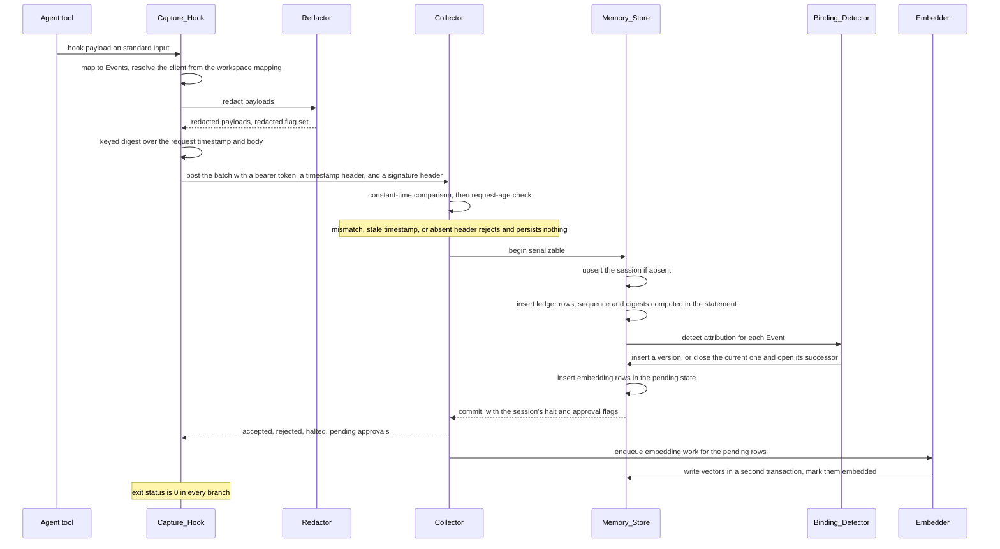
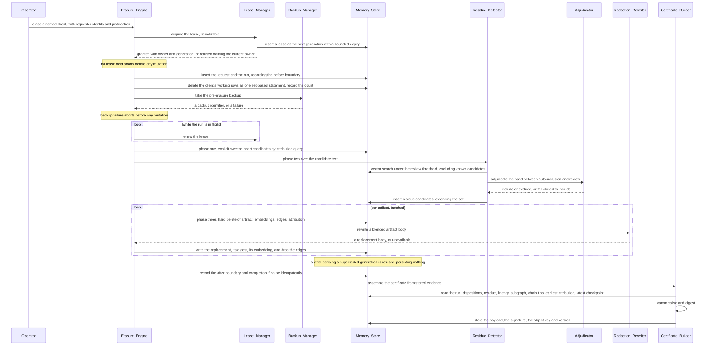

# Architecture

Molt is a memory layer for AI coding agents in which a managed CockroachDB cluster is
the single system of record. Capture runs on engineer machines, all durable state lives
in the cluster, and every governance claim is either a SQL query result or a signed
document a third party can re-derive from the cluster.

Nine rendered figures accompany this document, all under `assets/`: the component overview,
the write path, the erasure path, the residue decision bands, the ownership and run state
machines, the data model, the attribution timeline, the trust boundaries, and the
deployment topology. The overview is at
[`assets/molt-architecture.svg`](../assets/molt-architecture.svg). This document is the
explanation; the diagram is the map.

Read this document alongside the [status section of the README](../README.md#status).
Every component in the tables below is written, and the whole sequence has been run as
one history against a live instance by `tests/e2e/test_full_flow.py` — seed, signed
ingest, recall, the threshold grid, a signed checkpoint, a leased erasure run,
certificate issue, and independent verification. What is outstanding is deployment, not
component completion: no stack has been created, so nothing here has been exercised in a
cloud account. Where a component carries a named residue rather than a clean state, the
table says so in its own row and [`reviews.md`](reviews.md) carries the finding.

## Why the shape is what it is

Four decisions do most of the load-bearing work, and every structural oddity below
follows from one of them.

**The cluster is the truth, not a mirror.** There is no local event log that is later
shipped into a database. The only local persistence is a bounded retry spool. This is
what makes memory readable by an agent on a machine that has never seen the machine
that wrote it, and it is what makes an erasure claim checkable — there is exactly one
place to check.

**Tamper evidence is produced by the writing statement.** Sequence assignment and
digest computation happen inside the single `INSERT` that appends a ledger row, over
values that statement itself reads. Nothing reads a previously written digest in a
separate round trip and writes it back, because that gap is where a concurrent writer
would break the chain and where a determined one would forge it.

**Nothing on an engineer machine holds database credentials.** Capture and recall both
speak to the Collector over HTTPS with a bearer token and a keyed request signature.
Every component that does hold a connection string reads a role-scoped one from
Parameter Store.

**Governance claims are protected structurally, not procedurally.** Attribution is an
immutable version history rather than an editable row, so *when did you first hold
this* is answerable. Erasure ownership is a fenced lease, so a superseded worker's
write is refused rather than merely unlikely. Ledger integrity is committed to by a
signature produced outside the cluster, so a consistent rewrite is detectable even by
a party that does not trust the database administrator. Audit evidence is protected by
referential actions and privilege revocations, so removing the record of an erasure is
refused by the database rather than avoided by discipline. In each case the enforcement
point is a constraint, a privilege, or a key rather than an application rule.

## Component inventory

Grouped by where the component runs, because that is also where its trust boundary sits.

### On the engineer machine, holding no database credential

| Component | Owns | State |
|---|---|---|
| Capture_Hook | The hook entry point for each supported agent tool: maps a hook payload to Events, resolves the client from a workspace mapping, spools, transmits, and exits successfully in every branch | Built |
| MCP_Proxy | Sits between an agent tool and an MCP server and records JSON-RPC traffic in both directions | Built |
| Decorator_API | The decorator interface for instrumenting application code directly | Built |
| Redactor | Removes secret material from Event payloads before any write leaves the process | Built |

### Server side, holding a role-scoped connection

| Component | Owns | State |
|---|---|---|
| Collector | Ingest: signature and request-age verification, body bound, one serializable transaction per batch, halt and approval flags in the response | Built |
| Memory_Store | All schema, transactions, and queries, including the chain, lineage, attribution, working-tier, historical-read, and fencing modules | Built |
| Embedder | Batching, unit normalisation, and draining of pending embedding rows through the configured provider | Built |
| Provider_Selector | Reads provider configuration, constructs the embedding and text implementations, and refuses any embedding width other than the schema's | Built |
| Binding_Detector | Creates and supersedes client attribution at ingest | Built |
| Recall_Engine | Answers the agent's pre-action query under a tenancy filter applied inside SQL | Built |
| Confidence_Tracker | Records procedure retrievals and outcomes and moves procedure confidence with them | Built |
| Lease_Manager | Granting, renewing, and transferring erasure leases, and owning the fencing generation per client, so exactly one worker owns an erasure at a time | Built. Every evidence write the erasure engine sends carries the generation, the completion included; the one write the fence does not yet reach is the residue detector's own per-finding recording, which frames its own transactions |
| Residue_Detector | Finds semantic residue by vector similarity | Built |
| Adjudicator | Asks the text provider to decide the borderline residue band, failing closed | Built |
| Redaction_Rewriter | Performs surgical redaction of a blended artifact and validates the result | Built |
| Backup_Manager | Secures pre-erasure backup evidence by either path | Built |
| Erasure_Engine | The three phases and their transaction boundaries | Built, orchestration included: ownership before the first mutation, renewal beside every phase, each phase's evidence in its own transaction with the phase marker, idempotent finalisation, and a dry-run path that mutates no memory content |
| Sensitivity_Analyzer | Evaluates the residue candidate set across a threshold grid and reports the consequence of each pair, read-only | Built |
| Certificate_Builder / Certificate_Verifier | Assembly, canonicalisation, signing, storage; and independent verification against a retrieved public key | Built |
| Checkpoint_Signer | Computes, signs, stores, and verifies ledger checkpoints, including accounted and unaccounted disagreement | Built |
| Policy_Watcher | Consumes the write stream, evaluates rules, owns the kill switch and the approval queue | Built |
| Retention_Manager | Configures and reports database-enforced retention | Built |
| Molt_MCP_Server | Exposes memory to any MCP-compatible client as read-only tools over both transports | Built: the tool registry is `src/molt/mcpserver/tools.py` and both transports sit beside it. The HTTP transport authenticates no caller, which is an accepted finding rather than an omission |
| Web_Console | The demonstration application, its routes, and its read-only mode | Built: fourteen modules under `src/molt/console/routes/`, of which twelve are the registered view modules the package's import list names, and seventeen templates under `web/templates/`. Demonstration mode is middleware ahead of routing rather than a per-handler check |
| CLI | The `molt` argument tree, one module per verb | Built: thirteen verbs, one of them two words, each with its own module under `src/molt/cli/verbs/` |
| Seed_Generator | Multi-client seed data including deliberate cross-client contamination | Built |
| Telemetry | Metrics and structured logs, with credential fields filtered | Surface built, integration pending |
| Provisioner | Cluster, role, and service-account creation, and the capability probes | Built |
| Auditor_Gateway | Read-only auditor access through the managed MCP endpoint | Built as provisioning rather than as a service: `scripts/provision_roles.sh` creates a per-auditor login with an expiry, a schema of its own, and client-filtered views, and [`auditor.md`](auditor.md) documents the surface it actually creates. Three discrepancies between that function and the requirements are open findings in [`reviews.md`](reviews.md) |

Four of those components exist specifically to answer an obligation that would
otherwise rest on convention: the lease manager (exactly one owner, provably), the
checkpoint signer (tamper evidence covering every session in a window rather than only
the sessions a certificate names), the sensitivity analyzer (the one tuning decision
that changes erasure scope, made against measured evidence), and the confidence tracker
(procedural memory that improves with use rather than only accumulating).

## The write path



Three details matter more than they look.

Redaction happens **before transmission**, on the machine, so secret material never
becomes a network payload and never depends on the Collector behaving well. The
redacted flag travels with the row so a reader knows the content is not verbatim.

The digest chain is computed **in the inserting statement**, which is why the ledger
tier can be append-only with no role holding `UPDATE`. Retrospective edits are
detectable rather than prevented; see the trust boundary table for what that does and
does not buy.

Embedding is a **second transaction**. The ingest transaction inserts a placeholder in
a pending state and returns, because a provider call inside the capture path would put
a third-party latency budget in front of an agent.

## The erasure path



The shape of that path is driven by three properties.

**Evidence is written before, during, and after mutation.** The run row exists with its
before boundary before anything is deleted, each artifact's decision becomes a durable
disposition row as it is made, and the certificate is assembled by *reading those rows
back* rather than from the process's own memory. A run that crashes halfway leaves a
readable account of how far it got.

**Every phase fails in the safe direction.** No lease means abort before mutation. A
failed backup means abort before mutation. An unavailable adjudication means include
the candidate. A rewrite that fails validation against the erased client's markers
means hard delete the artifact. In each case the expensive-but-recoverable outcome is
chosen over the cheap-but-unprovable one.

**Ownership is fenced, not merely locked.** The lease carries a monotonically
increasing generation, a partial uniqueness constraint admits one current lease per
client, and every erasure write carries the generation it believes it holds. A worker
that was superseded — by takeover after expiry, say, while it was still running — has
its writes refused by the database with a stale-generation error rather than
overwriting the work of the worker that replaced it.

## Trust boundaries

| Boundary | Crossing | What is trusted on the far side |
|---|---|---|
| Engineer machine to Collector | HTTPS, a bearer token, and a keyed signature over the request timestamp and body | Nothing. The machine holds no database credential, and the Collector re-derives tenancy from its own principal mapping rather than from the request |
| Server components to the cluster | TLS with a role-scoped connection string from Parameter Store | The role's privilege set, which is the enforcement point rather than the application's intent |
| Molt to a model provider | HTTPS with a credential from Parameter Store or an operator file | Nothing beyond text. Provider output is validated before use and is never executed |
| Molt to the key service | The signing permission held by one execution role | The key policy. A compromise of any other role cannot produce a signature |
| Auditor to the cluster | The managed MCP endpoint, a read-only per-client-filtered view set, and an expiring service account | Nothing. The auditor is explicitly untrusted, which is exactly why the access is read-only and row-filtered |
| Public internet to the console | CloudFront in front of a function endpoint | Nothing. Every content route requires a session, and demonstration mode blocks every mutation route |

Two residues are worth stating rather than glossing:

- The hash chain and signed checkpoints give **tamper evidence, not tamper proofing**.
  Neither prevents a rewrite. What the checkpoint adds over the chain is coverage of
  every session in a window and detection by a party who does not trust the cluster
  administrator, because the signing key lives outside the cluster.
- The bearer token resists no replay. The request signature **bounds** the replayable
  window to the configured maximum request age rather than eliminating replay. A
  per-request nonce table would close it and would also put a write-contended row in
  front of every capture, so the residue is accepted deliberately.

The full set of threats, mitigations, and accepted residues is in
[`threat-model.md`](threat-model.md): seven named threats, each mitigation, and the
three accepted in part.

## Four platform facts that were probed, not assumed

Each of these was checked live against the delivered cluster and the result recorded in
a capability record the store reads once at process start. No component branches on a
version string; every branch is driven by the probe result. The fallbacks remain in the
design, but they are fallbacks rather than the expected path.

### The distributed vector index exists

The index was created and the cluster reports it with an L2 operator class. So the
index is the expected path for both recall and residue detection, and the decision to
unit-normalise every vector at write time becomes load-bearing rather than defensive:
on unit vectors, L2 ordering and cosine ordering coincide, which is what lets the
thresholds stay expressed in cosine space while the index does the work.

*Fallback:* an exact scan bounded by the covering index on the client column and a
candidate cap. Same SQL shape, same thresholds, with an unavailability metric emitted.

### Sinkless changefeeds are permitted

The changefeed statement emitted both row-change and resolved-timestamp rows, and the
rangefeed cluster setting reads enabled. So changefeed consumption is the policy
watcher's expected mode, and its health route reports that mode.

*Fallback:* timestamp polling from a persisted watermark, with a degradation metric
emitted. Retained because a watcher that silently stops seeing writes is a governance
failure, not a performance one.

### The garbage-collection horizon is 4500 seconds

Measured, and far shorter than a certificate's evidence lifetime. This is the fact with
the largest design consequence: a certificate cannot depend on reading the cluster as
it was before a run, because by the time anyone audits the certificate that history is
gone.

So the primary count mechanism for every certificate is derivation from the ledger and
the stored dispositions, which has no external dependency and no expiry. The historical
read is demoted to **opportunistic corroboration**, attempted only when both run
boundaries still fall inside the horizon at assembly time, with its agreement or
disagreement recorded beside the derived counts.

*Fallback:* none needed, because the primary mechanism depends on nothing that expires.

### On-demand backup does not exist in the cloud control plane

The control plane exposes backup listing and backup configuration only. Managed backups
run on the cluster's own fixed schedule with a fixed retention interval that Molt leaves
alone.

So the primary pre-erasure backup path is a backup statement issued against an
operator-owned bucket, before the first mutation of a run.

*Fallback:* record a reference to the most recent managed backup by identifier and
timestamp, and mark the record as *referenced* rather than *taken*, so the certificate
never implies a backup that Molt caused when it did not.

## Repository layout

```text
src/molt/
  config/      resolution order, secrets accessor, capability record
  models/      Events, sessions, derived artifacts, bindings, the tier taxonomy
  capture/     hook entry point, spool, one adapter per agent tool, proxy, decorator
  redact/      pattern set and recursive redaction
  store/       Memory_Store, migrations, chain, lineage, attribution, working, fencing
  collector/   ingest handler, routing, signed ingress, body bound
  providers/   the two protocols, registry, selector, and the implementations
  embed/       batching, normalisation, pending drain
  recall/      the agent critical path read
  erase/       engine, lease, sweep, residue, sensitivity, adjudicator, rewriter, disposition
  confidence/  retrievals, outcomes, adjustment, history
  attest/      certificate assembly and verification, checkpoints, the single canonicaliser
  policy/      watcher, rules, kill switch, approvals
  retention/   expiry configuration and reporting
  backup/      the primary backup statement path and the managed-backup reference fallback
  mcpserver/   tool registry and both transports
  console/     the demonstration application
  seed/        generator, corpora, contamination planting
  telemetry/   metrics, structured logs, correlation
  cli/         the argument tree, one module per verb
tests/         unit, property, integration, concurrency, e2e, perf, security, and more
skills/        three agent skills in the open format
infra/         templates, parameters, deploy and teardown wrappers
scripts/       provisioning, local database, capability probes, the hygiene gate
web/           templates and static assets for the console
docs/          this document and its siblings
```
