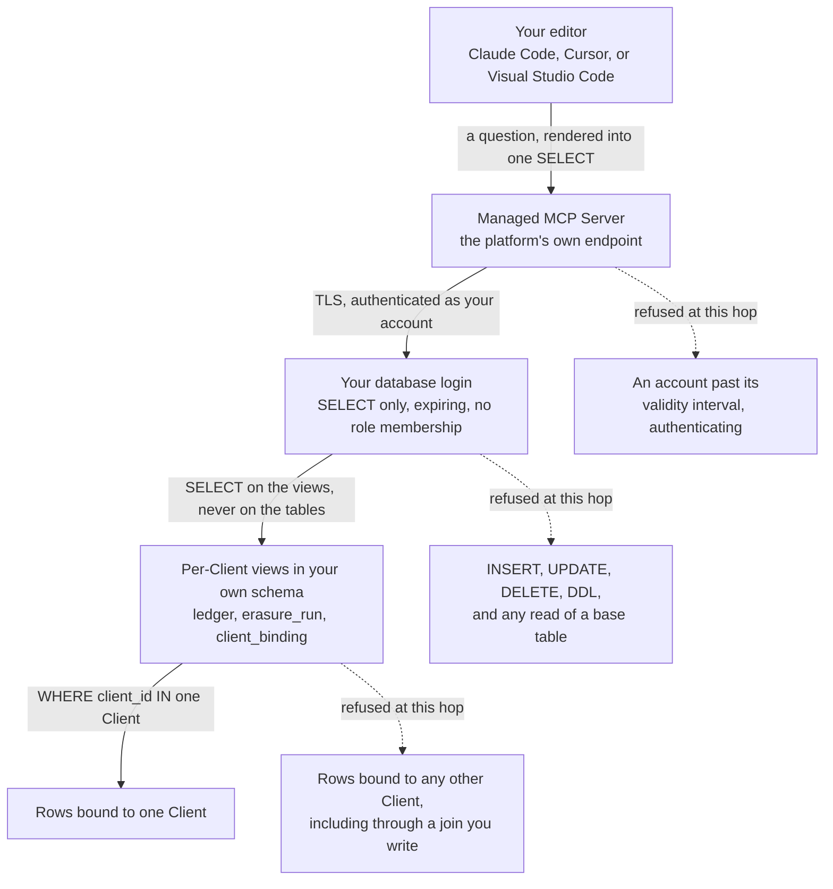

# Auditor access

You have read-only access to one tenant's slice of the memory cluster, reached from
your own editor through the database platform's managed MCP endpoint. You can read
three views: the event ledger, the erasure runs, and the attribution history, each
filtered to the single departing Client you act for. You can ask questions in
natural language, and the editor turns them into `SELECT` statements the account
runs. You cannot write, cannot read a base table, cannot see another Client's rows,
and cannot keep the access — the account stops being valid on its own after at most
30 days. Every statement you run is logged against your account.

That is the whole shape of it. The rest of this document is how to connect, what the
views hold, what is deliberately outside them, and why the access is cut this way.

This guide is generated per Auditor from a template. Every value in angle brackets
is a placeholder an operator substitutes before handing the document over. Nothing
here holds a credential, an endpoint, or an account name, and nothing you do while
following it should put one in a file you commit.

For the defined terms — Auditor, `Managed_MCP_Server`, `Auditor_Gateway` — see
[glossary.md](glossary.md). The trust boundary this access crosses is recorded as
its own row in [threat-model.md](threat-model.md#trust-boundaries-of-the-delivered-configuration).

## What the operator substitutes

| Placeholder | What it is | Where the value comes from |
| --- | --- | --- |
| `<MANAGED_MCP_ENDPOINT>` | The database platform's own managed MCP endpoint, the single address every editor below points at | The platform's console. It is the endpoint named in Requirement 24.1 and is the same for every Auditor |
| `<AUDITOR_ACCOUNT>` | Your account identifier, of the form `auditor_` followed by the slug the provisioning run was given | The `--auditor <slug>:<client-slug>` argument of the provisioning run for this engagement |
| `<CREDENTIAL_PARAMETER>` | The parameter path the connection credential was written to, of the form `<prefix>/auditor/<slug>/dsn` | The `--prefix` argument of the same provisioning run. The operator reads the value out of band and hands it to you through their own channel |

Two of those are the template's parameters (Requirements 24.1, 24.7). The third is a
path, not a value: it names *where* the credential lives so an operator can find it
without either of you pasting it anywhere.

One convenience falls out of the provisioning script: your account name and your
schema name are the same string. Wherever a query below reads
`<AUDITOR_ACCOUNT>.ledger`, that prefix is the schema the views live in.

Two more placeholders appear in the queries and are yours to fill, not the
operator's: `<CLIENT_SLUG>` is the Client you act for, and `<INSTANT>` is a moment
in the past you want an answer as of.

**No credential value belongs in this document, in an editor configuration file, or
in a shell history.** Every configuration below reads the credential from an
environment variable or from the editor's own prompt.

## The access path



The last hop is the load-bearing one. The filter is inside the view definition,
so it is applied by the database while it plans your query, not by something that
post-processes rows on the way back to you. A predicate you add narrows the result
further; nothing you add widens it.

## The views you can read

The provisioning script creates a schema named after your account, grants your
account `USAGE` on that schema, defines three views over it, and grants `SELECT` on
each view. It grants nothing on any base table and adds your account to no service
role, which is why the base tables are unreadable rather than merely discouraged
(Requirements 24.2, 24.5).

| View | Filtered by | What it answers |
| --- | --- | --- |
| `<AUDITOR_ACCOUNT>.ledger` | `client_id` in the one Client | Every recorded event attributed to your Client: session, sequence, category, the two instants, the agent tool and machine that produced it, the payload, whether it was redacted, the content and chain digests, and the expiry the row carries |
| `<AUDITOR_ACCOUNT>.erasure_run` | `client_id` in the one Client | Every erasure run for your Client: status, phase, the before and after instants, the two residue thresholds the run used, whether a backup was taken or skipped, the count of artifacts that were not embedded, and the start and finish |
| `<AUDITOR_ACCOUNT>.client_binding` | `client_id` in the one Client | The attribution history: one immutable row per version, carrying the artifact, its kind, the detection method, the confidence, the detection instant, the validity start, the validity end while closed, and the version that superseded it |

### The as-of-attribution read

The question an Auditor usually opens with is *when did you first attribute this
artifact to my Client, and what has changed since.* Requirement 43.11 obliges the
`Auditor_Gateway` to expose the as-of-attribution query of Requirement 43.4 through
this view set, and the `client_binding` view is where it lands: the view projects
every column of the attribution history, including the validity interval and the
superseding reference, so the as-of predicate is a `WHERE` clause you add.

The interval is half-open — inclusive at the start, exclusive at the end — so the
instant a supersession happened belongs to the successor alone and no instant
returns two versions for one Client:

```sql
SELECT id, client_id, method, confidence, valid_from, valid_to
FROM <AUDITOR_ACCOUNT>.client_binding
WHERE artifact_id = '<ARTIFACT_ID>'
  AND valid_from <= '<INSTANT>'
  AND (valid_to IS NULL OR valid_to > '<INSTANT>')
ORDER BY client_id;
```

A null validity end reads as *and it still holds*. A version whose interval is empty
— both ends the same instant — is a withdrawal marker: it records that a claim was
removed rather than that it never existed, and it is returned by no as-of read at any
instant. That asymmetry is the point of storing attribution as a version history
instead of a row that gets overwritten.

Stated plainly before you rely on it: the provisioning script creates no separate view
named for the as-of query. It creates the three above, and the as-of answer is a
predicate over the third. Your own Client's claims are what that view holds, so *what
has changed since* is answerable within your tenancy and says nothing about any other
Client's history.

### Three queries to start with

Everything that has ever been recorded against your Client, newest first:

```sql
SELECT occurred_at, category, agent_cli, machine_id, redacted
FROM <AUDITOR_ACCOUNT>.ledger
ORDER BY occurred_at DESC
LIMIT 100;
```

Whether anything is still attributed to your Client at all — the question an exit
review exists to settle. An empty result is the answer you are looking for:

```sql
SELECT artifact_kind, count(*) AS versions
FROM <AUDITOR_ACCOUNT>.client_binding
WHERE superseded_by IS NULL
GROUP BY artifact_kind;
```

What each erasure run for your Client did, and whether it finished:

```sql
SELECT id, status, phase, dry_run, t_before, t_after, backup_skipped
FROM <AUDITOR_ACCOUNT>.erasure_run
ORDER BY started_at DESC;
```

## Connecting from your editor

Three editors are supported (Requirement 24.3). All three point at the same
endpoint and all three read the credential from outside the configuration file.

Before any of them, put the credential in your shell for this session only — take
the value from the operator, not from a file in a repository:

```text
read -rs MOLT_AUDIT_CREDENTIAL
export MOLT_AUDIT_CREDENTIAL
```

`read -rs` echoes nothing while you paste, and an exported variable dies with the
shell.

### Claude Code

Register the endpoint once, from the directory you want the server available in:

```text
claude mcp add --transport http molt-audit <MANAGED_MCP_ENDPOINT> \
  --header "Authorization: Bearer ${MOLT_AUDIT_CREDENTIAL}"
```

Confirm it, then ask a question:

```text
claude mcp list
```

Inside a session, `/mcp` shows the server's state and the tools it offers. If the
server lists but every call fails, check your account's validity interval before
anything else — an expired login is the common cause and it fails at authentication
rather than at the query.

### Cursor

Write the server into `.cursor/mcp.json` in the folder you are reviewing from, or
into the same file under your home directory to have it everywhere:

```json
{
  "mcpServers": {
    "molt-audit": {
      "url": "<MANAGED_MCP_ENDPOINT>",
      "headers": {
        "Authorization": "Bearer ${MOLT_AUDIT_CREDENTIAL}"
      }
    }
  }
}
```

The `${...}` form is an environment reference, so the file holds the variable's name
and never its value. Open Settings, find the MCP section, and confirm `molt-audit`
reports as connected and lists its tools. Cursor reloads the file when you save it;
if the entry stays grey, restart the editor so it re-reads your environment.

### Visual Studio Code

Write `.vscode/mcp.json` in the workspace. The `inputs` block makes the editor
prompt you for the credential and keeps it out of the file:

```json
{
  "inputs": [
    {
      "id": "molt-audit-credential",
      "type": "promptString",
      "description": "Auditor credential for the managed MCP endpoint",
      "password": true
    }
  ],
  "servers": {
    "molt-audit": {
      "type": "http",
      "url": "<MANAGED_MCP_ENDPOINT>",
      "headers": {
        "Authorization": "Bearer ${input:molt-audit-credential}"
      }
    }
  }
}
```

Run **MCP: List Servers** from the command palette, start `molt-audit`, and answer
the prompt. The value is held for the session and the file stays shareable. Use the
chat view's tool picker to confirm the server's tools are present before you rely on
an answer.

## Every query you run is recorded

Your statements are logged. Each one becomes a structured record naming the service
account that ran it, a digest of the statement, and the number of rows it returned
(Requirement 24.6). The records are pulled from the cluster's own audit log for an
operator-supplied window through the control-plane tool, by
`scripts/pull_audit_log.sh` (Requirement 27.8) — a read-only pull that creates
nothing and changes nothing.

This is stated up front rather than buried, for two reasons. It is symmetric: you are
auditing a system that records what its own operators do, and the same mechanism
records what you do. And it is a protection for you — a logged read set is evidence
that your review stayed inside its scope, which is worth more to you than
unobserved access would be.

The digest is of the statement, not of the rows. What you read is recorded as a
count; the content you saw is not copied into the log.

## What you cannot see, and why that is not evasion

| Not available to you | Why |
| --- | --- |
| Any other Client's rows | The views filter by Client identifier. The engagement is about one departing Client, and access to another tenant's data would be the same failure you are here to rule out |
| The base tables behind the views | `SELECT` is granted on the views only. A grant on a table would let a query step around the filter, which is exactly what granting on the view prevents |
| Sessions, derived artifacts, embeddings, lineage edges, dispositions, residue candidates | Not in the view set the provisioning script defines. Each holds cross-tenant structure — a blended artifact and its lineage exist precisely because more than one Client contributed to them — so a per-Client filter over them would either leak the other contributors or answer nothing |
| Any write, in any form | The account holds `SELECT` and nothing else. Nobody can hand you the ability to alter the record you are checking, and that includes correcting it |
| The `Erasure_Certificate` and the signed checkpoints | Delivered to you as documents rather than queried. Verification runs against a retrieved public key half, so you can check a signature without any access to the cluster at all — a stronger position than reading a table would give you |
| The retention report | Computed over tables outside your view set. Its fields are the Client identifier and slug, the Jurisdiction, the retention interval, a count expiring within a fixed forward window of seven days, and a count already expired. Ask the operator for your Client's line; the window is fixed by the reporting obligation rather than configurable, so two reports are comparable |

The pattern is that everything withheld is either another tenant's data or evidence
you are given in a form you can verify independently. Where a document is the answer
rather than a query, verify the document — it commits to more than a row you read
under someone else's grant.

## Checking that an erasure actually happened

The view set above answers *what is still attributed to my Client*. The
`Erasure_Certificate` answers *what was removed, on whose authority, and against
what evidence* — and it is the half of the review you can perform without trusting
the party that performed the erasure, because verification needs the certificate
and a public key and nothing else that the operator controls.

### What the certificate claims

The signed payload states the request, the Client, the run, the ownership that
finalised it, the checkpoint it names, the backup path taken, the before and after
counts, one `Disposition` per Artifact, the lineage edges touched, the residue
candidates with their distances and bands, the terminal chain tip of every Session
the run touched, and the audit window. The signature is over the canonical bytes of
that whole payload, so a change to any one field invalidates it.

### What it deliberately does not claim

Four caveats travel inside every certificate, in a `caveats` member, so a reader
cannot receive the claim without the qualification. They are the honest boundary of
the document:

| Caveat | What it means for your review |
| --- | --- |
| Historical read bound | A historical read is bounded by the cluster's garbage-collection interval, and that interval is measured on the cluster rather than assumed by the software. Beyond it, the point-in-time corroboration is simply unavailable |
| Durable evidence | The append-only Ledger and the recorded Dispositions are the primary and durable evidence. A historical read is a corroborating convenience performed only when both instants fall inside the horizon; the derived figures stand on their own |
| Checkpoint scope | A `Ledger_Checkpoint` gives tamper **evidence**, not tamper **proofing**. The per-Session chain reaches the certificate only for the Sessions this run touched; the named checkpoint covers every Session in its window |
| Working tier excluded | No certificate field is derived from the `working` Memory_Tier and no `Verification_Query` reads it. Working rows removed for your Client are reported as one aggregate count |

Read the third one twice. Nothing in this system prevents a sufficiently privileged
principal from altering stored rows. What the design delivers is that an alteration
becomes *detectable*, and the reason it is detectable past a cluster administrator
is that the signing key lives outside the cluster. See
[threat-model.md](threat-model.md#2-ledger-tampering) for what that leaves standing.

### Verify it independently

`skills/verify-certificate/` is the procedure, shipped as a loadable skill with
`scripts/verify_certificate.sh` as its entry point. Run that rather than following
a transcription of it here: the script is the thing kept in agreement with the
verification path, and a procedure copied into prose drifts from the code it
describes. It reads only — no stage writes a row, and the database role it uses
holds `SELECT` alone.

The skill runs the certificate verification, then calls the lineage ancestor and
descendant tools for each Artifact identifier you name, so a surviving derived
descendant of erased material is reported rather than assumed absent. It emits one
JSON object per stage and returns the verification path's own exit status, so a
failed outcome is a non-zero status rather than a line of prose.

The same checks are reachable from the interface directly:

```text
molt attest verify --certificate <PATH> --json
molt attest verify --s3-key <KEY> --bucket <NAME> --json
molt attest verify --certificate <PATH> --checkpoint <UUID> --json
molt attest verify --certificate <PATH> --skip-live-queries --json
molt verify-chain --session-id <UUID> --json
```

`--skip-live-queries` is the offline mode: canonical round trip and signature only,
no cluster. It is the check to run first, because it needs no access at all.

### The signature, offline

The signature is asymmetric, produced with one key by one execution role, over the
SHA-256 digest of the canonical payload bytes. Verification retrieves the **public
half** and does the curve arithmetic locally. The property to understand is that
you are not asking the key service whether the signature is good, so
verification survives the loss of permission to ask it, and the operator cannot
influence the answer by controlling the service. The algorithm the delivered
configuration supports is `ECDSA_SHA_256` over the P-256 curve, named on the
certificate alongside the key identifier.

The signature check fails in two distinguishable ways. A payload whose
canonical re-serialisation digests differently fails as `payload_digest` — the
document was edited. A payload that digests correctly but whose signature does not
verify fails as `signature_value` — the document was not signed by that key.

### The session hash chain

Every Event in a Session carries a content digest and a chain digest, both computed
inside the statement that inserted the row. Verification recomputes them in the
client from the stored columns, so an alteration to a payload, a category, a
timestamp, a sequence number, or a digest column surfaces as a mismatch localised
to the offending row. `verify-chain` does this for a Session you name; certificate
verification does it for every Session the run touched, comparing the recomputed
tip against the tip the certificate recorded.

Here too the two failures differ, and the difference matters.
`chain_mismatch` means a row inside the Session no longer recomputes: the chain is
internally broken. `chain_tip_mismatch`
means the chain is internally sound but its terminal digest differs from the one
the certificate committed to, which is what a consistent rewrite after issue looks
like.

One Session in a certificate is read differently, and deliberately. A tenant erasure
removes that tenant's Sessions along with their Events, and the certificate records
each of those removals in its own dispositions while still naming the Session and
the terminal digest it carried beforehand. Such a Session is therefore expected to
hold no rows at all, and its absence is an **accounted deletion**: the report marks
the Session `accounted_deletion` and carries the note
`session_deleted_by_this_run`, no check fails, and the tip comparison does not
apply, because a chain of no rows re-derives to the genesis predecessor and could
never match a recorded tip. The inverse is a finding. A row still standing for a
Session the certificate says was deleted means content outlived a recorded deletion,
and that fails as `artifact_still_present` naming the Session. Only a Session the
certificate does not record as deleted is held to the recompute-and-match rule
above.

### The Ledger_Checkpoint

A checkpoint commits to the terminal chain digest of every Session holding at least
one Event inside a bounded window, takes a root digest over that covered set
ordered by Session identifier, and carries a signature over it. Verification
recomputes the root from live rows and checks the signature against the retrieved
public half.

The part that makes a checkpoint readable rather than alarming is that disagreement
is partitioned before it is reported. A covered Session whose digest moved because a
recorded `Erasure_Run` accounts for it is reported as explained; a Session whose
digest moved with nothing on the record is the finding, raised as
`checkpoint_unexplained_change` with every affected Session identifier named. A
checkpoint the certificate names but that cannot be found is
`checkpoint_absent`, and a checkpoint whose own signature fails is
`checkpoint_signature_invalid`.

One note the report may carry without failing:
`checkpoint_is_not_the_latest_before_run` says the certificate named a checkpoint
that is not the most recent one preceding the run. That is a coverage observation,
not a tamper finding.

### Reading the report

The verification report carries a machine-readable `outcome` and a list of failed
checks. The outcome is `verified` only when every check passed, and `failed` when
any check did not; there is no partial verdict, and the exit status is derived from
the outcome so a script does not have to parse prose. Each failed check names the
check, the subject it concerns, and the identifiers involved, and the report also
lists the distinct failed check names so a summary line is available without
walking the whole list.

The checks that can appear, and what each one tells you:

| Failed check | What it says |
| --- | --- |
| `payload_digest` | The canonical payload does not digest to the recorded value — the document was altered after signing |
| `signature_invalid` | The signature does not verify against the public key for the recorded digest |
| `erasure_incomplete` | A `Disposition` claims removal that the live state contradicts |
| `artifact_still_present` | An Artifact recorded as hard-deleted is still stored, or a Session recorded as hard-deleted still holds Events |
| `redaction_digest_mismatch` | A surgically redacted Artifact's current digest differs from the post-digest the certificate recorded |
| `count_disagreement` | A re-executed before or after count differs from the count the certificate states |
| `query_template_unknown` | The certificate carries a `Verification_Query` under a template name the verifier does not recognise |
| `chain_mismatch` | A Session's chain no longer recomputes from its stored rows |
| `chain_tip_mismatch` | A Session's terminal digest differs from the tip the certificate recorded |
| `checkpoint_absent` | The named checkpoint cannot be found |
| `checkpoint_signature_invalid` | The named checkpoint's own signature does not verify |
| `checkpoint_unexplained_change` | A covered Session's terminal digest moved with no recorded `Erasure_Run` accounting for it |

Notes are separate from failures and do not change the outcome. Four you will meet:
`historical_corroboration` records whether a point-in-time read was
attempted, whether both instants fell inside the horizon, and whether it agreed;
`recorded_count_derivation` names the mechanism the stated counts were derived from,
which is the Ledger and the Dispositions;
`checkpoint_disagreement_explained` names the Sessions whose movement a recorded run
accounts for; and `session_deleted_by_this_run` names a Session that holds no rows
because this run removed them, which the dispositions in the same document record.

A corroboration that was not attempted is not a failure. The three reasons it may
be skipped — `outside_gc_horizon`, `gc_horizon_unprobed`, and
`historical_read_refused` — are all recorded, and the certificate's own first two
caveats are why: the derived figures are the evidence, and the historical read is a
convenience that is only sometimes available.

### The verification queries

The certificate embeds SQL for a third party to run, so verification does not
require trusting our verifier. Two templates carry the central claim — that no
current attribution to your Client remains, and that no Session of your Client
remains — and every template targets the durable tiers only, never the `working`
tier. The row counts each query returned are reported. You can run them yourself
against the views you hold, and if a template's result and the report disagree, the
cluster is the fact.

## Why the access is shaped this way

**Read-only is the intended posture, because an Auditor is an untrusted third
party** (Requirement 24.7). That is not a comment on any particular reviewer. You
act for a departing Client, and the operator has no basis to extend you trust beyond
the one thing you are here to do. Stating it as the design's intent rather than as a
restriction is deliberate: it tells you the boundary is a decision with a reason, and
it means a request for more access is a change to a documented posture rather than a
favour someone can quietly grant.

**Row filtering lives in the view, not in the query.** The cluster boundary is a
privilege boundary: a role that may read a table may read every tenant's rows in it.
So tenancy is expressed as a view that carries the filter, and the grant is on that
view. This is why the filter cannot be stepped around by a cleverer query — there is
no wider relation your account can name.

**The account expires on its own.** An Auditor account is evidence access, not
standing access, so the provisioning script creates a login with a validity bound of
at most 30 days (Requirement 24.4) computed when the account is provisioned. Nobody
has to remember to revoke it, which is the failure mode that leaves review accounts
alive for years. If your engagement runs longer, ask for a fresh account rather than
an extension.

**Append-only underneath.** No role in this system holds `UPDATE` on the ledger, and
that revocation is written out for every role rather than left implicit. Rows leave
the ledger through an authorised erasure or through row-level expiry, never through
revision. That is what makes the chain digests on the rows you read worth checking:
a record whose rows can be edited in place commits to nothing.

An auditor who understands the shape asks better questions of it. If a claim in this
document and the behaviour of the cluster disagree, the cluster is the fact — say so,
and cite the query.

## Related documents

- [glossary.md](glossary.md) — the defined terms, including Auditor,
  `Managed_MCP_Server`, and `Auditor_Gateway`
- [threat-model.md](threat-model.md) — the Auditor-to-cluster trust boundary, what it
  is trusted with, and the threats the design accepts in part
- [protection.md](protection.md) — why evidence rows refuse deletion while derived
  rows cascade
- [setup.md](setup.md) — the provisioning run that creates the account, the schema,
  and the views
- [skills.md](skills.md) — the shipped Agent_Skills, including the certificate
  verification skill this guide sends you to instead of restating its procedure

Grounded in Requirements 24.1, 24.2, 24.3, 24.4, 24.5, 24.6, 24.7, 27.8, and 43.11.
