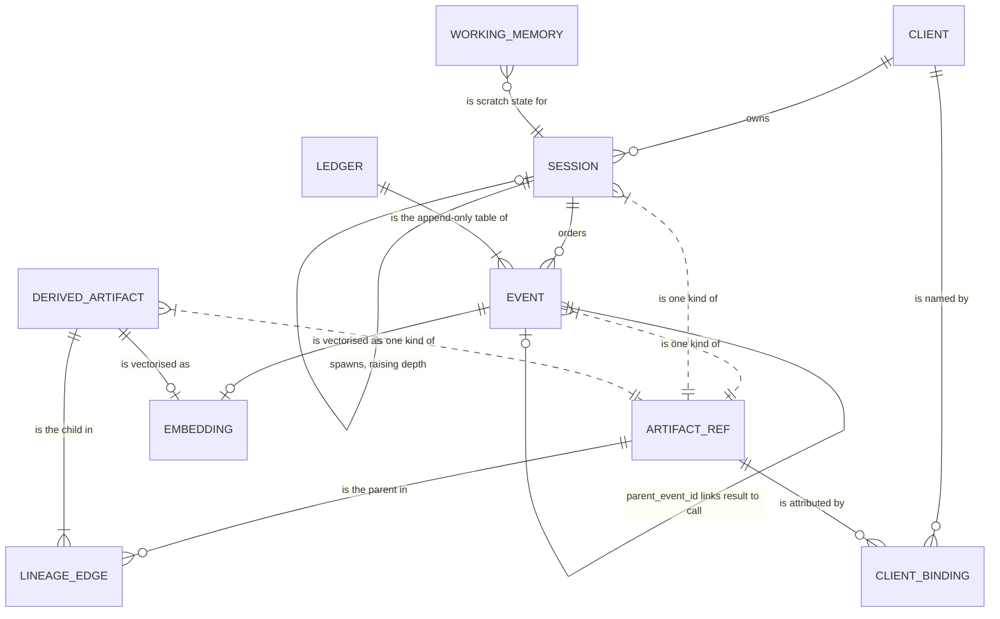
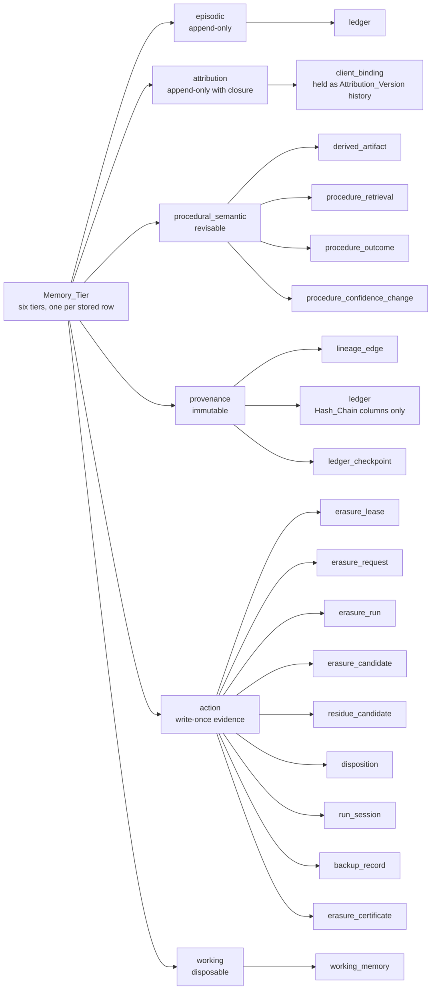
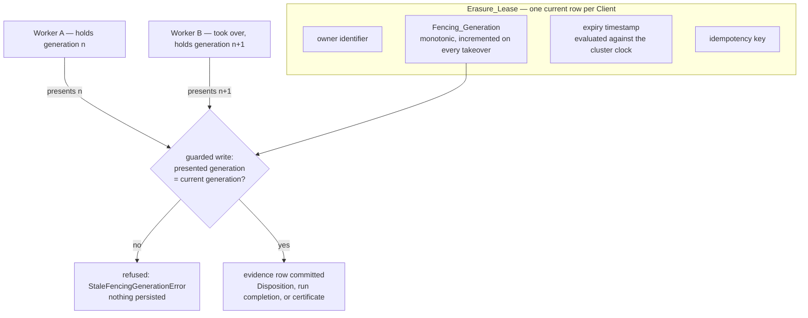
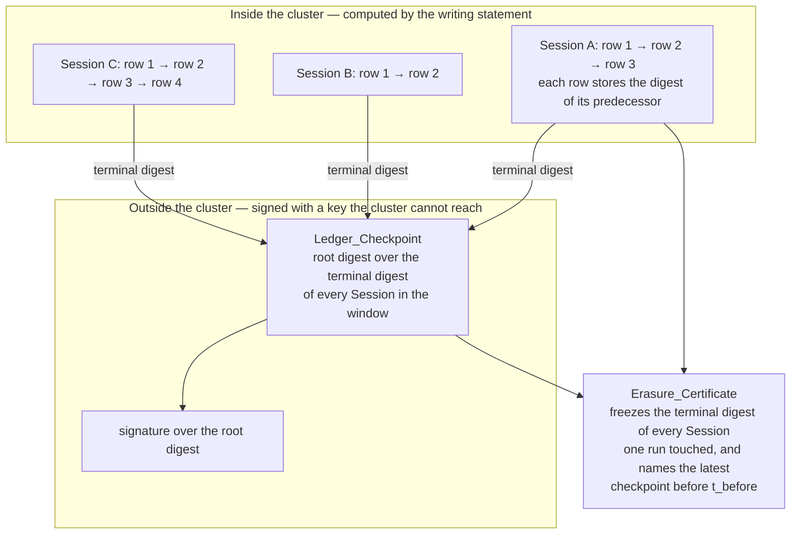

# Glossary

Every domain term, every system component name, and every external service name the Molt documentation uses, defined once. The requirements and the design are the sources of truth; this document restates their vocabulary in one place and, where two terms are easy to confuse, says exactly what separates them.

How to read an entry:

- The term is given in the spelling the documentation uses. Underscored spellings such as `Erasure_Lease` are the spec's own; lowercase backticked spellings such as `episodic` are stored values or table names.
- **Compare** notes are the load-bearing part of this glossary. A term is rarely misunderstood on its own; it is misunderstood by being mistaken for its nearest neighbour.
- Section references are written `§n`. Terms are alphabetised within each section.

## Section index

| Section | Covers |
|---|---|
| [§1 Core memory entities](#1-core-memory-entities) | What is stored: Sessions, Events, the Ledger, derived content, lineage, embeddings |
| [§2 Memory tiers](#2-memory-tiers) | The six named tiers, the tables each holds, and what a mutability contract is |
| [§3 Attribution and tenancy](#3-attribution-and-tenancy) | Which Client a row belongs to, and how that claim is held as history |
| [§4 Recall, embeddings, and procedural memory](#4-recall-embeddings-and-procedural-memory) | The read path on the agent critical path, and how a procedure earns standing |
| [§5 Erasure and ownership](#5-erasure-and-ownership) | The three-phase pipeline, its thresholds, and who is entitled to run it |
| [§6 Evidence and attestation](#6-evidence-and-attestation) | Digests, chains, checkpoints, certificates, signatures, backups |
| [§7 Governance and policy](#7-governance-and-policy) | Rules, halts, approvals, retention, roles, trust boundaries |
| [§8 Providers and models](#8-providers-and-models) | The two model interfaces and the prompt structure that makes caching work |
| [§9 System components](#9-system-components) | Every component name, alphabetised |
| [§10 External services and platform](#10-external-services-and-platform) | Every external service and hosted platform name |
| [§11 Verification and tooling](#11-verification-and-tooling) | Specifications, gates, properties, seed data, demonstrations |

## Quick reference: terms this scope adds

| Term | In one line | Section |
|---|---|---|
| `Attribution_Version` | One immutable version of a Client_Binding, with a validity interval and a supersession reference | [§3](#3-attribution-and-tenancy) |
| `Erasure_Lease` | The stored record of exclusive erasure ownership for one Client | [§5](#5-erasure-and-ownership) |
| `Fencing_Generation` | The monotonic integer on a lease that makes a superseded owner's write refusable | [§5](#5-erasure-and-ownership) |
| `Ingress_Signature` | A keyed digest over a request timestamp and body that bounds ingest replay | [§6](#6-evidence-and-attestation) |
| `Interface_Specification` | The machine-readable description of every route and every exposed tool | [§11](#11-verification-and-tooling) |
| `Ledger_Checkpoint` | A signed commitment to the terminal chain digest of every Session in a window | [§6](#6-evidence-and-attestation) |
| `Memory_Tier` | One of six named classes of stored memory, each with its own mutability contract | [§2](#2-memory-tiers) |
| `Procedure_Confidence` | The standing of a Learned_Procedure in the closed unit interval | [§4](#4-recall-embeddings-and-procedural-memory) |
| `Threat_Model` | The document recording trust boundaries, threats, mitigations, and accepted residue | [§7](#7-governance-and-policy) |
| `Threshold_Grid` | A set of threshold pairs the Sensitivity_Analyzer evaluates without mutation | [§5](#5-erasure-and-ownership) |
| `Working_Memory` | Disposable agent scratch state in the `working` tier, expired by Row-Level TTL | [§1](#1-core-memory-entities) |

## Near-neighbour pairs

Each row is a distinction a reader is likely to get wrong. The full entries carry the detail.

| Pair | The distinction |
|---|---|
| `Erasure_Lease` vs `Fencing_Generation` | The lease is the ownership record; the generation is the integer on it that a write must present. The lease answers *who owns this erasure*; the generation is what makes a stale owner's write refusable rather than merely unlikely |
| `Ledger_Checkpoint` vs `Hash_Chain` | The chain is computed inside the cluster per Session and detects an edit within that Session; the checkpoint is signed outside the cluster and covers every Session in a window, so it survives a rewrite that re-derives the chain consistently |
| `Attribution_Version` vs `Client_Binding` | The Client_Binding is the claim; the Attribution_Version is one immutable, time-bounded instance of that claim. There is no editable binding row — a changed claim appends a version and closes the prior one |
| Tamper evidence vs tamper proofing | Molt delivers evidence: an alteration becomes detectable and localisable. It does not prevent a sufficiently privileged principal from altering rows |
| `Erasure_Candidate` vs `Residue_Candidate` | A candidate comes from the explicit sweep over stored attribution; a residue candidate comes from vector similarity and is disjoint from the candidate set by construction |
| `Disposition` vs `Erasure_Certificate` | A Disposition is the durable per-Artifact decision record; the certificate is the signed document assembled from those records. The certificate is derived evidence, never the primary record |
| `Self_Managed_Backup` vs `Managed_Backup` | The first is a backup Molt takes; the second is a backup the cloud platform already took and that Molt only references. The certificate records which, because they are different claims |
| Recall floor vs erasure | Falling below the recall floor removes a procedure from results and nothing else. The row remains stored, remains attributed, and is still swept by erasure — exclusion from recall is not a soft delete |
| `Redactor` vs `Redaction_Rewriter` | The Redactor removes secret material from payloads before any write. The Redaction_Rewriter rewrites a Blended_Artifact during erasure so one Client's contribution is gone and the others survive |
| `Molt_MCP_Server` vs `Managed_MCP_Server` vs `MCP_Proxy` | Ours exposes memory as read-only tools; the managed one is the database platform's own endpoint that Auditors reach; the proxy sits between an agent and some other MCP server and records traffic |
| `Ingress_Signature` vs bearer token | The token authenticates a caller and resists no replay. The signature binds a request to a timestamp and body, bounding replay to the maximum request age |
| Auto-inclusion threshold vs review threshold | Below auto-inclusion a candidate is included with no model call. Between the two it is referred for adjudication. Above the review threshold it is never retrieved |
| `Threshold_Grid` vs a run's thresholds | The grid is calibration against the corpus as it stands now. It is not a replay of past adjudications and makes no claim about what a past run would have decided |
| `Verification_Query` vs `Certificate_Verifier` | The query is SQL embedded in the certificate for a third party to run; the verifier is our component that performs the full check. A third party needs the first and does not have to trust the second |
| `Procedure_Confidence` vs binding confidence | The first is a Learned_Procedure's standing, moved by recorded Session outcomes. The second is how sure a detection method is that an Artifact belongs to a Client, and it never moves — a different value supersedes |
| `Embedding_Provider` vs `External_Embedding_Service` | The first is the interface; the second is one external implementation behind it. Nothing outside the provider package knows which implementation is selected |

## 1. Core memory entities

`ARTIFACT_REF` is a view rather than a table: it is how the schema expresses a polymorphic reference to an Event, a Session, or a Derived_Artifact. An Embedding is itself an Artifact kind but is never a lineage parent, and `WORKING_MEMORY` is referenced by nothing at all, which is what makes the `working` tier disposable (see [§2](#2-memory-tiers)).

**Artifact** — Any row of stored memory content that can be erased. The four kinds are an Event, a Session record, a Derived_Artifact, and an Embedding. *Compare:* not every stored row is an Artifact. A Disposition, a lease, and a checkpoint are evidence about Artifacts and are not themselves erasable.

**Artifact reference view** — The schema view that spans the Event, Session, and Derived_Artifact kinds, giving one polymorphic handle a Client_Binding, a Lineage_Edge, or a Disposition can name. `working_memory` is deliberately absent from it.

**Behavioral_Baseline** — A Derived_Artifact describing statistically normal agent behavior, distilled from Events belonging to one or more Clients. Frequently blended, and therefore a frequent subject of Surgical_Redaction.

**Blended_Artifact** — A Derived_Artifact whose Client_Bindings name two or more distinct Clients. Blending is why erasure cannot be deletion alone: removing the row would destroy content the remaining Clients are entitled to. See Surgical_Redaction in [§5](#5-erasure-and-ownership).

**Client** — A tenant of the consultancy and the data subject of an Erasure_Request, identified by a UUID and a stable slug, and carrying a Jurisdiction, a retention interval, and a set of content markers. *Compare:* a Client is not a user account. Molt has no user management; the Web_Console has one operator credential set.

**Derived_Artifact** — Content produced by summarising, distilling, or generalising other Artifacts. The three delivered kinds are Summary, Behavioral_Baseline, and Learned_Procedure. Carries a body, a content digest, a derivation method, a revision counter, and — for the Learned_Procedure kind alone — a Procedure_Confidence.

**Embedding** — A fixed-width float vector representation of one Artifact's text, held in a `VECTOR(1024)` column with the provider name, the model identifier, and a per-row assertion that the vector is unit-normalised. Only an Event and a Derived_Artifact carry one.

**Event** — One immutable observation within a Session. The stored categories are session start, session end, user prompt, assistant response, tool call, tool result, model request, model response, file read, file write, shell command, decision, error, cost record, recall, policy halt, and attribution superseded. An Event never carries its own digests: the appending statement computes them.

**Event category** — The enumerated value on a Ledger row naming which kind of observation it is. The enumeration is declared once in the models package and the schema check constraint holds the same values in the same order, so the two cannot drift.

**Learned_Procedure** — A Derived_Artifact describing a reusable sequence of agent actions that previously succeeded, distilled from Events belonging to one or more Clients. The only kind that carries Procedure_Confidence, and the only kind whose recall ordering is confidence-weighted.

**Ledger** — The append-only table of Events, and the durable system of record for provenance. No role holds `UPDATE` on it; rows leave only by an authorised erasure or by Row-Level TTL. *Compare:* the Ledger is not a log shipped from a machine into a database later. There is no local event log — the only local persistence is a bounded retry spool.

**Lineage_Edge** — A stored edge from a Derived_Artifact to one parent Artifact it was produced from, carrying the derivation method. Edges are inserted and deleted, never edited, and an edge never joins an Artifact to itself.

**Lineage_Graph** — The directed acyclic graph formed by all Lineage_Edges. Closure over it, in either direction, is a recursive query in the database rather than a traversal in application code.

**Molt** — The complete system: capture, ledger, semantic recall, policy watching, and provable forgetting, with a managed CockroachDB Cloud cluster as the single system of record.

**Session** — One bounded run of an Agent_CLI, identified by a UUID, owning an ordered stream of Events and carrying tenancy, machine identity, counters, accrued cost, halt state, and its position in the subagent hierarchy.

**Session depth** — The nesting level of a Session in the subagent hierarchy. A Session with no parent sits at depth zero; a spawned Session sits at its parent's depth plus one, derived by the inserting statement from the parent row rather than trusted from a caller.

**Session outcome** — How a Session ended, or that it has not: `in_progress`, `succeeded`, `failed`, or `abandoned`. The terminal value is what drives a procedure outcome record ([§4](#4-recall-embeddings-and-procedural-memory)); `abandoned` deliberately moves no confidence.

**Summary** — A Derived_Artifact kind holding condensed content distilled from Artifacts. Carries no Procedure_Confidence — the schema states that as an equivalence, so a Summary can never acquire one.

**Unassigned Client** — The reserved Client a Session falls back to when the workspace mapping names none. It exists as a row inserted by the first migration, so an unattributed Session still has a tenant rather than a null.

**Working_Memory** — Short-lived agent scratch state in the `working` Memory_Tier, keyed by Session identifier and scratch key, freely overwritten, and physically deleted on expiry by Row-Level TTL. *Compare:* it is not a cache of memory content. The three containment rules that make the tier disposable are stated under `working` in [§2](#2-memory-tiers).

## 2. Memory tiers

Every stored row belongs to a named Memory_Tier, and `ledger` is the one table classified twice because its Event columns and its chain columns carry different contracts. The four descriptive columns of each tier — tables, mutability, capability relied on, and name — are encoded once, in `src/molt/models/tiers.py`, which the console tier view and the memory-tier document generator both read. The entries below define the vocabulary; the authoritative per-tier columns are the generated matrix in [memory-tiers.md](memory-tiers.md).

The `ledger` table appears under two tiers because the tier is a property of content rather than of storage: the Event columns are `episodic` and the chain columns are `provenance`, and they carry different mutability contracts.

**`action`** — The write-once evidence tier: leases, requests, runs, candidates, residue candidates, Dispositions, per-run Session records, backup records, and certificates. Its one mutable member is the lease row, and only that row's expiry, owner, and generation move. The capabilities it leans on are SERIALIZABLE isolation, a partial uniqueness constraint, and `ON DELETE RESTRICT`.

**`attribution`** — The tier holding `client_binding` as an Attribution_Version history. Append-only with closure: detection method, confidence, Artifact, and Client are immutable on a stored version, and only the validity end and the superseding reference are ever written, each exactly once. Closing one version and inserting its successor commit as one atomic supersession under SERIALIZABLE isolation.

**`episodic`** — The append-only tier holding `ledger`. Relies on SERIALIZABLE isolation so sequence assignment and digest computation happen inside the inserting statement, and on native `TIMESTAMPTZ` and `JSONB` types.

**Memory_Tier** — One named class of stored memory, distinguished from the other tiers by what it holds, whether it is mutable, and which CockroachDB capability it relies on. The six tiers are `episodic`, `attribution`, `procedural_semantic`, `provenance`, `action`, and `working`. *Compare:* a tier is not a category applied after the fact for documentation. A tier exists because its content carries a different mutability contract and leans on a different database capability, and the taxonomy is observable at runtime through the console tier view with live row counts.

**Mutability contract** — The rule stating what may change about a row in a given tier and what enforces the rule. The contracts are append-only, append-only with closure, revisable, immutable, write-once evidence, and disposable. The enforcement point is a privilege, a constraint, or a guard rather than an application convention.

**`procedural_semantic`** — The revisable tier holding `derived_artifact` together with the three procedural-memory record tables. Bodies are surgically rewritten and Procedure_Confidence moves with recorded outcomes, and every change is accompanied by an audited change record. Relies on the distributed vector index over the `VECTOR(1024)` column and on a column-scoped update guard confining what a revision may touch.

**`provenance`** — The immutable tier holding `lineage_edge`, the Hash_Chain columns of `ledger`, and `ledger_checkpoint`. Relies on recursive common table expressions for lineage closure, `sha256` evaluated inside the writing statement, and referential actions that refuse deletions which would remove audit history.

**`working`** — The disposable tier holding `working_memory`. Relies on Row-Level TTL with a default interval of 3600 seconds, so expiry is enforced by the cluster rather than by a process outside it. Three containment rules make it genuinely disposable: no certificate field and no Verification_Query reads it, nothing references a working row, and erasure deletes a Client's working rows as one aggregate count.

## 3. Attribution and tenancy

**As-of attribution query** — The query answering which Clients an Artifact was attributed to at a stated point in time, served from the validity intervals of stored Attribution_Versions rather than from a current-state table. It is what makes *when did you first hold this* answerable, and it is exposed to an Auditor through a per-Client-filtered view.

**Attribution_Version** — One immutable version of a Client_Binding, carrying a validity start, a validity end that is null while the version is current, and a reference to the version that superseded it, also null while current. Closure is total: a version is either current in both of those columns or closed in both. *Compare:* an Attribution_Version is not a revision of a binding row. Nothing rewrites a stored version; a changed claim inserts a successor and closes the predecessor in the same transaction.

**Binding confidence** — The value in the closed unit interval recorded on an Attribution_Version stating how sure the detection method is. Scope detection records 1.0, inherited detection carries the parent binding's value, and marker detection records 0.9. Exactly one unsuperseded version exists per Artifact and Client pair, holding the maximum confidence submitted. *Compare:* unlike Procedure_Confidence, this value never moves in place — a higher-confidence conclusion supersedes.

**Client_Binding** — A stored edge asserting that a named Artifact contains or is derived from data belonging to a named Client, carrying a detection method and a confidence value. Written in the same transaction as the Artifact it describes. *Compare:* a Client_Binding is a tenancy claim; a Lineage_Edge is a derivation fact. An Artifact can be bound to a Client it has no lineage path to, which is exactly what Semantic_Residue is.

**Detection method** — How an attribution was concluded, and part of the admission a version makes: `scope` (the owning Session's Client), `inherited` (a Client bound to a lineage parent), `marker` (a configured content marker appears in the Artifact text), or `residue` (vector similarity established the claim during erasure).

**Permitted Client set** — The set of Clients a caller may read, resolved from server configuration at startup. No tool schema declares it as a parameter, and the tenancy filter is applied inside SQL, so a tool argument cannot widen it.

**Supersession** — Closing the current Attribution_Version and inserting its successor as one atomic pair under SERIALIZABLE isolation, accompanied by an attribution-superseded Event on the Ledger. A version is superseded at most once, so a history cannot be rewritten by closing the same version twice.

**Team identifier** — An optional grouping label carried on a Session, used for fleet-level reporting. It confers no read authority; tenancy comes from the Client alone.

**Tenancy filter** — The SQL predicate restricting a read to the permitted Client set: a semi-join, written as an existence test over the current-attribution query. It sits inside the statement rather than in application code, so no caller can bypass it and no result is filtered after truncation.

## 4. Recall, embeddings, and procedural memory

**Confidence change record** — One audited row per Procedure_Confidence movement, naming the procedure, the prior value, the new value, the triggering outcome record, and the change timestamp, written in the same transaction as the value change. The value and its justification therefore cannot disagree.

**Cosine distance** — The distance measure every threshold in the design is expressed in: the recall bound, the auto-inclusion threshold, and the review threshold. Smaller means more similar. *Compare:* the vector index orders by L2 distance. The two orderings agree on unit vectors and disagree otherwise, which is why unit normalisation is a correctness step rather than hygiene.

**Distributed vector index** — The cluster-side index over the `VECTOR(1024)` column that serves nearest-neighbour ordering, verified present on the delivered cluster with an L2 operator class. When absent, the same SQL shape and the same cosine thresholds run as an exact scan bounded by a covering index and a candidate cap.

**Embedding dimension** — The fixed vector width the schema declares, 1024. Held as one constant beside the provider protocols, and compared against a provider's reported width at startup: a mismatch prints both widths and exits non-zero before any Embedding is written.

**Embedding state** — Whether an Artifact's vector is `not_required`, `pending`, `embedded`, or `failed`. A `pending` Artifact is still included in explicit sweep results and is counted in the certificate's unembedded-coverage count, so an unvectorised row is never quietly outside an erasure.

**Nearest-neighbour query** — The single SQL statement that orders Artifacts by ascending cosine distance from a query vector, with the tenancy filter and any distance bound applied inside the statement and the result truncated to the requested count.

**Procedure_Confidence** — A value in the closed interval from 0.0 to 1.0 held on a Derived_Artifact of kind Learned_Procedure, set at the configured initial value by the writing statement, raised by a succeeded Session outcome, and lowered by a failed one. The decrement is deliberately larger than the increment: a procedure that misleads an agent costs more than one that helps. Clamping happens in SQL with a column check constraint as the backstop. *Compare:* being retrieved does not move it. Retrieval is counted, not credited.

**Procedure outcome record** — One row per Session outcome for each procedure that Session retrieved, with the classification drawn from `succeeded`, `failed`, and `abandoned`. Sourced from the Session's own terminal outcome joined to that Session's retrieval records, so an outcome cannot be asserted for a procedure the Session never retrieved.

**Procedure retrieval record** — One row per returned procedure per consuming Session, naming procedure, Session, and timestamp. Written after the response is composed, so it is not on the latency path.

**Recall** — The pre-action memory query on the agent critical path: one embedding call, one nearest-neighbour query with the tenancy filter applied in SQL, and one join to the originating Session for outcome, machine identifier, and timestamp. Every recall writes one recall Event naming the query text, the returned Artifact identifiers, and the distances. Cluster unreachability yields an empty result set rather than a failure.

**Recall floor** — The configured Procedure_Confidence below which a Learned_Procedure is filtered out inside the SQL predicate rather than after truncation, so the floor does not silently shrink a result page. *Compare:* this is not a soft delete. The row stays stored, stays attributed, and is still swept by erasure.

**Unit normalisation** — Scaling every vector to unit length before writing it, which is what keeps cosine-expressed thresholds meaningful while an L2 index serves the ordering. The step is load-bearing rather than defensive: the documented default provider does not normalise, the delivered external provider does, and each Embedding row carries a per-row assertion that the stored vector is unit-normalised.

## 5. Erasure and ownership

The lease is the ownership record; the generation is the value a write must present. Neither replaces the erasure guard read, which is fine-grained and asks a different question, or SERIALIZABLE retry, which cannot express ownership at all.

**Adjudication** — The model decision for a residue candidate falling in the review band. One Text_Provider call per candidate, recording the provider name, the model identifier, the digest of the exact prompt, the returned classification, and the returned reasoning text. Any provider failure — throttling after retries, timeout, unparseable response, credential failure — classifies the candidate as included and marks it unadjudicated.

**Auto-inclusion threshold** — The cosine distance at or below which a residue candidate is included with no model call, default 0.20 and recorded on the run row. *Compare:* the review threshold, which is the outer bound of retrieval, not of automatic inclusion.

**Disposition** — The decision and outcome recorded for one Artifact within an Erasure_Run: `hard_delete`, `surgical_redaction`, or `retained`, with the reason, the selection reason, the pre and post digests, the binding counts, and the finalising Fencing_Generation. A Disposition survives the hard deletion of the Artifact it describes, which is why its Artifact identifier carries no foreign key. *Compare:* the certificate is assembled from Dispositions; the Dispositions are the record.

**Dry run** — A run that performs every phase and writes every evidence row but mutates no memory content. What makes a dry run safe is that the residue path and the disposition classification are read-only by construction, not that a flag is checked at each write.

**Erasure_Candidate** — An Artifact selected by the explicit sweep: found through stored attribution, by the current-attribution query for the named Client. *Compare:* a Residue_Candidate, which vector similarity found and which is excluded from the candidate set by an anti-join, so the two sets are disjoint by construction rather than by an in-memory check.

**Erasure guard read** — The read of in-flight runs for a Client that every transaction writing a Client_Binding performs in its own transaction. If a run is in flight the write is refused; if a run starts concurrently, SERIALIZABLE aborts exactly one of the two, so a concurrently written Artifact either fails or lands before the sweep and appears in the run's Dispositions. *Compare:* it detects a concurrent ordinary write, and says nothing about which erasure worker is legitimate — that is the lease's question.

**Erasure_Lease** — The stored record of exclusive ownership of erasure for one Client, carrying an owner identifier, a Fencing_Generation, an expiry timestamp, and an idempotency key. One current lease per Client is a partial uniqueness constraint. A run begun without a held lease aborts before any mutation and reports the current owner.

**Erasure_Request** — An operator-submitted instruction to erase one named Client from memory, identified by a UUID and carrying requester identity and justification.

**Erasure_Run** — One execution of the Erasure_Engine against one Erasure_Request, recording `t_before`, `t_after`, the thresholds actually used, the working-row count deleted, the owning generation, and per-Artifact Dispositions.

**Explicit sweep** — Phase one: the SQL selection of every Artifact carrying a current Client_Binding for the named Client. Entirely relational, with no model call and no vector search.

**Fail-closed** — The rule that unavailability resolves toward inclusion. An adjudication that cannot be obtained includes the candidate, and a rewrite that cannot be obtained or that fails validation becomes a hard delete. The bias is deliberate: an over-inclusive erasure costs memory utility, an under-inclusive one breaks the contractual claim.

**Fencing_Generation** — A monotonically increasing integer held on an Erasure_Lease, assigned as the highest generation previously recorded for that Client plus one and incremented on every takeover, carried on every erasure write so that a write from a superseded owner is refused. A zero-row result from the guarded write with a live lease row raises a stale-generation error carrying both values and persists nothing. The certificate records the generation of the owner that finalised the run, so the fencing claim is auditable from the document.

**Hard delete** — The Disposition in which an Artifact and its Embeddings, Lineage_Edges, and bindings are physically removed. Chosen when no other Client is bound to the Artifact.

**Idempotency key** — The value recorded once per run and carried on the lease. Finalising a run whose key is already marked finalised returns the recorded result and performs no mutation, so a retried finalisation reports the original outcome rather than producing a second completion.

**Residue_Candidate** — An Artifact reached by vector similarity from a query Artifact within the review threshold, recorded with its cosine distance, its band, whether it was adjudicated, and the decision reason. An Artifact reached from several query vectors keeps its smallest distance.

**Review band** — The interval between the auto-inclusion threshold and the review threshold, within which each candidate is referred for adjudication. Widening the band is the lever an operator has against under-inclusion, and the Threshold_Grid is how that choice is made against measured consequence.

**Review threshold** — The cosine distance beyond which a residue candidate is not retrieved at all, default 0.45 and recorded on the run row.

**Semantic_Residue** — Content belonging to one Client that is stored under a different Client's scope and carries no identifier of the owning Client, and is therefore discoverable only by vector similarity. The reason exact-match search is insufficient and embeddings are structural rather than a convenience.

**Surgical_Redaction** — Rewriting a Blended_Artifact so that the erased Client's contribution is removed and the contributions of all other Clients are preserved. The replacement body is validated for the erased Client's markers, slug, display name, and a length ratio before acceptance; a failing rewrite becomes a hard delete.

**Takeover** — Acquisition of a lease whose expiry precedes the cluster's current timestamp, superseding the expired lease and incrementing the Fencing_Generation by the same rule as a first grant. Expiry is evaluated against the cluster's clock inside the transaction, so a worker with a skewed clock cannot talk itself into a takeover.

**Threshold_Grid** — A set of pairs of an auto-inclusion threshold and a review threshold over which the Sensitivity_Analyzer evaluates the residue candidate set, reporting per pair the candidate count, the count that would be auto-included, the count that would be referred for adjudication, and — where ground truth is present — the count of planted cross-client fragments recovered. A pair whose auto-inclusion threshold exceeds its review threshold is reported as inapplicable rather than skipped. *Compare:* this is calibration against the corpus as it stands, not decision replay. It re-asks the model nothing and makes no claim about what a past run would have decided.

**Working-row purge** — The single set-based delete of a Client's `working_memory` rows at run start, recorded as one aggregate count on the run row rather than as per-row Dispositions.

## 6. Evidence and attestation

A Hash_Chain is self-consistent by construction, so a principal who rewrites rows and re-derives every link leaves nothing inconsistent inside the cluster. The checkpoint signature is what that principal cannot reproduce, and a certificate covers only the Sessions its run touched — which is the gap checkpoints exist to close.

**Audit log snapshot** — The cluster's own audit records for the window one Erasure_Run occupied, pulled from the control plane and stored against the run with the window bounds and the retrieval instant. Third-party corroboration of what a run did, which is why it is protected like the run's own evidence rather than more weakly (see [protection.md](protection.md)). No tier names it.

**Backup path** — The recorded value distinguishing how pre-erasure backup evidence was obtained: `self_managed` when Molt issued the backup statement, or `managed_referenced` when it recorded a reference to a backup the platform had already taken. The record also carries `taken` and `referenced` flags, because a referenced backup is evidence that a backup exists, not evidence that Molt produced one.

**Canonical serialisation** — The single byte-exact rendering rule applied before any digest or signature: UTF-8 with no byte order mark, keys sorted at every level, no insignificant whitespace, identifiers as lowercase hyphenated UUID strings, timestamps in RFC 3339 with a numeric offset at microsecond precision, and absent optional fields omitted rather than emitted as null. Deserialising a serialisation yields an equal value.

**Certificate caveat** — One of the four qualifications carried inside every Erasure_Certificate, so a reader cannot receive the claim without the limit on it: that a historical read is bounded by the measured garbage-collection horizon, that the Ledger and the recorded Dispositions are the primary and durable evidence while the historical read only corroborates, that a Ledger_Checkpoint gives tamper evidence rather than tamper proofing and the per-Session chain reaches the certificate only for the Sessions the run touched, and that no certificate field and no Verification_Query reads the `working` tier. *Compare:* a failed check, which reports that something did not verify. A caveat states what the certificate never claimed.

**Content digest** — The hexadecimal SHA-256 digest of an Artifact's content, computed inside the statement that writes the row. A Disposition records the pre and post digests, which is how a surgical rewrite is shown to have changed the body it claims to have changed.

**Erasure_Certificate** — The signed JSON document attesting to one completed Erasure_Run, holding the request, the Client, the run parameters and timestamps, the owning generation and idempotency key, the checkpoint it relies on, the backup record, the before and after counts with their derivation, the per-disposition counts, the lineage subgraph, the chain tips, and the Verification_Queries. Assembled from stored evidence rather than from process memory, canonically serialised, digested, signed, and stored in a versioned, Object-Locked bucket.

**Garbage-collection horizon** — The measured interval within which a historical read remains possible on the delivered cluster, 4500 seconds. Far shorter than a certificate's evidence lifetime, which is why the Ledger-plus-Dispositions derivation is the primary count mechanism and the historical read is corroboration.

**Hash_Chain** — A per-Session sequence in which each Ledger row stores the digest of the preceding row in the same Session, making retrospective edits detectable. Sequence assignment and digest computation happen inside the single statement that appends the row, using values that statement itself reads; nothing reads a previously written digest in a separate round trip and writes it back. *Compare:* a Ledger_Checkpoint. The chain is inside the cluster and per Session; the checkpoint is signed outside it and covers a whole window.

**Historical corroboration** — The opportunistic historical read of before and after counts, attempted only when both run timestamps fall inside the garbage-collection horizon at assembly time. Its agreement or disagreement is recorded alongside the derived counts rather than replacing them.

**Ingress_Signature** — A keyed digest over a request timestamp and a request body, presented as a request header so that a replayed ingest request is bounded by a maximum request age, default 300 seconds. Computed over the exact bytes received before any decode or parse, compared in constant time, and required on both ingest routes. Rejection is status 401 with nothing persisted, before the transaction opens. *Compare:* the bearer token, which authenticates a caller and resists no replay; and note the recall route is deliberately bearer-only, because a replayed recall writes one Event and returns data the caller could already read.

**Ledger_Checkpoint** — A signed record covering a bounded window of the Ledger, holding a root digest computed over the terminal Hash_Chain digest of every Session in that window, together with the window bounds, the covered Session count, the signature, the key identifier, and the signing algorithm name. No role holds `UPDATE` or `DELETE` on the table and no Row-Level TTL is configured on it, so a checkpoint outlives the rows it commits to. Verification recomputes the root digest from live rows and localises any disagreement to named Sessions; a disagreement fully accounted for by recorded Dispositions is a governed erasure rather than a finding.

**Managed_Backup** — A backup the CockroachDB Cloud platform takes automatically on the cluster's own fixed daily schedule, with a retention interval of 30 days that Molt leaves unaltered, referenced by identifier and timestamp rather than triggered by Molt. *Compare:* a Self_Managed_Backup, which Molt itself issues. On-demand backup creation is absent from the cloud control plane, which is why the self-managed path is primary.

**Object Lock retention mode** — Which of the object store's two write-once modes protects a stored Erasure_Certificate. The delivered configuration uses GOVERNANCE mode with a short retention interval, which a principal holding the bypass permission may release, so teardown completes with no manual step. COMPLIANCE mode is the production posture and admits no such release from any principal, including the account root. Stated as a limit rather than as protection: the object resists accidental deletion and does not resist a determined administrator of the account holding it. A certificate a reviewer already holds stays verifiable against the public key whether or not the object version survives.

**Root digest** — The SHA-256 digest a Ledger_Checkpoint commits to: computed over the covered Session identifiers and their terminal chain digests, ordered by Session identifier, with a fixed separator between fields and between records so no concatenation ambiguity exists. Ordering by identifier rather than by read order makes it a function of content alone, so an independent recomputation reproduces it.

**Self_Managed_Backup** — A cluster backup produced by issuing a `BACKUP INTO` statement that writes to an operator-owned storage location, taken before the first mutation of a run. The primary backup path. A failure with no skip flag aborts the run before any mutation.

**Signature** — An asymmetric signature over a canonical digest, produced with one KMS key by one execution role. Erasure_Certificates and Ledger_Checkpoints share that key and that call shape, so there is one signing path in the system rather than two to keep in agreement. Verification retrieves the public key and verifies locally, so it survives loss of permission to ask the key service to verify.

**t_before / t_after** — The run timestamps bracketing an erasure, read from the cluster and recorded on the run row, and the anchors for the before and after counts a certificate states.

**Tamper evidence** — The property Molt delivers: an alteration of stored history becomes detectable by anyone holding the public key, and localisable to named Sessions. *Compare:* tamper proofing.

**Tamper proofing** — Prevention of alteration. Molt does not claim it. A principal with sufficient privilege can still alter Ledger rows; what changes is that the alteration cannot be made to agree with a signature produced outside the cluster. The documentation states this plainly, because a reviewer who believes prevention was delivered will not ask the right questions.

**Verification_Query** — A SQL statement embedded in an Erasure_Certificate that a third party can execute against the cluster to re-confirm the certificate's central claim. Every template targets the durable tiers only and never the `working` tier. *Compare:* the Certificate_Verifier, which is our component. The queries exist so that verification does not require trusting our component.

## 7. Governance and policy

**Approval_Queue** — The stored set of pending human decisions raised by Policy_Rules whose Policy_Action is `require_approval`. A pending approval matching the current action causes the capture layer to return its blocking response.

**Auditor** — An untrusted third-party security reviewer acting for a departing Client, granted read-only interrogation access. Explicitly untrusted, which is why the access is read-only, row-filtered to that Auditor's own Client, granted on an explicit view list, and held by a service account with an expiry interval of at most 30 days.

**Demonstration mode** — The console configuration that rejects every mutation route with 403 from a route-name denylist before the handler runs, establishes an anonymous read-only principal restricted to the seeded Clients, and renders every blocked control as disabled with an accessible explanation rather than hiding it. A completed seeded run is replayed through the same streaming view, so phase streaming, redaction comparison, and certificate verification stay observable without a mutation route.

**Jurisdiction** — A named retention regime that determines the retention interval applied to an Artifact. Carried on the Client and reported per Client alongside expiring and expired counts.

**Kill_Switch** — The mechanism by which the Policy_Watcher marks a Session as halted so that the capture layer on any machine stops that Session's agent. The capture layer holds no database credential, so it learns halt state from the ingest and recall response envelope rather than by reading a table.

**Least-privilege role** — The principle applied twice over: one cloud execution role per component with a named permission set and no wildcard resource, and one database role per component. The database roles are `molt_writer` for the Collector, `molt_eraser` for the erasure path, `molt_reader` for verification, sensitivity analysis, the MCP server, and the Auditor views, and `molt_watcher` for the policy path. The eraser role's `DELETE` is revoked on every audit-evidence table, so the role that removes memory content cannot remove the record of having removed it.

**Policy_Action** — One of `allow`, `warn`, `require_approval`, or `halt_agent`.

**Policy_Rule** — A declarative condition over the memory write stream whose violation triggers a Policy_Action.

**Referential action** — What the database does to a referencing row when the row it references is deleted. Two are declared: `ON DELETE RESTRICT` on every reference to erasure evidence or a checkpoint, which turns an evidence-destroying delete into a refusal naming the referencing table and its row count, and `ON DELETE CASCADE` where the referencing row is a recomputable function of the row it references. *Compare:* a privilege revocation, which constrains the statements a role may issue rather than the rows a permitted statement may take with it. The two cover different cases, and [protection.md](protection.md) sets out which.

**Retention interval** — The per-Client interval added to an Artifact's write timestamp to yield its expiry, evaluated per write so the expiry column always equals the write timestamp plus the Jurisdiction interval. The `working` tier is the deliberate exception: it uses a fixed short interval, because scratch lifetime is a property of the tier rather than of the Client's regime.

**Row-Level TTL** — The cluster-enforced expiry of rows past their expiry column, configured on the Ledger, Derived_Artifact, Embedding, and Working_Memory tables. Every configuration is read back after being applied and raises when absent, because the cluster reports success for a configuration it did not store when the table was made earlier in the same transaction. Deliberately not configured on `ledger_checkpoint`.

**Threat_Model** — The document recording the trust boundaries of the delivered configuration, the threats considered, the mitigation applied to each threat and the requirement specifying it, and each threat the design accepts in part rather than mitigating in full, together with the reason. The seven named threats are credential compromise, Ledger tampering, concurrent erasure ownership, ingress replay, tenancy escape through a tool argument, prompt injection into an adjudication prompt, and provider credential leakage. *Compare:* it is not a security assurance statement. Three of the seven are recorded as accepted in part — Ledger tampering, ingress replay, and prompt injection into an adjudication prompt — because overstating a mitigation is the more expensive error.

**Trust boundary** — A crossing at which Molt states plainly what is trusted on the far side. Six boundaries are named by the design: the engineer machine to the Collector, each service to the cluster, Molt to a model provider, Molt to the key service, an Auditor to the cluster, and the public internet to the Web_Console. Three more the delivered configuration genuinely crosses are recorded in [threat-model.md](threat-model.md) and not in the design's own table: a client agent to the Molt_MCP_Server, Molt to Parameter_Store, and the Certificate_Builder to the S3_Bucket. In every case the answer is a privilege set, a key policy, or a signature rather than an intention.

**Update guard** — A database-side confinement naming the columns of a table that are immutable after insert, used where a grant cannot express column granularity. Three carry weight: attribution can be closed but never restated, procedural standing can move but bodies and tenancy cannot, and a lease can be renewed or superseded but its owner and generation cannot be rewritten.

## 8. Providers and models

**Cache_Boundary** — The position in a Text_Provider prompt immediately following the Stable_Prefix, marked so that a provider supporting prompt caching can reuse the Stable_Prefix across calls. Marked only where the provider reports prompt-cache support and only where the prefix reaches the Minimum_Cacheable_Prefix_Length; below that floor the same two-part structure is sent unmarked, so the prompt text does not differ by provider and the recorded prompt digest stays comparable.

**Embedding_Provider** — The interface that accepts text inputs and returns fixed-width float vectors, implemented once per model provider, and declaring a provider name, a model identifier, and a vector width. *Compare:* an implementation such as Bedrock or the External_Embedding_Service. Nothing outside the provider package imports a provider client library, which is what makes a provider change a configuration change.

**Minimum_Cacheable_Prefix_Length** — The configured least Stable_Prefix length, in bytes, at which the Adjudicator marks a Cache_Boundary, set from the measured shortest prefix the configured Text_Provider caches. Below the floor a cache write costs more than no caching, because the write is billed and nothing amortises it. The count of batches falling below the floor is recorded per run, so a low measured hit ratio stays interpretable.

**Prompt** — The two-part structure every Text_Provider call takes: a Stable_Prefix, an optional Cache_Boundary, and a variable suffix. Per-call bounds such as a token ceiling and a timeout are constructor state on each implementation rather than call parameters, which keeps the call satisfiable by an immutable test double.

**Prompt caching** — The provider capability that bills a shared prefix once as a cache write and thereafter as cheap cache reads. Candidates are grouped by query Artifact before dispatch so that the calls sharing a prefix are issued together, which is what makes the cache read rather than be repeatedly re-created. Cache-creation and cache-read token counts are recorded per batch from the provider's usage response.

**Provider probe** — The reachability check each implementation answers, reporting availability and, for an embedding provider, the vector width it returns. Run at startup by the Provider_Selector and again before deployment completes by the Provisioner, so an unavailable model is a deployment failure rather than a runtime surprise.

**Stable_Prefix** — The leading portion of a Text_Provider prompt that is identical across every call within one adjudication batch, comprising the task instructions and the query Artifact excerpt. Built once per query Artifact and memoised for the lifetime of the run; nothing that varies per candidate appears in it, so it serialises byte-identically for every candidate sharing that query Artifact.

**Text_Provider** — The interface that accepts a Prompt and returns generated text with token and cache-token counts, implemented once per model provider. Used by the Adjudicator and the Redaction_Rewriter, never a provider client library directly.

**Variable suffix** — The per-candidate portion of an adjudication prompt: the candidate excerpt, length-capped. Everything that differs between calls lives here, which is what leaves the prefix cacheable.

## 9. System components

Every component is a module under `src/molt/`, except where an entry says otherwise.

**Adjudicator** — The Erasure_Engine sub-component that asks the configured Text_Provider to decide borderline residue candidates, and that owns prompt construction, prefix memoisation, and Cache_Boundary marking.

**Auditor_Gateway** — The read-only access path exposing the cluster to an Auditor through the Managed_MCP_Server. Not a running service: a provisioned access path plus generated connection instructions holding no credential value.

**Backup_Manager** — The component that secures pre-erasure backup evidence, either by issuing a Self_Managed_Backup or by recording a reference to the most recent Managed_Backup, and that records which path was taken.

**Binding_Detector** — The component that creates Client_Bindings at ingest, in the Artifact's own transaction, emitting a new Attribution_Version or superseding the current one.

**Capture_Hook** — The component an Agent_CLI hook invokes, converting a hook payload into Events. Installed per tool as a thin shim so the invoking hook format identifies the tool rather than operator configuration. Every exception is caught and the process exits with status zero in every branch, because availability of the host agent is the higher obligation.

**Capture adapter** — The per-tool module that turns one Agent_CLI's hook payload into Events. Each declares the token the shim installs under, the vendor fields it consumes per event, the Event categories it emits, the specification it was written from, and three capability flags: whether the tool reads a structured document from standard output, whether it accepts context the model will see, and whether it honours a structured refusal. The fields consumed per tool are recorded under `docs/hooks/`.

**Certificate_Builder** — The component that assembles an Erasure_Certificate from stored evidence, canonically serialises and digests it, signs it, and stores it.

**Certificate_Verifier** — The component that independently verifies an Erasure_Certificate: canonical round trip, signature against a retrieved public key, live Verification_Queries, and the Ledger_Checkpoint the certificate names.

**Checkpoint_Signer** — The component that computes, signs, stores, and verifies Ledger_Checkpoints. Hosted inside the console function because that is the one execution role holding the signing permission, and a second signing principal would break that exclusivity.

**CLI** — The `molt` command-line interface, with verbs for erasure, residue inspection, sensitivity analysis, lease contention, attestation, recall, policy watching, serving the console, running the MCP server, seeding, migration, chain verification, and retention reporting. Every verb takes a machine-readable output flag, and all output passes through one formatter that redacts secret-named values.

**Collector** — The HTTP service that receives Events, Session metadata, and recall queries from remote machines. Reached at a function endpoint over HTTPS; requires a bearer token on every route but the health route, and an Ingress_Signature in addition on both ingest routes. Rejects an oversized body before any parse and runs under a reserved concurrency ceiling, so cost under a flood is bounded.

**Confidence_Tracker** — The component that records Learned_Procedure retrievals and outcomes and adjusts Procedure_Confidence, writing every value change and its justification in one transaction.

**Decorator_API** — The Python decorator interface for instrumenting application code directly. Emits a tool call Event before and a tool result Event after the call, converts an exception into an error Event and re-raises the original, and becomes a pass-through when Molt is unconfigured.

**Embedder** — The component that produces Embeddings through the configured Embedding_Provider, in bounded batches, normalising every vector before write and draining pending rows in creation order.

**Erasure_Engine** — The component that executes the three erasure phases, holds an Erasure_Lease for the whole run, carries the lease's generation on every evidence write, and streams phase progress to its caller.

**Invocation index** — The small file beside the retry spool that holds a pending tool call between two hook processes, so a tool result Event can name the tool call Event it answers. Where the tool's payload carries a call identifier the match is exact; where it does not, the index falls back to the most recent unlinked call of the same Session preferring a matching tool name.

**Lease_Manager** — The component that grants, renews, transfers, and releases Erasure_Leases and that owns the Fencing_Generation for each Client, including the guarded write predicate every erasure write passes through.

**MCP_Proxy** — The component that sits between an Agent_CLI and an MCP server and records JSON-RPC traffic in both directions. Forwards the exact byte sequence it received; Event emission is a side effect on a copy of the frame, so a parse failure increments a counter and never touches the relay path.

**Memory_Store** — The CockroachDB data-access layer that owns all schema, transactions, and queries, and the only module that issues SQL. Every caller-supplied value is a bound parameter, connections require full TLS verification, every write runs under explicit SERIALIZABLE isolation, and serialization failures retry with bounded jittered backoff.

**Molt_MCP_Server** — The MCP server that exposes Molt memory to any MCP-compatible client agent as read-only tools: recall, lineage ancestors, lineage descendants, and residue candidates. The registry declares no mutation tool and the database role holds `SELECT` only, so the read-only guarantee is structural.

**Policy_Watcher** — The component that consumes the memory write stream and applies Policy_Rules, preferring changefeed consumption and degrading to timestamp polling from a persisted watermark, and reporting its mode and last consumed mutation on a health route.

**Provider_Selector** — The component that reads provider configuration and constructs the configured Embedding_Provider and Text_Provider implementations, loads each credential from configuration storage or an operator file, refuses at startup any embedding implementation reporting a width other than the schema width, and records prompt-cache support for the Adjudicator to read.

**Provisioner** — The ccloud CLI scripts that create the cluster, roles, and service accounts, then run the capability probes and exit non-zero on an unreachable model identifier.

**Recall_Engine** — The component that answers agent pre-action memory queries, applying the tenancy filter in SQL, ordering by ascending cosine distance with confidence as a tie-break for procedures, and enforcing the recall floor inside the predicate.

**Redaction_Rewriter** — The Erasure_Engine sub-component that asks the configured Text_Provider to perform Surgical_Redaction. Every provider failure mode collapses to unavailability, which the engine treats as fail-closed.

**Redactor** — The component that removes secret material from Event payloads before any write, replacing matches with a fixed token, preserving structure and value types exactly, bounding recursion depth, and being idempotent because the replacement token matches no pattern. *Compare:* the Redaction_Rewriter, which operates during erasure on whole Artifact bodies.

**Repository** — The public source repository constituting the submission.

**Residue_Detector** — The Erasure_Engine sub-component that finds Semantic_Residue by vector similarity, excluding the explicit candidate set by anti-join and banding each candidate against the run's thresholds.

**Retention_Manager** — The component that configures database-enforced retention, computes each Artifact's expiry from its Client's interval, reads back every Row-Level TTL configuration, and reports retention status per Client.

**Seed_Generator** — The component that produces realistic multi-client seed data including deliberate cross-client contamination, deterministic from a supplied seed, writing its ground-truth mapping to a separate file.

**Sensitivity_Analyzer** — The component that evaluates the residue candidate set across a Threshold_Grid and reports the consequence of each threshold pair. Runs under the read-only role, so its purity is enforced by privilege, and makes no Text_Provider call, so a full grid costs no model spend.

**Telemetry** — The component that emits metrics and structured logs to CloudWatch, buffering metric emission, continuing on emission failure, and dropping any field whose key is in the content denylist so bodies, credentials, and vectors cannot reach a log record.

**Transmitter** — The capture-side component that claims the local retry spool, sends one batch to the Collector, and hands back the response envelope the hook reads halt state and pending approvals from. An unreachable, refused, unsigned, or late send appends the batch to the spool instead, which is the only local persistence in the system.

**Web_Console** — The publicly reachable demo web application: server-rendered templates behind a content delivery distribution, with views for fleet overview, Session detail, lineage, residue, the sensitivity grid, procedure standing, the Memory_Tier table, the erasure console, run detail, redaction comparison, certificates, retention, and approvals. Every content route requires a session cookie; mutation routes additionally require a per-session request token.

## 10. External services and platform

**Agent_CLI** — A third-party AI coding agent command-line tool whose public hook specification Molt integrates with. The supported set is Claude Code, Cursor, Codex, Gemini CLI, and Copilot. Each has one adapter, written from that tool's own published specification, with the fields consumed recorded per tool under `docs/hooks/`.

**Agent_Skills_Repo** — The CockroachDB Agent Skills repository used for schema and query review during development. *Compare:* the Agent_Skills Molt itself ships, which are deliverables under `skills/`.

**Bedrock** — Amazon Bedrock, the documented default Embedding_Provider implementation and the documented default Text_Provider implementation. Its embedding implementation does not return unit-normalised vectors, which is what makes the Embedder's normalisation load-bearing under this selection.

**CDN_Distribution** — The Amazon CloudFront distribution that terminates HTTPS for the Web_Console using CloudFront's own default certificate and generated hostname, with the console function endpoint as its single origin. Chosen because no custom domain is in scope and no load balancer is created anywhere.

**ccloud_CLI** — The CockroachDB Cloud command-line tool. Always invoked as a subprocess with an argument vector, never a shell string.

**CloudWatch** — Amazon CloudWatch, receiving metrics and structured logs, with metric writes restricted to one namespace by policy condition.

**CockroachDB_Cluster** — The managed CockroachDB Cloud cluster holding all Molt data, and the single system of record. Verified on the delivered configuration for the distributed vector index, sinkless changefeeds, its garbage-collection horizon, and the absence of on-demand backup creation from the control plane.

**External_Embedding_Service** — The Voyage AI embeddings API, supplying the code-specialised retrieval embedding model the delivered demonstration configuration selects, verified to return exactly the schema width. Returns already-normalised vectors, so the Embedder's scaling is a no-op under this selection.

**External_Text_Service** — The Anthropic messages API, supplying the adjudication model and the redaction model the delivered demonstration configuration selects, and supporting prompt caching with cache-token fields in its usage response.

**Fargate** — Amazon ECS Fargate, hosting the Policy_Watcher and the Molt_MCP_Server, both of which hold long-running connections. Tasks run in public subnets with security groups permitting no inbound traffic, because both are outbound-connecting and this avoids a network address translation charge.

**KMS** — AWS Key Management Service, holding the asymmetric signing key for Erasure_Certificates and Ledger_Checkpoints. The signing permission is granted to one execution role and to no other principal.

**Lambda** — AWS Lambda, hosting the Collector ingest function and the Web_Console function, each reached through an HTTPS function endpoint. A request-scoped invocation is why the erasure console streams from durable phase and disposition rows rather than from an in-process task.

**Managed_MCP_Server** — The CockroachDB Cloud MCP endpoint, through which an Auditor reaches the per-Client-filtered view set. *Compare:* the Molt_MCP_Server, which is ours and exposes memory as tools rather than the cluster as SQL.

**Parameter_Store** — AWS Systems Manager Parameter Store, standard tier, holding the database connection string per role, the Collector bearer token, the ingress signing secret, the console credential and session key, and the model provider credentials. The standard tier carries no per-parameter monthly charge, which matters because Molt holds several secrets.

**S3_Bucket** — The Amazon S3 bucket with versioning and Object Lock enabled that stores Erasure_Certificates, and the target of the Self_Managed_Backup path. Its policy denies unencrypted writes and denies any principal outside the named roles. Retention is set in [governance mode](https://docs.aws.amazon.com/AmazonS3/latest/userguide/object-lock.html) with a short interval: a principal holding the bypass permission can release a locked version, which is what lets teardown empty the bucket. Compliance mode admits no such release from any principal, including the account root, and would leave the bucket un-emptiable until every interval had elapsed.

## 11. Verification and tooling

**Agent_Skill** — An executable skill definition expressed in the open Agent Skills format, shipped in the Repository and loadable by any MCP-compatible client. The three shipped skills verify a certificate, run a residue sweep, and audit retention, and each declares an entry point invoking read-only operations only. They are declarative artifacts a client agent reads, not Python modules Molt imports.

**Capability record** — The record of probe results Memory_Store reads once at process start: distributed vector index presence and operator class, changefeed availability, the measured garbage-collection horizon, backup path availability, and provider prompt-cache support. No component branches on a cluster version string; every branch is driven by a probe result.

**CI_Workflow** — The Repository's continuous integration workflow definition, running six steps in a fixed order: strict static type check, type-ignore allowlist check, linter, formatter check, metadata-hygiene check, then the unit suite followed by the property suite. Any failing step fails the workflow. It requires no cloud or cluster credential, which is what makes it runnable by a reviewer.

**Contention demonstration** — The CLI verb that races at least ten worker processes for one Client's Erasure_Lease against a real cluster, asserts exactly one grant and the rest refused, terminates the winner without release, asserts a takeover only after expiry, revives the terminated worker, and asserts its disposition write is refused as stale with nothing persisted. It proves the refusal rather than asserting it.

**Correctness property** — A universally quantified statement about system behaviour that the test suite checks over generated inputs rather than over chosen examples. The numbered properties cover erasure completeness and preservation, lineage closure and acyclicity, chain tamper detection and uniqueness under concurrency, redaction idempotence and structure preservation, certificate round trip and signature sensitivity, recall tenancy and ordering, fencing safety under contention, attribution history correctness, checkpoint verifiability, ingress signature verification, threshold monotonicity, confidence bounds, and working-tier disposability, among others.

**Failed check** — One named entry in a verification report, carrying the check that did not pass, the subject it concerns, and the identifiers involved. The named checks distinguish an edited payload from an unsigned one, an internally broken chain from a sound chain whose tip has moved, and a checkpoint that is absent from one whose signature fails or whose covered Sessions moved without a recorded Erasure_Run accounting for them. *Compare:* a note, which records a circumstance such as a corroboration skipped outside the garbage-collection horizon and does not change the outcome.

**Ground truth** — The mapping the Seed_Generator writes to a separate file, recording where cross-client contamination was deliberately planted. It is the only input that lets a Threshold_Grid report say whether a threshold pair is right rather than merely how much it would sweep.

**Interface_Specification** — The machine-readable document describing every Collector route, every Web_Console route, and every Molt_MCP_Server tool with request shapes, response shapes, authentication requirements, and error responses. Served by the console at a route that reads no table and returns no memory content. Two tests hold it honest: every route the application's own route table declares must appear in it, and every tool the server registry exposes must appear in it. *Compare:* this glossary, which defines vocabulary for readers; the Interface_Specification defines contracts for callers.

**Metadata-hygiene gate** — The check that scans tracked source and documentation for prohibited metadata patterns: email addresses, calendar dates, clock times, timestamp literals, version-history entries, authorship attribution, and two token-driven classes for personal names and reference-project identifiers. A permitted-term list carries the platform and vendor names the requirements oblige the documentation to state, so a match falling wholly inside one of those is not a finding. Zero findings exits zero with per-class counts; findings print one line per finding as path, line, class, and matched span, and exit one; a malformed list file exits two, so a broken configuration is never reported as a clean scan.

**Property-based test** — A test that generates inputs, checks a correctness property over each, and shrinks any counterexample to a minimal failing case. Database-backed and provider-backed properties are marked and skip with a clear message when no instance is reachable.

**Seed data** — The content the Seed_Generator writes: multi-client demonstration material carrying deliberately planted cross-client contamination, reproducible because the generator is deterministic from a supplied seed. *Compare:* Ground truth, which is the separate record of where that contamination was planted. The seed data alone does not say.

**Type-ignore allowlist** — The tracked record of every type-check ignore directive, naming the file, the exact directive, and the reason. A directive with no matching entry fails the workflow, and an entry naming a directive that no longer exists also fails, so the record cannot rot into a list of stale exemptions.

**Verification report** — The structured outcome of an attestation run: per-check results and one overall outcome, with a non-zero exit status on failure. The outcome reads verified only when every check passed and failed when any did not, so there is no partial verdict, and the distinct failed check names are available as a list so a summary needs no walk of the whole set. A checkpoint disagreement is reported with the identifier of every covered Session whose terminal digest now differs, and with the Erasure_Runs whose recorded Dispositions account for the difference, so the report distinguishes a governed erasure from a finding.
