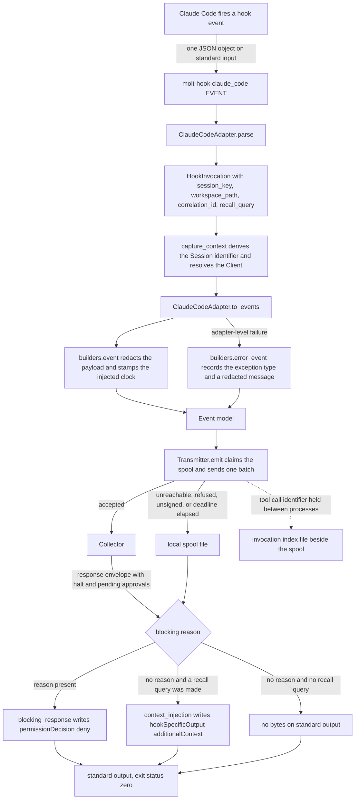

# Claude Code hook specification notes

Everything below is derived from `src/molt/capture/adapters/claude_code.py`, the
shared Event constructors in `src/molt/capture/adapters/builders.py`, the linkage
store in `src/molt/capture/adapters/invocation_index.py`, and the entry point in
`src/molt/capture/hook.py`. Where the adapter and a general expectation about this
tool disagree, the adapter is the record.

Sibling notes: [Cursor](cursor.md), [Codex](codex.md),
[Gemini CLI](gemini_cli.md), [Copilot](copilot.md).

## Vendor specification location

The adapter records its own source in the module constant `SPECIFICATION`, whose
value is *the published hooks reference for Claude Code*. That is the vendor's own
hooks reference page within its published product documentation, the section that
enumerates the hook events, the JSON object each event delivers on standard input,
and the JSON decision object the tool reads back from standard output. No URL is
recorded in the adapter, so none is quoted here; the location is the hooks
reference section of the vendor's documentation for this tool and nothing else in
the repository grounds a more specific address.

The adapter's module docstring states the four facts of that reference which decide
its shape: the event name is carried in the payload as well as in the shim
arguments, a subagent is identified on every event fired inside it, tool calls
carry their own correlation identifier, and all three capability flags are backed
by a documented channel.

## Hook event names and consumed fields

`TOOL` is `claude_code`, which is the token the shim is installed with and the
value that lands in every Event's `agent_cli` column. Twelve vendor event names are
recognised, each bound to a module constant and keyed in both `CONSUMED_FIELDS` and
`EMITTED_CATEGORIES`.

Every payload of this tool carries four base fields that the adapter reads on every
event: `session_id`, `cwd`, `hook_event_name`, and — on the events that have one —
the event-specific fields below.

| Vendor event | Fields consumed | Event category |
| --- | --- | --- |
| `SessionStart` | `session_id`, `cwd`, `hook_event_name`, `source`, `model` | `session_start` |
| `SessionEnd` | `session_id`, `cwd`, `hook_event_name`, `reason` | `session_end` |
| `UserPromptSubmit` | `session_id`, `cwd`, `hook_event_name`, `prompt`, `permission_mode` | `user_prompt` |
| `PreToolUse` | `session_id`, `cwd`, `hook_event_name`, `tool_name`, `tool_input`, `tool_use_id`, `permission_mode`, `agent_id`, `agent_type` | `tool_call` |
| `PostToolUse` | `session_id`, `cwd`, `hook_event_name`, `tool_name`, `tool_input`, `tool_response`, `tool_use_id`, `duration_ms`, `agent_id`, `agent_type` | `tool_result` |
| `PostToolUseFailure` | `session_id`, `cwd`, `hook_event_name`, `tool_name`, `tool_use_id`, `error`, `is_interrupt`, `duration_ms` | `error` |
| `PermissionRequest` | `session_id`, `cwd`, `hook_event_name`, `tool_name`, `tool_input` | `decision` |
| `Stop` | `session_id`, `cwd`, `hook_event_name`, `last_assistant_message`, `stop_hook_active` | `assistant_response` |
| `SubagentStart` | `session_id`, `cwd`, `hook_event_name`, `agent_id`, `agent_type` | `session_start` |
| `SubagentStop` | `session_id`, `cwd`, `hook_event_name`, `agent_id`, `agent_type`, `last_assistant_message`, `stop_hook_active` | `session_end` |
| `PreCompact` | `session_id`, `cwd`, `hook_event_name`, `trigger`, `custom_instructions` | `decision` |
| `Notification` | `session_id`, `cwd`, `hook_event_name`, `notification_type`, `message`, `title` | `decision` |

`CONSUMED_FIELDS` is a module-level mapping rather than a comment, so the table above
is checkable against the code by reading one constant. Nothing generates the table,
and a reviewer who suspects drift should import the module and compare.

### Why each field is consumed, and what breaks without it

`session_id` is the vendor's stable key for the run. `derive_session_id` in
`src/molt/capture/protocol.py` turns the tool token and this key into a Session
identifier by a name-based derivation, which is what lets a fresh hook process
compute the same Session identifier as the previous one with no shared state. Absent
it, `capture_context` falls back to a machine-and-tool scoped key and notes that the
payload named no session key; every Event of the run then collapses into one
machine-scoped Session and per-run history is lost.

`cwd` is the workspace path. `resolve_client` matches it against the operator's
workspace-to-Client mapping, longest root winning. Absent it, the reserved
unassigned Client is used and the invocation carries the unassigned-Client note, so
the Events land but are not attributable to a Client's memory.

`hook_event_name` selects the mapping branch in `_mapped` and, on the injection
path, names the event the response envelope declares itself for. The adapter reads
it from the payload and treats the shim's second argument only as a fallback, so
nothing here trusts the shim over the vendor. Absent both, the event falls to
`_observation` and is recorded as a `decision` Event rather than as the tool call,
prompt, or response it actually was.

`tool_use_id` is this tool's correlation identifier. It is lifted onto the
invocation as `correlation_id`, recorded with the pending call in the invocation
index, and matched exactly when the result arrives, so `parent_event_id` on a
`tool_result` Event points at the right `tool_call` Event even when several calls are
in flight. Absent it, the index falls back to the most recent unlinked call of the
same Session preferring a matching `tool_name`, which is correct for serial calls
and a guess for parallel ones.

`tool_input` and `tool_response` pass through `builders.bounded_value`, which keeps
the value where its canonical rendering fits inside the 8192-byte payload cap and
replaces it with a byte length and a digest beyond that. Without the cap a single
file-sized tool response would be copied into a Ledger row.

`agent_id` and `agent_type` are the subagent parentage of Requirement 1.4. When
`session_id` and `agent_id` are both present the Session key becomes the two joined
by a unit separator and `SubagentSpawn` carries the parent key, so the child Session
derives a distinct identifier and records its parent. Absent `agent_id`, subagent
work is folded into the parent Session and the tree of a delegated run disappears.

`prompt`, `last_assistant_message`, and the notification text fields become the
Event's redacted text body through `builders.body_fields`, which stores the byte
length and digest in the payload rather than a second copy of the text.
`permission_mode`, `stop_hook_active`, `is_interrupt`, `duration_ms`, `source`,
`model`, `trigger`, and `custom_instructions` are recorded because they explain why
a run behaved as it did: a manual compaction carries the operator's own instruction
for what to preserve, and the remainder of the session is only explicable with it.

## Hook event flow



The recall leg runs before the batch is placed: `_decide` asks memory when
`recall_query` is set, then places the Events, so the one round trip that carries
the Events is also the one that carries the halt state the decision is read from.
`_recall_query` sets the query on `UserPromptSubmit`, using the prompt itself, and
on `PreToolUse`, using the tool name joined to the first present input among
`command`, `file_path`, `url`, `pattern`, `query`, and `prompt`. Both are events
whose documented output carries an additional-context field, so a block rendered for
either reaches the model.

## Context-injection envelope

This tool documents a structured injection envelope, so recall results reach the
model's context rather than only the engineer's terminal. `context_injection`
renders:

```json
{"hookSpecificOutput":{"hookEventName":"PreToolUse","additionalContext":"..."}}
```

`hookEventName` is the adapter's `injection_event` field, which `parse` updates from
the payload, because the reference requires the envelope to name the event that fired
and one hook invocation is one process.

`additionalContext` holds `builders.recall_block`. That block is the same object in
all five adapters and this is where its shape is stated once: a fixed heading, then
one line per prior attempt in ascending distance order carrying the distance,
outcome, Session, machine, and observation instant, each followed by an excerpt
clipped to 320 characters. Only the envelope around it differs between tools, which
is the whole of Requirement 13.6.

An empty result set renders as zero bytes. That is this tool's own form for a hook
with nothing to report, and `write_decision` writes nothing at all rather than an
empty line. Emitting an envelope carrying a sentence about having found nothing
would spend the model's context to say nothing.

## Blocking-decision channel

`blocking_response` renders:

```json
{"hookSpecificOutput":{"hookEventName":"PreToolUse","permissionDecision":"deny","permissionDecisionReason":"..."}}
```

A pre-tool decision of `deny` with a reason stops the pending tool call and the
reason is shown to the agent, so this is a genuine structured refusal rather than an
advisory note. The reason comes from `TransmitResult.blocking_reason`: a halted
Session outranks a pending approval, because a halt holds the whole Session while an
approval may hold one kind of action, and nothing is refused when no response
envelope was read.

**Molt never uses a non-zero-exit convention for this tool, or for any of the
five.** `hook.py` defines `EXIT_OK` as 0 and `main` returns it unconditionally, so a
malformed payload, an unset configuration surface, an unreachable Collector, an
unwritable spool directory, and a programming mistake all exit 0 with one line on
standard error. A refusal is expressed only through the vendor's structured channel;
the exit status is never a signal.

The reason is an ordering of obligations rather than a convenience. A hook that exits
non-zero can stop the agent that invoked it, so a defect in memory capture would
become a defect in the engineer's editor. Availability of the host agent outranks
completeness of the record, and the four sibling notes state the same rule without
restating this paragraph.

When a refusal is issued the Event recording it is spooled rather than transmitted:
`policy_halt_event` builds a `policy_halt` Event and `_decide` appends it to the
spool, because the refusal is already on standard output and the agent is waiting.

## Capability flags

`capabilities()` returns all three flags true.

| Flag | Value | Consequence for capture behaviour |
| --- | --- | --- |
| `structured_stdout` | `true` | The response is a JSON document on standard output. The entry point writes those bytes and nothing else ever writes there; every diagnostic goes to standard error as at most one line. |
| `context_injection` | `true` | Recall results travel in `additionalContext` and reach the model's context at the point the hook fired. `_decide` adds no advisory note, because the block is not advisory. |
| `blocking_decision` | `true` | A halt or a matching pending approval produces `permissionDecision` `deny` and the tool actually stops the call. `_decide` adds no "refusal is advisory" note. |

The entry point calls `context_injection` whatever the flag says. The flag records
*which channel was used*, not whether results are surfaced at all, and for this tool
the channel is the model-facing one.

## Asymmetries against the other four tools

- **Exact call linkage.** This tool and [Cursor](cursor.md) and [Codex](codex.md)
  carry `tool_use_id`; [Gemini CLI](gemini_cli.md) and [Copilot](copilot.md) carry
  no call identifier at all and fall back to recency. Parallel tool calls are
  therefore linked correctly here and only probably linked there.
- **Model-facing injection.** This tool, Codex, and Gemini CLI have a documented
  additional-context field. Cursor and Copilot do not, and their adapters degrade to
  an engineer-facing text channel with `context_injection` false.
- **No dedicated shell or file events.** Cursor exposes hook events for a shell
  command, a file read, a file edit, and a tool-server call, so its adapter emits
  `shell_command`, `file_read`, and `file_write` Events. Here every action arrives as
  a generic tool call and is recorded as `tool_call` and `tool_result`, with the
  action visible only inside `tool_input`.
- **No model-traffic events.** Only Gemini CLI exposes requests to and responses
  from the model, so only its adapter emits `model_request` and `model_response`
  Events. This tool's `Stop` event is the nearest equivalent and yields an
  `assistant_response` Event.
- **One payload spelling.** Copilot documents two spellings of the same payload and
  reads every field under both. Here each field has exactly one documented name.
- **Subagent identity on every inner event.** `agent_id` and `agent_type` are added
  to tool events fired inside a subagent, not only to the subagent lifecycle events,
  so parentage is recoverable from a tool call alone. Cursor names the parent
  explicitly through `parent_conversation_id`; Gemini CLI documents no subagent
  lifecycle event at all.

## Comparison of the five tools

This is the canonical copy of the five-way matrix. The other four notes carry their
own column and link here rather than repeating the table, so a vendor adding an event
changes one document.

| Aspect | Claude Code | Cursor | Codex | Gemini CLI | Copilot |
| --- | --- | --- | --- | --- | --- |
| Recognised event names | 12 | 20 | 11 | 11 | 14 plus 13 aliases |
| Event name spelling | upper camel | lower camel | upper camel | upper camel | lower camel, with an upper camel alias set |
| Event name source | `hook_event_name` | `hook_event_name` | `hook_event_name` | `hook_event_name` | `hook_event_name` when present, else payload-shape recognition |
| Field name spellings read | one | one | one | one | two |
| Session key field | `session_id` | `conversation_id`, else `session_id` | `session_id` | `session_id` | `sessionId`, else `session_id` |
| Workspace field | `cwd` | first of `workspace_roots`, else `cwd` | `cwd` | `cwd` | `cwd` |
| Call correlation | `tool_use_id` | `tool_use_id`, absent on the shell pair | `tool_use_id` | none | none |
| Turn grouping | none | `generation_id` on the pre-tool event | `turn_id` on nearly every event | none | none |
| Subagent parentage | `agent_id` | `subagent_id`, `parent_conversation_id`, `tool_call_id` | `agent_id` | none documented | `agentId`, `agentName` |
| Events memory is queried on | prompt submission, pre-tool | prompt submission, pre-shell, pre-tool, pre-tool-server | prompt submission, pre-tool | prompt submission only | prompt submission, pre-tool |
| Injection channel | `additionalContext` | `user_message`, advisory | `additionalContext` | `additionalContext` | progress line, advisory |
| Blocking channel | `permissionDecision` `deny` | `permission` `deny` | `permissionDecision` `deny` | `decision` `deny` | `permissionDecision` `deny` |
| `structured_stdout` | true | true | true | true | true |
| `context_injection` | true | false | true | true | false |
| `blocking_decision` | true | true | true | true | true |
| Model-traffic events | no | no | no | yes | no |
| Dedicated shell and file events | no | yes | no | no | no |

Two rows are the ones to read first. `context_injection` splits the five in three and
two: where it is false the recall block reaches a person rather than the model.
`Call correlation` splits them three and two the other way, and decides whether
parallel tool calls are linked exactly or matched by recency.
