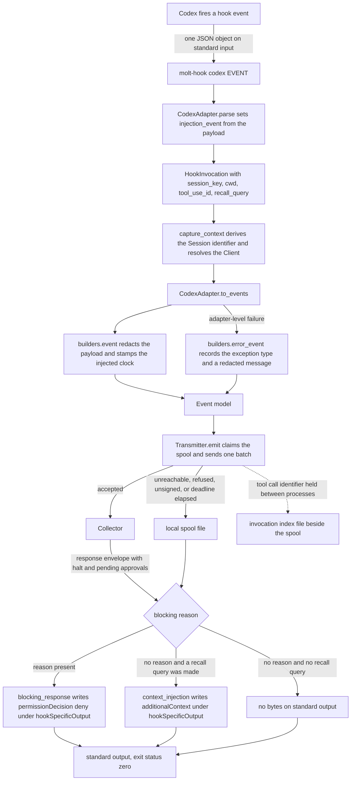

# Codex hook specification notes

The adapter is `src/molt/capture/adapters/codex.py`. It builds Events through
`builders.py`, links calls to results through `invocation_index.py`, and is driven by
`hook.py`; everything below is read out of those four files. Where the adapter and a
general expectation about this tool disagree, believe the adapter.

Sibling notes: [Claude Code](claude_code.md), [Cursor](cursor.md),
[Gemini CLI](gemini_cli.md), [Copilot](copilot.md).

## Vendor specification location

The source is named rather than linked. `SPECIFICATION` reads *the published hooks
documentation for Codex*: the vendor's own hooks page, where the lifecycle events a
command hook may be registered for are enumerated alongside the JSON object each
delivers on standard input and the decision read back from standard output. The
constant holds no URL, so this document quotes none.

The adapter's module docstring states the four facts of that documentation which
decide its shape: a subagent's hook carries the parent's session identifier, tool
events carry both a call identifier and a turn identifier, plain standard output is
ignored on most events so a decision must be JSON, and all three capability flags are
backed by a documented channel.

## Hook event names and consumed fields

Eleven vendor event names are recognised, each bound to a module constant and keyed in
both `CONSUMED_FIELDS` and `EMITTED_CATEGORIES`. `TOOL` is `codex`, which is both the
token the shim installs under and the `agent_cli` value on every Event.

Every payload carries `session_id`, `cwd`, and `hook_event_name`, which the adapter
reads on every event.

| Vendor event | Fields consumed | Event category |
| --- | --- | --- |
| `SessionStart` | `session_id`, `cwd`, `hook_event_name`, `source`, `model`, `permission_mode` | `session_start` |
| `SessionEnd` | `session_id`, `cwd`, `hook_event_name`, `reason` | `session_end` |
| `UserPromptSubmit` | `session_id`, `cwd`, `hook_event_name`, `prompt`, `turn_id` | `user_prompt` |
| `PreToolUse` | `session_id`, `cwd`, `hook_event_name`, `tool_name`, `tool_input`, `tool_use_id`, `turn_id`, `permission_mode` | `tool_call` |
| `PostToolUse` | `session_id`, `cwd`, `hook_event_name`, `tool_name`, `tool_input`, `tool_response`, `tool_use_id`, `turn_id` | `tool_result` |
| `PermissionRequest` | `session_id`, `cwd`, `hook_event_name`, `tool_name`, `tool_input`, `turn_id` | `decision` |
| `SubagentStart` | `session_id`, `cwd`, `hook_event_name`, `agent_id`, `agent_type`, `turn_id`, `permission_mode` | `session_start` |
| `SubagentStop` | `session_id`, `cwd`, `hook_event_name`, `agent_id`, `agent_type`, `last_assistant_message`, `stop_hook_active`, `turn_id` | `session_end` |
| `Stop` | `session_id`, `cwd`, `hook_event_name`, `last_assistant_message`, `stop_hook_active`, `turn_id` | `assistant_response` |
| `PreCompact` | `session_id`, `cwd`, `hook_event_name`, `trigger`, `turn_id` | `decision` |
| `PostCompact` | `session_id`, `cwd`, `hook_event_name`, `trigger`, `turn_id` | `decision` |

### Why each field is consumed, and what breaks without it

`session_id` is the run key, turned into a Session identifier by the name-based
derivation every adapter shares, which is why a fresh hook process arrives at the same
identifier as the last one with no state between them. On a subagent hook the
documentation states this field still holds the *parent* session identifier, and that
is what makes the parentage below work. Absent it, `capture_context` falls back to a
machine-and-tool scoped key and notes the fallback, collapsing every run on the machine
into one Session.

`cwd` is the workspace path. `resolve_client` matches it against the operator's
workspace-to-Client mapping, longest root winning; with no match the run lands under
the reserved unassigned Client and is attributable to no tenant's memory.

`hook_event_name` selects the mapping branch and, on the injection path, names the
event the response envelope declares itself for: `parse` copies it into the adapter's
`injection_event` field, because the documented envelope names the event that fired
and one hook invocation is one process. Absent it, the event falls to `_observation`
and is recorded as a `decision` Event rather than as the tool call, prompt, or
response it was.

`agent_id` and `agent_type` are the subagent parentage of Requirement 1.4. When
`session_id` and `agent_id` are both present the child Session key is the two joined
by a unit separator and `SubagentSpawn` carries the parent key, so the child Session
derives its own identifier and records its parent. Absent `agent_id`, delegated work
folds into the parent Session and the tree of a delegated run disappears.

`tool_use_id` is this tool's correlation identifier. It is lifted onto the invocation
as `correlation_id`, recorded with the pending call in the invocation index, and
matched exactly when the result arrives, so `parent_event_id` on a `tool_result` Event
points at the right `tool_call` Event even with several calls in flight. Absent it,
the index falls back to the most recent unlinked call of the same Session preferring a
matching `tool_name` — correct for serial calls, a guess for parallel ones.

`turn_id` is carried in the payload of nearly every Event this adapter builds, and it
is deliberately *not* the linkage. It groups the Events of one model turn so that a
prompt, the tool calls it produced, and the final message read as one turn, while
`parent_event_id` continues to express only the call-to-result relationship of
Requirement 7.8. Without it, turn boundaries are recoverable only by timestamp
ordering.

`tool_input` and `tool_response` go through `builders.bounded_value`: under the
8192-byte payload cap the value is kept as it stands, over it only a byte length and a
digest survive. A file-sized tool response is identified rather than copied into a
Ledger row.

`prompt` and `last_assistant_message` become the Event's redacted text body through
`builders.body_fields`, which keeps the byte length and digest in the payload rather
than a second copy of the text. `source`, `model`, `permission_mode`, `reason`,
`stop_hook_active`, and `trigger` are recorded because they explain why a run behaved
as it did: the permission mode in force decides which actions were even possible.

## Hook event flow



`_recall_query` sets the query on `UserPromptSubmit` from the prompt, and on
`PreToolUse` from the tool name joined to the first present input among `command`,
`description`, `path`, and `query`. Where none of those is present, `_describe` falls
back to the canonical rendering of the whole argument object clipped to 320
characters, so a tool this adapter has never seen still produces a usable query. That
fallback is specific to this adapter: `command` covers both a shell call and a patch,
and `description` covers a human-readable approval request.

## Context-injection envelope

This tool documents a structured injection envelope, and for a sharper reason than the
others: **plain text on standard output is added as developer context only on the
session-start, subagent-start, and prompt-submission events, and is ignored
everywhere else.** On the pre-tool event — the one that matters most for recall,
because it precedes the action — writing prose would achieve nothing. The JSON object
is the only channel that reaches the model there.

`context_injection` renders:

```json
{"hookSpecificOutput":{"hookEventName":"PreToolUse","additionalContext":"..."}}
```

`hookEventName` is the adapter's `injection_event`, updated by `parse` from the
payload. `additionalContext` holds `builders.recall_block`, whose ranking and wording
are the same for every tool and are
[set out in the Claude Code notes](claude_code.md#context-injection-envelope). Only
the envelope differs, which is the whole of Requirement 13.6.

An empty result set renders as zero bytes — this tool's own form for a hook with
nothing to report — and `write_decision` writes nothing at all rather than an empty
line.

## Blocking-decision channel

`blocking_response` renders:

```json
{"hookSpecificOutput":{"hookEventName":"PreToolUse","permissionDecision":"deny","permissionDecisionReason":"..."}}
```

A pre-tool permission decision of `deny` with a reason stops the pending call, so
`blocking_decision` is true. Note that `hookEventName` here is fixed to `PreToolUse`
rather than taken from `injection_event`: a refusal is only meaningful on the
pre-tool event, so the refusal envelope names that event unconditionally while the
injection envelope names whichever event fired. The reason comes from
`TransmitResult.blocking_reason`, where a halted Session outranks a pending approval
and nothing is refused when no response envelope was read.

**The exit status carries no refusal, for this tool or any of the five.** `hook.py`
returns `EXIT_OK` from every branch, so the structured channel above is the only place
a refusal appears. [The Claude Code notes](claude_code.md#blocking-decision-channel)
list the failures that still exit zero and say why availability of the host agent is
the higher obligation.

A refusal's `policy_halt` Event is appended to the spool instead of being
transmitted: the decision is already on standard output and the agent is waiting on
it.

## Capability flags

`capabilities()` returns all three flags true.

| Flag | Value | Consequence for capture behaviour |
| --- | --- | --- |
| `structured_stdout` | `true` | The response is a JSON document on standard output, and it has to be: plain text is ignored on most events. |
| `context_injection` | `true` | Recall results travel in `additionalContext` and reach the model's context on the event that fired. `_decide` adds no advisory note. |
| `blocking_decision` | `true` | A halt or a matching pending approval produces `permissionDecision` `deny` and the tool actually stops the call. No advisory note is added. |

## Asymmetries against the other four tools

- **Plain text is ignored on most events.** Unique among the five in being stated
  that way. For [Cursor](cursor.md) and [Copilot](copilot.md) the constraint is that
  no injection envelope exists on a pre-action event; here an envelope exists and the
  *alternative* to it is explicitly inert, which is why the adapter never falls back
  to prose.
- **A turn identifier carried on nearly every event.** Unique among the five.
  [Cursor](cursor.md) has `generation_id` on its pre-tool event only; this tool
  carries `turn_id` on prompts, tool events, permission requests, subagent events,
  stops, and both compaction events, so turn grouping is available almost everywhere.
- **Two compaction events.** This is the only adapter that recognises a post-compaction
  event as well as a pre-compaction one, so the effect of a compaction is bracketed
  rather than only announced.
- **A refusal envelope with a fixed event name.** The injection envelope names the
  event that fired; the refusal envelope always names the pre-tool event. Compare
  [Claude Code](claude_code.md), which does exactly the same thing, against
  [Gemini CLI](gemini_cli.md), whose refusal is a top-level decision with no event
  name at all.
- **A canonical-rendering fallback for the recall query.** Where no recognised input
  field is present, this adapter renders the whole argument object rather than
  producing an empty description. Claude Code, Gemini CLI, and Copilot return an empty
  description instead, so an unrecognised tool yields a weaker query there.
- **No dedicated shell, file, or model-traffic events.** Every action arrives as a
  generic tool call, so the action is visible only inside `tool_input`. Cursor has
  dedicated shell and file events; Gemini CLI has model-traffic events.
- **`Stop` is an assistant response.** Shared with Claude Code: the event carries
  `last_assistant_message` directly, so it maps to `assistant_response` rather than to
  `decision`.

## This tool's column

The five-way matrix lives in
[the Claude Code notes](claude_code.md#comparison-of-the-five-tools). This tool's
column of it:

| Aspect | Codex |
| --- | --- |
| Recognised event names | 11 |
| Event name spelling | upper camel |
| Event name source | `hook_event_name` |
| Session key field | `session_id`, holding the parent's value on a subagent hook |
| Workspace field | `cwd` |
| Call correlation | `tool_use_id` |
| Turn grouping | `turn_id`, on nearly every event |
| Subagent parentage | `agent_id`, `agent_type` |
| Events memory is queried on | prompt submission, pre-tool |
| Injection channel | `additionalContext`, model-facing |
| Blocking channel | `permissionDecision` `deny`, nested and naming the pre-tool event |
| Capability flags | all three true |
| Compaction events | two, uniquely: before and after |
| Recall query fallback | the canonical rendering of the whole argument object |
