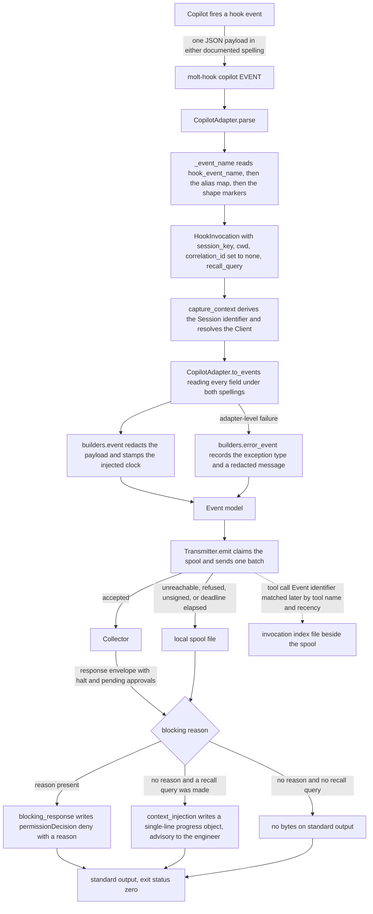

# Copilot hook specification notes

`src/molt/capture/adapters/copilot.py` is the subject here; `builders.py`,
`invocation_index.py`, and `hook.py` are the shared modules it calls into. Nothing
below comes from anywhere else, and where the adapter and a general expectation about
this tool disagree, the adapter wins.

Sibling notes: [Claude Code](claude_code.md), [Cursor](cursor.md),
[Codex](codex.md), [Gemini CLI](gemini_cli.md).

## Vendor specification location

`SPECIFICATION` names *the published hooks reference for GitHub Copilot*. That page
lists the lifecycle points a command hook may be registered for, the JSON payload each
hands the hook process, the decision object read back on standard output, and the
progress-line convention a hook writes a timeline message with. The adapter records no
URL and this document invents none.

The adapter's module docstring states the five facts of that reference which decide its
shape: one payload has two documented spellings, nothing identifies an individual tool
call, a refusal has a documented channel, injected context has no pre-action channel
but a display channel exists, and an empty result set writes nothing.

## Two documented spellings of one payload

This is the defining peculiarity of this tool and it colours every table below. The
reference defines a lower camel case payload for a lower camel case event name, and a
compatible payload whose fields are lower snake case for the same event registered
under its upper camel case name. **Which one arrives depends on how the operator
registered the hook**, so the adapter reads every field under both spellings through
`_either`, and reduces the event name to the lower camel case form before mapping.

`EVENT_ALIASES` holds the thirteen upper camel case names and the lower camel case name
each is the same event as:

| Registered as | Mapped to |
| --- | --- |
| `SessionStart` | `sessionStart` |
| `SessionEnd` | `sessionEnd` |
| `UserPromptSubmit` | `userPromptSubmitted` |
| `PreToolUse` | `preToolUse` |
| `PostToolUse` | `postToolUse` |
| `PostToolUseFailure` | `postToolUseFailure` |
| `PermissionRequest` | `permissionRequest` |
| `Stop` | `agentStop` |
| `SubagentStart` | `subagentStart` |
| `SubagentStop` | `subagentStop` |
| `ErrorOccurred` | `errorOccurred` |
| `PreCompact` | `preCompact` |
| `Notification` | `notification` |

`userPromptTransformed` has no upper camel case alias; it exists only in the lower camel
case set.

### Payload-shape recognition, and its honest limits

`_event_name` resolves the event in three steps. The compatible payload names the event
in `hook_event_name`, so that field is read first and passed through the alias map. The
lower camel case payload does not carry an event name, and the shim's own event argument
is applied by `dispatch` only *after* `parse` returns, so the adapter falls back to
`_SHAPE_MARKERS`: an ordered list of the fields that distinguish one documented payload
from another.

The order is what makes the recognition unambiguous. A subagent payload is examined
before a turn payload because both name a stop reason, and a tool result before a tool
call because both name a tool:

`toolResult` or `tool_result` → `postToolUse`; `errorContext` or `error_context` →
`errorOccurred`; `transformedPrompt` or `transformed_prompt` → `userPromptTransformed`;
`notification_type` → `notification`; `trigger` → `preCompact`; `agentId`, `agent_id`,
or `response` → `subagentStop`; `agentName`, `agentDisplayName`, or `agentDescription` →
`subagentStart`; `error` → `postToolUseFailure`; `toolName`, `tool_name`, `toolArgs`, or
`tool_input` → `preToolUse`; `source` → `sessionStart`; `reason` → `sessionEnd`;
`stopReason` or `stop_reason` → `agentStop`; `prompt` → `userPromptSubmitted`.

The adapter's own comment is explicit that this recognition is an *inference from the
documented payload shapes rather than something the specification states*, which is why
it is the last resort and why an unrecognised shape yields no name at all rather than a
guessed one. An unnamed event then reaches `_observation` and is recorded as a
`decision` Event carrying `hook_event` of `unnamed`, so nothing is lost even when
nothing is recognised. No other adapter of the five performs shape-based recognition;
the other four read an event name that is always present.

## Hook event names and consumed fields

Fourteen lower camel case event names are recognised, and `TOOL` is `copilot` — the
shim's installation token, and the `agent_cli` value on every Event. Every entry in the
table names both documented spellings, because either may arrive. Dotted names are
nested fields of the documented result and error objects.

| Vendor event | Fields consumed | Event category |
| --- | --- | --- |
| `sessionStart` | `sessionId`, `session_id`, `cwd`, `hook_event_name`, `source`, `initialPrompt`, `initial_prompt` | `session_start` |
| `sessionEnd` | `sessionId`, `session_id`, `cwd`, `hook_event_name`, `reason` | `session_end` |
| `userPromptSubmitted` | `sessionId`, `session_id`, `cwd`, `hook_event_name`, `prompt` | `user_prompt` |
| `userPromptTransformed` | `sessionId`, `cwd`, `hook_event_name`, `prompt`, `transformedPrompt` | `decision` |
| `preToolUse` | `sessionId`, `session_id`, `cwd`, `hook_event_name`, `toolName`, `tool_name`, `toolArgs`, `tool_input` | `tool_call` |
| `postToolUse` | `sessionId`, `session_id`, `cwd`, `hook_event_name`, `toolName`, `tool_name`, `toolArgs`, `tool_input`, `toolResult.resultType`, `toolResult.textResultForLlm`, `tool_result.result_type`, `tool_result.text_result_for_llm` | `tool_result` |
| `postToolUseFailure` | `sessionId`, `session_id`, `cwd`, `hook_event_name`, `toolName`, `tool_name`, `toolArgs`, `tool_input`, `error` | `error` |
| `permissionRequest` | `sessionId`, `cwd`, `hook_event_name`, `toolName`, `tool_name` | `decision` |
| `agentStop` | `sessionId`, `session_id`, `cwd`, `hook_event_name`, `stopReason`, `stop_reason`, `stop_hook_active` | `decision` |
| `subagentStart` | `sessionId`, `cwd`, `hook_event_name`, `agentName`, `agentDisplayName`, `agentDescription` | `session_start` |
| `subagentStop` | `sessionId`, `session_id`, `cwd`, `hook_event_name`, `agentId`, `agent_id`, `agentType`, `agent_type`, `agentName`, `agent_name`, `response`, `last_assistant_message`, `stopReason`, `stop_reason` | `session_end` |
| `errorOccurred` | `sessionId`, `session_id`, `cwd`, `hook_event_name`, `error.name`, `error.message`, `errorContext`, `error_context`, `recoverable` | `error` |
| `preCompact` | `sessionId`, `session_id`, `cwd`, `hook_event_name`, `trigger`, `customInstructions`, `custom_instructions` | `decision` |
| `notification` | `sessionId`, `cwd`, `hook_event_name`, `notification_type`, `message`, `title` | `decision` |

### Why each field is consumed, and what breaks without it

`sessionId` or `session_id` is the run key, whichever spelling arrived, and
`derive_session_id` turns it and the tool token into a Session identifier by a
name-based derivation that needs no state carried between hook processes. Absent both
spellings, `capture_context` falls back to a machine-and-tool scoped key and notes the
fallback, and every run on that machine collapses into one Session.

`cwd` resolves the Client through the operator's workspace mapping, longest root first.
Absent it the run falls to the reserved unassigned Client.

`hook_event_name` is read first and is the only spelling of the event name that appears
as a payload field; when it is absent the shape markers decide. Without either, the
event becomes an unnamed `decision` Event.

`toolName` or `tool_name` carries double duty, because **no documented field identifies
an individual tool call.** The documented tool inputs are the tool name and its
arguments and the documented tool result is the text the model will see; no call
identifier appears in either. `_tool_call` therefore records the pending call with
`correlation_id` set to `None` and keys the index entry by tool name alone, and
`_tool_result` and `_tool_failure` take the most recent unlinked call of the same
Session preferring one whose tool name matches. Without the tool name the fallback
degrades to pure recency and a result may adopt an unrelated call.

`toolArgs` or `tool_input` meets the 8192-byte payload cap in `builders.bounded_value`,
so a file-sized argument object is recorded as a byte length and a digest rather than
copied into a Ledger row.

`toolResult.textResultForLlm` or `tool_result.text_result_for_llm` is exactly what the
model will read, which makes it the right thing for memory to hold: a later recall
against a similar action returns what the agent was actually told last time. It passes
through `builders.content_fields`, which inlines the content when it fits inside the cap
and otherwise records its byte length and digest. `toolResult.resultType` or
`tool_result.result_type` is kept alongside it so a query can distinguish a class of
result without parsing the text.

`agentId`, `agent_id`, `agentName`, and `agent_name` are the subagent parentage of
Requirement 1.4 for this tool. On the two subagent events, `parse` reads an agent
identifier and falls back to an agent name, and where both a session key and an agent
are present the child Session key becomes the two joined by a unit separator with
`SubagentSpawn` carrying the parent key. `agentDisplayName` and `agentDescription` are
recorded on the subagent's own start Event, because a subagent's description is the
nearest thing this tool offers to the task it was given. Absent an agent, delegated work
folds into the parent Session.

`initialPrompt` or `initial_prompt` is recorded as a digest only, never as text. A
session's opening prompt is already captured as a `user_prompt` Event, so the digest
identifies it without a second copy.

`error.name` and `error.message` become the exception type and the redacted message of
an `error` Event; `errorContext` and `recoverable` say where the failure happened and
whether the session continued, which is the difference between a hiccup and a
termination.

`prompt`, `transformedPrompt`, and `response` or `last_assistant_message` become the
Event's redacted text body through `builders.body_fields`, which keeps the byte length
and digest in the payload rather than a second copy of the text. Recording the
transformed prompt matters because the transformation is a rewrite the model saw and
the engineer did not write.

`source`, `reason`, `stopReason`, `stop_hook_active`, `trigger`, `customInstructions`,
`notification_type`, `message`, and `title` are recorded because they explain why a run
behaved as it did.

## Hook event flow



`_recall_query` sets the query on `userPromptSubmitted` from the prompt, and on
`preToolUse` from the tool name joined to the first present argument among `command`,
`path`, `filePath`, `file_path`, and `pattern` — a list that itself spans both
spellings.

## Context-injection envelope: none, and what Molt does instead

**This tool documents no injection envelope on its pre-action event.** The documented
output of the pre-tool event is a permission decision, a reason, and substituted
arguments; the additional-context field belongs to the post-tool and notification
events, which fire too late to shape the action. This is the central asymmetry of this
document.

What the reference *does* define for a command hook on any event is a progress line: a
single-line object with a message, stripped from the decision stream and shown on the
timeline. `context_injection` writes the recall block there:

```json
{"type":"progress","message":"..."}
```

Two details of that rendering follow from the channel. The block's newlines are replaced
by a spaced vertical bar, because progress recognition is line-oriented and a multi-line
message would not be recognised as one progress line. And `builders.json_bytes` emits no
trailing newline of its own, for the same reason.

The block itself is `builders.recall_block`, identical in ranking and wording to every
other tool's and
[described in full in the Claude Code notes](claude_code.md#context-injection-envelope).
Only the envelope differs, which is the whole of Requirement 13.6.

An empty result set renders as zero bytes. The reference states that empty output falls
through to default behaviour, which is exactly the no-op an absent recall result set
calls for, and `write_decision` writes nothing at all rather than an empty line.

Because the channel reaches the engineer and decides nothing, `_decide` appends the note
*the tool documents no injection envelope, so results are advisory* to the single
diagnostic line on standard error. The entry point still calls `context_injection`
unconditionally: the capability flag records which channel was used, not whether results
are surfaced.

## Blocking-decision channel

A refusal *is* structured here. `blocking_response` renders:

```json
{"permissionDecision":"deny","permissionDecisionReason":"..."}
```

A pre-tool decision of `deny` with a reason prevents the tool from executing, and the
reference states the reason is shown to the agent, so `blocking_decision` is true. Note
the shape: the same two field names [Claude Code](claude_code.md) and
[Codex](codex.md) use, but at the top level rather than nested under an envelope object
naming an event.

The reason comes from `TransmitResult.blocking_reason`, where a halted Session outranks
a pending approval and nothing is refused when no response envelope was read.

**A refusal never travels as an exit status, here or in any of the five.** `hook.py`
returns `EXIT_OK` from every branch, including the malformed payload and the
unreachable Collector; see
[the Claude Code notes](claude_code.md#blocking-decision-channel) for why.

The `policy_halt` Event recording the refusal is appended to the spool rather than
transmitted, because the decision is already on standard output and the agent is
waiting on it.

## Capability flags

| Flag | Value | Consequence for capture behaviour |
| --- | --- | --- |
| `structured_stdout` | `true` | Both responses are JSON documents on standard output: a decision object, or a single-line progress object. Nothing else ever writes there. |
| `context_injection` | `false` | Recall results travel on the progress line and reach the engineer's timeline rather than the model's context. `_decide` adds the advisory note to the diagnostic line. Memory still shapes the run, but through a human rather than through the model's prompt. |
| `blocking_decision` | `true` | A halt or a matching pending approval produces `permissionDecision` `deny` and the tool actually stops the call. No advisory note is added. |

## Asymmetries against the other four tools

- **Two payload spellings for one event.** Unique among the five. Every field is read
  under both a lower camel case and a lower snake case name, and the event name is
  normalised through an alias map before mapping. The other four adapters read exactly
  one documented name per field, so this adapter is the only one whose consumed-field
  table has two entries per concept.
- **Event recognition by payload shape.** Unique among the five, and the only place any
  adapter infers rather than reads. The lower camel case payload carries no event name
  and the shim's argument arrives too late, so an ordered marker list decides. An
  unrecognised shape yields no name rather than a guess.
- **No structured injection envelope, and an unusual substitute.** Shared with
  [Cursor](cursor.md) in having no pre-action envelope, but the substitute differs:
  Cursor writes the block into the permission response's user-facing message, while this
  tool writes a timeline progress line and must flatten the block to one line to do it.
  [Claude Code](claude_code.md), [Codex](codex.md), and
  [Gemini CLI](gemini_cli.md) all have a model-facing field.
- **No call identifier.** Shared with Gemini CLI. Claude Code, Cursor, and Codex carry
  `tool_use_id`, so their results link exactly; here the index falls back to the most
  recent unlinked call of the same Session preferring a matching tool name.
- **A dedicated session-level error event.** `errorOccurred` with a structured error
  object, an error context, and a recoverability flag has no counterpart in the other
  four adapters, which record errors only as tool failures or as adapter-level failures.
- **A prompt-transformation event.** `userPromptTransformed` is unique among the five and
  is the only event of any tool that reports a rewrite of the engineer's own prompt.
- **The opening prompt as a digest.** `initialPrompt` is recorded as a digest on the
  session start Event, which no other adapter does, because the same text arrives again
  as a prompt Event.

## This tool's column

The five-way matrix lives in
[the Claude Code notes](claude_code.md#comparison-of-the-five-tools). This tool's
column of it:

| Aspect | Copilot |
| --- | --- |
| Recognised event names | 14, plus 13 upper camel aliases |
| Event name spelling | lower camel, with an upper camel alias set |
| Event name source | `hook_event_name` when present, else payload-shape recognition |
| Field name spellings read | two, for every field |
| Session key field | `sessionId`, else `session_id` |
| Workspace field | `cwd` |
| Call correlation | none |
| Turn grouping | none |
| Subagent parentage | `agentId`, `agentName` |
| Events memory is queried on | prompt submission, pre-tool |
| Injection channel | a timeline progress line, advisory to the engineer |
| Blocking channel | top-level `permissionDecision` `deny` |
| Capability flags | `structured_stdout` true, `context_injection` false, `blocking_decision` true |
| Events with no counterpart elsewhere | `errorOccurred`, `userPromptTransformed` |
