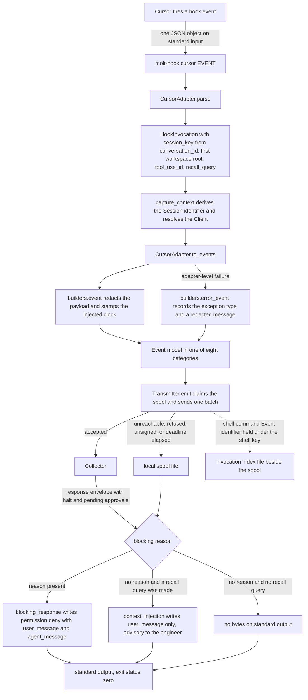

# Cursor hook specification notes

Sources for these notes: the adapter at `src/molt/capture/adapters/cursor.py`, plus
the three modules every adapter shares — `builders.py` for the Event constructors,
`invocation_index.py` for call linkage, `hook.py` for the entry point. Where the
adapter and a general expectation about this tool disagree, the adapter is what runs
and therefore the record.

Sibling notes: [Claude Code](claude_code.md), [Codex](codex.md),
[Gemini CLI](gemini_cli.md), [Copilot](copilot.md).

## Vendor specification location

`SPECIFICATION` in the adapter names its source: *the published agent hooks
documentation for Cursor*. That page lists the hook events an operator may configure,
gives the JSON object each event hands the hook process on standard input, and gives
the object the tool reads back. The constant holds no URL, and none is invented here.

The adapter's module docstring states the five facts of that documentation which
decide its shape: the run is identified by a conversation rather than a session, the
workspace arrives as a list of roots, shell and file and tool-server actions have
hook events of their own, a refusal has a documented channel while injected context
does not, and an empty recall result set writes nothing.

## Hook event names and consumed fields

`TOOL` is `cursor`: the token the shim installs under, and the value every Event's
`agent_cli` column carries. Twenty vendor event names are recognised, each bound to a
module constant and keyed in both `CONSUMED_FIELDS` and `EMITTED_CATEGORIES` — the
largest event surface of the five, by some margin.

Every payload carries `conversation_id`, `hook_event_name`, and `workspace_roots`,
which the adapter reads on every event.

| Vendor event | Fields consumed | Event category |
| --- | --- | --- |
| `sessionStart` | `conversation_id`, `session_id`, `hook_event_name`, `workspace_roots`, `model`, `cursor_version`, `is_background_agent`, `composer_mode` | `session_start` |
| `sessionEnd` | `conversation_id`, `session_id`, `hook_event_name`, `workspace_roots`, `reason`, `duration_ms`, `final_status`, `error_message`, `is_background_agent` | `session_end` |
| `beforeSubmitPrompt` | `conversation_id`, `hook_event_name`, `workspace_roots`, `prompt` | `user_prompt` |
| `preToolUse` | `conversation_id`, `generation_id`, `hook_event_name`, `workspace_roots`, `tool_name`, `tool_input`, `tool_use_id`, `cwd`, `model` | `tool_call` |
| `postToolUse` | `conversation_id`, `hook_event_name`, `workspace_roots`, `tool_name`, `tool_input`, `tool_output`, `tool_use_id`, `duration`, `cwd` | `tool_result` |
| `postToolUseFailure` | `conversation_id`, `hook_event_name`, `workspace_roots`, `tool_name`, `tool_input`, `tool_use_id`, `error_message`, `failure_type`, `duration`, `is_interrupt` | `error` |
| `beforeShellExecution` | `conversation_id`, `hook_event_name`, `workspace_roots`, `command`, `cwd`, `sandbox` | `shell_command` |
| `afterShellExecution` | `conversation_id`, `hook_event_name`, `workspace_roots`, `command`, `output`, `duration`, `sandbox` | `tool_result` |
| `beforeMCPExecution` | `conversation_id`, `hook_event_name`, `workspace_roots`, `tool_name`, `tool_input`, `url`, `command` | `tool_call` |
| `afterMCPExecution` | `conversation_id`, `hook_event_name`, `workspace_roots`, `tool_name`, `tool_input`, `result_json`, `duration` | `tool_result` |
| `beforeReadFile` | `conversation_id`, `hook_event_name`, `workspace_roots`, `file_path`, `content` | `file_read` |
| `afterFileEdit` | `conversation_id`, `hook_event_name`, `workspace_roots`, `file_path`, `edits` | `file_write` |
| `beforeTabFileRead` | `conversation_id`, `hook_event_name`, `workspace_roots`, `file_path`, `content` | `file_read` |
| `afterTabFileEdit` | `conversation_id`, `hook_event_name`, `workspace_roots`, `file_path`, `edits` | `file_write` |
| `subagentStart` | `conversation_id`, `hook_event_name`, `workspace_roots`, `subagent_id`, `subagent_type`, `task`, `parent_conversation_id`, `tool_call_id`, `subagent_model`, `is_parallel_worker` | `session_start` |
| `subagentStop` | `conversation_id`, `hook_event_name`, `workspace_roots`, `subagent_type`, `status`, `task`, `summary`, `duration_ms`, `message_count`, `tool_call_count`, `modified_files` | `session_end` |
| `afterAgentResponse` | `conversation_id`, `hook_event_name`, `workspace_roots`, `text` | `assistant_response` |
| `afterAgentThought` | `conversation_id`, `hook_event_name`, `workspace_roots`, `text`, `duration_ms` | `decision` |
| `stop` | `conversation_id`, `hook_event_name`, `workspace_roots`, `status`, `loop_count` | `decision` |
| `preCompact` | `conversation_id`, `hook_event_name`, `workspace_roots`, `trigger`, `context_usage_percent`, `context_tokens`, `message_count` | `decision` |

### One base field deliberately not consumed

Every payload of this tool carries the authenticated user's electronic contact
address as a base field. The adapter's own comment on `CONSUMED_FIELDS` records that
its absence from the table is deliberate: it is personal data that no Event needs, so
it is never lifted into a payload, a text body, or a Session record. This is the only
place among the five adapters where a documented base field is dropped on purpose
rather than for want of a use.

### Why each field is consumed, and what breaks without it

`conversation_id` is the run key, stable across the turns of one conversation. The
two session lifecycle events also carry `session_id`, documented as the same value,
so `parse` reads whichever is present, conversation first. `derive_session_id` turns
it into the Session identifier. Absent both, `capture_context` falls back to a
machine-and-tool scoped key and notes it, collapsing every run on the machine into
one Session.

`workspace_roots` is a list of workspace folders, normally one. `_first_root` takes
the first entry as the workspace the Client is resolved from, falling back to `cwd`
on the events that carry one, and the whole list is kept on the Session-scoped Event
so a multi-root workspace is still readable afterwards. Absent it, the reserved
unassigned Client is used and the run is not attributable to a Client's memory.

`hook_event_name` selects the mapping branch. Absent it the event falls to
`_observation` and becomes a `decision` Event, which for this tool costs more than
for the others: the dedicated shell, file, and tool-server categories are only
reachable through the event name.

`tool_use_id` is the correlation identifier for the generic tool events and the
tool-server events. It is recorded with the pending call and matched exactly when the
result arrives, so `parent_event_id` is right even for parallel calls. The shell pair
carries no such identifier, which is handled below.

`generation_id` on `preToolUse` names the model turn the call was produced by, so the
several calls of one generation are recognisable as one act of the agent rather than
as unrelated neighbours. Without it, a batch of parallel calls reads as coincidence.

`tool_input`, `tool_output`, `result_json`, and `edits` meet the 8192-byte payload cap
in `builders.bounded_value`: what fits is kept, what does not becomes a byte length and
a digest. `content` and `output` take the same reduction through
`builders.content_fields`, which inlines the content where it fits. A file read of a
megabyte is identified rather than copied into a Ledger row.

`subagent_id`, `subagent_type`, `parent_conversation_id`, and `tool_call_id` are the
subagent parentage of Requirement 1.4. When `parent_conversation_id` and
`subagent_id` are both present the child Session key is the parent key joined to the
subagent identifier by a unit separator, and `tool_call_id` becomes the spawning
Event identifier when it parses as a UUID. Absent them, delegated work folds into the
parent Session and the tree of a parallel run disappears.

`cursor_version` is kept because a run's behaviour belongs to the build that produced
it: a mapping that changed with a release is only explicable from the Ledger if the
Ledger says which build was running. `composer_mode`, `is_background_agent`,
`is_parallel_worker`, `sandbox`, `failure_type`, `is_interrupt`, `final_status`,
`status`, `loop_count`, `duration_ms`, `duration`, `message_count`,
`tool_call_count`, `context_usage_percent`, and `context_tokens` are recorded for the
same reason: they are why a run looks as it does.

`prompt`, `text`, and `summary` become the Event's redacted text body through
`builders.body_fields`, which keeps the byte length and digest in the payload rather
than a second copy of the text.

## Hook event flow



`_recall_query` sets the query on `beforeSubmitPrompt` from the prompt, on
`beforeShellExecution` from the command clipped to 320 characters, and on
`preToolUse` and `beforeMCPExecution` from the tool name joined to the first present
input among `command`, `file_path`, `url`, `query`, and `pattern`.

## Context-injection envelope: none, and what Molt does instead

**This tool documents no injection envelope on any pre-action event.** The
documented additional-context field belongs to events that fire *after* an action and
to session start, and none of the pre-action events defines one. That is the central
asymmetry of this document.

`context_injection` therefore renders the recall block into the one text channel a
pre-action response does define:

```json
{"user_message":"..."}
```

`user_message` is a field of the pre-action permission response and reaches the
engineer's own view, not the model's context. No permission field is written
alongside it, because reporting what memory holds is not a decision about the pending
action, and writing one would turn a report into a permission verdict the hook was
not asked to give.

The block itself is `builders.recall_block`, byte-for-byte the block every other
adapter renders and
[described in full in the Claude Code notes](claude_code.md#context-injection-envelope).
Only the envelope differs, which is the whole of Requirement 13.6.

An empty result set renders as zero bytes, and `write_decision` writes nothing at
all rather than an empty line.

Because the channel is advisory, `_decide` appends the note *the tool documents no
injection envelope, so results are advisory* to the single diagnostic line on standard
error. `context_injection` is called either way; the flag says which channel carried
the block, not whether one was written.

## Blocking-decision channel

A refusal *is* structured here. `blocking_response` renders:

```json
{"permission":"deny","user_message":"...","agent_message":"..."}
```

A permission decision of `deny` with a message for the user and a message for the
agent is the documented way to stop a pending action, so `blocking_decision` is
true. The same reason text fills both message fields: the engineer and the agent are
told the same thing. The reason comes from `TransmitResult.blocking_reason`, where a
halted Session outranks a pending approval and nothing is refused when no response
envelope was read.

**No refusal is ever expressed as a non-zero exit status, here or for any of the
five.** `hook.py` returns `EXIT_OK` unconditionally and the vendor's structured
channel is the only channel a refusal travels on; the reasoning is in
[the Claude Code notes](claude_code.md#blocking-decision-channel).

A refusal's own `policy_halt` Event goes to the spool rather than over the wire,
because standard output already carries the refusal and the agent is waiting on it.

## Capability flags

| Flag | Value | Consequence for capture behaviour |
| --- | --- | --- |
| `structured_stdout` | `true` | The response is a JSON document on standard output, and nothing else ever writes there. |
| `context_injection` | `false` | Recall results travel in `user_message` and reach the engineer rather than the model's context. `_decide` adds the advisory note to the diagnostic line. Memory still shapes the run, but through a human rather than through the model's prompt. |
| `blocking_decision` | `true` | A halt or a matching pending approval produces `permission` `deny` and the tool actually stops the action. No advisory note is added. |

## Asymmetries against the other four tools

- **No pre-action injection envelope.** Shared only with [Copilot](copilot.md).
  [Claude Code](claude_code.md), [Codex](codex.md), and
  [Gemini CLI](gemini_cli.md) all document an additional-context field on a
  pre-action event, so their blocks reach the model. Here and in Copilot the block is
  advisory text. Copilot's advisory channel is a timeline progress line; this tool's
  is the permission response's user-facing message.
- **Dedicated shell, file, and tool-server events.** Unique among the five. This is
  the only adapter that emits `shell_command`, `file_read`, and `file_write` Events,
  because it is the only tool whose specification exposes those actions as hook
  events of their own rather than as generic tool calls.
- **A pair of events with no correlation identifier inside a tool that has one.**
  The shell pair carries no call identifier even though the generic tool events do,
  so the shell Event is recorded in the invocation index under the adapter's own key
  `shell` and the shell result takes the most recent unlinked entry under that key.
  The private key is what keeps a shell result from adopting an unrelated
  tool-server call. Gemini CLI and Copilot have no correlation identifier at all;
  this tool is the only one that is mixed.
- **A base field dropped for privacy.** Unique among the five: the payload's
  authenticated-user contact address is never consumed.
- **Twenty event names.** The largest surface of the five, and the only one with
  distinct tab-completion file events alongside the agent's own file events.
- **A build identifier on session start.** `cursor_version` has no counterpart in the
  other four adapters' consumed fields.

## This tool's column

The five-way matrix lives in
[the Claude Code notes](claude_code.md#comparison-of-the-five-tools). This tool's
column of it:

| Aspect | Cursor |
| --- | --- |
| Recognised event names | 20, the largest surface of the five |
| Event name spelling | lower camel |
| Event name source | `hook_event_name` |
| Session key field | `conversation_id`, else `session_id` |
| Workspace field | first of `workspace_roots`, else `cwd` |
| Call correlation | `tool_use_id`, absent on the shell pair |
| Turn grouping | `generation_id`, on the pre-tool event only |
| Subagent parentage | `subagent_id`, `parent_conversation_id`, `tool_call_id` |
| Events memory is queried on | prompt submission, pre-shell, pre-tool, pre-tool-server |
| Injection channel | `user_message`, advisory to the engineer |
| Blocking channel | `permission` `deny`, with a message for the user and one for the agent |
| Capability flags | `structured_stdout` true, `context_injection` false, `blocking_decision` true |
| Dedicated shell and file events | yes, uniquely |
| Base field dropped on purpose | the authenticated user's contact address |
