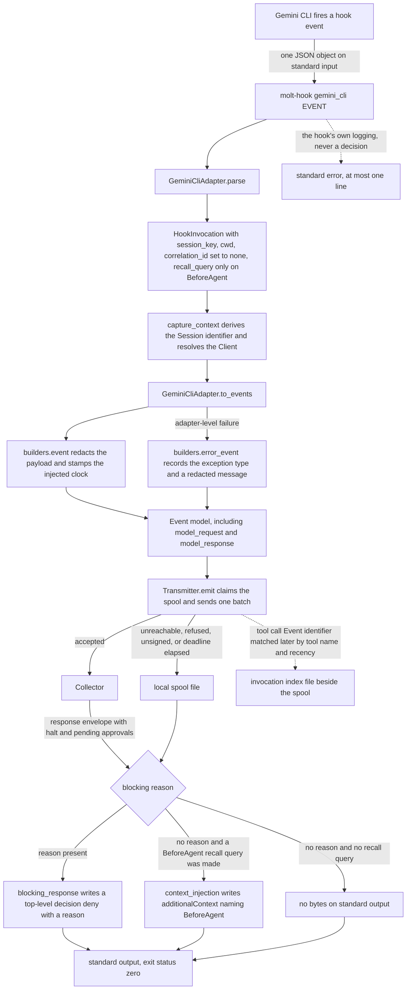

# Gemini CLI hook specification notes

Read these notes against `src/molt/capture/adapters/gemini_cli.py` and the three
shared modules it uses: `builders.py`, `invocation_index.py`, and `hook.py`. The
adapter is the record wherever it and a general expectation about this tool disagree.

Sibling notes: [Claude Code](claude_code.md), [Cursor](cursor.md),
[Codex](codex.md), [Copilot](copilot.md).

## Vendor specification location

`SPECIFICATION` records the source as *the published hooks reference for Gemini CLI*:
the vendor's hooks reference page, which enumerates the hook events, the JSON object
each passes on standard input, the object read back on standard output, and the
reservation of standard error for the hook's own logging rather than for any part of
the decision. No URL is recorded in the adapter and none is supplied here.

The adapter's module docstring states the five facts of that reference which decide its
shape: model traffic has hook events of its own, tool events carry no call identifier,
only some events accept added context, a refusal is a top-level decision, and no hook
event names a spawned subagent.

## Hook event names and consumed fields

Eleven vendor event names are recognised, each bound to a module constant and keyed in
both `CONSUMED_FIELDS` and `EMITTED_CATEGORIES`. `TOOL` is `gemini_cli`, the shim's
installation token and the `agent_cli` value on every Event. Dotted names below are
nested fields of the documented request and response shapes, read through `_mapping`.

Every payload carries `session_id`, `cwd`, and `hook_event_name`, which the adapter
reads on every event.

| Vendor event | Fields consumed | Event category |
| --- | --- | --- |
| `SessionStart` | `session_id`, `cwd`, `hook_event_name`, `source` | `session_start` |
| `SessionEnd` | `session_id`, `cwd`, `hook_event_name`, `reason` | `session_end` |
| `BeforeAgent` | `session_id`, `cwd`, `hook_event_name`, `prompt` | `user_prompt` |
| `AfterAgent` | `session_id`, `cwd`, `hook_event_name`, `prompt`, `prompt_response`, `stop_hook_active` | `assistant_response` |
| `BeforeTool` | `session_id`, `cwd`, `hook_event_name`, `tool_name`, `tool_input`, `mcp_context`, `original_request_name` | `tool_call` |
| `AfterTool` | `session_id`, `cwd`, `hook_event_name`, `tool_name`, `tool_input`, `tool_response`, `tool_response.error`, `mcp_context`, `original_request_name` | `tool_result` |
| `BeforeModel` | `session_id`, `cwd`, `hook_event_name`, `llm_request.model`, `llm_request.messages`, `llm_request.config` | `model_request` |
| `AfterModel` | `session_id`, `cwd`, `hook_event_name`, `llm_request.model`, `llm_response.candidates`, `llm_response.usageMetadata.totalTokenCount` | `model_response` |
| `BeforeToolSelection` | `session_id`, `cwd`, `hook_event_name`, `llm_request.model`, `llm_request.toolConfig` | `decision` |
| `Notification` | `session_id`, `cwd`, `hook_event_name`, `notification_type`, `message` | `decision` |
| `PreCompress` | `session_id`, `cwd`, `hook_event_name`, `trigger` | `decision` |

The `AfterModel` mapping also reads the first candidate's `finishReason` through
`_finish_reason`, which is the field a response is actually read for.

### Why each field is consumed, and what breaks without it

`session_id` is the run key, and `derive_session_id` turns it and the tool token into a
Session identifier by a name-based derivation. No state travels between hook processes,
which is the point: each one recomputes the identifier. Absent the field,
`capture_context` falls back to a machine-and-tool scoped key and notes the fallback,
and every run on that machine collapses into one Session.

`cwd` is the workspace path the Client is resolved from, longest configured root
winning. Without it the run belongs to the reserved unassigned Client, so its Events
are stored and attributable to nobody.

`hook_event_name` selects the mapping branch. Absent it the event falls to
`_observation` and becomes a `decision` Event, which costs more here than elsewhere:
`model_request` and `model_response` are reachable only through the event name, so the
one capability that distinguishes this tool is lost with it.

`tool_name` carries double duty. It is the Event's payload field and it is the
invocation index's matching key, because **no field of either tool event identifies the
individual call.** `_tool_call` records the pending call with `correlation_id` set to
`None`, and `_tool_result` takes the most recent unlinked call of the same Session,
preferring one whose `tool_name` matches. Without the tool name the fallback degrades
further to pure recency, and a result may adopt an unrelated call.

`tool_input` and `tool_response` meet the 8192-byte payload cap in
`builders.bounded_value`. What fits is stored; what does not becomes a byte length and
a digest, so a file-sized response is identified rather than copied into a Ledger row.

`tool_response.error` decides the `failed` payload flag on a `tool_result` Event. A
result read on its own therefore reports whether the call succeeded without a query
having to reason about the response shape.

`mcp_context` and `original_request_name` identify a call that arrived through a tool
server. A call routed through a server behaves according to that server rather than
according to this tool, and the two are indistinguishable from `tool_name` alone. Both
are recorded on the result as well as on the call, so a result read on its own says
which server answered it without a reader walking back to the call Event.

`llm_request.model` is recorded on the model request, on the model response, and on the
tool-selection observation, because the model in force is the single largest determinant
of a run's behaviour. `llm_request.messages` is reduced to a count rather than copied:
the messages are the conversation, and the conversation is already in the Ledger as
prompts and responses, so a second copy per request would multiply the Ledger by the
turn count. `llm_request.config` and `llm_request.toolConfig` pass through
`builders.bounded_value`, because sampling settings and the tool set offered to the
model are why one turn differs from another.

`llm_response.usageMetadata.totalTokenCount` is the only token accounting any of the
five tools reports to a hook. It is recorded only when it is a genuine integer, so a
malformed field yields no field rather than a zero that would read as a real
measurement.

`prompt` and `prompt_response` become the Event's redacted text body through
`builders.body_fields`, which keeps the byte length and digest in the payload rather
than a second copy of the text. `source`, `reason`, `stop_hook_active`,
`notification_type`, `message`, and `trigger` are recorded because they explain why a
run behaved as it did.

## Hook event flow



## Context-injection envelope

This tool documents a structured injection envelope, but on a narrower set of events
than the tools that share the flag. The reference gives the additional-context field to
the events that fire before the agent plans, after a tool returns, and at session
start. **The event that fires before a tool runs documents a decision and a rewritten
input, not added context.**

That single fact decides where memory is queried. `_recall_query` returns a query only
for `BeforeAgent`, using the prompt, and returns `None` for every other event including
`BeforeTool`. Querying memory on `BeforeTool` would produce results with nowhere to put
them, so the adapter does not query there at all. `context_injection` renders:

```json
{"hookSpecificOutput":{"hookEventName":"BeforeAgent","additionalContext":"..."}}
```

`hookEventName` is the constant `BeforeAgent` rather than a field updated by `parse`,
because for this tool there is exactly one event a block is ever written for.
Contrast [Claude Code](claude_code.md) and [Codex](codex.md), whose adapters carry an
`injection_event` field set from the payload because either of two events may be
answered.

`additionalContext` holds `builders.recall_block`, the same ranked block every adapter
renders and one the
[Claude Code notes](claude_code.md#context-injection-envelope) describe in full. Only
the envelope differs, which is the whole of Requirement 13.6.

An empty result set renders as zero bytes, this tool's own no-op for a hook with
nothing to decide, and `write_decision` writes nothing at all rather than an empty
line.

## Blocking-decision channel

`blocking_response` renders:

```json
{"decision":"deny","reason":"..."}
```

This is the flattest refusal of the five: a top-level decision with a top-level reason,
no envelope object and no event name. The reference documents the same decision for the
tool event and for the pre-planning event alike, so one refusal document serves both
and `blocking_decision` is true. The reason comes from
`TransmitResult.blocking_reason`, where a halted Session outranks a pending approval and
nothing is refused when no response envelope was read.

**The exit status is never a refusal, for this tool or any of the five**; `hook.py`
returns `EXIT_OK` from every branch, and
[the Claude Code notes](claude_code.md#blocking-decision-channel) give the full list
of failures that still exit zero. What is particular here is where the diagnostic
lands: this tool's reference reserves standard error for a hook's own logging, so the
one line written there cannot be mistaken for part of the decision.

A refusal's `policy_halt` Event is spooled rather than transmitted, since standard
output already carries the decision and the agent is waiting on it.

## Capability flags

`capabilities()` returns all three flags true.

| Flag | Value | Consequence for capture behaviour |
| --- | --- | --- |
| `structured_stdout` | `true` | The response is a JSON document on standard output. The diagnostic line goes to standard error, which this tool reserves for the hook's own logging, so the two streams cannot be confused. |
| `context_injection` | `true` | Recall results travel in `additionalContext` and reach the model's context — but only on `BeforeAgent`, because that is the only pre-action event whose documented output carries the field. `_decide` adds no advisory note. |
| `blocking_decision` | `true` | A halt or a matching pending approval produces a top-level `decision` of `deny` and the tool actually stops the action. No advisory note is added. |

Note the shape of the asymmetry: the flag is true, yet the injection point is narrower
than for [Claude Code](claude_code.md) or [Codex](codex.md), which inject on a
pre-tool event as well as on prompt submission. A true flag records that a
model-facing channel exists, not that every pre-action event has one.

## Asymmetries against the other four tools

- **The only tool exposing model traffic.** Unique among the five. `BeforeModel` and
  `AfterModel` are why `model_request` and `model_response` exist as Event categories
  at all, and why this is the only adapter that reports a token count. No other tool's
  hook surface sees a request to the model.
- **No call identifier on either tool event.** Shared with [Copilot](copilot.md).
  [Claude Code](claude_code.md), [Cursor](cursor.md), and [Codex](codex.md) carry
  `tool_use_id`, so their results link exactly; here the invocation index falls back to
  the most recent unlinked call of the same Session preferring a matching tool name,
  which is correct for serial calls and a guess for parallel ones.
- **No subagent lifecycle event.** Unique among the five. The reference's event list
  covers sessions, prompts, tools, and model traffic and names no subagent event, so
  `parse` passes `subagent=None` and no Session ever records a parent for this tool.
  Requirement 1.4 applies where a payload identifies a spawned subagent, and here no
  payload does. Delegated work, if the tool performs any, is indistinguishable from the
  parent's own work.
- **Injection on one event only.** The additional-context field exists but not on the
  pre-tool event, so memory is queried on prompt submission alone. Claude Code and
  Codex query on both prompt submission and the pre-tool event; Cursor and Copilot have
  no model-facing channel at all.
- **A refusal with no envelope and no event name.** Claude Code and Codex nest their
  refusal under `hookSpecificOutput` and name an event; Cursor uses `permission` with
  two message fields; Copilot uses `permissionDecision` at the top level. This tool is
  the only one whose refusal is a bare `decision` and `reason` pair.
- **Standard error is specified.** This is the only one of the five whose reference
  explicitly reserves standard error for the hook's own logging, which happens to be
  exactly what the entry point does for every tool: at most one diagnostic line there,
  never a decision.
- **Tool-server provenance on the result as well as the call.** `mcp_context` and
  `original_request_name` are recorded twice on purpose. Cursor records a tool-server
  call's `url` and `command` on the call Event only.

## This tool's column

The five-way matrix lives in
[the Claude Code notes](claude_code.md#comparison-of-the-five-tools). This tool's
column of it:

| Aspect | Gemini CLI |
| --- | --- |
| Recognised event names | 11 |
| Event name spelling | upper camel |
| Event name source | `hook_event_name` |
| Session key field | `session_id` |
| Workspace field | `cwd` |
| Call correlation | none, on either tool event |
| Turn grouping | none |
| Subagent parentage | none documented |
| Events memory is queried on | prompt submission only |
| Injection channel | `additionalContext`, model-facing, on `BeforeAgent` alone |
| Blocking channel | top-level `decision` `deny`, no envelope and no event name |
| Capability flags | all three true |
| Model-traffic events | yes, uniquely, with a token count |
| Standard error | reserved by the vendor for the hook's own logging |
