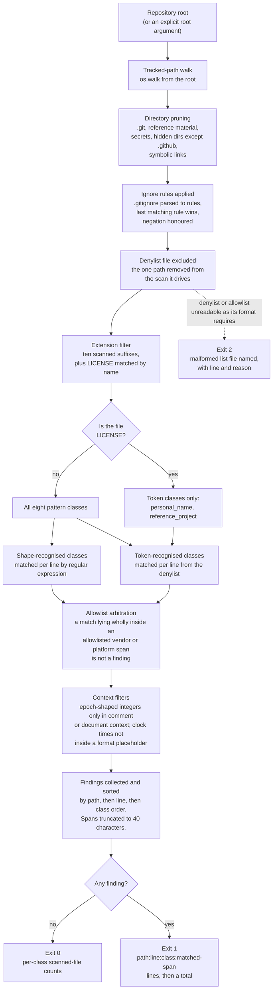

# Metadata hygiene

`scripts/hygiene.py` is a provenance gate. It asserts that the repository's
source and documentation carry no attributable metadata: nothing that names a
person, nothing that dates the work, nothing that records its lineage, and
nothing that names the reading material studied while building it. The claim
being defended is that the tree contains only original material written for
this project, and that the claim is checkable rather than asserted.

The gate is a text property rather than a behavioural one, so it needs no reachable
database instance, no cloud account, and no model provider. It is step 5 of the
workflow, after the four static-analysis gates and before both test suites;
[typing.md](typing.md) says why that position is fixed.

Run it from the repository root:

```text
python3.12 scripts/hygiene.py
```

## Scan flow



Two properties of that flow matter more than the individual steps.

**Nothing outside the tracked tree is ever opened.** Pruning happens during the
walk, before a directory's contents are examined, so a reference directory, a
secrets directory, or an ignored build output contributes no file to the scan
list and is never read. That is a correctness requirement, not an optimisation:
the gate must be able to run in a working tree that holds studied reading
material locally without that material influencing the result in either
direction.

**A broken configuration is never reported as a clean scan.** If either list
file cannot be read as its format requires, the gate exits 2 before scanning
anything. A gate whose denylist silently failed to load would report zero
findings, and zero findings is exactly the answer a passing run gives.

## The eight pattern classes

The class names below are the identifiers the gate reports, in the order it
reports them.

| Class as reported | Recognised by | What it matches |
| --- | --- | --- |
| `email_address` | Shape | A local part, an at sign, and a dotted domain ending in a two-or-more-letter label. |
| `calendar_date` | Shape | A four-digit-year-first or four-digit-year-last numeric date with hyphen or slash separators, and a month name written out or abbreviated beside a day and a four-digit year, in either order, with optional ordinal suffix. |
| `clock_time` | Shape | An hour and minute, optional seconds, optional meridiem marker, and optional zone designator or numeric offset. |
| `timestamp_literal` | Shape | A numeric date joined to a time by `T` or a space, with optional fractional seconds and optional zone designator or offset. Additionally, integers in the epoch-second and epoch-millisecond ranges, ten and thirteen digits respectively, in comment or document context only. |
| `version_history` | Shape | Heading and list-item forms of a change-log, release-notes, revision-history or version-history section title, an as-yet-unreleased section marker, a what-is-new heading, and any heading whose text begins with a three-part dotted version number. |
| `attribution` | Shape | The attribution keyword, the encircled attribution mark, a parenthesised c followed by a year or a capitalised name, an originator or upkeep tag introduced by a colon or an equals sign or written as an annotation, and phrases of the form produced-by naming who made the file. |
| `personal_name` | Token | Any term listed in the personal-name section of the denylist. |
| `reference_project` | Token | Any term listed in the reference-project section of the denylist. |

Six of the eight are recognised by shape, and they cover everything that has a
recognisable form. Two are recognised by token, and they have to be, because a
personal name and a project identifier are arbitrary strings: no regular
expression distinguishes a person's surname from an ordinary noun, or a studied
project's name from a word. Those two classes are therefore data-driven, and
the data is the denylist.

The class list is not the same thing as the rule list. `timestamp_literal` is
matched by three separate rules and `version_history` and `attribution` by two
each, because each class has distinct forms that no single readable expression
covers. Findings are always reported under the class, never the rule, so the
report vocabulary stays at eight names.

### Context filters

Two classes would produce false findings if matched unconditionally, so each
carries a narrowing condition.

Epoch-shaped integers are ambiguous in running code: a ten-digit integer can be
a threshold, an identifier, or a size. Those two rules are therefore restricted
to comment and document context. A `.md` file is entirely document context; in
any other file the match must sit after a comment marker or inside a leading
string literal. The consequence is deliberate and asymmetric: a hard-coded
epoch value in executable code is left alone, because it is a code-quality
question for the linter and the type checker, while the same value in a comment
is a provenance question and is reported.

Clock times are suppressed inside format placeholders, where an hour-and-minute
shape is a template rather than a recorded moment: a match preceded by a percent
sign within the last few characters, or sitting inside an unclosed brace pair
with a closing brace later on the line, is not a finding.

## The denylist and the allowlist

The gate reads two sectioned data files. They serve opposite purposes and the
asymmetry between them is the substance of the policy.

| File | Sections | Role |
| --- | --- | --- |
| `scripts/hygiene_denylist.txt` | `personal-name`, `reference-project` | Supplies the tokens for the two classes that cannot be recognised by shape. A term listed here is forbidden wherever it appears. |
| `scripts/hygiene_allowlist.txt` | `database`, `cloud`, `agent-cli`, `tooling` | Names the terms whose occurrence is never a finding. A match lying wholly inside an allowlisted span is discarded. |

Both files share a format: a section header in square brackets, then one term
per line, with blank lines and number-sign comments ignored. Terms are matched
case-insensitively at alphanumeric boundaries, so a listed term matches as a
whole word and does not fire inside a longer identifier that merely contains it.

### Why the allowlist exists

The documentation is obliged to name things. It has to name the database
product and its tooling, the cloud provider and each service the delivered
configuration uses, each supported agent command-line tool, and the build and
runtime tooling the manifest declares. Those names are third-party names, and a
naive originality check would flag every one of them.

The distinction the allowlist draws is between a name that is a factual
dependency statement and a name that is a provenance signal. Naming a vendor,
a platform, a managed service, or a pinned tool states what the system runs on
and what it requires. That statement is required by the specification, it is
verifiable against the manifest and the infrastructure templates, and it says
nothing about who wrote the code or what the code was derived from.

A personal name or a reference-project name carries the opposite information. A
personal name attributes the work to someone, which is exactly what the
originality claim excludes and what anonymous review requires be absent. A
reference-project name signals lineage: it suggests the design was taken from a
studied implementation rather than derived from the requirements. Neither adds
any technical fact a reader needs. A dependency can be substituted and the
substitution is a visible configuration change; a derivation cannot be
substituted, which is why naming one is treated as a claim about origin rather
than a claim about the runtime.

Both lists are strict about their own contents. An unknown section header, an
entry appearing before any section header, a duplicate entry, and an entry
holding a control character each make the file malformed. Duplicates are
rejected because a list that tolerated them would drift into two entries with
different intent under one spelling, and a control character is rejected
because a term whose printed form differs from its stored form cannot be
reviewed by reading it.

### Why the denylist is the only path excluded from its own scan

The denylist is a file whose entire content is the tokens it forbids. It cannot
express its own policy without violating it. Scanning it would produce one
`personal_name` or `reference_project` finding per entry, every run, with no
possible remedy short of emptying the list and disabling the two classes it
drives.

So the denylist path, in both its given and resolved forms, is the single
excluded path. The exclusion is narrow by construction:

- It is one path, not a directory and not a pattern. No other file inherits it.
- It excludes only that file from the scan, and does not disable the two
  classes. Every other retained file is still matched against every denylist
  token.
- The allowlist is **not** excluded. It has no reason to be: the terms it holds
  are permitted terms, so their presence in it is not a finding.

The asymmetry is the point. The allowlist is scannable because listing a
permitted term is permitted. The denylist is not, because listing a forbidden
term requires writing it down.

The `LICENSE` file is handled by a related but distinct rule. It is retained by
name rather than by extension, and it is scanned for the two denylist classes
only. A licence text legitimately carries the attribution line and the year
that every other file in the tree is forbidden from carrying: that is what a
licence is for, and stripping it would change its legal meaning. So the six
shape classes are not applied to it. The two token classes still are, because
no licence needs to name a person from this project or a studied
implementation, and a licence file is not a place to hide either.

## The exit-code contract

| Exit | Condition | Output |
| --- | --- | --- |
| 0 | No finding | `hygiene: no findings`, then one line per class giving the number of files scanned for that class, then `total: N files scanned`. |
| 1 | At least one finding | One line per finding as `path:line:class:matched-span`, with the matched span whitespace-collapsed and truncated to 40 characters, sorted by path, then line number, then the fixed class order. Then a total line giving the finding count, the number of files affected, and the number scanned. |
| 2 | A list file is absent or malformed | The offending file, the line number, and the reason, on the error stream. No scan result is produced. |

The status 0 output reports a per-class count rather than a single total on
purpose. Because `LICENSE` is scanned for two classes and every other file for
all eight, a single number could not distinguish a run that covered the whole
tree from a run whose walk silently pruned most of it. Eight counts make the
coverage of a passing run auditable, which matters for a gate whose passing
output is otherwise the absence of information.

Truncating the reported span to 40 characters keeps the report readable and
avoids a second problem: a finding line that reproduced an entire matched
region in full would copy the offending text into the workflow log, and for the
two token classes that means reproducing a denylisted term at length. The line
number and the path are what a reader needs; the span is a locator, not a quote.

Findings are sorted deterministically, so two runs over the same tree emit
byte-identical output and the report can be diffed across runs.

### Machine-readable output

`--json` replaces the text output with a single object on standard output, for
both the clean and the findings cases:

| Field | Content |
| --- | --- |
| `status` | `clean` or `findings` |
| `exit_code` | The status the process will exit with |
| `files_scanned` | The number of retained paths |
| `scanned_file_counts` | The per-class counts, one per class |
| `total_findings` | The finding count |
| `findings` | An array of objects with `path`, `line`, `class`, and `span` |

For a malformed list file the object instead carries `status` of
`malformed_list_file`, an `exit_code` of 2, the `list_file` path, the `line`,
and the `reason`. In every case the process exit status equals the `exit_code`
field, so a caller may branch on either without the two disagreeing.

The flag exists so a caller can consume the result without parsing the text
form. Keys are emitted in sorted order, which makes the output stable across
runs and diffable in the same way the text form is.

## Other invocation options

| Option | Effect |
| --- | --- |
| `root` (positional, optional) | The tree to scan. Defaults to the repository root inferred from the script's own location, so the argument-free invocation is the correct one. |
| `--denylist` | Path to the forbidden-token file. Defaults to `hygiene_denylist.txt` beside the script. |
| `--allowlist` | Path to the permitted-term file. Defaults to `hygiene_allowlist.txt` beside the script. |
| `--json` | Emit one machine-readable object instead of text. |

The defaults are chosen so that the workflow step, the documented developer
command, and the test suite that exercises the gate are the same invocation
with the same data files. Overriding a list path is useful for testing the
gate's own behaviour and is not part of the normal check.

## Related documents

- [typing.md](typing.md) — the four static checks that precede this one, and why the
  order of the pipeline is fixed.
- [glossary.md](glossary.md) — the `Metadata-hygiene gate` entry, and `Repository`.
