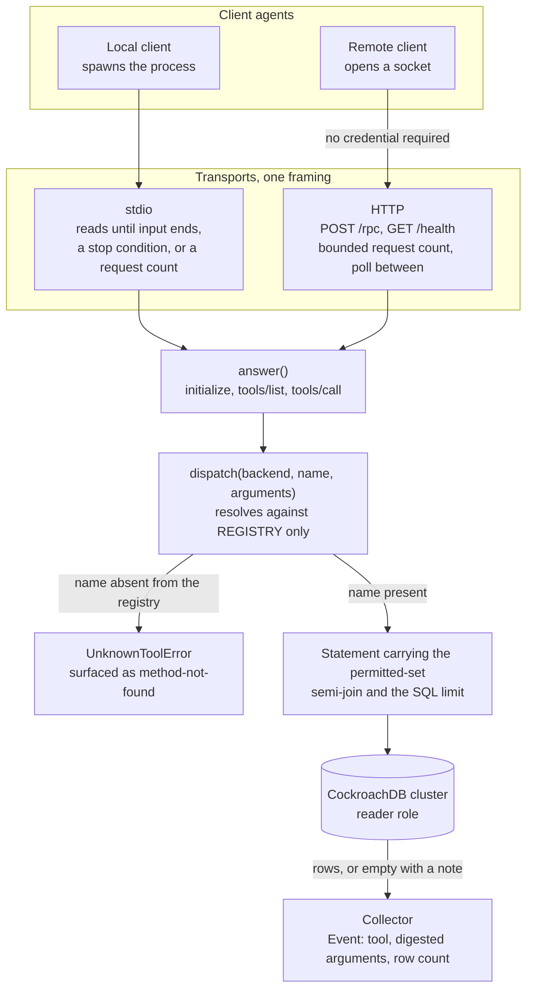

# The Molt MCP server

Four read-only tools, two transports, and one decision that shapes everything
else: **tenancy is resolved once at startup and is not an argument.** A client
agent calls a tool by name with a handful of scalars; it cannot name a `Client`
set, cannot name a Session, and cannot ask for more rows than the server was
configured to give. That is not enforced by a check in a handler — it is enforced
by the absence of anywhere to put the request.

One thing on this surface is genuinely open, and it belongs before anything else
because it changes how the rest reads: **the HTTP transport authenticates nobody.**
See [The HTTP transport is unauthenticated](#the-http-transport-is-unauthenticated).

## The four tools

`REGISTRY` in `src/molt/mcpserver/tools.py` is a module-level tuple of four entries,
built once at import. Dispatch resolves a requested name against that tuple and
against nothing else, so a mutation tool is not refused by a check that could be
edited away: it has no entry to be reached through.

| Tool | Required argument | Optional | Result row | Fields |
|---|---|---|---|---|
| `molt.recall` | `query_text` (text) | `limit` (count) | `recalled` | `artifact_id`, `artifact_kind`, `distance`, `session_id`, `machine_id`, `occurred_at`, `outcome`, `kind`, `excerpt`, `confidence` |
| `molt.lineage_ancestors` | `artifact_ids` (identifier list) | `limit` | `lineage_node` | `artifact_id`, `artifact_kind` |
| `molt.lineage_descendants` | `artifact_ids` (identifier list) | `limit` | `lineage_node` | `artifact_id` |
| `molt.residue_candidates` | `run_id` (identifier) | `limit` | `residue_candidate` | `artifact_id`, `artifact_kind`, `query_artifact_id`, `cosine_distance`, `band`, `included`, `decision_reason` |

Four argument shapes exist in `ArgumentKind`: text, identifier, identifier list,
and count. None of them is a client set and none can carry one. An extra key naming
one is a key nothing reads — the handler reads only the arguments its own schema
declares, and `_digested` records the presence of every supplied key, declared or
not, as a truncated digest of its value.

`molt.recall` hands the Recall_Engine the server's permitted set and *no* Session
identifier. Both halves matter: a caller-named Session would have added its own
`Client` to the permitted union, which is precisely the widening a tool argument
must not be able to do.

`molt.residue_candidates` reaches the Residue_Detector's read path through
`residue_report`, the read-only exposure of the same walk the erasure sweep uses, so
a band reported here and a band recorded there cannot come to mean different
things. It records nothing and adjudicates nothing.

## The read-only posture

Read-only holds twice over, and the two guarantees are independent.

*It is a privilege fact.* `McpServer.from_configuration` refuses a store
authenticated as anything but a reader role before it builds anything, so a
statement that tried to write would be refused by the cluster's own privilege check
(Requirement 40.5).

*It is a structural fact.* `ToolEffect` declares one member, `READ_ONLY`. There is
no effect value a mutating entry could carry, so a mutation tool cannot be described
in the registry, let alone dispatched (Requirement 40.6).

Recording an invocation needs no write privilege either. The Event naming the tool,
the digested arguments, and the returned row count is handed to the Collector
through the capture ingress rather than appended by this server, so it travels the
signed path and obeys the capture redaction (Requirement 40.9). Recording cannot
fail an invocation: a sink that would not accept the batch is logged and the answer
the caller already holds stands.

## The permitted Client set comes from configuration

`MOLT_MCP_PERMITTED_CLIENTS` carries the slugs. One statement at construction turns
them into identifiers, ordered by slug, with the slugs travelling as a single bound
array so a slug holding a quote character is data (Requirement 40.7). A slug naming
no `Client` resolves to nothing rather than to an error, because an operator's list
may name a tenant not yet placed and a server that refused to start over that is a
server an absent tenant can take down. Construction refuses a server configured
with no permitted client at all.

The filter is applied **inside SQL**, as a semi-join over unsuperseded
Attribution_Versions (Requirement 40.8). The recall tool reaches that filter by
calling the engine; the two lineage tools carry the same term in their own
statements, because a closure filtered after it is returned is a closure that
crossed the wire holding rows the caller may not see. The term is not composed into
statement text — the attribution layer's own current-claim predicate is checked
into each closure at import, and `_validate_statements` raises at import time if a
closure's admission has drifted. That check runs at import rather than in a suite,
because a drifted statement would otherwise stay runnable on a machine nobody had
run the suite on.

## The result bound

`MOLT_MCP_MAX_RESULTS` defaults to **50** (Requirement 40.10). The bound is a SQL
limit, not a trim: every tool passes it into the statement that produces its rows,
so nothing is discarded after the cluster answered. A caller asking for more than
the maximum is answered at the maximum rather than refused, and a caller asking for
a value that is not a usable count is answered at the maximum as well.

`molt.residue_candidates` has two statement bounds rather than one — the
query-Artifact limit and the neighbour bound — and their *product* is what a pass
can report. So the neighbour bound is divided down by the query limit until the
product fits the configured maximum, with both halves still applied by the cluster.
That is what keeps the bound a limit rather than a trim on the one tool where the
naive reading would have been wrong.

## Both transports



`MOLT_MCP_TRANSPORT` defaults to `stdio`; `MOLT_MCP_BIND` names the host and port
the hosted transport listens on. Both transports carry the same JSON-RPC framing
and both reach the tools through `dispatch`, so the surface a client sees does not
depend on how it reached the server and neither transport can expose a tool the
other does not. The framing serves exactly three methods: `initialize`,
`tools/list`, `tools/call`.

Neither loop runs unbounded, which is what lets a caller drive either transport and
then stop it. The stdio loop reads until its input ends, until a caller-supplied
stop condition is met, or until a request count is reached; the HTTP loop serves a
bounded number of requests with a short poll between them.

A lost cluster costs a result, not a session. A tool that could not reach the
cluster answers an empty result carrying a note, and the framing returns that as a
*result* rather than as an error, so the session stays open and the next call is
attempted. A tool call is advisory, and a client that lost its transport has lost
more than one answer.

`GET /health` reports status, cluster reachability, the tool names, the permitted
client count, the transport, the maximum result count, and the authentication
posture. Every field is a count, a name, or a flag: no Artifact, no excerpt, and no
argument value appears, because health is the one route that answers without a
permitted set having been consulted. A draining instance reports `degraded` even
while the cluster is reachable, so a load balancer takes it out of rotation before
the transport stops answering rather than after.

## The HTTP transport is unauthenticated

This is an open gap, not a footnote. The configuration surface declares no
credential for the HTTP transport and the server invents none. The posture is a
code constant rather than an inference:

```python
HTTP_AUTHENTICATION_POSTURE = "unauthenticated; network isolation is the only control"
```

The health route reports that string, so an operator reads the posture instead of
guessing at it. **Exposing this transport to a reachable network would expose the
configured tenants' fleet memory to whoever reaches the socket.**

The risk is recorded as **accepted** in [threat-model.md](threat-model.md), under
threat 5 and again in the residue table, along with the grounds for accepting it and
the controls that compensate. The distinction to carry away from here: every one of
those controls bounds *what* a reacher could read, and none of them bounds *who* may
reach. Read the threat model row before binding this transport anywhere.

## Related documents

- [threat-model.md](threat-model.md) — threat 5, tenancy escape through a tool
  argument, and the accepted risk on this transport.
- [skills.md](skills.md) — the three shipped Agent_Skills, two of which call these
  tools through a client's own session.
- [memory-tiers.md](memory-tiers.md) — the tiers the four tools read from.
- [glossary.md](glossary.md) — `Molt_MCP_Server`, distinguished there from the
  `Managed_MCP_Server` an Auditor reaches and the `MCP_Proxy` that records traffic.

_Requirements: 30.5, 40.1–40.11._
