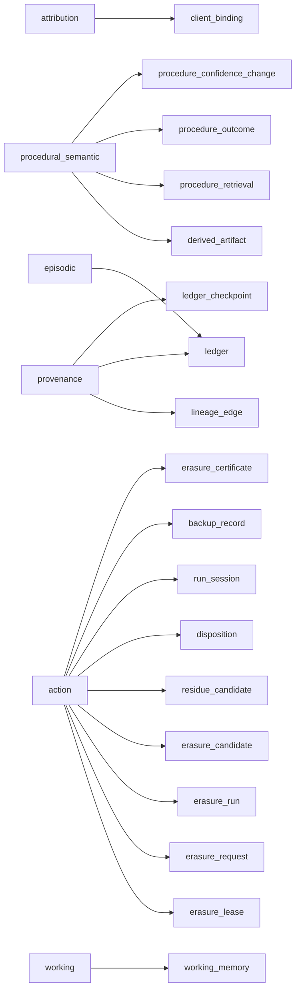

# Memory tiers

Every row Molt stores belongs to a named Memory_Tier. A tier is not a label applied
for convenience: it exists because its rows carry a different mutability contract
from the rows in every other tier, and because they lean on a different CockroachDB
capability to hold that contract.

Those two facts are what make the cluster the agent's memory rather than its
logfile. The episodic record cannot be edited because no role holds `UPDATE` on it.
A procedure's body can be rewritten because a column-scoped guard says which columns
a revision may touch. A scratch value disappears because the cluster sweeps it,
rather than because something outside the cluster remembered to.

Six tiers: `episodic`, `attribution`, `procedural_semantic`, `provenance`, `action`,
and `working`.

## One taxonomy, three renderings

The taxonomy is encoded in exactly one place, `src/molt/models/tiers.py`, as a
read-only mapping over frozen specifications in declared order. Three things read
it:

- the design document's tier table, which is prose about the same mapping;
- the Web_Console Memory_Tier view at `GET /tiers`, which renders the four
  descriptive columns beside a live row count;
- this document, whose matrix is emitted by `scripts/generate_tier_doc.py`.

Nothing in the list above holds its own copy of the taxonomy. That matters more
than it sounds: a tier table kept by hand goes stale silently, and the failure
mode is a reader trusting a mutability contract the schema stopped honouring
several migrations ago.

Every table each tier holds, with its key columns, is drawn in
[`assets/molt-data-model.svg`](../assets/molt-data-model.svg). The attribution tier's
succession of Attribution_Versions, which is the least obvious of the six, is drawn on a
validity timeline in
[`assets/molt-attribution-timeline.svg`](../assets/molt-attribution-timeline.svg).

## The tier matrix

<!-- generated:tier-matrix begin -->

*The matrix and the tier diagram below are emitted from `src/molt/models/tiers.py` by `scripts/generate_tier_doc.py`. Change the mapping, not this region.*

| Memory_Tier | Tables held | Mutability | CockroachDB capability relied on |
| --- | --- | --- | --- |
| `episodic` | `ledger` | Append-only. No role holds UPDATE; rows leave only by an authorised erasure or by Row-Level TTL. | SERIALIZABLE isolation, so sequence assignment and digest computation happen inside the inserting statement; TIMESTAMPTZ and JSONB native types. |
| `attribution` | `client_binding` (held as an Attribution_Version history) | Append-only with closure. Detection method, confidence, Artifact, and Client are immutable on a stored version; only the validity end and the superseding reference are ever written, and both exactly once. | SERIALIZABLE isolation, so closing the old version and inserting the new one is one atomic supersession; partial and covering indexes serving the as-of query inside its one-second bound. |
| `procedural_semantic` | `derived_artifact`, `procedure_retrieval`, `procedure_outcome`, `procedure_confidence_change` | Revisable. Bodies are surgically rewritten and Procedure_Confidence moves with recorded outcomes; every change is accompanied by an audited change record. | Distributed vector index over the VECTOR(1024) column for semantic recall; column-scoped UPDATE privilege confining what a revision may touch. |
| `provenance` | `lineage_edge`, `ledger`, `ledger_checkpoint` (of the ledger table this tier holds the Hash_Chain columns only) | Immutable. Edges are inserted and deleted, never edited; chain columns are never rewritten; checkpoints admit no UPDATE and no DELETE from any role. | Recursive common table expressions for lineage closure; sha256 evaluated inside the writing statement; referential actions refusing deletions that would remove audit history. |
| `action` | `erasure_lease`, `erasure_request`, `erasure_run`, `erasure_candidate`, `residue_candidate`, `disposition`, `run_session`, `backup_record`, `erasure_certificate` | Write-once evidence, with one current lease per Client. Dispositions and certificates are inserted and never rewritten; the lease row is the only mutable member and only its expiry, owner, and generation move. | SERIALIZABLE isolation for monotonic Fencing_Generation assignment; a partial uniqueness constraint admitting one current lease per Client; ON DELETE RESTRICT protecting the evidence chain. |
| `working` | `working_memory` | Disposable. Rows are overwritten freely and physically deleted on expiry; nothing depends on a working row surviving. | Row-Level TTL with a 3600 second default interval, so expiry is enforced by the cluster rather than by a scheduled process outside it. |

<!-- generated:tier-matrix end -->

## How the matrix stays true

`scripts/generate_tier_doc.py` reads the mapping module and replaces the region
between the two marker comments above. Everything outside those markers — every
paragraph of this document — is untouched by a write, which is what lets the
document carry reasoning the mapping has no place for while still holding a
matrix nobody edits.

The script has two modes and the second is the one that makes the no-drift claim
worth anything:

| Mode | Invocation | Effect | Exit status |
| --- | --- | --- | --- |
| write | `PYTHONPATH=src python3.12 scripts/generate_tier_doc.py` | splices the current region into the document, reporting whether the bytes moved | 0 written or already current, 2 document missing or markers unusable |
| verify | `PYTHONPATH=src python3.12 scripts/generate_tier_doc.py --check` | splices into a copy, compares, writes nothing | 0 current, 1 stale, 2 document missing or markers unusable |

A generator with no verify mode documents an intention. A generator whose verify
mode a reviewer can run turns "this table cannot drift from the module" into a
statement someone can falsify in one command, which is the difference between a
guarantee and a note. The script also refuses a document carrying a duplicated
begin marker or markers in the wrong order, because a malformed document that
spliced cleanly into the wrong place would report itself current while showing a
reader the wrong matrix.

The invocation carries the source directory on the import path because the script
imports the mapping rather than parsing it. Reading the mapping as data — the same
objects the console renders from — is what makes the matrix and the view the same
statement; a generator that scraped the module's text could agree with a mapping
the interpreter never loaded.

## The ledger under two tiers

`ledger` is the one table the mapping names twice, under `episodic` and under
`provenance`, and the mapping qualifies the second appearance: of the ledger
table the provenance tier holds the Hash_Chain columns only. The two entries
therefore classify different columns of one table rather than the same rows
twice.

The split is not bookkeeping. An Event's payload and its chain columns carry
different contracts and rest on different capabilities:

- The payload is episodic content. It is appended, it may be redacted by a
  governed erasure, and it may expire under the ledger's own daily Row-Level TTL
  sweep. What it needs from the cluster is a sequence number and a digest computed
  inside the inserting statement, which is a SERIALIZABLE isolation property.
- The chain columns are provenance evidence about that payload. They are never
  rewritten by anything, and what they need from the cluster is `sha256` evaluated
  in the writing statement and referential actions that refuse deletions removing
  audit history. Their value comes entirely from being uneditable, so treating
  them as episodic content would put them under a contract that permits revision
  in principle.

The `attribution` tier carries the other qualification in the mapping:
`client_binding` is held as an Attribution_Version history rather than as one
current row per Client, which is why its contract reads "append-only with
closure" rather than "revisable".

## The working tier

The `working` tier is the only tier whose rows nothing is permitted to depend on,
and it is the reason the taxonomy needs a mutability column at all. Every other
tier exists because something has to stay readable later. This one exists because
something has to be forgettable: a plan under revision, a partially assembled
answer, a cursor into a file the agent is walking. Holding that in a durable tier
would make each value a governed artifact with a lineage, an attribution, and an
erasure obligation, which is a large amount of ceremony for a value whose whole
nature is to be superseded shortly.

**Expiry is the cluster's work, not a scheduler's.** Migration 011 configures
Row-Level TTL on `working_memory` with `ttl_expiration_expression` naming the
row's own `expires_at` column, `ttl_job_cron` set to the hourly schedule, and
`ttl_delete_batch_size` set to 500. The column defaults to the configured
working-tier interval of 3600 seconds. Nothing outside the cluster deletes an
expired working row, and no process outside the cluster needs to be running,
reachable, or correct for expiry to happen. A writer wanting a shorter-lived
value sets the column and needs no schema change.

**Why the sweep schedule differs from the content tables.** The schema carries
three TTL postures:

| Tables | Sweep schedule | Why |
| --- | --- | --- |
| `ledger`, `derived_artifact`, `embedding` | fixed daily schedule | a comfortable tolerance for a record an auditor reads weeks later |
| `ledger_checkpoint`, `checkpoint_session` | none configured | a checkpoint's value is that it stays checkable, so nothing expires it |
| `working_memory` | fixed hourly schedule | an interval of 3600 seconds swept on the same order of magnitude, so disposability is observable rather than asserted |

Applying the daily schedule to the working tier would leave a row whose stated
lifetime is 3600 seconds resident for up to a day past its expiry, and the tier's
disposability would then be a claim in a document rather than a property of the
cluster.

**The configuration is applied on its own and read back.** Configuring row-level
expiry on a table created earlier in the same transaction is not refused by this
cluster: it reports success, the transaction commits, and the storage parameters
are simply absent from the committed descriptor afterwards. A reader checking only
for an error would conclude the tier expires its rows while the cluster in fact
sweeps nothing — the one failure this tier cannot tolerate quietly. The
configuration therefore stands as a statement of its own after the table body has
committed, and the Retention_Manager reads the stored parameters back and confirms
they are present.

**Nothing can come to depend on a working row.** The `artifact_ref` view spans
exactly three artifact kinds — an Event, a Session, and a derived artifact — and a
statement inserting a Lineage_Edge proves its parent exists by joining that view.
`working_memory` is deliberately absent from it, so a working row cannot be named
as a lineage parent, cannot be swept into an erasure candidate set built from the
same artifact kinds, and cannot become the subject of an attribution binding. The
exclusion is structural rather than conventional: the join that would have to
succeed returns no row.

**Erasure accounts for the tier in one number.** An Erasure_Run begins by deleting
every `working_memory` row carrying the Client identifier as one set-based
statement and records the deleted row count as a single aggregate on the run row,
rather than emitting a Disposition per row. A Disposition is evidence about
content that mattered, and a working row is by construction content that did not.
For the same reason the tier's reference to `session` cascades rather than
restricts; see [protection.md](protection.md).

## Observing the taxonomy at runtime

The taxonomy is observable against the live cluster rather than only documented.
The Web_Console serves the Memory_Tier view at `GET /tiers`, rendering one row per
tier with the tables that tier holds, that tier's mutability, the capability it
relies on, and that tier's current row count. The handler reads its four
descriptive columns from the same mapping module this document's matrix is emitted
from, so the page and the matrix cannot disagree.

What makes the route evidence rather than decoration:

- **Counts are read at request time.** One `COUNT(*)` per tier inside one
  read-only transaction, neither cached nor precomputed. The claim the view makes
  is about the cluster as it is now, and a stale count would make the page
  decorative.
- **The working tier shows two extra figures.** The count of resident rows whose
  expiry precedes the request, and the interval remaining until the next TTL job
  run, computed from the `ttl_job_cron` storage parameter read back from the
  table's own configuration rather than from a hardcoded value or a configuration
  key. That is what turns "the cluster enforces expiry" into something a viewer
  can watch happen.
- **The route opens no write transaction.** The counts are taken inside
  `BEGIN TRANSACTION READ ONLY`, so a statement that wrote would be refused by the
  cluster rather than merely absent from the module. The route also reads through
  `Console.read_only_store()`, which is the reader connection — holding `SELECT`
  and nothing else — wherever the deployment configures one, and the primary
  connection where it configures none. The delivered console configures one. Either
  way the read-only transaction stands, so the view is available unchanged in
  read-only demonstration mode.

## What the mapping does not name

The matrix lists the tables the mapping assigns and no others. Several tables the
schema defines are named by no tier — the Client and Session registries, the
policy, match, and approval tables, the watcher watermark, the capability record,
the `embedding` table, and the run-window `audit_log_snapshot` table among them.

That matters when reading [protection.md](protection.md), where
`audit_log_snapshot` and `embedding` appear in the referential-action groups
although no tier names either of them. The protection groups are drawn from the
schema's foreign keys and the tier matrix from the mapping, so the two documents
cover overlapping but not identical table sets.

## Related documents

- [protection.md](protection.md) — which tables refuse deletion, which cascade,
  and the privilege half of the same protection.
- [threat-model.md](threat-model.md) — threat 2, which is what the episodic
  tier's append-only contract is defending against, and what it does not defend
  against.
- [glossary.md](glossary.md) — the Memory_Tier, Working_Memory, and
  Attribution_Version definitions this document uses.
