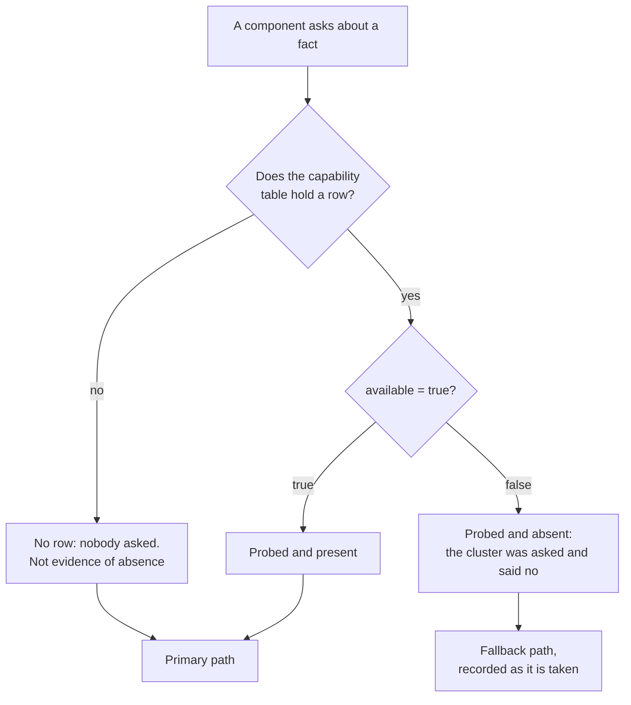

# Platform facts

Every degradation path in this design turns on a platform fact somebody measured.
None of them turns on a cluster version string. That distinction is the whole design
of `src/molt/store/capability.py`: a version string says what a build is *called*, a
probe says what this cluster, on this tier, under this connection, actually *did*
when asked. The two come apart exactly where it matters — a tier carrying the same
version as another may still reject the statement the design wants, and a statement
that succeeded is proof no name can give.

One consequence is easy to miss and decides several branches below.



`available(name)` and `unavailable(name)` are not each other's negation, and callers
use the second when deciding whether to degrade. An unprobed fact leaves the primary
path in place, because the delivered tier carries every one of these capabilities and
degrading on the strength of a missing row would be silent. The one exception is the
collection horizon, where the historical read module treats absent and unavailable
alike — there, a missing answer would otherwise be replaced by an assumed interval.

The record is read once per process and held on the store instance, not in module
state. A nearest-neighbour query on the agent's critical path must not pay a read to
discover which statement to send, and the reading roles that run those queries are
not all granted `SELECT` on the capability table.

The vector index fact below is the one with a visual consequence: the thresholds it
serves, and the bands they divide the candidate set into, are drawn in
[`assets/molt-residue-bands.svg`](../assets/molt-residue-bands.svg).

## The matrix

| Fact | How it is probed | What depends on it |
|---|---|---|
| **Distributed vector index** — created on the delivered cluster tier, reported by the cluster with the `vector_l2_ops` operator class | `CREATE VECTOR INDEX` in migration 003, marked permitted-to-fail, then `SHOW CREATE TABLE embedding` is read back and matched against `embedding_vec_idx` over the `vec` column; the row records the operator class the cluster reported, not the one the code asked for | Recall and residue detection run index-served. Because the reported class orders by squared distance while every threshold here is cosine, unit normalisation at write time is load-bearing rather than defensive. The **exact-scan path exists only as a fallback** for tiers on which the index cannot be created, taken only when the record reports the fact probed and absent, and emitting `store.vector_index_unavailable` as it is taken |
| **Sinkless changefeeds**, with the rangefeed cluster setting enabled | `EXPERIMENTAL CHANGEFEED FOR ledger, derived_artifact WITH updated, resolved` is opened at Policy_Watcher start on a dedicated streaming connection; the Provisioner separately reads the rangefeed cluster setting and records it in the same capability record | Changefeed consumption is the primary mechanism and the watcher's expected mode. **Polling is retained only as a fallback** for tiers that reject the statement. A rejection is recorded three ways — `changefeed` unavailable in the record, `watcher.degraded_to_polling` emitted, and `polling` persisted as the mode — so the degradation is visible to a probe, to a metric, and to the next process to start |
| **Garbage-collection horizon: 4500 seconds**, measured | `SHOW ZONE CONFIGURATION FROM TABLE ledger` is read and `gc.ttlseconds` parsed with an ASCII-only digit class anchored so a fractional value reads as no reading at all rather than being truncated; a non-positive interval is recorded as unavailable with no detail | 4500 seconds is far shorter than typical defaults and shorter than the evidence lifetime of an Erasure_Certificate, so the **derived count mechanism is primary** for every certificate. The historical read is opportunistic corroboration, performed only when both `t_before` and `t_after` fall inside the horizon at assembly time, with agreement or disagreement recorded beside the derived counts |
| **Managed_Backups: a fixed daily schedule, a 30-day retention interval Molt leaves unaltered**; the control plane offers listing and configuration and no on-demand creation | The Provisioner interrogates the control plane through the `ccloud` CLI for an on-demand backup creation operation and records `on_demand_backup` absent; the self-managed path is probed separately by asking the cluster to *plan* `BACKUP INTO` against the operator-owned target | **The self-managed path is primary.** `BACKUP INTO` an operator-owned target is issued before the first mutation of a run; referencing the most recent Managed_Backup by identifier and instant is the fallback, and the recorded backup path value distinguishes taken from referenced |
| **Object Lock: `COMPLIANCE` is the production posture; the delivered configuration uses `GOVERNANCE` with a short interval** | Declared in `infra/templates/storage.yaml` at bucket creation, because Object Lock can be enabled on no existing bucket; versioning is its prerequisite and is declared with it. The delivered default retention interval is one day, at the template's own minimum | A `COMPLIANCE` retention interval can be overridden by no principal, so it would leave teardown permanently blocked. `GOVERNANCE` lets a release-permitted principal lift the retention, which is what makes teardown need no manual step. The trade is stated rather than hidden: the delivered posture is weaker than production by exactly that release permission |
| **A Ledger_Checkpoint is tamper *evidence*, not tamper *proofing*** | Not a probe but a design fact, and stated because overstating it is the expensive error. The checkpoint commits to the terminal chain digest of every covered Session, takes a root digest over the canonical bytes of that set ordered by Session identifier, and has that digest signed | Nothing prevents a rewrite; a rewrite becomes *detectable*. Coverage extends past a principal holding database administrator privilege on the cluster for one reason: **the signing key lives outside the cluster**, so a principal who can rewrite every row still cannot produce the signature that would make the rewrite check out. Verification recomputes the root from live rows and checks the signature against a retrieved public half rather than asking the key service, so it survives loss of permission to call it |
| **The per-Session chain reaches a certificate only for touched Sessions; checkpoints cover every Session in the window** | Structural: `run_session` records the terminal chain digest per Session an Erasure_Run touched, while a checkpoint covers every Session holding at least one Event inside its window | This is the gap checkpoints exist to close. A consistently rewritten Session that no certificate mentions is reachable by no certificate's chain evidence and is covered by the checkpoint's root digest |
| **The bearer token resists no replay; the Ingress_Signature bounds the replayable window** | The signature is an HMAC-SHA256 digest over the presented timestamp concatenated with the exact body bytes, keyed from the parameter store, required on both ingest routes in addition to the bearer token, compared in constant time | Without the signature every replay writes Ledger rows indistinguishable from the originals, carrying valid digests and real chain positions. With it, the replayable window is **the configured maximum request age, default 300 seconds** — bounded, not closed. A per-request nonce store would close it and would put a write-contended row in front of every capture |
| **The Sensitivity_Analyzer calibrates thresholds and replays no recorded adjudication decision** | Structural: it evaluates the residue candidate set across a Threshold_Grid, reports per pair the candidate count and the counts each pair would auto-include and refer, and invokes the configured text provider for no candidate | It answers *what would this threshold pair have reached*, not *what did the model decide*. It performs no mutation of memory content, so an operator may run it against a live corpus while choosing thresholds. Pairs whose auto-inclusion threshold exceeds their review threshold are reported inapplicable rather than evaluated |

The referential and privilege halves of the checkpoint and Ledger protections are in
[protection.md](protection.md); the threats each of the last four rows belongs to are
in [threat-model.md](threat-model.md).

## Measured recall latency on the delivered configuration

Recall is the one read in this system that sits on a person's critical path: an
agent asks memory what happened last time *before* it acts, so a query that does not
return promptly is a query an operator switches off. The figures below come from
`tests/perf/test_recall_latency.py`, which is the only place a corpus of the stated
size is actually built.

**Corpus.** Exactly 100000 embeddings. Two thousand are fully formed Artifacts — a
`derived_artifact` row, the `lineage_edge` reaching its Session, a current
Attribution_Version binding it to a permitted `Client`, and a vector on a fine
distance ladder near the query direction. The remaining 98000 are bulk vectors over
2000 distinct directions, far from that direction, bound to no `Client` the caller
may see, so the tenancy admission has something to exclude among the bulk as well as
among the attributed rows.

| Form | p95 | Median | Slowest | Sample |
|---|---|---|---|---|
| Index-served | **0.5629s** | 0.2728s | 1.2951s | 50 queries, k=10, candidate pool 256 |
| Exact-scan fallback | 0.8100s | 0.3270s | 1.5428s | same |

The stated bound is 2 seconds, so the index-served form passes with roughly 3.5x
headroom. Only that form is asserted. The fallback figure is measured and reported
because a slower exact scan on a tier without the index is the documented trade, not
a regression.

**The plan was read back rather than assumed.** An index-served measurement means
nothing if the optimiser quietly chose a scan, and on this cluster it will choose a
scan until table statistics exist. So the corpus is analysed before anything is
timed, and the plan for the store's own recall statement — prefixed, not rebuilt —
was read and confirmed to name the index:

```text
vector search table: embedding@embedding_vec_idx target count: 256
```

Two caveats bound how far these numbers can be carried. Both are limitations of the
figure rather than properties of the system, and neither is a hedge.

**The bulk vectors repeat 49 times per direction, so the figure is a floor rather
than a worst case.** A 1024-dimension vector renders to roughly 20KB of text, so
sending a hundred thousand distinct ones would move gigabytes across the wire and the
module would spend its time on placement instead of measurement. Each bulk direction
is therefore inserted many times by one statement the cluster expands. Duplicate
vectors concentrate in the index rather than spreading through it, so a fully diverse
corpus of the same size would search a differently shaped index. The reported figure
is a **floor** for that corpus, not a worst case for it.

**The exact-scan figure scales with what a caller may see, not with the corpus.**
That form narrows to attributed Artifacts *before* it ranks them, bounded by the
candidate pool with no ordering on that bound. Two things follow. Its cost tracks the
size of the permitted slice rather than the size of the table, so this figure would
not rise the way the index-served one would as the corpus grew. And with more
attributed Artifacts than the pool admits, the subset it considers is an arbitrary
one, so **its page is not required to equal the index-served page** and no agreement
between the two is asserted. The two forms answer the same question only within that
cap.

The corpus was loaded with the vector index dropped and the index built once
afterwards. Maintaining the index across a hundred thousand individual inserts is
what makes a corpus of this size unplaceable rather than merely slow: the index
splits and rebalances its partitions as it fills, so insert cost rises with the rows
already present. This weakens nothing above, because what is measured is query
latency against a fully built index and never insert latency, and the index the
queries ran against comes from the same statement migration 003 uses.

## Related documents

- [providers.md](providers.md) — the fixed 1024-dimension width these vectors are
  stored at and the startup gate that enforces it.
- [memory-tiers.md](memory-tiers.md) — which tier each of these facts serves and the
  capability that tier relies on.
- [protection.md](protection.md) — the referential actions and privilege revocations
  that protect checkpoints and the Ledger.
- [threat-model.md](threat-model.md) — Ledger tampering, ingress replay, and the
  residues each leaves standing.
- [glossary.md](glossary.md) — `Ledger_Checkpoint`, `Managed_Backup`,
  `Self_Managed_Backup`, `Ingress_Signature`, `Threshold_Grid`.

_Requirements: 10.3, 10.10, 10.11, 10.12, 13.5, 19.8, 20.2, 20.7, 21.16, 23.14,
23.15, 27.11, 45.13, 45.14, 45.15, 47.6, 47.14, 48.5, 48.6, 48.12._
