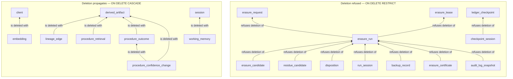

# Structural protection of the audit record

Deleting a row of memory content in Molt is a governed operation: it has a
request, a fenced lease, a candidate set, a Disposition per artifact, and a signed
certificate behind it. Deleting a row of evidence *about* that operation is not
something any principal should be able to do by accident.

Cascading deletes were exactly how it could have happened. The foreign keys the
early migrations declared inline carried `ON DELETE CASCADE` or the platform's
default, so removing one `erasure_run` row would have silently removed the whole
record of what that run touched. Migration 013 re-creates every reference to an
Erasure_Request, an Erasure_Run, an Erasure_Lease, or a Ledger_Checkpoint with
`ON DELETE RESTRICT`, which turns that accident into a refusal naming the
referencing table and the referencing row count.

The division is between **evidence** and **recomputable derivation**, and it is
drawn per table rather than uniformly, because the two groups fail in opposite
directions. Losing an evidence row destroys the only record that something
happened. Keeping a stale derived row after its subject is gone destroys
correctness, and rebuilding it costs a computation.

## The referential-action groups



Every arrow is a foreign key pointing from the referencing table to the table it
references. In the upper group the arrow is a veto; in the lower group it is a
conduit.

### Restricted: the row is the only record of something that happened

| Referencing table | Column | References | Constraint | Declared in |
| --- | --- | --- | --- | --- |
| `erasure_run` | `request_id` | `erasure_request (id)` | `erasure_run_request_fk` | 013 |
| `erasure_run` | `lease_id` | `erasure_lease (id)` | `erasure_run_lease_fk` | 013 |
| `erasure_candidate` | `run_id` | `erasure_run (id)` | `erasure_candidate_run_fk` | 013 |
| `residue_candidate` | `run_id` | `erasure_run (id)` | `residue_candidate_run_fk` | 013 |
| `disposition` | `run_id` | `erasure_run (id)` | `disposition_run_fk` | 013 |
| `run_session` | `run_id` | `erasure_run (id)` | `run_session_run_fk` | 013 |
| `backup_record` | `run_id` | `erasure_run (id)` | `backup_record_run_fk` | 013 |
| `erasure_certificate` | `run_id` | `erasure_run (id)` | `erasure_certificate_run_fk` | 013 |
| `audit_log_snapshot` | `run_id` | `erasure_run (id)` | `audit_log_snapshot_run_fk` | 013 |
| `checkpoint_session` | `checkpoint_id` | `ledger_checkpoint (id)` | `checkpoint_session_checkpoint_fk` | 010 inline, re-created in 013 |

Four tables are therefore protected as referenced parents — `erasure_request`,
`erasure_lease`, `erasure_run`, and `ledger_checkpoint` — and ten references are
what protect them. The reason each referencing row is in this group:

- **`erasure_run` → `erasure_request`.** A run is the execution of a request, and
  a request whose runs still exist is history rather than a draft. Removing the
  request would leave runs that executed nothing.
- **`erasure_run` → `erasure_lease`.** The lease record is the proof that the
  finalising worker held ownership at the Fencing_Generation the certificate
  states. Without it the certificate asserts an ownership nobody can check.
- **`erasure_candidate` → `erasure_run`.** The candidate set is the record of what
  the sweep selected, and the certificate's completeness claim rests on it. A
  certificate claiming completeness over a candidate set that no longer exists
  claims nothing.
- **`residue_candidate` → `erasure_run`.** Distances, bands, and adjudication
  reasoning are the only record of why a borderline artifact was included or left
  alone. That reasoning is not recoverable after the fact, because the embeddings
  it compared may themselves have been removed by the erasure it justified.
- **`disposition` → `erasure_run`.** The Dispositions are the certificate's
  substance. Losing them makes the certificate unverifiable.
- **`run_session` → `erasure_run`.** The terminal Hash_Chain digest per touched
  Session is precisely what an independent verifier re-derives.
- **`backup_record` → `erasure_run`.** The backup evidence answers whether an
  erasure was reversible at the moment it ran, which is a question no later
  reconstruction can answer.
- **`erasure_certificate` → `erasure_run`.** The signed document must not be
  orphaned, and must not be removable by removing the run it describes.
- **`audit_log_snapshot` → `erasure_run`.** Cluster audit records covering the run
  window are third-party corroboration of what the run did, so they are protected
  like the run's own evidence rather than more weakly.
- **`checkpoint_session` → `ledger_checkpoint`.** Per-Session digests are what
  localise a checkpoint disagreement, so a checkpoint cannot be reduced to its
  root digest by a delete. This reference already restricted where it was declared
  inline; migration 013 re-creates it under a name of its own so that every
  protected reference is named by one convention and reads as one set.

### Cascading: the row is a function of something that survives

| Referencing table | Column | References | Constraint | Declared in |
| --- | --- | --- | --- | --- |
| `embedding` | `client_id` | `client (id)` | `embedding_client_fk` | 013, replacing the inline reference from 003 |
| `lineage_edge` | `child_id` | `derived_artifact (id)` | `lineage_edge_child_fk` | 002 inline, re-created in 013 |
| `working_memory` | `session_id` | `session (id)` | `working_memory_session_fk` | 011 inline, re-created in 013 |
| `procedure_retrieval` | `procedure_id` | `derived_artifact (id)` | platform-generated | 012 inline |
| `procedure_outcome` | `procedure_id` | `derived_artifact (id)` | platform-generated | 012 inline |
| `procedure_confidence_change` | `procedure_id` | `derived_artifact (id)` | platform-generated | 012 inline |
| `procedure_confidence_change` | `outcome_id` | `procedure_outcome (id)` | platform-generated | 012 inline |

Why each cascades:

- **`embedding`.** A vector is a recomputable function of an artifact's text and
  the configured model. Rebuilding one costs one provider call; keeping a stale one
  costs correctness, so a tenant's removal takes its vectors with it.
- **`lineage_edge`.** An edge whose child is gone describes nothing. The derivation
  it recorded is carried on the Disposition and in the certificate's lineage
  subgraph, so the evidence survives the edge. This is the case that shows the
  division is about evidence rather than about importance: lineage matters
  enormously, and the edge still cascades, because the edge is not where the
  lineage is preserved.
- **`working_memory`.** Scratch state for a Session that no longer exists is
  disposable by construction, and the working tier's whole purpose is that nothing
  depends on a working row surviving. See [memory-tiers.md](memory-tiers.md).
- **The three procedural usage tables.** A retrieval record, an outcome record, and
  a confidence movement are usage history *about* a procedure, so they go with the
  procedure. The contrast with a Disposition is the whole distinction in one line:
  a Disposition is evidence about a governed operation and must outlive its
  subject, while these are history about content and follow it. The movement row
  additionally cascades from the outcome that caused it, so a value in the history
  can always be traced back to the Session whose ending produced it or else is
  gone with it.

### Neither declared: no explicit action, or no reference at all

Two smaller groups complete the picture, and neither is an oversight.

References declared with no explicit action — the Session and Client references on
`ledger`, the Client references on `session`, `derived_artifact`, `client_binding`,
`erasure_lease`, `policy_rule`, and `working_memory`, and the rule references on
`policy_match` and `approval_queue` — carry the platform's default, which also
refuses a delete that would orphan a row. Migration 013 restates only those
references where the refusal is itself an audit guarantee, so the protected set is
readable in one file under one naming convention rather than inferred from the
absence of a clause.

Three references the first migration generation declared are no longer enforced at
all, which is why the lineage self-references on `session` and `ledger` are absent
from that list. Their columns still hold their values and the indexes over them
still stand; what the cluster no longer does is refuse a delete that would leave one
dangling. The subsection after next says why each had to give way.

Four columns deliberately carry no reference at all:

| Column | Why no reference |
| --- | --- |
| `disposition.artifact_id` | A Disposition is evidence about an artifact a hard delete removed, so it must outlive that artifact. A reference of any kind would either refuse the erasure the Disposition is evidence of or vanish along with it. |
| `checkpoint_session.session_id` | The same argument. A checkpoint must remain checkable after an authorised erasure has removed the Session it covered. |
| `client_binding.superseded_by` | A reason of ordering rather than of survival. A supersession is two ordered statements in one SERIALIZABLE transaction, the close first and the insert second, so the closed row briefly names a successor the next statement has not yet inserted. This cluster checks each foreign key per statement with no deferred checking available, and reversing the order leaves two current versions, which the partial unique index refuses. Migration 013 drops the constraint migration 008 added. |
| `erasure_lease.superseded_by` | The same ordering argument, with `lease_current_unique` playing the role of the partial unique index: inserting the successor before closing the incumbent would leave two unsuperseded leases for one tenant. Migration 013 drops the constraint migration 009 added. |

In all four cases the integrity of the value comes from the transaction, which
commits both statements or neither, rather than from a constraint.

The two supersessions this argument covers are drawn out: the lease case in
[`assets/molt-lease-states.svg`](../assets/molt-lease-states.svg), and the attribution
case in [`assets/molt-attribution-timeline.svg`](../assets/molt-attribution-timeline.svg).
Both figures also carry the absences on the right, so the reason a constraint is missing
sits beside the thing it would otherwise have guarded.

### Dropped: the reference stood between an authorised erasure and its own subject

Migration 017 drops three references the core migration declared. This is the same
argument as the `disposition.artifact_id` row above, reached from the other
direction: there the reference was never declared, here it was declared and had to
be removed once the erasure path was built against it.

| Referencing table | Column | Referenced | Constraint dropped | Why it had to give way |
| --- | --- | --- | --- | --- |
| `session` | `spawning_event_id` | `ledger (id)` | `session_spawning_event_fk` | A sub-agent Session names the Event that spawned it, and every Event names the Session it was recorded in. The Event may not go before the Session and the Session may not go before its own Events, so the pair is a cycle for deletion and one of the two has to give |
| `session` | `parent_session_id` | `session (id)` | `session_parent_session_id_fkey` | A tenant's Session tree is removed whole, and a batch boundary cuts across it wherever the candidate ordering puts the parent. Requiring a child to be removed alongside or before its parent is a requirement no batching can honour |
| `ledger` | `parent_event_id` | `ledger (id)` | `ledger_parent_event_id_fkey` | A result names the call it answers, and the call and its result belong to one Session and leave together, so the same batch-boundary argument applies unchanged |

What is dropped is the enforcement and not the column. Every dropped column keeps
the value it holds, the index over each of them stays, and the derivation graph is
carried independently in `lineage_edge`, which is where a reader follows provenance
from in any case. No lineage becomes unreadable; what goes is the cluster's refusal.

`ledger.session_id` is the fourth reference of that group and it stays enforced,
which is worth saying because it shows the line is drawn by cycle and not by
convenience. It forbids an orphan Event — an Event belonging to a Session that does
not exist records nothing a reader can use — and it sits in no cycle, because no
Session is ever required to outlive an Event through it. It is satisfiable by
ordering alone, and the disposition phase orders for it: the hard delete sorts its
decisions so that every Event is removed in an earlier batch than, or the same batch
as, any Session. So it costs nothing to keep. `ledger.client_id` stays for the
opposite reason: a tenant's Client row is what the erasure was requested for and
what its evidence is filed against, so it outlives the memory it owned and nothing
about a governed deletion asks this reference to give way.

One invariant the two Session references were carrying is not theirs to take with
them, and it moved rather than lapsing. A Session naming a parent no `session` row
holds, or a spawning Event no `ledger` row holds, is refused by the write path
itself: `src/molt/store/sessions.py` guards the inserting statement so that a named
row which cannot be found leaves the statement selecting nothing, and reports that
as a missing parent. The refusal is inside the inserting transaction, so it cannot
race a concurrent delete, and it is not a reference, so an authorised erasure is
free to remove either half of the pair.

## The privilege half of the same protection

Migration 014 revokes `DELETE` from the eraser role on nine tables:

```sql
REVOKE DELETE ON TABLE erasure_request, erasure_run, erasure_candidate,
    residue_candidate, disposition, run_session, backup_record, erasure_certificate,
    audit_log_snapshot FROM molt_eraser;
```

No grant in either migration generation ever conferred that privilege — migration
007 grants the eraser `SELECT, INSERT, UPDATE` on the evidence tables and stops
there — so the revocation removes a privilege that was never held. It is stated
all the same, because an absence nobody wrote down is an absence a later grant can
undo without anyone noticing.

Two further revocations belong to the same posture. Migration 014 revokes `UPDATE`
and `DELETE` on `ledger_checkpoint` and `checkpoint_session` from all four roles,
because a checkpoint any Molt principal could rewrite or drop would commit to
nothing and the coverage it extends beyond a cluster administrator would collapse
to what the Hash_Chain already gives itself. Migration 007 revokes `UPDATE` on
`ledger` from all four roles, which is the basis of the episodic tier's
append-only contract.

The contrast that makes the intent legible is what the eraser role *does* hold.
It holds `DELETE` on the content tables — `ledger`, `derived_artifact`,
`lineage_edge`, `client_binding`, `embedding`, and `working_memory` — and no
`UPDATE` on `ledger`. Erasure removes memory content and never the record of
having removed it.

### Why the two halves are complementary rather than redundant

It is tempting to read the revoked privilege as a belt beside the referential
braces. It is not: each half covers a case the other says nothing about.

| Case | Referential action | Privilege revocation |
| --- | --- | --- |
| Deleting an `erasure_run` row that a Disposition references | refuses the statement and names the referencing table and row count | also refuses, because the role holds no `DELETE` here |
| Deleting an `erasure_request` row no run references yet, or a fresh `erasure_run` with no candidates, dispositions, or certificate | permits it; a restricting reference constrains only rows that are actually referenced | refuses it; the role cannot delete from these tables at all |
| Deleting a `client` row while `embedding` rows cascade from it | performs the cascade on the role's behalf | says nothing; the role's privileges on `embedding` are not consulted for rows the cluster deletes by cascade |

The middle row is the gap the revocation closes. A restricting reference is a
statement about *edges*, and an unreferenced evidence row has no edges — a request
whose run has not started, a run whose sweep has not selected anything yet. Those
are exactly the rows an operator error would find first, and referential
protection alone would let them go.

The bottom row is the gap the referential action closes. A revoked privilege is a
statement about *statements the role issues*, and a cascade is work the cluster
performs on the role's behalf after the statement is authorised. Privilege
revocation alone therefore cannot stop evidence disappearing behind a permitted
delete of a parent row, which is precisely the accident migration 013 exists to
prevent.

## Related documents

- [memory-tiers.md](memory-tiers.md) — the Memory_Tier matrix, including the
  `action` tier whose contract these referential actions enforce and the `working`
  tier whose cascade is the deliberate opposite.
- [threat-model.md](threat-model.md) — threat 2, where these two halves are the
  layers that cover a principal holding write access to the cluster, and the limit
  of what they cover.
- [glossary.md](glossary.md) — the Disposition, Erasure_Certificate,
  Ledger_Checkpoint, and Erasure_Lease definitions this document uses.
