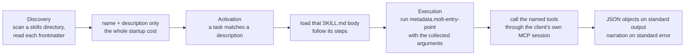

# Agent skills

Three operational procedures ship as loadable skills rather than as prose in a
runbook: verifying an erasure certificate, sweeping for a client's semantic
residue, and auditing retention per client (Requirements 39.1–39.4).
The reason is narrow. Each of these is a procedure a reviewer needs to *run*, often
on behalf of a party that does not trust the party being reviewed, and a procedure
described in prose is a procedure that drifts from the code it describes. Shipped as
skills, they are executed by whichever client the reviewer already uses, and they
import no Python from this project.

| Skill | Answers | Reads through | Calls server tools |
|---|---|---|---|
| `verify-certificate` | Did the erasure a certificate claims actually happen, and does any descendant of erased material survive | `cli:attest verify`, then the two lineage tools | `mcp:lineage_ancestors`, `mcp:lineage_descendants` |
| `residue-sweep` | What would an erasure for this client reach beyond the rows that name it outright, at these thresholds | `cli:mcp` spawning the read-only server | `mcp:residue_candidates` |
| `retention-audit` | Per client: the jurisdiction, the configured interval, what expires within the next seven days, and what has already expired | `cli:retention` | none |

`retention-audit` needs no server and no model credential, because the report is a
query. It is therefore the cheapest of the three to run and the one a compliance
reviewer will reach for most often.

## The format is the open one, unextended

Each skill is a directory holding a required `SKILL.md` — YAML frontmatter carrying
the declaration, a Markdown body carrying the instructions — plus the conventional
optional `scripts/` directory holding the executable the agent may run. That is the
[Agent Skills](https://agentskills.io) specification and nothing beyond it
(Requirement 39.7).

```text
skills/
  verify-certificate/  SKILL.md  scripts/verify_certificate.sh
  residue-sweep/       SKILL.md  scripts/residue_sweep.sh
  retention-audit/     SKILL.md  scripts/retention_audit.sh
```

No parallel manifest exists.

The frontmatter fields are the specification's own: `name`, `description`,
`license`, `compatibility`, `allowed-tools`, and `metadata`. Anything a reader might
expect in a bespoke manifest is declared under `metadata`, which the specification
defines as a map of string keys to string values for properties a client stores
beyond the defined set. The keys are prefixed `molt-` so they cannot collide with
another publisher's. The inputs, outputs, and behaviour that Requirement 39.5
obliges each skill to declare are `metadata.molt-inputs`,
`metadata.molt-outputs`, and `metadata.molt-behavior`; the read-only claim is
`metadata.molt-effect` and `metadata.molt-database-role`, and the operations it
rests on are `metadata.molt-operations`. The full key table is in
[`skills/README.md`](../skills/README.md) and is not restated here.

Two prerequisites are declared in each skill's `compatibility` field rather than
assumed: this project's command-line interface must be on `PATH`, and, for the two
skills that call server tools, `MOLT_MCP_PROTOCOL_VERSION` must name the transport
revision the client negotiates. That revision is a caller's input because a revision
pinned inside a shipped definition ages against the transport rather than with it.

## How a client loads them



Discovery reads frontmatter only; a body is not read until the skill is chosen, so
shipping three skills costs a client three short reads at startup. Point the client
at `skills/`, or copy a skill directory into wherever the client scans — a skill
directory references no file outside itself, so copying one copies all of it.

Execution is the part that makes these usable across clients. Each entry point
prints JSON objects on standard output and narration on standard error, so a client
reads a stream of objects rather than parsing prose, and a failed outcome is a
non-zero exit status rather than a sentence. `verify-certificate` returns the
verification path's own status, which is what lets a reviewer wire it into a check
that has to fail loudly.

## Read-only, structurally

Every operation any skill declares is a read (Requirement 39.6), and two independent
mechanisms make that structural rather than conventional: the reader role holds
`SELECT` and no `INSERT`, `UPDATE`, or `DELETE`, and the server's tool registry
contains no mutation entry, so a mutation could not be issued even by a tool that
tried. The `allowed-tools` field pre-approves the skill's own entry point, file
reads, and the read-only server tools it calls, and nothing else.

Operations outside that set are absent by design rather than by omission. Erasure,
seeding, migration, the policy watcher, and the console are each a separate path
that mutates, and no definition here names one. The full operation inventory, with
the surface and the rows each reads, is in
[`skills/README.md`](../skills/README.md); the tools themselves, their bound, and
their transports are in [mcp.md](mcp.md).

## The review obligation stands alongside these

Shipping these skills discharges nothing about how the schema and the queries
underneath them were reviewed. The development process uses the CockroachDB Agent
Skills repository for schema review and query review, and that obligation is
independent of the three definitions here: it governs the tables and statements the
skills read, while the skills govern how a reviewer drives them. Both are required,
and the reviews performed and the changes they produced are recorded separately
(Requirements 27.10, 39.8).

## Related documents

- [mcp.md](mcp.md) — the four read-only tools two of these skills call, the
  configuration-sourced permitted `Client` set, the result bound, and the accepted
  risk on the HTTP transport.
- [threat-model.md](threat-model.md) — why an Auditor is treated as untrusted and
  what read-only access does and does not bound.
- [glossary.md](glossary.md) — `Agent_Skill`, and `Agent_Skills_Repo`: the review
  repository, not these definitions.
- [`skills/README.md`](../skills/README.md) — the frontmatter key table and the
  full read-only operation set.

_Requirements: 27.10, 39.1–39.8._
