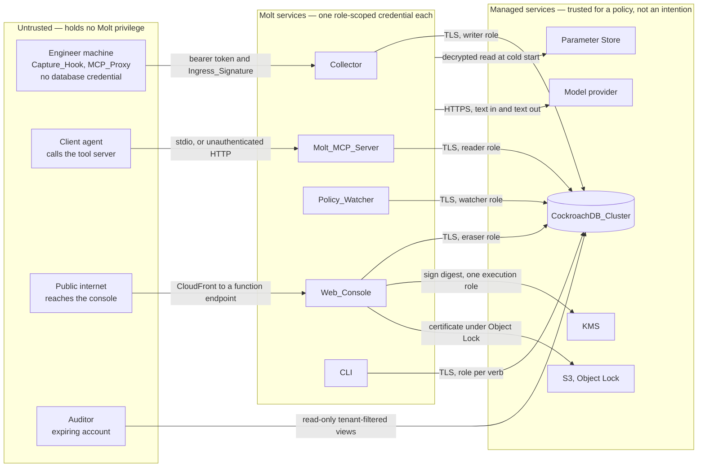
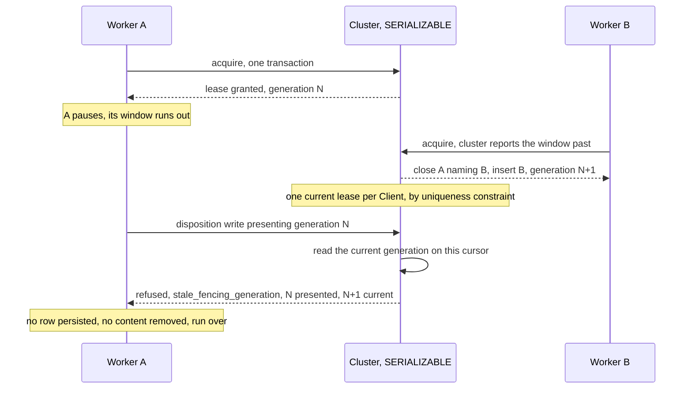
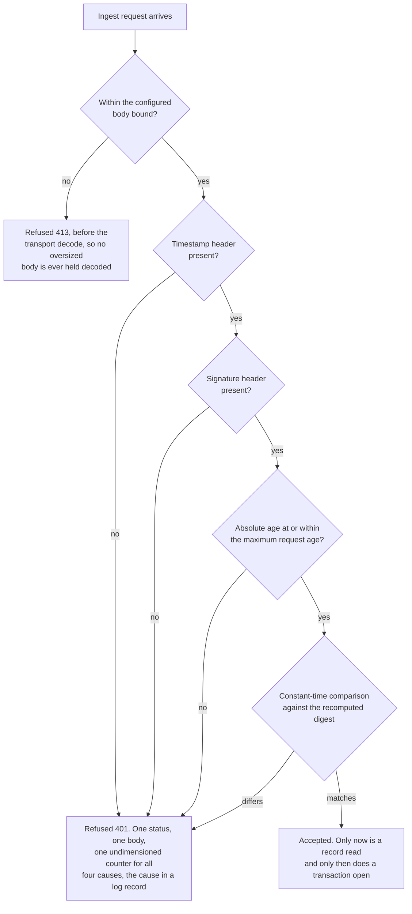

# Threat model

Molt holds every client's code and every agent's reasoning about it, so the
question a reviewer should be able to answer from one document is: *at each
crossing, what is trusted on the far side, and what is left standing after the
mitigation.* This document answers both, threat by threat, and names the
requirement that specifies each mitigation.

It is a security posture statement rather than a security assurance statement.
Three of the seven named threats are recorded here as **accepted in part**: the
design states a residue rather than closing it. Overstating a mitigation is the
more expensive error in a document like this one, because a reviewer who believes
prevention was delivered stops asking the right questions.

## How a status is read

| Status | Meaning |
|---|---|
| Mitigated | The attack is refused by a mechanism outside the application's own good intentions — a privilege set, a constraint, a key policy, or a keyed digest — and the residue is confined to a compromise of that mechanism itself. |
| Accepted in part | A mechanism narrows the attack but does not remove it. The remaining exposure is named, together with why it was not closed. |
| Accepted | No mitigation is applied. The reason and the compensating controls are named. |

Two words are used precisely throughout.

**Tamper evidence** means an alteration is *detectable* after the fact.
**Tamper proofing** means an alteration is *prevented*. Molt delivers the former
for the Ledger and does not deliver the latter, and the distinction is stated
rather than blurred (Requirement 45.13). The signed `Ledger_Checkpoint` extends
that evidence past a principal holding database administrator privilege on the
cluster for exactly one reason: the signing key lives outside the cluster, so a
principal who can rewrite every row in the cluster still cannot produce the
signature that would make the rewrite check out (Requirement 45.14).

## Trust boundaries of the delivered configuration

A rendered version of this section, including the accepted residues beside each
zone, is at [`assets/molt-trust-boundaries.svg`](../assets/molt-trust-boundaries.svg).

Six boundaries are the ones the design and the glossary name. Three more are
crossings the delivered configuration genuinely makes and the design's own table
does not list; they are marked below, because a boundary left off a table is a
boundary nobody reviews. A tenth row splits the Collector crossing in two, since
the platform's authorisation on the function endpoint and the application's own
checks behind it are separate questions with separate answers.

| Boundary | Crossing | What is trusted on the far side | Enforcement point |
|---|---|---|---|
| Engineer machine to Collector | HTTPS with a bearer token and an `Ingress_Signature` over the presented timestamp and the exact body bytes | Nothing. The machine holds no database credential and the Collector re-derives tenancy from its own principal mapping rather than from the request | Keyed digest, constant-time comparison, and the maximum request age |
| Collector, console, watcher, MCP server, and CLI to the cluster | TLS with a role-scoped connection string read from Parameter Store | The role's privilege set, which is the enforcement point rather than the application's intent | Four least-privileged roles and the update guards of migration 007 |
| Molt to a model provider | HTTPS with a credential resolved from a parameter name or an operator file | Nothing beyond text. Provider output is parsed and validated before use and is never executed | Response parsing, the two-label enum, and fail-closed classification |
| Molt to the key service | The digest-signing permission held by one execution role | The key policy. A compromise of any other role produces no signature | The key policy, plus verification against a retrieved public half rather than against the service |
| Auditor to the cluster | A read-only account, valid for at most thirty days, with per-tenant views and `SELECT` granted on the views rather than on the tables | Nothing. The Auditor is explicitly untrusted, which is why the access is read-only and row-filtered | View-level grants and account expiry |
| Public internet to the Web_Console | CloudFront in front of a function endpoint whose own authorisation is `AuthType: NONE` | Nothing. Every content route requires a session and demonstration mode blocks every mutation route | Session requirement per content route |
| **Client agent to the Molt_MCP_Server** *(not in the design's table)* | The process transport for a local client; the HTTP transport requires nothing at all | Nothing on the stdio path. On the HTTP path, the network — `HTTP_AUTHENTICATION_POSTURE` reads "unauthenticated; network isolation is the only control" | The reader role, the startup-resolved permitted `Client` set, and the absence of an ingress listener on the task |
| **Public internet to the Collector function endpoint** *(the platform-layer face of the first row)* | HTTPS to a function endpoint the platform authorises for anyone: `AuthType: NONE` | Nothing. The endpoint's own authorisation is open, and every control is in the application behind it | Bearer token on every route but health, plus the `Ingress_Signature` on both ingest routes, verified before any record is read |
| **Molt to Parameter Store** *(not in the design's table)* | A decrypted read of one parameter name per credential, at cold start, cached for the process lifetime | The parameter policy and the task role that may read it. A failure message names the parameter and never the value | Parameter access policy; no credential value in source (Requirement 30.1) |
| **Certificate_Builder to the object store** *(not in the design's table)* | A certificate envelope written under Object Lock in governance retention | The bucket policy: public access denied, encryption at rest required, Object Lock enabled at creation | Object Lock retention in [governance mode](https://docs.aws.amazon.com/AmazonS3/latest/userguide/object-lock.html), which a principal holding the bypass permission may lift; the posture and its consequence are below |

Two residues cut across the rows above rather than sitting in any one of them.

- The cluster boundary is a *privilege* boundary, not a content boundary. A role
  that may read a table may read every tenant's rows in it, and tenancy filtering
  above the Auditor views is applied by the query rather than by the grant. That
  is why the tenancy filter being inside SQL rather than applied to returned rows
  matters so much (see threat 5).
- Every crossing to a model provider carries memory content in the prompt. The
  named threat below is *credential* leakage, and the credential is well
  contained; the content in the prompt is not a leak but it is an exposure, and it
  is bounded only by the excerpt byte budget and the provider's own contract.

## Three postures that read stronger than they are

### Both function endpoints are open at the platform layer

The Collector endpoint and the console endpoint are both declared with
`AuthType: NONE`. On each of them the platform's own authorisation mode is
unavailable for a structural reason rather than declined as the weaker of two
options.

The Collector is called by `Capture_Hook` processes on engineer machines, and those
processes hold no cloud credential by design: giving a laptop one would put a
signing identity on every machine in the fleet, a larger exposure than the one it
would close. The console sits behind the content distribution, which cannot sign a
request as a cloud principal on a viewer's behalf, so platform authorisation on the
origin would refuse every real request.

Both authenticate **in the application** instead, and that is where a reviewer
should look:

| Endpoint | Where authentication actually happens | What it checks |
|---|---|---|
| Collector | The ingress path, before any record is read and before any transaction opens | A bearer token on every route but health, and an `Ingress_Signature` in addition on both ingest routes |
| Web_Console | The console authentication path, on every content route | An operator credential, then a signed session cookie; mutation routes additionally require a per-session request token, and demonstration mode refuses every mutation route from a name denylist before the handler runs |

The residue is real and it is the same on both: the platform will hand any request
to the function, so a flaw in the in-application check is reachable from the public
internet with nothing in front of it. What bounds the cost rather than the
reachability is the Collector's reserved concurrency ceiling, which caps spend under
a flood.

### Historical reads are bounded by the garbage-collection horizon

A point-in-time read of the cluster's own history is answerable only while both
instants sit inside the garbage-collection horizon, measured at 4500 seconds on the
delivered configuration. Past it the read is unavailable rather than degraded, and
asking for it is an error.

So a certificate's counts are *derived* from the Ledger and the recorded
Dispositions, and the historical read is attempted only as corroboration and
recorded as skipped when the horizon does not admit it. A reviewer verifying a
certificate long after issue should expect the corroboration to be absent and should
not read its absence as a finding. The durable evidence is the append-only Ledger
and the Dispositions; the cluster's own history is a short-lived convenience on top
of them.

### Object Lock is in governance mode, which a privileged principal can release

Certificates are written under Object Lock in **governance** retention. A principal
holding the bypass permission can shorten or lift the retention period and then
delete the object version; compliance retention would admit no such call from any
principal, including the account root.

Governance is the delivered choice because teardown has to be able to release
retention on each certificate version and finish with no manual step. It is the
right trade for a demonstration deployment and the wrong one for production, where
compliance mode is the posture. Stated as a limit rather than as protection: the
object resists accidental deletion and does not resist a determined administrator of
the account holding it.

What survives such a deletion is the signature. A certificate a reviewer already
holds stays verifiable against the public key with no access to the bucket at all,
which is why delivery to the reviewer matters more than retention on the bucket.

## The seven threats at a glance

| # | Threat | Status |
|---|---|---|
| 1 | Credential compromise | Mitigated |
| 2 | Ledger tampering | Accepted in part |
| 3 | Concurrent erasure ownership | Mitigated |
| 4 | Ingress replay | Accepted in part |
| 5 | Tenancy escape through a tool argument | Mitigated (the unauthenticated HTTP transport is a separate accepted risk) |
| 6 | Prompt injection into an adjudication prompt | Accepted in part |
| 7 | Provider credential leakage | Mitigated |

The count of partial acceptances is three, and the design's own phrasing is the
only reason a reader might arrive at two. The design labels Ledger tampering and
prompt injection "partially mitigated", and phrases ingress replay as "bounded
rather than eliminated" instead. On the test applied here — does the design state a
residue rather than close it — bounded is accepted: a replay inside the age window
is admitted deliberately. The glossary's `Threat_Model` entry names the same three.

---

## 1. Credential compromise

**The attack.** An attacker obtains a credential Molt uses — the cluster
connection string, the Collector bearer value, the ingress shared value, or a
provider credential — by finding it in source, in a log record, in an exception
message, in a traceback, in CLI output, or on disk with permissive modes. With the
cluster credential the attacker then writes, rewrites, or reads fleet memory
directly.

**The mitigation.** Four structural layers, and two operational refusals besides.

*No value in source.* Every credential resolves from a configured parameter name
or a configured operator file and from nothing else; `load_credential` raises
`MissingConfigError` when neither is configured rather than falling back to a
default (Requirements 30.1, 30.2, 30.3, 30.12, 37.11).

*A value that will not render.* `Credential` returns the fixed placeholder
`[MOLT_CREDENTIAL]` from its text conversion, its representation, and its format
specification, implements neither equality nor hashing, and exposes the value only
through an explicit `reveal` call. An accidental interpolation into a log record,
an exception message, an error-detail column, or an output stream therefore yields
the placeholder rather than a prefix, and every real use is a call site a reviewer
can find (Requirements 37.12, 26.7).

*A telemetry surface that drops the field rather than truncating it.* The
structured log filter removes fields whose names match a content set or carry a
content marker — `credential`, `secret`, `password`, `api_key`, `authorization`,
`dsn`, `connection_string`, and others — at every depth of a nested structure, and
renders a value of no JSON type through its own text conversion, which is what
makes a wrapped credential appear as its placeholder. The same predicate governs
metric dimensions, so a delivery backend cannot publish as a dimension what the
log filter drops (Requirement 31.4).

*A privilege set that bounds what a stolen credential can do.* Four
least-privileged roles connect the components (Requirement 30.4). No role holds
`UPDATE` on `ledger`, and migration 007 revokes it from all four explicitly rather
than relying on the grant lists having omitted it. Database-side update guards
confine which columns each role may restate: the tenancy and lineage columns of a
session are unwritable by every non-administrative role, a stored
`Attribution_Version` may be closed but never restated (Requirement 43.9), and the
writer's update of a `Derived_Artifact` is confined to the `Procedure_Confidence`
column (Requirement 49.14). A stolen capture credential therefore cannot move a
session to another tenant, rewrite what spawned it, or edit an attribution
history.

*Two operational refusals.* A credential file must lie inside the configured
credential directory and must grant no group or other access; a mode that does is
refused rather than warned about. And the local connection-string bypass raises
`LocalBypassRefusedError` when the deployment marks itself production, so the
development convenience is unreachable exactly where it would be dangerous.

**What remains.** The wrapper prevents *accidental* disclosure, not deliberate
use: a principal who can call `reveal`, read process memory, or read the parameter
under the task role holds the value. The provisioning script deliberately rotates
nothing on a second run, and nothing in the delivered configuration rotates a
credential on a schedule, so a compromise stays valid until an operator rotates it
by hand. Outside production the connection string may come from the environment,
which is a value on an engineer machine rather than in a managed store. And the
guards exempt the administrative path, correctly: a database administrator can
already drop a table, so a guard pretending otherwise would be theatre — the
answer to a hostile administrator is the externally signed checkpoint, not a
trigger.

| Threat | Mitigation | Requirement | Residual risk | Status |
|---|---|---|---|---|
| Credential compromise | Values only from a parameter name or an operator file; a wrapper rendering one fixed placeholder everywhere; telemetry field and dimension filtering; four least-privileged roles; `UPDATE` on `ledger` revoked from every role; column-scoped update guards; credential-file mode refusal; production refusal of the local bypass | 30.1, 30.2, 30.3, 30.4, 30.12, 31.4, 37.11, 37.12, 26.7, 43.9, 49.14 | No scheduled rotation, so a stolen value stays valid until rotated by hand; `reveal` and process memory are outside the wrapper's reach; the administrative path is exempt from the column guards by design | Mitigated |

---

## 2. Ledger tampering

**The attack.** A principal with write access to the cluster edits a `ledger` row
after the fact — softening a recorded command, removing an Event that shows what
an agent did — and then repairs the digest columns so the chain still verifies. A
naive chain catches the first half and misses the second, because a chain
recomputed after a consistent rewrite verifies against itself by construction.

**The mitigation.** Three layers, and it matters which layer covers which
attacker.

*The chain, computed inside the appending statement.* One statement reads the tip
of the Session's chain, derives the next sequence number and the predecessor
digest from that read, computes the content digest and the chain digest with the
cluster's own hash function, and inserts the row — all inside the transaction that
commits it. No digest is ever computed from state read in an earlier round trip,
and because the sequence number the digest commits to is derived by the same
statement, a caller cannot pre-compute a digest to present. Verification is an
independent recomputation in Python from the stored columns, so an alteration to
the payload, the category, the timestamp, the sequence number, or a digest column
itself surfaces as a mismatch localised to that row (Requirements 8.1–8.7).

*The append-only privilege.* A chain over editable rows commits to nothing, so no
role holds `UPDATE` on `ledger`: rows leave by an authorised erasure or by expiry,
never by revision. Which privileges are withheld, and which deletions the database
itself refuses, are set out in [protection.md](protection.md) and not restated
here.

*The signed checkpoint, which is the only layer covering a cluster
administrator.* A checkpoint commits to the terminal chain digest of every Session
holding at least one Event inside a bounded window, takes a root digest over the
canonical bytes of that covered set ordered by Session identifier, and has that
digest signed with a key the cluster holds no access to. Verification recomputes
the root from live rows and checks the signature against a public half retrieved
from the key service rather than asking the service to check, so verification
survives the loss of permission to call it. Disagreement is partitioned before it
is reported: a Session whose digest moved because a recorded `Erasure_Run`
accounts for it is explained, and a Session whose digest moved with nothing on the
record is the finding (Requirements 45.2 through 45.8, 45.13, 45.14).

**What remains, and why this is accepted in part.** None of the three layers
*prevents* a rewrite. This is tamper evidence, not tamper proofing, and the
requirement obliges the documentation to say so rather than imply prevention
(Requirement 45.13). Two consequences follow that a reviewer should hold onto.

First, detection is retrospective and depends on someone verifying. Nothing
verifies continuously; the chain check and the checkpoint check are operations the
CLI exposes.

Second, coverage has an edge in time. A checkpoint is computed on a fixed interval
whose default is 3600 seconds, so Events appended after the most recent checkpoint
are covered by the in-cluster chain alone — and the in-cluster chain is exactly
what a principal holding administrator privilege can rewrite consistently. Within
that trailing window, a consistent rewrite by such a principal is not detectable.
The window is bounded by the interval and it is not zero.

| Threat | Mitigation | Requirement | Residual risk | Status |
|---|---|---|---|---|
| Ledger tampering | Per-Session `Hash_Chain` with both digests computed inside the appending statement; independent recomputation in Python; `UPDATE` on `ledger` revoked from every role; signed `Ledger_Checkpoint` over every Session in a window, signed by a key outside the cluster, verified against a retrieved public half, with authorised erasures partitioned from unexplained change | 8.1–8.7, 45.2–45.8, 45.13, 45.14 | No prevention, only evidence; detection requires someone to run a verification; Events appended since the most recent checkpoint are covered by the in-cluster chain alone, so a consistent rewrite by a cluster administrator inside that trailing interval is not detectable | Accepted in part |

---

## 3. Concurrent erasure ownership

**The attack.** Two workers believe they own the erasure for one `Client`. The
second was granted ownership after the first was presumed dead; the first was only
paused, and it resumes and writes a `Disposition`, a completion record, or a
certificate. The evidence then describes a run two workers jointly performed, and
afterwards nothing distinguishes the superseded worker's rows from the real
owner's.

**The mitigation.** The lease carries a monotonic `Fencing_Generation`, and the
generation read sits inside the same transaction as every guarded write. That last
clause is the whole mechanism: a check in one transaction followed by a write in
another leaves a window in which the lease is taken over, and a write committing
in that window is precisely the write the fence exists to refuse.

| Property | What holds it | Requirement |
|---|---|---|
| One current lease per `Client` | A partial uniqueness constraint | 44.2 |
| A generation that never repeats | The tenant's historical maximum plus one, read and written in one serialisable transaction. The maximum spans closed leases as well as the current one, so takeover generations strictly increase | 44.3 |
| Takeover on the cluster's clock and nothing else | A lease is takeable exactly when the cluster, reading the row inside the transaction that would supersede it, reports its expiry as past, so neither a fast worker clock nor a slow one can move ownership | 44.6 |
| A refusal that names the winner | Both generations and the current owner travel in the refusal, so the loser aborts rather than retrying | 44.4, 44.8 |
| Every evidence write fenced | The `Disposition`, the run completion, and the certificate insert. The content mutation shares the transaction the fence guards, so a superseded owner removes nothing and records nothing | 44.7, 44.8, 44.11 |
| Finalisation idempotent by a state transition | The marking statement matches the run only while its finalisation instant is absent, so a repeat mutates nothing and returns the recorded outcome | 44.9, 44.10 |
| A refused write counted, and demonstrated | The undimensioned `erasure.stale_generation_refused` counter, plus a contention demonstration that proves the refusal rather than asserting it | 44.13, 44.14, 44.15 |

A retry deliberately does not loop. The transaction wrapper runs the body again on
a serialization conflict, so the generation read runs again; a re-read reporting a
bumped generation raises the refusal on that attempt, because a superseded write
cannot become admissible by being run again and looping would spend the retry
budget only to report conflict where the truth is supersession.

**What remains.** Ownership is exclusive; *execution* is not. A superseded worker
keeps running until its next guarded write, so it may still issue provider calls
and a backup that duplicate the new owner's work and cost. Whatever it committed
while its generation was still current stands — correctly, and attributable to
that generation, which is why the certificate carries the finalising owner's
generation. And a healthy worker paused longer than the lease interval, whose
default is thirty seconds, loses ownership on the same rule as a dead one; that
is the deliberate trade, since the case a graceful path would hide is exactly the
one the fence exists for.

| Threat | Mitigation | Requirement | Residual risk | Status |
|---|---|---|---|---|
| Concurrent erasure ownership | `Erasure_Lease` with a monotonic `Fencing_Generation` derived from the tenant's historical maximum; one current lease per `Client` by uniqueness constraint; takeover only on the cluster's own reading of expiry; the generation read inside every guarded write's transaction; refusals naming both generations and the current owner; idempotent finalisation by state transition; a contention demonstration | 44.2, 44.3, 44.4, 44.6, 44.7, 44.8, 44.9, 44.10, 44.11, 44.13, 44.15 | A superseded worker keeps executing until its next guarded write, duplicating provider calls and a backup; work committed while it was current stands; a healthy but paused owner loses the lease on the same rule as a dead one | Mitigated |

---

## 4. Ingress replay

**The attack.** An attacker captures one ingest request — bearer value, headers,
body — and re-sends it. A bearer token authenticates a caller and resists no
replay whatsoever, so without a second mechanism every replay writes Ledger rows
indistinguishable from the originals, inflating memory with duplicates that carry
valid digests and a real chain position.

**The mitigation.** An `Ingress_Signature`: an HMAC-SHA256 digest over the
presented timestamp concatenated with the exact body bytes, keyed with a shared
value the Collector retrieves from the parameter store, required on both ingest
routes in addition to the bearer token (Requirements 47.1, 47.2, 47.11). The keyed
construction is the standard one, [HMAC](https://datatracker.ietf.org/doc/html/rfc2104)
over SHA-256, so its strength rests on the hash function and the secrecy of the key
rather than on anything invented here.

Four properties of that path carry weight. Both headers are read *before* any body
handling, so an absent header is answered without the body being touched. The
material is built by the signer's own function over the raw bytes received, before
any decode of the content, so the two sides agree because they call one definition
rather than because two modules remember a convention. The comparison is constant
time, and answers rather than raises for a presented value outside the ASCII range
(Requirement 47.9). And the four rejection causes — timestamp header absent,
signature header absent, timestamp outside the window, digest mismatch — share one
status, one response body, and one undimensioned counter, with the cause named only
in a log record, so the response distinguishes them no more than the comparison
does (Requirements 47.4, 47.5, 47.7, 47.8, 47.13).

Verification runs before any record is read and before any transaction opens, which
is what makes *nothing persisted* structural for every cause rather than something
the handler arranges. The oversized-body refusal is the one answer that differs, and
it sits earlier still: status 413 before the transport decode, so no oversized body
is ever held in decoded form. The age bound is an absolute difference, inclusive on
the accepted side, so a timestamp as far ahead of the reading as the bound allows is
as refusable as one that far behind.

The recall route is deliberately bearer-only (Requirement 47.12), and that is
defensible on two grounds rather than one. It is the interactive read path on the
agent's critical path: an operator or an agent holding the bearer value but not
the shared secret must still be able to ask memory a question, and a shared secret
on that path would lock out exactly the caller the route exists for. And the
replay of a read is not the same object as the replay of a write — a re-sent recall
request appends no Ledger row, moves no counter, and changes no state; it returns
an answer the caller was already entitled to. The asymmetry is between a request
that mutates memory and one that reads it, which is the same line the signature
requirement itself draws.

**What remains, and why this is accepted in part.** A capture replayed *inside*
the age window is still accepted, and its rows are still indistinguishable from
the originals. The window is the configured maximum request age, default 300
seconds (Requirements 47.6, 47.14). A per-request nonce store would close it and
would also put a write-contended row in front of every capture on the ingest path,
so the residue is accepted deliberately rather than overlooked. A bounded window in
place of a nonce is the ordinary trade rather than an unusual one: AWS Signature
Version 4 holds
[the signed portions of a request valid within fifteen minutes of its timestamp](https://docs.aws.amazon.com/AmazonS3/latest/developerguide/sig-v4-authenticating-requests.html),
a window three times as wide as the one here. That makes the residue conventional,
not smaller. One further
deviation is stated in the implementation and repeated here: Requirement 47.5
names the cluster's current timestamp, and the bound is measured against the
Collector host's reading instead, because a cluster round trip on that path would
make every forged signature cost a leased connection. The cost is that the
window's accuracy depends on two platform-synchronised hosts rather than on one
authority, against a bound measured in minutes.

| Threat | Mitigation | Requirement | Residual risk | Status |
|---|---|---|---|---|
| Ingress replay | `Ingress_Signature` over the presented timestamp and the exact body bytes, keyed from the parameter store, required with the bearer token on both ingest routes; headers read before any body handling; constant-time comparison; four causes answered identically and counted; verification before any record is read or transaction opened; absolute inclusive age bound | 47.1, 47.2, 47.3, 47.4, 47.5, 47.7, 47.8, 47.9, 47.11, 47.13, 47.14 | A capture replayed inside the maximum request age, default 300 seconds, is accepted; no nonce store, because a nonce row would be write-contended on every capture; the age is measured against the Collector host's reading rather than the cluster's, so the window depends on host synchronisation | Accepted in part |

---

## 5. Tenancy escape through a tool argument

**The attack.** A client agent calls a Molt tool and adds an argument naming a
`Client` set, a tenant slug, or a Session identifier, hoping to widen what the
call returns past the tenants the server was configured for. A weaker variant asks
for a large result count and hopes rows are filtered after the cluster answered,
so that a truncation bug or an error path leaks a row that crossed the wire.

**The mitigation.** The widening has nothing to act on, at four levels. The
mechanism is laid out in [mcp.md](mcp.md); what belongs here is where each level's
guarantee comes from.

| Level | Where the guarantee comes from | Requirement |
|---|---|---|
| The permitted `Client` set | Resolved from the `[mcp]` configuration surface by one query at construction. Nothing re-reads it per call | 40.7 |
| The argument shapes | Text, an identifier, a list of identifiers, a count. No shape is a client set or can carry one, and a handler reads only the arguments its own schema declares, so an extra key naming a set is a key nothing reads | — |
| The tenancy filter and the result bound | A semi-join over unsuperseded `Attribution_Version` rows and a SQL limit, both inside the statement, so a row the caller may not see never crosses the wire and nothing is trimmed after the cluster answered | 40.8, 40.10 |
| Read-only | Construction refuses a store authenticated as anything but the reader role, and the effect enumeration declares one member, so no mutating entry can be described in the registry | 40.5, 40.6 |

Behind two of those rows sits a detail the table cannot hold. The recall tool is
handed the server's permitted set and *no* Session identifier: a caller-named Session
would have added its own `Client` to the permitted union, which is precisely the
widening a tool argument must not be able to do. And the current-claim predicate is
checked into each statement at import rather than composed per call, so a closure
whose admission has drifted from the attribution layer's own term refuses to load.
The tool server and the recall path cannot come to admit different rows.

Recording an invocation cannot smuggle a write either. The Event travels to the
Collector over the signed ingress path, and each recorded argument is a key with its
value digested, including keys no schema declares, so an extra key attempting to
name a client set is recorded as having been present without its content being
restated (Requirement 40.9).

**The accepted risk on this boundary: the HTTP transport is unauthenticated.**
This is an open gap, not a footnote. The configuration surface declares no
credential for the HTTP transport and the server invents none; the posture is a code
constant, `HTTP_AUTHENTICATION_POSTURE`, which the health route reports verbatim so
that an operator reads it rather than guessing at it. Exposing the transport to a
reachable network would expose fleet memory to whoever reaches it, and would breach
Requirement 30.5, which obliges authentication on every network-exposed route other
than the health routes.

Why it is accepted, and what compensates. The delivered configuration gives the
task no ingress listener and a local client uses the process transport, so as
delivered the transport is not network-exposed. If it were exposed, three controls
would bound the damage and none would remove the gap: the store holds the reader
role, so nothing can be mutated through it; the permitted `Client` set comes from
configuration, so the exposure reaches the tenants that server was configured for
rather than fleet memory whole; and every invocation is recorded as an Event naming
the tool, the digested arguments, and the returned row count.

The honest summary is that read access to the configured tenants' memory is
available to anyone who can reach the socket, and the only thing stopping them is
that nothing routes to it.

| Threat | Mitigation | Requirement | Residual risk | Status |
|---|---|---|---|---|
| Tenancy escape through a tool argument | Permitted `Client` set resolved from configuration at startup; no tool schema declaring a client-set parameter and no handler reading an undeclared key; recall given the server's set and no caller Session; tenancy applied as a semi-join inside SQL with the attribution layer's own current-claim predicate, checked at import; bound applied as a SQL limit; construction refused unless the store holds the reader role; one read-only effect value; invocations recorded with argument values digested | 40.5, 40.6, 40.7, 40.8, 40.9, 40.10 | No argument can widen tenancy. Separately: the HTTP transport requires nothing at all, so exposing it would grant read access to the configured tenants' memory to whoever reaches the socket, and would breach Requirement 30.5 | Mitigated |
| — the unauthenticated HTTP transport | **No mitigation.** Accepted because the delivered configuration gives the task no ingress listener and local clients use the process transport. Compensating controls: reader role only, permitted set fixed by configuration, every invocation recorded, and the posture stated in the code and reported on the health route | 40.4, 40.5, 40.7, 40.9 (Requirement 30.5 is the obligation this would breach if exposed) | Read access to the configured tenants' memory for any principal that can reach the socket | Accepted |

---

## 6. Prompt injection into an adjudication prompt

**The attack.** A residue candidate whose cosine distance falls in the review band
is sent to a text model, which answers whether that candidate carries content
derived from the subject text being erased. The candidate excerpt is memory
content — it can be anything an agent ever wrote or pasted. An attacker who can
get text into memory can therefore write text designed to be read by the
adjudicating model: instructions to disregard what precedes them, a forged
well-formed verdict, a claim that the candidate is unrelated. If that text
persuades the model to answer `exclude`, the candidate stays in memory after an
erasure that was supposed to remove it, and the certificate records the exclusion
as a reasoned decision.

The geometry is unfavourable and precision about it matters: the candidate excerpt
is the *variable suffix*, so hostile text sits at the end of the prompt, after the
task instructions and after the subject excerpt. That is the strongest position an
injected instruction can occupy.

**What actually constrains a hostile excerpt.** Four things, and what each one does
needs saying exactly, because not one of them is sanitisation.

*A fixed structure and a byte budget.* The prompt is the fixed task instructions,
a labelled subject-excerpt section holding the query text cut to the configured
prefix budget, then a labelled candidate-excerpt section holding the candidate cut
to the same budget. The cut is by encoded length at a character boundary and is
deterministic. This bounds *how much* injected text arrives and marks which bytes
belong to which part. It does not sanitise, escape, or neutralise anything, and no
part of the module attempts to.

That omission reflects the state of the art rather than an oversight. OWASP's
guidance treats prompt injection as a defence-in-depth problem — structured prompts,
least-privilege tool scopes, constrained handling of the model's output, human
approval on consequential actions — and presents no single layer, filtering
included, as sufficient on its own
([prompt injection prevention](https://cheatsheetseries.owasp.org/cheatsheets/LLM_Prompt_Injection_Prevention_Cheat_Sheet.html)).
The three constraints that follow are that kind of surround.

*A parser that admits two labels and nothing else.* The response must be one JSON
object carrying a `classification` reading `include` or `exclude` and a
`reasoning` string; a fenced block is unwrapped first. Anything else — not an
object, a missing member, an unknown label — is refused (Requirement 17.6). This
means an injection cannot invent a third outcome or make the pipeline do something
other than include or exclude.

*Fail-closed on every failure, in one direction.* Throttling after the provider's
own retries, a timeout, a credential failure, and an unparseable response are one
outcome: the candidate is classified `include`, with the reason
`adjudication_unavailable_fail_closed`, the adjudicated flag false, and a metric
emitted (Requirements 17.8, 18.7 for the analogous rewrite path). An
over-inclusive erasure costs memory utility; an under-inclusive one breaks the
contractual claim, so the failure direction is chosen on purpose. Note what this
does *not* cover: a well-formed `exclude` is not a failure, so it never reaches
this path.

*Evidence per candidate.* The provider name, the model identifier, the digest of
the whole prompt, the returned classification, and the returned reasoning are
recorded for every adjudicated candidate (Requirement 17.6), and the distance, the
threshold comparison, and the final inclusion decision are recorded for every
candidate whether adjudicated or not (Requirement 17.7). An injected verdict is
therefore reviewable after the fact, with the exact prompt identified by digest.

**Can a manipulated verdict cause under-inclusion?** Yes. That is the honest
answer and it is the reason this threat is accepted in part. A hostile excerpt that
persuades the model to answer `exclude` in a well-formed way produces a verdict the
Adjudicator accepts at face value: `included` is false, the reason is
`adjudicated_exclude`, the adjudicated flag is true, and no failure path is taken.
Nothing downstream re-checks the verdict against the excerpt.

Two things bound the consequence, and neither removes it. The review band is
bounded on the near side: a candidate whose distance is at or below the
auto-inclusion threshold, default 0.20, is marked included *without the
Adjudicator being invoked at all* (Requirement 17.4), so injection cannot reach the
closest matches — the ones most likely to be genuine residue. And the band itself
is an operator decision made against measured evidence rather than a guess: the
`Sensitivity_Analyzer` shows what each threshold pair would include, without
mutation and without replaying a recorded decision, so an operator can widen the
auto-inclusion threshold and shrink the region where a model's answer is trusted at
all (Requirement 48).

| Threat | Mitigation | Requirement | Residual risk | Status |
|---|---|---|---|---|
| Prompt injection into an adjudication prompt | Fixed two-part prompt structure with labelled sections and a deterministic byte cap on both excerpts; a response parser admitting exactly two labels and refusing everything else; every failure — throttle, timeout, credential fault, unparseable response — classified `include` and recorded as fail-closed; provider, model, prompt digest, classification, and reasoning recorded per adjudicated candidate; distance, band, and decision recorded per candidate; the auto-inclusion band decided without invoking the model; the band tunable against measured evidence | 17.4, 17.6, 17.7, 17.8, 18.7, 48 | **Not mitigated:** a candidate excerpt that persuades the model to answer `exclude` in a well-formed way is accepted at face value, causing an under-inclusive residue decision. Nothing sanitises the excerpt, and it occupies the end of the prompt. Bounded by the auto-inclusion band, which never reaches the model, and by the operator's ability to widen it | Accepted in part |

---

## 7. Provider credential leakage

**The attack.** The credential Molt calls a model provider with escapes into a
place it can be read: a log record from the embedder, the Adjudicator, or the
rewriter; an exception message or traceback from a failed call; a CLI output
stream; or the request-shaped diagnostics a provider client emits. With it, an
attacker spends the operator's inference budget and, more importantly, can read
whatever else that credential reaches on the provider side.

**The mitigation.** Threat 1's layers apply unchanged at this boundary: one
resolution rule reaching a parameter name or an operator file and nothing else, a
wrapper that renders the fixed placeholder on every path, a telemetry filter that
drops `api_key`, `credential`, `authorization`, and any credential- or
secret-marked name at every depth and governs metric dimensions by the same
predicate, and a CLI that prints no secret value in any output stream
(Requirements 30.12, 37.11, 37.12, 26.7, 31.4).

One thing is specific to this boundary. The `Provider_Selector` maps a provider role
to its pair of configuration keys and delegates to the secret accessors rather than
resolving anything itself, because two implementations of one resolution rule is
precisely the drift the placeholder discipline cannot survive.

The addition is what the provider-facing components record instead. The
Adjudicator's own log records name the provider, the model identifier, the
artifact identifier, the prompt digest, and the exception *type name* — not the
exception message, and not the credential. A credential failure is therefore
recorded as a fault type on the fail-closed path, which is the right amount of
information: an operator learns that a credential failed without the record
carrying what failed. The startup probe's log record was likewise given field names
that avoid the content markers, so the width and the reachability answers actually
appear instead of being dropped as if they were memory content — the filter is
strict enough that field naming had to be designed around it.

**What remains.** The credential leaves the process on every provider call, so a
compromise of the provider account, of the provider's own request logging, or of
the transport terminates outside Molt's control. Nothing rotates the value on a
schedule. And an operator-file credential is only as protected as its mode, which
is checked — no group or other access — at read time and not thereafter.

| Threat | Mitigation | Requirement | Residual risk | Status |
|---|---|---|---|---|
| Provider credential leakage | Credentials only from a parameter name or an operator file, resolved through one implementation; wrapped so every rendering yields a fixed placeholder; telemetry field and dimension filtering by name and marker at every depth; CLI printing no secret value; provider-facing components recording provider, model, prompt digest, and exception type rather than message | 30.12, 37.11, 37.12, 26.7, 31.4 | The value leaves the process on every call, so provider-side logging or account compromise is outside Molt's reach; no scheduled rotation; a credential file's mode is checked at read time only | Mitigated |

---

## Accepted and partly accepted, in one place

Requirement 51.9 asks that a threat the design does not mitigate be recorded as
accepted together with the reason. Collected here so no acceptance depends on a
reader having reached the right subsection.

| Item | Status | Reason for the acceptance |
|---|---|---|
| Ledger tampering | Accepted in part | Prevention is not offered: the chain and the checkpoint are evidence. Detection needs someone to verify, and the interval between checkpoints leaves a trailing window in which a consistent rewrite by a cluster administrator is not detectable. The alternative — an append path that could not be rewritten by any principal — is not available inside a cluster whose administrator can drop a table, which is why the coverage that matters comes from a key held outside it |
| Ingress replay | Accepted in part | The window is bounded to the configured maximum request age rather than closed. A per-request nonce store would close it and would put a write-contended row in front of every capture on the ingest path |
| Prompt injection into an adjudication prompt | Accepted in part | A well-formed `exclude` verdict is accepted at face value, so a successful injection causes under-inclusion. The consequence is bounded by the auto-inclusion band, which never reaches the model, and by the operator's ability to widen that band against measured evidence |
| The unauthenticated HTTP transport of the Molt_MCP_Server | Accepted | The configuration surface declares no credential for it and the delivered configuration gives the task no ingress listener, so the transport is not network-exposed as delivered. Compensating controls are the reader role, the configuration-fixed permitted `Client` set, and per-invocation recording. Exposing it would breach Requirement 30.5 |
| The age bound measured against the Collector host rather than the cluster | Accepted | Requirement 47.5 names the cluster's timestamp; reading it would put a network round trip and a leased connection in front of every request including every forged one. Both hosts are platform-synchronised against a bound measured in minutes |
| No scheduled credential rotation | Accepted | Provisioning deliberately rotates nothing on a second run, so a run is idempotent. A compromised value stays valid until an operator rotates it |
| Both function endpoints declared `AuthType: NONE` | Accepted | Neither endpoint can use the platform's own authorisation mode: the `Capture_Hook` holds no cloud credential by design, and the content distribution cannot sign as a cloud principal for a viewer. Both authenticate in the application instead — the Collector by bearer token and `Ingress_Signature`, the console by credential and signed session cookie. The residue is that a flaw in the in-application check is reachable from the public internet with nothing in front of it |
| Historical reads bounded by the garbage-collection horizon | Accepted | The horizon is a cluster property, measured rather than assumed, at 4500 seconds on the delivered configuration. Extending it would raise storage cost for a corroboration that is not the evidence. The certificate's counts are derived from the Ledger and the Dispositions, and the historical read is recorded as skipped when the horizon does not admit it |
| Object Lock in governance mode rather than compliance mode | Accepted | Governance retention can be released by a principal holding the bypass permission, which is what lets teardown complete with no manual step. Compliance mode is the production posture and would admit no such call from any principal. A certificate the reviewer already holds stays verifiable against the public key whether or not the object survives |

## Related documents

- [protection.md](protection.md) — the referential and privilege halves of the
  Ledger and evidence protection: which deletions the database refuses, which
  cascade, and which privileges no role holds.
- [glossary.md](glossary.md) — the definitions this document uses:
  `Ingress_Signature`, `Ledger_Checkpoint`, `Erasure_Lease`,
  `Fencing_Generation`, `Attribution_Version`, and `Threat_Model` itself.
- [memory-tiers.md](memory-tiers.md) — the mutability contract per `Memory_Tier`,
  including the append-only episodic tier this document's second threat is about
  and the disposable working tier nothing depends on surviving.
- [architecture.md](architecture.md) — the component inventory grouped by where
  each component runs, which is also where its boundary sits.
