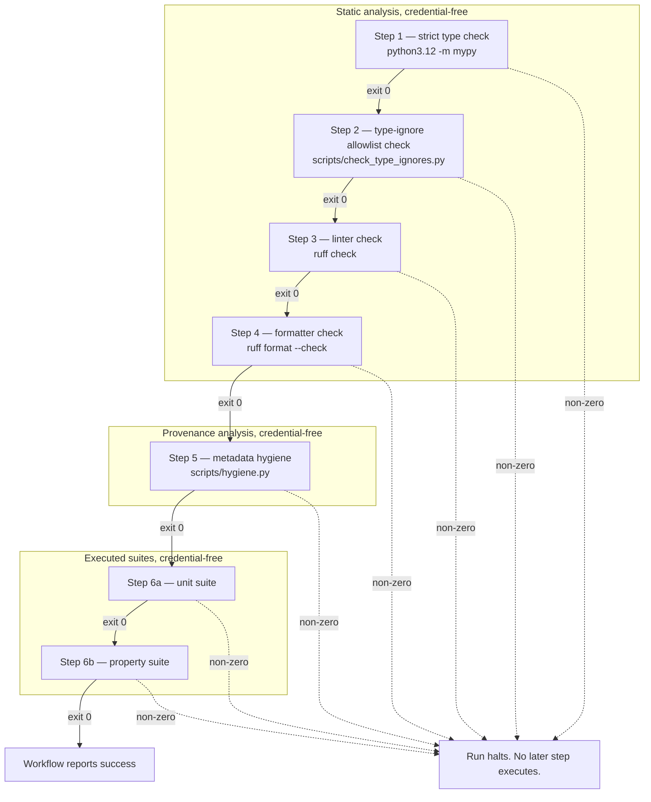

# Typing and static-analysis gates

Molt treats the shapes its code declares as machine-verified facts rather than
conventions. Four static checks run over the tracked tree before any test suite
executes, and each one is a single invocation that reads its scope from
`pyproject.toml` or from an explicit path list on the command line. The same
invocations run on a developer machine and in the workflow, so a check that
passes locally cannot fail only in the workflow because the two used different
arguments.

## The gate pipeline



### Why the order is fixed

The order is a cost gradient and a dependency chain at once, and both point the
same way.

The strict type check runs first because it is the cheapest check that can
invalidate the largest amount of work. A type error usually means the code does
not mean what it says it means, and there is no value in learning that a
generative suite passed against code whose contract is wrong. It also runs
first because it produces the input the second step consumes: the set of
directives that silence it.

The type-ignore allowlist check runs second, immediately after the checker whose
output it audits. Running it before the type check would be meaningless, since
the reportable spelling of a directive is what the type check establishes.
Running it later would let a linting or formatting failure mask the fact that a
type error was silenced rather than fixed.

The linter runs third and the formatter fourth, in that order and never the
reverse. The linter can report a genuine defect, an unused argument, a naive
timestamp, a shadowed builtin, a security-sensitive construct. The formatter
reports only that a file's layout differs from canonical layout. Surfacing a
defect before a layout difference means a reviewer reads the substantive failure
first. The formatter runs in check mode so the step reports a difference and
rewrites nothing; a gate that mutated the tree it was auditing could not be
trusted to describe it.

Metadata hygiene runs fifth, after the four checks that concern code
correctness and before the suites. It is a property of the text of the
repository rather than of its behaviour, so it needs nothing to have run
first, but it is placed before the suites for the same cost reason: a hygiene
finding is a text edit, and there is no point spending suite time to discover
one.

All five of these precede both suites because every one of them is a static
read of tracked files. None requires a reachable database instance, a cloud
account, or a model provider. Placing the credential-free, sub-second checks
ahead of the executed suites means the common failure is reported in the
cheapest possible run, and the whole pipeline is runnable by a reviewer holding
no credentials at all.

The unit suite precedes the property suite for the same reason the static
checks precede both: a deterministic example failure is cheaper to produce and
easier to read than a shrunk generative counterexample, and any defect the unit
suite can find is a defect the property suite would spend far longer finding.

No step continues on error. Each step is an independent invocation whose exit
status is the step's result, so a non-zero exit halts the run and no later step
executes. This is deliberate: a pipeline that continued past a type error would
report a wall of downstream noise whose root cause is a single upstream fact.

## Commands

These are the invocations the workflow runs, verbatim. Run the same lines on a
developer machine from the repository root.

| Gate | Command | Scope and where the scope is declared |
| --- | --- | --- |
| Strict type check | `python3.12 -m mypy` | `src/molt`, `tests`, `scripts`. Declared by `files` under `[tool.mypy]` in `pyproject.toml`. **No path arguments are passed.** |
| Type-ignore allowlist check | `python3.12 scripts/check_type_ignores.py` | Every `.py` and `.pyi` file under the repository root, ignore rules applied. Determined by the script's own tracked-source walk. |
| Linter check | `python3.12 -m ruff check src/molt tests scripts infra` | The four paths named on the command line. Configured by `[tool.ruff]` and `[tool.ruff.lint]` in `pyproject.toml`. |
| Formatter check | `python3.12 -m ruff format --check src/molt tests scripts infra` | The same four paths. Configured by `[tool.ruff.format]` in `pyproject.toml`. |
| Metadata hygiene | `python3.12 scripts/hygiene.py` | Tracked source and documentation. See [hygiene.md](hygiene.md). |

Three details in that table are load-bearing.

**The type check takes no path arguments.** The checked path set lives in
`files` under `[tool.mypy]`. A developer cannot narrow the check by passing a
directory and a reviewer cannot widen it, because neither side supplies a path
at all. The scope is a tracked fact in the manifest, reviewed like any other
change, rather than an argument that can drift between a shell history entry
and a workflow definition.

**The linter and formatter scopes are explicit at the call site.** Here the
opposite choice is made on purpose: the four paths are written out so the scope
is visible where the command is read. The `extend-exclude` list in
`[tool.ruff]` exists to keep an argument-free invocation away from ignored
material, not to define the checked scope. `infra` appears in the linter and
formatter scope because the requirement names it as a checked path; it
currently carries shell, template, and parameter files and no Python source,
so the effective set of files the formatter reformats is drawn from the three
Python roots. Naming `infra` anyway means the day a Python file is added there
it is covered without a workflow edit.

**One tool fills both the linter and formatter role, pinned to one exact
version.** `required-version = "==0.16.3"` under `[tool.ruff]` refuses to run
if the installed tool is any other release. A formatter and a linter from
separate projects can disagree about the same line, producing a pair of gates
that cannot both be satisfied; a single pinned tool cannot. The type checker,
linter, and formatter are all pinned exactly in the `dev` extra of
`pyproject.toml`, so the manifest, the developer machine, and the workflow
resolve one tree.

Both `ruff` commands can equivalently be invoked as the `ruff` console script
rather than through `python3.12 -m`. The module form is written above because
it is what the workflow runs, and it guarantees the tool executing is the one
installed into the interpreter that resolved the manifest.

## Why the type configuration is strict

`[tool.mypy]` sets `strict = true` and then states the individual settings
explicitly rather than relying on the bundle. That redundancy is intentional:
the file records which guarantees are being claimed, so a future release that
changes what the bundle covers cannot silently relax the contract. There are no
per-module overrides. A module cannot opt out; a directive that silences the
checker on one line must be justified in the allowlist instead.

### Path and package resolution

| Setting | What it prevents |
| --- | --- |
| `python_version = "3.11"` | Prevents the check from accepting syntax or standard-library shapes that the declared floor interpreter does not have, which would pass locally on a newer interpreter and fail for a user on the floor. |
| `mypy_path = ["src"]`, `files = ["src/molt", "tests", "scripts"]` | Prevents scope drift. The package is importable and checkable from a bare checkout with no install step, and the checked set cannot be narrowed by a command-line argument. |
| `namespace_packages`, `explicit_package_bases` | Prevents a module under `src/` from being resolved under two different names, which would let the same file be checked twice under conflicting assumptions or skipped entirely. |

### Untyped and partially typed code

| Setting | What it prevents |
| --- | --- |
| `disallow_untyped_defs` | Prevents an unannotated function from existing. Without it a function with no annotations is not merely unchecked, it is invisible: its body is skipped and its callers learn nothing. |
| `disallow_incomplete_defs` | Prevents the half-annotated function, which is the more dangerous case, because it looks annotated to a reader while one parameter or the return silently accepts anything. |
| `disallow_untyped_calls` | Prevents a fully typed function from calling into an unchecked one and inheriting its unknowns. This is what stops a single unannotated helper from erasing the guarantees of every caller above it. |
| `disallow_untyped_decorators` | Prevents a decorator from laundering a typed function into an untyped one. A decorator returning an unknown type replaces the whole signature it wraps. |
| `check_untyped_defs` | Prevents an unannotated body from being skipped, so obvious errors inside it are still reported rather than deferred until the annotation is added. |

### Erasure of declared shapes

| Setting | What it prevents |
| --- | --- |
| `disallow_any_generics` | Prevents a bare generic. A container declared without its parameter admits any element, so the declaration reads as a constraint while enforcing nothing. |
| `disallow_any_unimported` | Prevents an unresolved import from leaking an unknown type into a signature, where it would appear as a real annotation while checking nothing. |
| `disallow_subclassing_any` | Prevents a class from inheriting from an unknown base, which would make every attribute access on that class unverifiable, including the ones the subclass never declared. |
| `warn_return_any` | Prevents a function that returns an unknown value from satisfying a declared concrete return type. Without this, one dynamic value at the bottom of a call chain propagates upward unchallenged. |

### Import resolution

| Setting | What it prevents |
| --- | --- |
| `ignore_missing_imports = false` | Prevents a dependency the checker cannot find from being silently treated as unknown. A missing dependency is a configuration error and is reported as one. |
| `follow_imports = "normal"` | Prevents a dependency from being read only for its signatures while its own inconsistencies go unreported. |
| `follow_untyped_imports = false` | Prevents an untyped module from being treated as dynamic on import. An untyped dependency is a decision to make explicitly, not a hole that opens itself. |

### Remaining strictness and configuration hygiene

| Setting | What it prevents |
| --- | --- |
| `strict_optional` | Prevents a missing value from being used where a present one is required. This is the single largest class of runtime failure the checker can rule out statically. |
| `strict_equality` | Prevents a comparison between types that can never be equal, which is always a defect and always silently false at runtime. |
| `extra_checks` | Prevents a set of narrower unsoundnesses, including mismatched keyword handling and unsafe overlapping overloads, that the base configuration tolerates. |
| `implicit_reexport = false` | Prevents a module from becoming an accidental part of the public surface by being imported somewhere. An importable name must be exported deliberately. |
| `warn_unused_ignores` | Prevents a suppression from outliving the error it suppressed. This is what keeps the allowlist finite and is the type checker's own half of the two-sided discipline the allowlist gate completes. |
| `warn_redundant_casts` | Prevents a cast that changes nothing from remaining as a false signal that a conversion is happening. |
| `warn_unreachable` | Prevents dead code from surviving. Unreachable code after a narrowing usually means the narrowing is wrong, not that the code is spare. |
| `warn_unused_configs` | Prevents this configuration itself from rotting. A section matching no module is reported, so a stale override cannot sit here appearing to do something. |
| `pretty`, `show_error_codes` | Prevent a report that is hard to act on. Every error carries the code needed to write a targeted, narrow suppression if one is genuinely warranted. |

## The type-ignore allowlist

Every type-check ignore directive in tracked source must be named by an entry
in `scripts/type_ignore_allowlist.txt`.

### Current state

**The allowlist is empty. It contains zero entries, and the scan finds zero
directives in tracked source.** The file holds only its format documentation, so
there is nothing to tabulate.

This is the intended steady state, not an unfinished section. The strict
configuration above is written so that suppression is rarely the correct
response to a report, and the gate below makes an empty allowlist the cheapest
state to maintain.

### The format an entry takes

An entry is one line of three columns separated by a vertical bar:

```text
<path relative to the repository root> | <exact directive> | <reason>
```

| Column | Content | Rule |
| --- | --- | --- |
| 1 | The file the directive appears in | Relative to the repository root, forward slashes. |
| 2 | The directive, exactly as the gate reports it | Including any bracketed error-code list. Whitespace runs collapse to one space. Running the gate prints the reportable spelling, so the column is copied from a real report rather than guessed. |
| 3 | The reason | What the checker cannot express, and what makes suppressing it correct rather than convenient. |

Blank lines and lines beginning with a hash are ignored. A line carrying other
than three columns, or carrying an empty column, is malformed: the gate exits
with status 2 and names the line, rather than treating an unparseable file as
an empty one.

Two conventions keep the file honest. Add an entry in the same change that adds
the directive it justifies, and remove the entry in the change that removes the
directive. Because column 3 is prose, it is reviewable: a reason that says only
that the checker complained is not a reason and should not survive review.

## The allowlist check

`scripts/check_type_ignores.py` walks the tracked tree, applying the
repository ignore rules, collects every type-check ignore directive it finds in
`.py` and `.pyi` files, normalises each one by collapsing whitespace runs, and
compares the found set against the allowlist **in both directions**.

| Direction | Condition | Reported as |
| --- | --- | --- |
| Unlisted directive | A directive appears in tracked source that no allowlist entry names | `path:line:directive` |
| Stale entry | An allowlist entry names a directive that no longer appears in the source | `path:-:directive`, with `-` for the line, because a stale entry names no live line by definition |

| Exit status | Meaning |
| --- | --- |
| 0 | No finding in either direction. The scanned file count and the directive count are printed. |
| 1 | At least one finding in either direction. Every finding is printed, followed by a count of each kind. |
| 2 | The allowlist file is absent or an entry is malformed. |

The two directives are matched on the pair of file path and exact directive
text, not on path alone. Moving a directive to another line in the same file
keeps the entry valid; moving it to another file or changing its error-code
list does not.

### Why the check is two-sided

A one-sided check that only rejected unlisted directives would be satisfied by
adding an entry, and an allowlist that only ever grows stops being an
allowlist. Each direction closes a different failure.

Rejecting an unlisted directive means silencing the type checker is a
documented decision. The directive itself is a single comment that a reviewer
skims past; the allowlist entry is a line in a small, deliberately short file
that a reviewer reads, carrying a prose reason that can be argued with. The
gate converts an invisible local act into a visible global one.

Rejecting a stale entry means the allowlist cannot accumulate exemptions that
protect nothing. A stale entry is worse than clutter. It is a standing licence:
a future change that reintroduces a directive at that path with that spelling
would pass the gate silently, because the entry authorising it is already
there. Pruning entries as the directives they cover disappear keeps the
allowlist a description of the present tree rather than a record of everything
ever permitted.

Together the two directions make the allowlist an exact inventory. Its length
is the number of places the type system cannot express something true about the
code, and that number is reviewable precisely because neither direction can
drift. It is currently zero.

## Related documents

- [hygiene.md](hygiene.md) — step 5 of the same pipeline, its pattern classes, and
  its exit-code contract.
- [glossary.md](glossary.md) — the `CI_Workflow` and `Type-ignore allowlist` entries.
